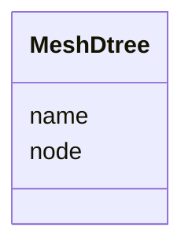

# Class: MeshDtree 


URI: [img_ext:MeshDtree](https://w3id.org/jgi/img_ext/MeshDtree)





<!-- no inheritance hierarchy -->


## Slots

| Name | Cardinality and Range | Description | Inheritance |
| ---  | --- | --- | --- |
| [name](name.md) | 0..1 <br/> [String](String.md) |  | direct |
| [node](node.md) | 0..1 <br/> [String](String.md) |  | direct |


## Identifier and Mapping Information


### Schema Source


* from schema: https://w3id.org/jgi/img_ext


## Mappings

| Mapping Type | Mapped Value |
| ---  | ---  |
| self | img_ext:MeshDtree |
| native | img_ext:MeshDtree |


## LinkML Source

<!-- TODO: investigate https://stackoverflow.com/questions/37606292/how-to-create-tabbed-code-blocks-in-mkdocs-or-sphinx -->

### Direct

<details>
```yaml
name: mesh_dtree
from_schema: https://w3id.org/jgi/img_ext
attributes:
  name:
    name: name
    from_schema: https://w3id.org/jgi/img_ext
    domain_of:
    - db_source
    - mesh_dtree
    - np_activity_cv
    - phenotype_rule
    - public_set
    range: string
    required: false
  node:
    name: node
    from_schema: https://w3id.org/jgi/img_ext
    domain_of:
    - img_compound_meshd_tree
    - mesh_dtree
    range: string
    required: false

```
</details>

### Induced

<details>
```yaml
name: mesh_dtree
from_schema: https://w3id.org/jgi/img_ext
attributes:
  name:
    name: name
    from_schema: https://w3id.org/jgi/img_ext
    alias: name
    owner: mesh_dtree
    domain_of:
    - db_source
    - mesh_dtree
    - np_activity_cv
    - phenotype_rule
    - public_set
    range: string
    required: false
  node:
    name: node
    from_schema: https://w3id.org/jgi/img_ext
    alias: node
    owner: mesh_dtree
    domain_of:
    - img_compound_meshd_tree
    - mesh_dtree
    range: string
    required: false

```
</details>