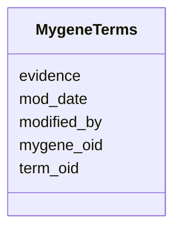

# Class: MygeneTerms 


URI: [img_ext:MygeneTerms](https://w3id.org/jgi/img_ext/MygeneTerms)





<!-- no inheritance hierarchy -->


## Slots

| Name | Cardinality and Range | Description | Inheritance |
| ---  | --- | --- | --- |
| [mygene_oid](mygene_oid.md) | 0..1 <br/> [Integer](Integer.md) |  | direct |
| [term_oid](term_oid.md) | 0..1 <br/> [Integer](Integer.md) |  | direct |
| [evidence](evidence.md) | 0..1 <br/> [String](String.md) |  | direct |
| [modified_by](modified_by.md) | 0..1 <br/> [Integer](Integer.md) |  | direct |
| [mod_date](mod_date.md) | 0..1 <br/> [Datetime](Datetime.md) |  | direct |


## Identifier and Mapping Information


### Schema Source


* from schema: https://w3id.org/jgi/img_ext


## Mappings

| Mapping Type | Mapped Value |
| ---  | ---  |
| self | img_ext:MygeneTerms |
| native | img_ext:MygeneTerms |


## LinkML Source

<!-- TODO: investigate https://stackoverflow.com/questions/37606292/how-to-create-tabbed-code-blocks-in-mkdocs-or-sphinx -->

### Direct

<details>
```yaml
name: mygene_terms
from_schema: https://w3id.org/jgi/img_ext
attributes:
  mygene_oid:
    name: mygene_oid
    from_schema: https://w3id.org/jgi/img_ext
    domain_of:
    - mygene
    - mygene_img_groups
    - mygene_terms
    range: integer
    required: false
  term_oid:
    name: term_oid
    from_schema: https://w3id.org/jgi/img_ext
    domain_of:
    - img_term
    - img_term_children
    - img_term_enzymes
    - img_term_history
    - img_term_synonyms
    - mygene_terms
    range: integer
    required: false
  evidence:
    name: evidence
    from_schema: https://w3id.org/jgi/img_ext
    domain_of:
    - gene_img_functions
    - img_pathway_assertions
    - img_pathway_taxons
    - mygene_terms
    - natural_product
    - pathway_network_taxons
    range: string
    required: false
  modified_by:
    name: modified_by
    from_schema: https://w3id.org/jgi/img_ext
    domain_of:
    - cell_localization
    - gene_img_functions
    - gene_myimg_functions
    - img_compound
    - img_compound_kegg_compounds
    - img_parts_list
    - img_parts_list_backup
    - img_pathway
    - img_pathway_assertions
    - img_pathway_taxons
    - img_reaction
    - img_term
    - img_term_synonyms
    - mygene
    - mygene_terms
    - myimg_bio_cluster_np
    - myimg_job
    - natural_product
    - np_biosynthesis_source
    - pathway_network
    - pathway_network_img_pathways
    - pathway_network_parents
    - pathway_network_parts_lists
    - pathway_network_taxons
    - phenotype_rule
    - phenotype_rule_taxons
    range: integer
    required: false
  mod_date:
    name: mod_date
    from_schema: https://w3id.org/jgi/img_ext
    domain_of:
    - cell_localization
    - gene_img_functions
    - gene_myimg_functions
    - img_compound
    - img_compound_kegg_compounds
    - img_parts_list
    - img_parts_list_backup
    - img_pathway
    - img_pathway_assertions
    - img_pathway_taxons
    - img_reaction
    - img_term
    - img_term_synonyms
    - mygene
    - mygene_terms
    - myimg_bio_cluster_np
    - myimg_job
    - natural_product
    - np_biosynthesis_source
    - pathway_network
    - pathway_network_img_pathways
    - pathway_network_parents
    - pathway_network_parts_lists
    - pathway_network_taxons
    - phenotype_rule
    - phenotype_rule_taxons
    range: datetime
    required: false

```
</details>

### Induced

<details>
```yaml
name: mygene_terms
from_schema: https://w3id.org/jgi/img_ext
attributes:
  mygene_oid:
    name: mygene_oid
    from_schema: https://w3id.org/jgi/img_ext
    alias: mygene_oid
    owner: mygene_terms
    domain_of:
    - mygene
    - mygene_img_groups
    - mygene_terms
    range: integer
    required: false
  term_oid:
    name: term_oid
    from_schema: https://w3id.org/jgi/img_ext
    alias: term_oid
    owner: mygene_terms
    domain_of:
    - img_term
    - img_term_children
    - img_term_enzymes
    - img_term_history
    - img_term_synonyms
    - mygene_terms
    range: integer
    required: false
  evidence:
    name: evidence
    from_schema: https://w3id.org/jgi/img_ext
    alias: evidence
    owner: mygene_terms
    domain_of:
    - gene_img_functions
    - img_pathway_assertions
    - img_pathway_taxons
    - mygene_terms
    - natural_product
    - pathway_network_taxons
    range: string
    required: false
  modified_by:
    name: modified_by
    from_schema: https://w3id.org/jgi/img_ext
    alias: modified_by
    owner: mygene_terms
    domain_of:
    - cell_localization
    - gene_img_functions
    - gene_myimg_functions
    - img_compound
    - img_compound_kegg_compounds
    - img_parts_list
    - img_parts_list_backup
    - img_pathway
    - img_pathway_assertions
    - img_pathway_taxons
    - img_reaction
    - img_term
    - img_term_synonyms
    - mygene
    - mygene_terms
    - myimg_bio_cluster_np
    - myimg_job
    - natural_product
    - np_biosynthesis_source
    - pathway_network
    - pathway_network_img_pathways
    - pathway_network_parents
    - pathway_network_parts_lists
    - pathway_network_taxons
    - phenotype_rule
    - phenotype_rule_taxons
    range: integer
    required: false
  mod_date:
    name: mod_date
    from_schema: https://w3id.org/jgi/img_ext
    alias: mod_date
    owner: mygene_terms
    domain_of:
    - cell_localization
    - gene_img_functions
    - gene_myimg_functions
    - img_compound
    - img_compound_kegg_compounds
    - img_parts_list
    - img_parts_list_backup
    - img_pathway
    - img_pathway_assertions
    - img_pathway_taxons
    - img_reaction
    - img_term
    - img_term_synonyms
    - mygene
    - mygene_terms
    - myimg_bio_cluster_np
    - myimg_job
    - natural_product
    - np_biosynthesis_source
    - pathway_network
    - pathway_network_img_pathways
    - pathway_network_parents
    - pathway_network_parts_lists
    - pathway_network_taxons
    - phenotype_rule
    - phenotype_rule_taxons
    range: datetime
    required: false

```
</details>