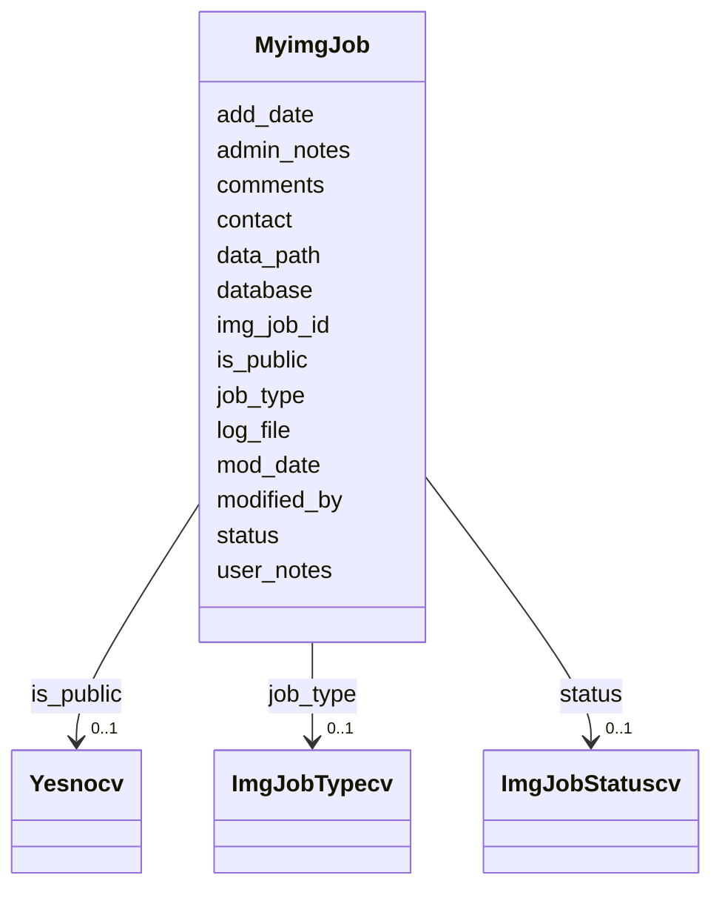

# Class: MyimgJob 


URI: [img_ext:MyimgJob](https://w3id.org/jgi/img_ext/MyimgJob)





<!-- no inheritance hierarchy -->


## Slots

| Name | Cardinality and Range | Description | Inheritance |
| ---  | --- | --- | --- |
| [img_job_id](img_job_id.md) | 0..1 <br/> [Float](Float.md) |  | direct |
| [contact](contact.md) | 0..1 <br/> [Float](Float.md) |  | direct |
| [add_date](add_date.md) | 0..1 <br/> [Datetime](Datetime.md) |  | direct |
| [status](status.md) | 0..1 <br/> [ImgJobStatuscv](ImgJobStatuscv.md) | Foreign key to img_job_statuscv | direct |
| [job_type](job_type.md) | 0..1 <br/> [ImgJobTypecv](ImgJobTypecv.md) | Foreign key to img_job_typecv | direct |
| [database](database.md) | 0..1 <br/> [String](String.md) |  | direct |
| [is_public](is_public.md) | 0..1 <br/> [Yesnocv](Yesnocv.md) | Foreign key to yesnocv | direct |
| [log_file](log_file.md) | 0..1 <br/> [String](String.md) |  | direct |
| [data_path](data_path.md) | 0..1 <br/> [String](String.md) |  | direct |
| [comments](comments.md) | 0..1 <br/> [String](String.md) |  | direct |
| [modified_by](modified_by.md) | 0..1 <br/> [Float](Float.md) |  | direct |
| [mod_date](mod_date.md) | 0..1 <br/> [Datetime](Datetime.md) |  | direct |
| [admin_notes](admin_notes.md) | 0..1 <br/> [String](String.md) |  | direct |
| [user_notes](user_notes.md) | 0..1 <br/> [String](String.md) |  | direct |


## Usages

| used by | used in | type | used |
| ---  | --- | --- | --- |
| [MyimgJobParameters](MyimgJobParameters.md) | [img_job_id](img_job_id.md) | range | [MyimgJob](MyimgJob.md) |
| [MyimgJobUsers](MyimgJobUsers.md) | [img_job_id](img_job_id.md) | range | [MyimgJob](MyimgJob.md) |


## Identifier and Mapping Information


### Schema Source


* from schema: https://w3id.org/jgi/img_ext


## Mappings

| Mapping Type | Mapped Value |
| ---  | ---  |
| self | img_ext:MyimgJob |
| native | img_ext:MyimgJob |


## LinkML Source

<!-- TODO: investigate https://stackoverflow.com/questions/37606292/how-to-create-tabbed-code-blocks-in-mkdocs-or-sphinx -->

### Direct

<details>
```yaml
name: myimg_job
from_schema: https://w3id.org/jgi/img_ext
attributes:
  img_job_id:
    name: img_job_id
    from_schema: https://w3id.org/jgi/img_ext
    rank: 1000
    domain_of:
    - myimg_job
    - myimg_job_parameters
    - myimg_job_users
    range: float
    required: false
  contact:
    name: contact
    from_schema: https://w3id.org/jgi/img_ext
    domain_of:
    - gene_function_history
    - gene_history
    - img_parts_list_history
    - img_pathway_history
    - img_term_history
    - myimg_job
    range: float
    required: false
  add_date:
    name: add_date
    from_schema: https://w3id.org/jgi/img_ext
    domain_of:
    - gene_function_history
    - gene_history
    - img_compound
    - img_parts_list
    - img_parts_list_backup
    - img_parts_list_history
    - img_pathway
    - img_pathway_history
    - img_reaction
    - img_term
    - img_term_history
    - img_term_synonyms
    - mygene
    - myimg_job
    - pathway_network
    - phenotype_rule
    - public_set
    range: datetime
    required: false
  status:
    name: status
    description: Foreign key to img_job_statuscv
    from_schema: https://w3id.org/jgi/img_ext
    domain_of:
    - img_compound
    - img_pathway_assertions
    - img_pathway_taxons
    - myimg_job
    range: img_job_statuscv
    required: false
  job_type:
    name: job_type
    description: Foreign key to img_job_typecv
    from_schema: https://w3id.org/jgi/img_ext
    rank: 1000
    domain_of:
    - myimg_job
    range: img_job_typecv
    required: false
  database:
    name: database
    from_schema: https://w3id.org/jgi/img_ext
    rank: 1000
    domain_of:
    - myimg_job
    range: string
    required: false
  is_public:
    name: is_public
    description: Foreign key to yesnocv
    from_schema: https://w3id.org/jgi/img_ext
    domain_of:
    - gene_myimg_functions
    - mygene
    - myimg_bio_cluster_np
    - myimg_job
    range: yesnocv
    required: false
  log_file:
    name: log_file
    from_schema: https://w3id.org/jgi/img_ext
    rank: 1000
    domain_of:
    - myimg_job
    range: string
    required: false
  data_path:
    name: data_path
    from_schema: https://w3id.org/jgi/img_ext
    rank: 1000
    domain_of:
    - myimg_job
    range: string
    required: false
  comments:
    name: comments
    from_schema: https://w3id.org/jgi/img_ext
    domain_of:
    - gene_function_history
    - gene_history
    - img_parts_list_history
    - img_pathway_assertions
    - img_pathway_history
    - img_reaction
    - img_reaction_assoc_networks
    - img_reaction_assoc_paths
    - img_reaction_assoc_rxns
    - img_term
    - img_term_history
    - myimg_bio_cluster_np
    - myimg_job
    - pathway_network
    range: string
    required: false
  modified_by:
    name: modified_by
    from_schema: https://w3id.org/jgi/img_ext
    domain_of:
    - cell_localization
    - gene_img_functions
    - gene_myimg_functions
    - img_compound
    - img_compound_kegg_compounds
    - img_parts_list
    - img_parts_list_backup
    - img_pathway
    - img_pathway_assertions
    - img_pathway_taxons
    - img_reaction
    - img_term
    - img_term_synonyms
    - mygene
    - mygene_terms
    - myimg_bio_cluster_np
    - myimg_job
    - natural_product
    - np_biosynthesis_source
    - pathway_network
    - pathway_network_img_pathways
    - pathway_network_parents
    - pathway_network_parts_lists
    - pathway_network_taxons
    - phenotype_rule
    - phenotype_rule_taxons
    range: float
    required: false
  mod_date:
    name: mod_date
    from_schema: https://w3id.org/jgi/img_ext
    domain_of:
    - cell_localization
    - gene_img_functions
    - gene_myimg_functions
    - img_compound
    - img_compound_kegg_compounds
    - img_parts_list
    - img_parts_list_backup
    - img_pathway
    - img_pathway_assertions
    - img_pathway_taxons
    - img_reaction
    - img_term
    - img_term_synonyms
    - mygene
    - mygene_terms
    - myimg_bio_cluster_np
    - myimg_job
    - natural_product
    - np_biosynthesis_source
    - pathway_network
    - pathway_network_img_pathways
    - pathway_network_parents
    - pathway_network_parts_lists
    - pathway_network_taxons
    - phenotype_rule
    - phenotype_rule_taxons
    range: datetime
    required: false
  admin_notes:
    name: admin_notes
    from_schema: https://w3id.org/jgi/img_ext
    rank: 1000
    domain_of:
    - myimg_job
    range: string
    required: false
  user_notes:
    name: user_notes
    from_schema: https://w3id.org/jgi/img_ext
    rank: 1000
    domain_of:
    - myimg_job
    range: string
    required: false

```
</details>

### Induced

<details>
```yaml
name: myimg_job
from_schema: https://w3id.org/jgi/img_ext
attributes:
  img_job_id:
    name: img_job_id
    from_schema: https://w3id.org/jgi/img_ext
    rank: 1000
    alias: img_job_id
    owner: myimg_job
    domain_of:
    - myimg_job
    - myimg_job_parameters
    - myimg_job_users
    range: float
    required: false
  contact:
    name: contact
    from_schema: https://w3id.org/jgi/img_ext
    alias: contact
    owner: myimg_job
    domain_of:
    - gene_function_history
    - gene_history
    - img_parts_list_history
    - img_pathway_history
    - img_term_history
    - myimg_job
    range: float
    required: false
  add_date:
    name: add_date
    from_schema: https://w3id.org/jgi/img_ext
    alias: add_date
    owner: myimg_job
    domain_of:
    - gene_function_history
    - gene_history
    - img_compound
    - img_parts_list
    - img_parts_list_backup
    - img_parts_list_history
    - img_pathway
    - img_pathway_history
    - img_reaction
    - img_term
    - img_term_history
    - img_term_synonyms
    - mygene
    - myimg_job
    - pathway_network
    - phenotype_rule
    - public_set
    range: datetime
    required: false
  status:
    name: status
    description: Foreign key to img_job_statuscv
    from_schema: https://w3id.org/jgi/img_ext
    alias: status
    owner: myimg_job
    domain_of:
    - img_compound
    - img_pathway_assertions
    - img_pathway_taxons
    - myimg_job
    range: img_job_statuscv
    required: false
  job_type:
    name: job_type
    description: Foreign key to img_job_typecv
    from_schema: https://w3id.org/jgi/img_ext
    rank: 1000
    alias: job_type
    owner: myimg_job
    domain_of:
    - myimg_job
    range: img_job_typecv
    required: false
  database:
    name: database
    from_schema: https://w3id.org/jgi/img_ext
    rank: 1000
    alias: database
    owner: myimg_job
    domain_of:
    - myimg_job
    range: string
    required: false
  is_public:
    name: is_public
    description: Foreign key to yesnocv
    from_schema: https://w3id.org/jgi/img_ext
    alias: is_public
    owner: myimg_job
    domain_of:
    - gene_myimg_functions
    - mygene
    - myimg_bio_cluster_np
    - myimg_job
    range: yesnocv
    required: false
  log_file:
    name: log_file
    from_schema: https://w3id.org/jgi/img_ext
    rank: 1000
    alias: log_file
    owner: myimg_job
    domain_of:
    - myimg_job
    range: string
    required: false
  data_path:
    name: data_path
    from_schema: https://w3id.org/jgi/img_ext
    rank: 1000
    alias: data_path
    owner: myimg_job
    domain_of:
    - myimg_job
    range: string
    required: false
  comments:
    name: comments
    from_schema: https://w3id.org/jgi/img_ext
    alias: comments
    owner: myimg_job
    domain_of:
    - gene_function_history
    - gene_history
    - img_parts_list_history
    - img_pathway_assertions
    - img_pathway_history
    - img_reaction
    - img_reaction_assoc_networks
    - img_reaction_assoc_paths
    - img_reaction_assoc_rxns
    - img_term
    - img_term_history
    - myimg_bio_cluster_np
    - myimg_job
    - pathway_network
    range: string
    required: false
  modified_by:
    name: modified_by
    from_schema: https://w3id.org/jgi/img_ext
    alias: modified_by
    owner: myimg_job
    domain_of:
    - cell_localization
    - gene_img_functions
    - gene_myimg_functions
    - img_compound
    - img_compound_kegg_compounds
    - img_parts_list
    - img_parts_list_backup
    - img_pathway
    - img_pathway_assertions
    - img_pathway_taxons
    - img_reaction
    - img_term
    - img_term_synonyms
    - mygene
    - mygene_terms
    - myimg_bio_cluster_np
    - myimg_job
    - natural_product
    - np_biosynthesis_source
    - pathway_network
    - pathway_network_img_pathways
    - pathway_network_parents
    - pathway_network_parts_lists
    - pathway_network_taxons
    - phenotype_rule
    - phenotype_rule_taxons
    range: float
    required: false
  mod_date:
    name: mod_date
    from_schema: https://w3id.org/jgi/img_ext
    alias: mod_date
    owner: myimg_job
    domain_of:
    - cell_localization
    - gene_img_functions
    - gene_myimg_functions
    - img_compound
    - img_compound_kegg_compounds
    - img_parts_list
    - img_parts_list_backup
    - img_pathway
    - img_pathway_assertions
    - img_pathway_taxons
    - img_reaction
    - img_term
    - img_term_synonyms
    - mygene
    - mygene_terms
    - myimg_bio_cluster_np
    - myimg_job
    - natural_product
    - np_biosynthesis_source
    - pathway_network
    - pathway_network_img_pathways
    - pathway_network_parents
    - pathway_network_parts_lists
    - pathway_network_taxons
    - phenotype_rule
    - phenotype_rule_taxons
    range: datetime
    required: false
  admin_notes:
    name: admin_notes
    from_schema: https://w3id.org/jgi/img_ext
    rank: 1000
    alias: admin_notes
    owner: myimg_job
    domain_of:
    - myimg_job
    range: string
    required: false
  user_notes:
    name: user_notes
    from_schema: https://w3id.org/jgi/img_ext
    rank: 1000
    alias: user_notes
    owner: myimg_job
    domain_of:
    - myimg_job
    range: string
    required: false

```
</details>