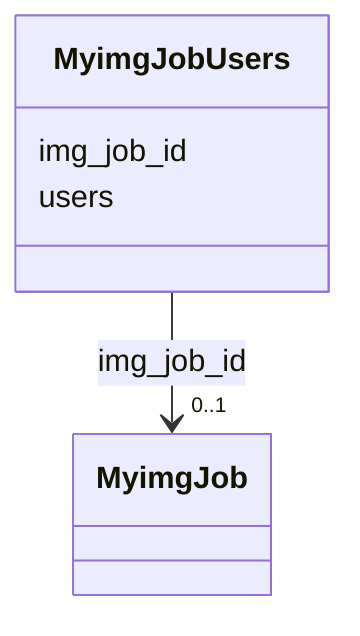

# Class: MyimgJobUsers 


URI: [img_ext:MyimgJobUsers](https://w3id.org/jgi/img_ext/MyimgJobUsers)





<!-- no inheritance hierarchy -->


## Slots

| Name | Cardinality and Range | Description | Inheritance |
| ---  | --- | --- | --- |
| [img_job_id](img_job_id.md) | 0..1 <br/> [MyimgJob](MyimgJob.md) | Foreign key to myimg_job | direct |
| [users](users.md) | 0..1 <br/> [Float](Float.md) |  | direct |


## Identifier and Mapping Information


### Schema Source


* from schema: https://w3id.org/jgi/img_ext


## Mappings

| Mapping Type | Mapped Value |
| ---  | ---  |
| self | img_ext:MyimgJobUsers |
| native | img_ext:MyimgJobUsers |


## LinkML Source

<!-- TODO: investigate https://stackoverflow.com/questions/37606292/how-to-create-tabbed-code-blocks-in-mkdocs-or-sphinx -->

### Direct

<details>
```yaml
name: myimg_job_users
from_schema: https://w3id.org/jgi/img_ext
attributes:
  img_job_id:
    name: img_job_id
    description: Foreign key to myimg_job
    from_schema: https://w3id.org/jgi/img_ext
    domain_of:
    - myimg_job
    - myimg_job_parameters
    - myimg_job_users
    range: myimg_job
    required: false
  users:
    name: users
    from_schema: https://w3id.org/jgi/img_ext
    rank: 1000
    domain_of:
    - myimg_job_users
    range: float
    required: false

```
</details>

### Induced

<details>
```yaml
name: myimg_job_users
from_schema: https://w3id.org/jgi/img_ext
attributes:
  img_job_id:
    name: img_job_id
    description: Foreign key to myimg_job
    from_schema: https://w3id.org/jgi/img_ext
    alias: img_job_id
    owner: myimg_job_users
    domain_of:
    - myimg_job
    - myimg_job_parameters
    - myimg_job_users
    range: myimg_job
    required: false
  users:
    name: users
    from_schema: https://w3id.org/jgi/img_ext
    rank: 1000
    alias: users
    owner: myimg_job_users
    domain_of:
    - myimg_job_users
    range: float
    required: false

```
</details>