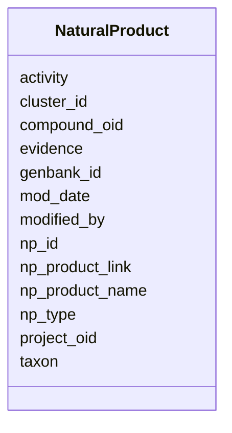

# Class: NaturalProduct 


URI: [img_ext:NaturalProduct](https://w3id.org/jgi/img_ext/NaturalProduct)





<!-- no inheritance hierarchy -->


## Slots

| Name | Cardinality and Range | Description | Inheritance |
| ---  | --- | --- | --- |
| [np_id](np_id.md) | 0..1 <br/> [Float](Float.md) |  | direct |
| [np_product_name](np_product_name.md) | 0..1 <br/> [String](String.md) |  | direct |
| [np_product_link](np_product_link.md) | 0..1 <br/> [String](String.md) |  | direct |
| [project_oid](project_oid.md) | 0..1 <br/> [Float](Float.md) |  | direct |
| [taxon](taxon.md) | 0..1 <br/> [Float](Float.md) |  | direct |
| [cluster_id](cluster_id.md) | 0..1 <br/> [String](String.md) |  | direct |
| [genbank_id](genbank_id.md) | 0..1 <br/> [String](String.md) |  | direct |
| [evidence](evidence.md) | 0..1 <br/> [String](String.md) |  | direct |
| [np_type](np_type.md) | 0..1 <br/> [String](String.md) |  | direct |
| [activity](activity.md) | 0..1 <br/> [String](String.md) |  | direct |
| [compound_oid](compound_oid.md) | 0..1 <br/> [Float](Float.md) |  | direct |
| [modified_by](modified_by.md) | 0..1 <br/> [Float](Float.md) |  | direct |
| [mod_date](mod_date.md) | 0..1 <br/> [Datetime](Datetime.md) |  | direct |


## Identifier and Mapping Information


### Schema Source


* from schema: https://w3id.org/jgi/img_ext


## Mappings

| Mapping Type | Mapped Value |
| ---  | ---  |
| self | img_ext:NaturalProduct |
| native | img_ext:NaturalProduct |


## LinkML Source

<!-- TODO: investigate https://stackoverflow.com/questions/37606292/how-to-create-tabbed-code-blocks-in-mkdocs-or-sphinx -->

### Direct

<details>
```yaml
name: natural_product
from_schema: https://w3id.org/jgi/img_ext
attributes:
  np_id:
    name: np_id
    from_schema: https://w3id.org/jgi/img_ext
    rank: 1000
    domain_of:
    - natural_product
    range: float
    required: false
  np_product_name:
    name: np_product_name
    from_schema: https://w3id.org/jgi/img_ext
    rank: 1000
    domain_of:
    - natural_product
    range: string
    required: false
  np_product_link:
    name: np_product_link
    from_schema: https://w3id.org/jgi/img_ext
    rank: 1000
    domain_of:
    - natural_product
    range: string
    required: false
  project_oid:
    name: project_oid
    from_schema: https://w3id.org/jgi/img_ext
    rank: 1000
    domain_of:
    - natural_product
    range: float
    required: false
  taxon:
    name: taxon
    from_schema: https://w3id.org/jgi/img_ext
    domain_of:
    - gene_function_history
    - gene_history
    - gene_img_functions
    - img_pathway_assertions
    - img_pathway_taxons
    - mygene
    - natural_product
    - pathway_network_taxons
    - phenotype_rule_taxons
    range: float
    required: false
  cluster_id:
    name: cluster_id
    from_schema: https://w3id.org/jgi/img_ext
    domain_of:
    - bc_ext_links
    - myimg_bio_cluster_np
    - natural_product
    - np_biosynthesis_source
    range: string
    required: false
  genbank_id:
    name: genbank_id
    from_schema: https://w3id.org/jgi/img_ext
    rank: 1000
    domain_of:
    - natural_product
    range: string
    required: false
  evidence:
    name: evidence
    from_schema: https://w3id.org/jgi/img_ext
    domain_of:
    - gene_img_functions
    - img_pathway_assertions
    - img_pathway_taxons
    - mygene_terms
    - natural_product
    - pathway_network_taxons
    range: string
    required: false
  np_type:
    name: np_type
    from_schema: https://w3id.org/jgi/img_ext
    rank: 1000
    domain_of:
    - natural_product
    range: string
    required: false
  activity:
    name: activity
    from_schema: https://w3id.org/jgi/img_ext
    domain_of:
    - img_compound_activity
    - natural_product
    range: string
    required: false
  compound_oid:
    name: compound_oid
    from_schema: https://w3id.org/jgi/img_ext
    domain_of:
    - img_compound
    - img_compound_activity
    - img_compound_aliases
    - img_compound_ext_links
    - img_compound_kegg_compounds
    - img_compound_meshd_tree
    - myimg_bio_cluster_np
    - natural_product
    - np_biosynthesis_source
    range: float
    required: false
  modified_by:
    name: modified_by
    from_schema: https://w3id.org/jgi/img_ext
    domain_of:
    - cell_localization
    - gene_img_functions
    - gene_myimg_functions
    - img_compound
    - img_compound_kegg_compounds
    - img_parts_list
    - img_parts_list_backup
    - img_pathway
    - img_pathway_assertions
    - img_pathway_taxons
    - img_reaction
    - img_term
    - img_term_synonyms
    - mygene
    - mygene_terms
    - myimg_bio_cluster_np
    - myimg_job
    - natural_product
    - np_biosynthesis_source
    - pathway_network
    - pathway_network_img_pathways
    - pathway_network_parents
    - pathway_network_parts_lists
    - pathway_network_taxons
    - phenotype_rule
    - phenotype_rule_taxons
    range: float
    required: false
  mod_date:
    name: mod_date
    from_schema: https://w3id.org/jgi/img_ext
    domain_of:
    - cell_localization
    - gene_img_functions
    - gene_myimg_functions
    - img_compound
    - img_compound_kegg_compounds
    - img_parts_list
    - img_parts_list_backup
    - img_pathway
    - img_pathway_assertions
    - img_pathway_taxons
    - img_reaction
    - img_term
    - img_term_synonyms
    - mygene
    - mygene_terms
    - myimg_bio_cluster_np
    - myimg_job
    - natural_product
    - np_biosynthesis_source
    - pathway_network
    - pathway_network_img_pathways
    - pathway_network_parents
    - pathway_network_parts_lists
    - pathway_network_taxons
    - phenotype_rule
    - phenotype_rule_taxons
    range: datetime
    required: false

```
</details>

### Induced

<details>
```yaml
name: natural_product
from_schema: https://w3id.org/jgi/img_ext
attributes:
  np_id:
    name: np_id
    from_schema: https://w3id.org/jgi/img_ext
    rank: 1000
    alias: np_id
    owner: natural_product
    domain_of:
    - natural_product
    range: float
    required: false
  np_product_name:
    name: np_product_name
    from_schema: https://w3id.org/jgi/img_ext
    rank: 1000
    alias: np_product_name
    owner: natural_product
    domain_of:
    - natural_product
    range: string
    required: false
  np_product_link:
    name: np_product_link
    from_schema: https://w3id.org/jgi/img_ext
    rank: 1000
    alias: np_product_link
    owner: natural_product
    domain_of:
    - natural_product
    range: string
    required: false
  project_oid:
    name: project_oid
    from_schema: https://w3id.org/jgi/img_ext
    rank: 1000
    alias: project_oid
    owner: natural_product
    domain_of:
    - natural_product
    range: float
    required: false
  taxon:
    name: taxon
    from_schema: https://w3id.org/jgi/img_ext
    alias: taxon
    owner: natural_product
    domain_of:
    - gene_function_history
    - gene_history
    - gene_img_functions
    - img_pathway_assertions
    - img_pathway_taxons
    - mygene
    - natural_product
    - pathway_network_taxons
    - phenotype_rule_taxons
    range: float
    required: false
  cluster_id:
    name: cluster_id
    from_schema: https://w3id.org/jgi/img_ext
    alias: cluster_id
    owner: natural_product
    domain_of:
    - bc_ext_links
    - myimg_bio_cluster_np
    - natural_product
    - np_biosynthesis_source
    range: string
    required: false
  genbank_id:
    name: genbank_id
    from_schema: https://w3id.org/jgi/img_ext
    rank: 1000
    alias: genbank_id
    owner: natural_product
    domain_of:
    - natural_product
    range: string
    required: false
  evidence:
    name: evidence
    from_schema: https://w3id.org/jgi/img_ext
    alias: evidence
    owner: natural_product
    domain_of:
    - gene_img_functions
    - img_pathway_assertions
    - img_pathway_taxons
    - mygene_terms
    - natural_product
    - pathway_network_taxons
    range: string
    required: false
  np_type:
    name: np_type
    from_schema: https://w3id.org/jgi/img_ext
    rank: 1000
    alias: np_type
    owner: natural_product
    domain_of:
    - natural_product
    range: string
    required: false
  activity:
    name: activity
    from_schema: https://w3id.org/jgi/img_ext
    alias: activity
    owner: natural_product
    domain_of:
    - img_compound_activity
    - natural_product
    range: string
    required: false
  compound_oid:
    name: compound_oid
    from_schema: https://w3id.org/jgi/img_ext
    alias: compound_oid
    owner: natural_product
    domain_of:
    - img_compound
    - img_compound_activity
    - img_compound_aliases
    - img_compound_ext_links
    - img_compound_kegg_compounds
    - img_compound_meshd_tree
    - myimg_bio_cluster_np
    - natural_product
    - np_biosynthesis_source
    range: float
    required: false
  modified_by:
    name: modified_by
    from_schema: https://w3id.org/jgi/img_ext
    alias: modified_by
    owner: natural_product
    domain_of:
    - cell_localization
    - gene_img_functions
    - gene_myimg_functions
    - img_compound
    - img_compound_kegg_compounds
    - img_parts_list
    - img_parts_list_backup
    - img_pathway
    - img_pathway_assertions
    - img_pathway_taxons
    - img_reaction
    - img_term
    - img_term_synonyms
    - mygene
    - mygene_terms
    - myimg_bio_cluster_np
    - myimg_job
    - natural_product
    - np_biosynthesis_source
    - pathway_network
    - pathway_network_img_pathways
    - pathway_network_parents
    - pathway_network_parts_lists
    - pathway_network_taxons
    - phenotype_rule
    - phenotype_rule_taxons
    range: float
    required: false
  mod_date:
    name: mod_date
    from_schema: https://w3id.org/jgi/img_ext
    alias: mod_date
    owner: natural_product
    domain_of:
    - cell_localization
    - gene_img_functions
    - gene_myimg_functions
    - img_compound
    - img_compound_kegg_compounds
    - img_parts_list
    - img_parts_list_backup
    - img_pathway
    - img_pathway_assertions
    - img_pathway_taxons
    - img_reaction
    - img_term
    - img_term_synonyms
    - mygene
    - mygene_terms
    - myimg_bio_cluster_np
    - myimg_job
    - natural_product
    - np_biosynthesis_source
    - pathway_network
    - pathway_network_img_pathways
    - pathway_network_parents
    - pathway_network_parts_lists
    - pathway_network_taxons
    - phenotype_rule
    - phenotype_rule_taxons
    range: datetime
    required: false

```
</details>