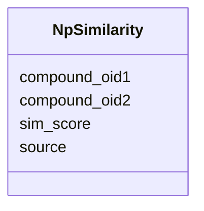

# Class: NpSimilarity 


URI: [img_ext:NpSimilarity](https://w3id.org/jgi/img_ext/NpSimilarity)





<!-- no inheritance hierarchy -->


## Slots

| Name | Cardinality and Range | Description | Inheritance |
| ---  | --- | --- | --- |
| [compound_oid1](compound_oid1.md) | 0..1 <br/> [Integer](Integer.md) |  | direct |
| [compound_oid2](compound_oid2.md) | 0..1 <br/> [Integer](Integer.md) |  | direct |
| [sim_score](sim_score.md) | 0..1 <br/> [Float](Float.md) |  | direct |
| [source](source.md) | 0..1 <br/> [String](String.md) |  | direct |


## Identifier and Mapping Information


### Schema Source


* from schema: https://w3id.org/jgi/img_ext


## Mappings

| Mapping Type | Mapped Value |
| ---  | ---  |
| self | img_ext:NpSimilarity |
| native | img_ext:NpSimilarity |


## LinkML Source

<!-- TODO: investigate https://stackoverflow.com/questions/37606292/how-to-create-tabbed-code-blocks-in-mkdocs-or-sphinx -->

### Direct

<details>
```yaml
name: np_similarity
from_schema: https://w3id.org/jgi/img_ext
attributes:
  compound_oid1:
    name: compound_oid1
    from_schema: https://w3id.org/jgi/img_ext
    rank: 1000
    domain_of:
    - np_similarity
    range: integer
    required: false
  compound_oid2:
    name: compound_oid2
    from_schema: https://w3id.org/jgi/img_ext
    rank: 1000
    domain_of:
    - np_similarity
    range: integer
    required: false
  sim_score:
    name: sim_score
    from_schema: https://w3id.org/jgi/img_ext
    rank: 1000
    domain_of:
    - np_similarity
    range: float
    required: false
  source:
    name: source
    from_schema: https://w3id.org/jgi/img_ext
    rank: 1000
    domain_of:
    - np_similarity
    range: string
    required: false

```
</details>

### Induced

<details>
```yaml
name: np_similarity
from_schema: https://w3id.org/jgi/img_ext
attributes:
  compound_oid1:
    name: compound_oid1
    from_schema: https://w3id.org/jgi/img_ext
    rank: 1000
    alias: compound_oid1
    owner: np_similarity
    domain_of:
    - np_similarity
    range: integer
    required: false
  compound_oid2:
    name: compound_oid2
    from_schema: https://w3id.org/jgi/img_ext
    rank: 1000
    alias: compound_oid2
    owner: np_similarity
    domain_of:
    - np_similarity
    range: integer
    required: false
  sim_score:
    name: sim_score
    from_schema: https://w3id.org/jgi/img_ext
    rank: 1000
    alias: sim_score
    owner: np_similarity
    domain_of:
    - np_similarity
    range: float
    required: false
  source:
    name: source
    from_schema: https://w3id.org/jgi/img_ext
    rank: 1000
    alias: source
    owner: np_similarity
    domain_of:
    - np_similarity
    range: string
    required: false

```
</details>