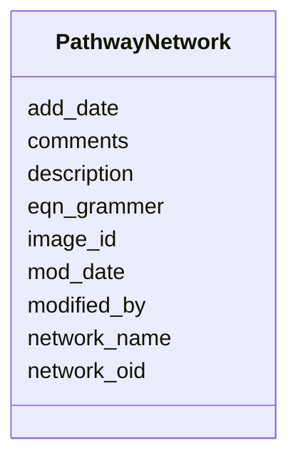

# Class: PathwayNetwork 


URI: [img_ext:PathwayNetwork](https://w3id.org/jgi/img_ext/PathwayNetwork)





<!-- no inheritance hierarchy -->


## Slots

| Name | Cardinality and Range | Description | Inheritance |
| ---  | --- | --- | --- |
| [network_oid](network_oid.md) | 0..1 <br/> [Integer](Integer.md) |  | direct |
| [network_name](network_name.md) | 0..1 <br/> [String](String.md) |  | direct |
| [eqn_grammer](eqn_grammer.md) | 0..1 <br/> [String](String.md) |  | direct |
| [description](description.md) | 0..1 <br/> [String](String.md) |  | direct |
| [comments](comments.md) | 0..1 <br/> [String](String.md) |  | direct |
| [image_id](image_id.md) | 0..1 <br/> [String](String.md) |  | direct |
| [add_date](add_date.md) | 0..1 <br/> [Datetime](Datetime.md) |  | direct |
| [mod_date](mod_date.md) | 0..1 <br/> [Datetime](Datetime.md) |  | direct |
| [modified_by](modified_by.md) | 0..1 <br/> [Integer](Integer.md) |  | direct |


## Usages

| used by | used in | type | used |
| ---  | --- | --- | --- |
| [ImgReactionAssocNetworks](ImgReactionAssocNetworks.md) | [network](network.md) | range | [PathwayNetwork](PathwayNetwork.md) |
| [PathwayNetworkCComponents](PathwayNetworkCComponents.md) | [network_oid](network_oid.md) | range | [PathwayNetwork](PathwayNetwork.md) |
| [PathwayNetworkImgPathways](PathwayNetworkImgPathways.md) | [network_oid](network_oid.md) | range | [PathwayNetwork](PathwayNetwork.md) |
| [PathwayNetworkParents](PathwayNetworkParents.md) | [network_oid](network_oid.md) | range | [PathwayNetwork](PathwayNetwork.md) |
| [PathwayNetworkParents](PathwayNetworkParents.md) | [parent](parent.md) | range | [PathwayNetwork](PathwayNetwork.md) |
| [PathwayNetworkPartsLists](PathwayNetworkPartsLists.md) | [network_oid](network_oid.md) | range | [PathwayNetwork](PathwayNetwork.md) |
| [PathwayNetworkTComponents](PathwayNetworkTComponents.md) | [network_oid](network_oid.md) | range | [PathwayNetwork](PathwayNetwork.md) |
| [PathwayNetworkTaxons](PathwayNetworkTaxons.md) | [network_oid](network_oid.md) | range | [PathwayNetwork](PathwayNetwork.md) |


## Identifier and Mapping Information


### Schema Source


* from schema: https://w3id.org/jgi/img_ext


## Mappings

| Mapping Type | Mapped Value |
| ---  | ---  |
| self | img_ext:PathwayNetwork |
| native | img_ext:PathwayNetwork |


## LinkML Source

<!-- TODO: investigate https://stackoverflow.com/questions/37606292/how-to-create-tabbed-code-blocks-in-mkdocs-or-sphinx -->

### Direct

<details>
```yaml
name: pathway_network
from_schema: https://w3id.org/jgi/img_ext
attributes:
  network_oid:
    name: network_oid
    from_schema: https://w3id.org/jgi/img_ext
    rank: 1000
    domain_of:
    - pathway_network
    - pathway_network_c_components
    - pathway_network_img_pathways
    - pathway_network_parents
    - pathway_network_parts_lists
    - pathway_network_t_components
    - pathway_network_taxons
    range: integer
    required: false
  network_name:
    name: network_name
    from_schema: https://w3id.org/jgi/img_ext
    rank: 1000
    domain_of:
    - pathway_network
    range: string
    required: false
  eqn_grammer:
    name: eqn_grammer
    from_schema: https://w3id.org/jgi/img_ext
    rank: 1000
    domain_of:
    - pathway_network
    range: string
    required: false
  description:
    name: description
    from_schema: https://w3id.org/jgi/img_ext
    domain_of:
    - assertioncv
    - componentcv
    - img_job_typecv
    - imgtermcv
    - mygene
    - pathway_network
    - phenotype_rule
    - public_set
    - statuscv
    - yesnocv
    range: string
    required: false
  comments:
    name: comments
    from_schema: https://w3id.org/jgi/img_ext
    domain_of:
    - gene_function_history
    - gene_history
    - img_parts_list_history
    - img_pathway_assertions
    - img_pathway_history
    - img_reaction
    - img_reaction_assoc_networks
    - img_reaction_assoc_paths
    - img_reaction_assoc_rxns
    - img_term
    - img_term_history
    - myimg_bio_cluster_np
    - myimg_job
    - pathway_network
    range: string
    required: false
  image_id:
    name: image_id
    from_schema: https://w3id.org/jgi/img_ext
    rank: 1000
    domain_of:
    - pathway_network
    range: string
    required: false
  add_date:
    name: add_date
    from_schema: https://w3id.org/jgi/img_ext
    domain_of:
    - gene_function_history
    - gene_history
    - img_compound
    - img_parts_list
    - img_parts_list_backup
    - img_parts_list_history
    - img_pathway
    - img_pathway_history
    - img_reaction
    - img_term
    - img_term_history
    - img_term_synonyms
    - mygene
    - myimg_job
    - pathway_network
    - phenotype_rule
    - public_set
    range: datetime
    required: false
  mod_date:
    name: mod_date
    from_schema: https://w3id.org/jgi/img_ext
    domain_of:
    - cell_localization
    - gene_img_functions
    - gene_myimg_functions
    - img_compound
    - img_compound_kegg_compounds
    - img_parts_list
    - img_parts_list_backup
    - img_pathway
    - img_pathway_assertions
    - img_pathway_taxons
    - img_reaction
    - img_term
    - img_term_synonyms
    - mygene
    - mygene_terms
    - myimg_bio_cluster_np
    - myimg_job
    - natural_product
    - np_biosynthesis_source
    - pathway_network
    - pathway_network_img_pathways
    - pathway_network_parents
    - pathway_network_parts_lists
    - pathway_network_taxons
    - phenotype_rule
    - phenotype_rule_taxons
    range: datetime
    required: false
  modified_by:
    name: modified_by
    from_schema: https://w3id.org/jgi/img_ext
    domain_of:
    - cell_localization
    - gene_img_functions
    - gene_myimg_functions
    - img_compound
    - img_compound_kegg_compounds
    - img_parts_list
    - img_parts_list_backup
    - img_pathway
    - img_pathway_assertions
    - img_pathway_taxons
    - img_reaction
    - img_term
    - img_term_synonyms
    - mygene
    - mygene_terms
    - myimg_bio_cluster_np
    - myimg_job
    - natural_product
    - np_biosynthesis_source
    - pathway_network
    - pathway_network_img_pathways
    - pathway_network_parents
    - pathway_network_parts_lists
    - pathway_network_taxons
    - phenotype_rule
    - phenotype_rule_taxons
    range: integer
    required: false

```
</details>

### Induced

<details>
```yaml
name: pathway_network
from_schema: https://w3id.org/jgi/img_ext
attributes:
  network_oid:
    name: network_oid
    from_schema: https://w3id.org/jgi/img_ext
    rank: 1000
    alias: network_oid
    owner: pathway_network
    domain_of:
    - pathway_network
    - pathway_network_c_components
    - pathway_network_img_pathways
    - pathway_network_parents
    - pathway_network_parts_lists
    - pathway_network_t_components
    - pathway_network_taxons
    range: integer
    required: false
  network_name:
    name: network_name
    from_schema: https://w3id.org/jgi/img_ext
    rank: 1000
    alias: network_name
    owner: pathway_network
    domain_of:
    - pathway_network
    range: string
    required: false
  eqn_grammer:
    name: eqn_grammer
    from_schema: https://w3id.org/jgi/img_ext
    rank: 1000
    alias: eqn_grammer
    owner: pathway_network
    domain_of:
    - pathway_network
    range: string
    required: false
  description:
    name: description
    from_schema: https://w3id.org/jgi/img_ext
    alias: description
    owner: pathway_network
    domain_of:
    - assertioncv
    - componentcv
    - img_job_typecv
    - imgtermcv
    - mygene
    - pathway_network
    - phenotype_rule
    - public_set
    - statuscv
    - yesnocv
    range: string
    required: false
  comments:
    name: comments
    from_schema: https://w3id.org/jgi/img_ext
    alias: comments
    owner: pathway_network
    domain_of:
    - gene_function_history
    - gene_history
    - img_parts_list_history
    - img_pathway_assertions
    - img_pathway_history
    - img_reaction
    - img_reaction_assoc_networks
    - img_reaction_assoc_paths
    - img_reaction_assoc_rxns
    - img_term
    - img_term_history
    - myimg_bio_cluster_np
    - myimg_job
    - pathway_network
    range: string
    required: false
  image_id:
    name: image_id
    from_schema: https://w3id.org/jgi/img_ext
    rank: 1000
    alias: image_id
    owner: pathway_network
    domain_of:
    - pathway_network
    range: string
    required: false
  add_date:
    name: add_date
    from_schema: https://w3id.org/jgi/img_ext
    alias: add_date
    owner: pathway_network
    domain_of:
    - gene_function_history
    - gene_history
    - img_compound
    - img_parts_list
    - img_parts_list_backup
    - img_parts_list_history
    - img_pathway
    - img_pathway_history
    - img_reaction
    - img_term
    - img_term_history
    - img_term_synonyms
    - mygene
    - myimg_job
    - pathway_network
    - phenotype_rule
    - public_set
    range: datetime
    required: false
  mod_date:
    name: mod_date
    from_schema: https://w3id.org/jgi/img_ext
    alias: mod_date
    owner: pathway_network
    domain_of:
    - cell_localization
    - gene_img_functions
    - gene_myimg_functions
    - img_compound
    - img_compound_kegg_compounds
    - img_parts_list
    - img_parts_list_backup
    - img_pathway
    - img_pathway_assertions
    - img_pathway_taxons
    - img_reaction
    - img_term
    - img_term_synonyms
    - mygene
    - mygene_terms
    - myimg_bio_cluster_np
    - myimg_job
    - natural_product
    - np_biosynthesis_source
    - pathway_network
    - pathway_network_img_pathways
    - pathway_network_parents
    - pathway_network_parts_lists
    - pathway_network_taxons
    - phenotype_rule
    - phenotype_rule_taxons
    range: datetime
    required: false
  modified_by:
    name: modified_by
    from_schema: https://w3id.org/jgi/img_ext
    alias: modified_by
    owner: pathway_network
    domain_of:
    - cell_localization
    - gene_img_functions
    - gene_myimg_functions
    - img_compound
    - img_compound_kegg_compounds
    - img_parts_list
    - img_parts_list_backup
    - img_pathway
    - img_pathway_assertions
    - img_pathway_taxons
    - img_reaction
    - img_term
    - img_term_synonyms
    - mygene
    - mygene_terms
    - myimg_bio_cluster_np
    - myimg_job
    - natural_product
    - np_biosynthesis_source
    - pathway_network
    - pathway_network_img_pathways
    - pathway_network_parents
    - pathway_network_parts_lists
    - pathway_network_taxons
    - phenotype_rule
    - phenotype_rule_taxons
    range: integer
    required: false

```
</details>