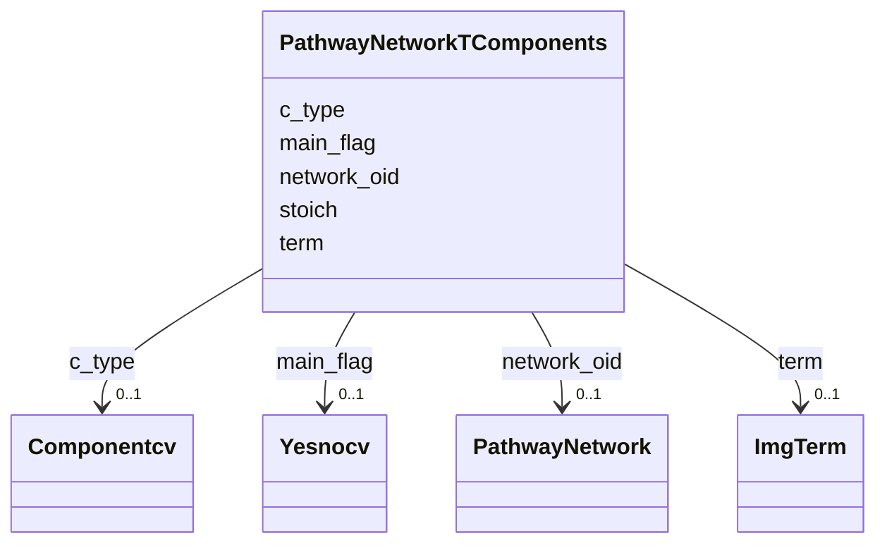

# Class: PathwayNetworkTComponents 


URI: [img_ext:PathwayNetworkTComponents](https://w3id.org/jgi/img_ext/PathwayNetworkTComponents)





<!-- no inheritance hierarchy -->


## Slots

| Name | Cardinality and Range | Description | Inheritance |
| ---  | --- | --- | --- |
| [network_oid](network_oid.md) | 0..1 <br/> [PathwayNetwork](PathwayNetwork.md) | Foreign key to pathway_network | direct |
| [c_type](c_type.md) | 0..1 <br/> [Componentcv](Componentcv.md) | Foreign key to componentcv | direct |
| [stoich](stoich.md) | 0..1 <br/> [Integer](Integer.md) |  | direct |
| [term](term.md) | 0..1 <br/> [ImgTerm](ImgTerm.md) | Foreign key to img_term | direct |
| [main_flag](main_flag.md) | 0..1 <br/> [Yesnocv](Yesnocv.md) | Foreign key to yesnocv | direct |


## Identifier and Mapping Information


### Schema Source


* from schema: https://w3id.org/jgi/img_ext


## Mappings

| Mapping Type | Mapped Value |
| ---  | ---  |
| self | img_ext:PathwayNetworkTComponents |
| native | img_ext:PathwayNetworkTComponents |


## LinkML Source

<!-- TODO: investigate https://stackoverflow.com/questions/37606292/how-to-create-tabbed-code-blocks-in-mkdocs-or-sphinx -->

### Direct

<details>
```yaml
name: pathway_network_t_components
from_schema: https://w3id.org/jgi/img_ext
attributes:
  network_oid:
    name: network_oid
    description: Foreign key to pathway_network
    from_schema: https://w3id.org/jgi/img_ext
    domain_of:
    - pathway_network
    - pathway_network_c_components
    - pathway_network_img_pathways
    - pathway_network_parents
    - pathway_network_parts_lists
    - pathway_network_t_components
    - pathway_network_taxons
    range: pathway_network
    required: false
  c_type:
    name: c_type
    description: Foreign key to componentcv
    from_schema: https://w3id.org/jgi/img_ext
    domain_of:
    - img_pathway_c_components
    - img_pathway_t_components
    - img_reaction_c_components
    - img_reaction_t_components
    - pathway_network_c_components
    - pathway_network_t_components
    range: componentcv
    required: false
  stoich:
    name: stoich
    from_schema: https://w3id.org/jgi/img_ext
    domain_of:
    - img_pathway_c_components
    - img_pathway_t_components
    - img_reaction_c_components
    - img_reaction_t_components
    - pathway_network_c_components
    - pathway_network_t_components
    range: integer
    required: false
  term:
    name: term
    description: Foreign key to img_term
    from_schema: https://w3id.org/jgi/img_ext
    domain_of:
    - img_parts_list_img_terms
    - img_pathway_t_components
    - img_reaction_t_components
    - img_term
    - img_term_history
    - pathway_network_t_components
    range: img_term
    required: false
  main_flag:
    name: main_flag
    description: Foreign key to yesnocv
    from_schema: https://w3id.org/jgi/img_ext
    domain_of:
    - img_pathway_c_components
    - img_pathway_t_components
    - img_reaction_c_components
    - img_reaction_t_components
    - pathway_network_c_components
    - pathway_network_t_components
    range: yesnocv
    required: false

```
</details>

### Induced

<details>
```yaml
name: pathway_network_t_components
from_schema: https://w3id.org/jgi/img_ext
attributes:
  network_oid:
    name: network_oid
    description: Foreign key to pathway_network
    from_schema: https://w3id.org/jgi/img_ext
    alias: network_oid
    owner: pathway_network_t_components
    domain_of:
    - pathway_network
    - pathway_network_c_components
    - pathway_network_img_pathways
    - pathway_network_parents
    - pathway_network_parts_lists
    - pathway_network_t_components
    - pathway_network_taxons
    range: pathway_network
    required: false
  c_type:
    name: c_type
    description: Foreign key to componentcv
    from_schema: https://w3id.org/jgi/img_ext
    alias: c_type
    owner: pathway_network_t_components
    domain_of:
    - img_pathway_c_components
    - img_pathway_t_components
    - img_reaction_c_components
    - img_reaction_t_components
    - pathway_network_c_components
    - pathway_network_t_components
    range: componentcv
    required: false
  stoich:
    name: stoich
    from_schema: https://w3id.org/jgi/img_ext
    alias: stoich
    owner: pathway_network_t_components
    domain_of:
    - img_pathway_c_components
    - img_pathway_t_components
    - img_reaction_c_components
    - img_reaction_t_components
    - pathway_network_c_components
    - pathway_network_t_components
    range: integer
    required: false
  term:
    name: term
    description: Foreign key to img_term
    from_schema: https://w3id.org/jgi/img_ext
    alias: term
    owner: pathway_network_t_components
    domain_of:
    - img_parts_list_img_terms
    - img_pathway_t_components
    - img_reaction_t_components
    - img_term
    - img_term_history
    - pathway_network_t_components
    range: img_term
    required: false
  main_flag:
    name: main_flag
    description: Foreign key to yesnocv
    from_schema: https://w3id.org/jgi/img_ext
    alias: main_flag
    owner: pathway_network_t_components
    domain_of:
    - img_pathway_c_components
    - img_pathway_t_components
    - img_reaction_c_components
    - img_reaction_t_components
    - pathway_network_c_components
    - pathway_network_t_components
    range: yesnocv
    required: false

```
</details>