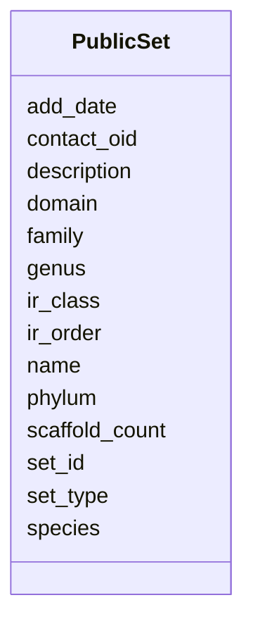

# Class: PublicSet 


URI: [img_ext:PublicSet](https://w3id.org/jgi/img_ext/PublicSet)





<!-- no inheritance hierarchy -->


## Slots

| Name | Cardinality and Range | Description | Inheritance |
| ---  | --- | --- | --- |
| [name](name.md) | 0..1 <br/> [String](String.md) |  | direct |
| [set_type](set_type.md) | 0..1 <br/> [String](String.md) |  | direct |
| [contact_oid](contact_oid.md) | 0..1 <br/> [Float](Float.md) |  | direct |
| [description](description.md) | 0..1 <br/> [String](String.md) |  | direct |
| [add_date](add_date.md) | 0..1 <br/> [Datetime](Datetime.md) |  | direct |
| [scaffold_count](scaffold_count.md) | 0..1 <br/> [Float](Float.md) |  | direct |
| [domain](domain.md) | 0..1 <br/> [String](String.md) |  | direct |
| [phylum](phylum.md) | 0..1 <br/> [String](String.md) |  | direct |
| [ir_class](ir_class.md) | 0..1 <br/> [String](String.md) |  | direct |
| [ir_order](ir_order.md) | 0..1 <br/> [String](String.md) |  | direct |
| [family](family.md) | 0..1 <br/> [String](String.md) |  | direct |
| [genus](genus.md) | 0..1 <br/> [String](String.md) |  | direct |
| [species](species.md) | 0..1 <br/> [String](String.md) |  | direct |
| [set_id](set_id.md) | 0..1 <br/> [Float](Float.md) |  | direct |


## Identifier and Mapping Information


### Schema Source


* from schema: https://w3id.org/jgi/img_ext


## Mappings

| Mapping Type | Mapped Value |
| ---  | ---  |
| self | img_ext:PublicSet |
| native | img_ext:PublicSet |


## LinkML Source

<!-- TODO: investigate https://stackoverflow.com/questions/37606292/how-to-create-tabbed-code-blocks-in-mkdocs-or-sphinx -->

### Direct

<details>
```yaml
name: public_set
from_schema: https://w3id.org/jgi/img_ext
attributes:
  name:
    name: name
    from_schema: https://w3id.org/jgi/img_ext
    domain_of:
    - db_source
    - mesh_dtree
    - np_activity_cv
    - phenotype_rule
    - public_set
    range: string
    required: false
  set_type:
    name: set_type
    from_schema: https://w3id.org/jgi/img_ext
    rank: 1000
    domain_of:
    - public_set
    range: string
    required: false
  contact_oid:
    name: contact_oid
    from_schema: https://w3id.org/jgi/img_ext
    domain_of:
    - gene_myimg_groups
    - mygene_img_groups
    - public_set
    range: float
    required: false
  description:
    name: description
    from_schema: https://w3id.org/jgi/img_ext
    domain_of:
    - assertioncv
    - componentcv
    - img_job_typecv
    - imgtermcv
    - mygene
    - pathway_network
    - phenotype_rule
    - public_set
    - statuscv
    - yesnocv
    range: string
    required: false
  add_date:
    name: add_date
    from_schema: https://w3id.org/jgi/img_ext
    domain_of:
    - gene_function_history
    - gene_history
    - img_compound
    - img_parts_list
    - img_parts_list_backup
    - img_parts_list_history
    - img_pathway
    - img_pathway_history
    - img_reaction
    - img_term
    - img_term_history
    - img_term_synonyms
    - mygene
    - myimg_job
    - pathway_network
    - phenotype_rule
    - public_set
    range: datetime
    required: false
  scaffold_count:
    name: scaffold_count
    from_schema: https://w3id.org/jgi/img_ext
    rank: 1000
    domain_of:
    - public_set
    range: float
    required: false
  domain:
    name: domain
    from_schema: https://w3id.org/jgi/img_ext
    rank: 1000
    domain_of:
    - public_set
    range: string
    required: false
  phylum:
    name: phylum
    from_schema: https://w3id.org/jgi/img_ext
    rank: 1000
    domain_of:
    - public_set
    range: string
    required: false
  ir_class:
    name: ir_class
    from_schema: https://w3id.org/jgi/img_ext
    rank: 1000
    domain_of:
    - public_set
    range: string
    required: false
  ir_order:
    name: ir_order
    from_schema: https://w3id.org/jgi/img_ext
    rank: 1000
    domain_of:
    - public_set
    range: string
    required: false
  family:
    name: family
    from_schema: https://w3id.org/jgi/img_ext
    rank: 1000
    domain_of:
    - public_set
    range: string
    required: false
  genus:
    name: genus
    from_schema: https://w3id.org/jgi/img_ext
    rank: 1000
    domain_of:
    - public_set
    range: string
    required: false
  species:
    name: species
    from_schema: https://w3id.org/jgi/img_ext
    rank: 1000
    domain_of:
    - public_set
    range: string
    required: false
  set_id:
    name: set_id
    from_schema: https://w3id.org/jgi/img_ext
    rank: 1000
    domain_of:
    - public_set
    range: float
    required: false

```
</details>

### Induced

<details>
```yaml
name: public_set
from_schema: https://w3id.org/jgi/img_ext
attributes:
  name:
    name: name
    from_schema: https://w3id.org/jgi/img_ext
    alias: name
    owner: public_set
    domain_of:
    - db_source
    - mesh_dtree
    - np_activity_cv
    - phenotype_rule
    - public_set
    range: string
    required: false
  set_type:
    name: set_type
    from_schema: https://w3id.org/jgi/img_ext
    rank: 1000
    alias: set_type
    owner: public_set
    domain_of:
    - public_set
    range: string
    required: false
  contact_oid:
    name: contact_oid
    from_schema: https://w3id.org/jgi/img_ext
    alias: contact_oid
    owner: public_set
    domain_of:
    - gene_myimg_groups
    - mygene_img_groups
    - public_set
    range: float
    required: false
  description:
    name: description
    from_schema: https://w3id.org/jgi/img_ext
    alias: description
    owner: public_set
    domain_of:
    - assertioncv
    - componentcv
    - img_job_typecv
    - imgtermcv
    - mygene
    - pathway_network
    - phenotype_rule
    - public_set
    - statuscv
    - yesnocv
    range: string
    required: false
  add_date:
    name: add_date
    from_schema: https://w3id.org/jgi/img_ext
    alias: add_date
    owner: public_set
    domain_of:
    - gene_function_history
    - gene_history
    - img_compound
    - img_parts_list
    - img_parts_list_backup
    - img_parts_list_history
    - img_pathway
    - img_pathway_history
    - img_reaction
    - img_term
    - img_term_history
    - img_term_synonyms
    - mygene
    - myimg_job
    - pathway_network
    - phenotype_rule
    - public_set
    range: datetime
    required: false
  scaffold_count:
    name: scaffold_count
    from_schema: https://w3id.org/jgi/img_ext
    rank: 1000
    alias: scaffold_count
    owner: public_set
    domain_of:
    - public_set
    range: float
    required: false
  domain:
    name: domain
    from_schema: https://w3id.org/jgi/img_ext
    rank: 1000
    alias: domain
    owner: public_set
    domain_of:
    - public_set
    range: string
    required: false
  phylum:
    name: phylum
    from_schema: https://w3id.org/jgi/img_ext
    rank: 1000
    alias: phylum
    owner: public_set
    domain_of:
    - public_set
    range: string
    required: false
  ir_class:
    name: ir_class
    from_schema: https://w3id.org/jgi/img_ext
    rank: 1000
    alias: ir_class
    owner: public_set
    domain_of:
    - public_set
    range: string
    required: false
  ir_order:
    name: ir_order
    from_schema: https://w3id.org/jgi/img_ext
    rank: 1000
    alias: ir_order
    owner: public_set
    domain_of:
    - public_set
    range: string
    required: false
  family:
    name: family
    from_schema: https://w3id.org/jgi/img_ext
    rank: 1000
    alias: family
    owner: public_set
    domain_of:
    - public_set
    range: string
    required: false
  genus:
    name: genus
    from_schema: https://w3id.org/jgi/img_ext
    rank: 1000
    alias: genus
    owner: public_set
    domain_of:
    - public_set
    range: string
    required: false
  species:
    name: species
    from_schema: https://w3id.org/jgi/img_ext
    rank: 1000
    alias: species
    owner: public_set
    domain_of:
    - public_set
    range: string
    required: false
  set_id:
    name: set_id
    from_schema: https://w3id.org/jgi/img_ext
    rank: 1000
    alias: set_id
    owner: public_set
    domain_of:
    - public_set
    range: float
    required: false

```
</details>