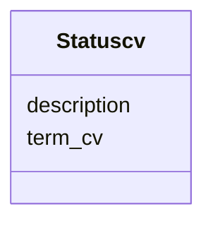

# Class: Statuscv 


URI: [img_ext:Statuscv](https://w3id.org/jgi/img_ext/Statuscv)





<!-- no inheritance hierarchy -->


## Slots

| Name | Cardinality and Range | Description | Inheritance |
| ---  | --- | --- | --- |
| [term_cv](term_cv.md) | 0..1 <br/> [String](String.md) |  | direct |
| [description](description.md) | 0..1 <br/> [String](String.md) |  | direct |


## Usages

| used by | used in | type | used |
| ---  | --- | --- | --- |
| [ImgPathwayTaxons](ImgPathwayTaxons.md) | [status](status.md) | range | [Statuscv](Statuscv.md) |


## Identifier and Mapping Information


### Schema Source


* from schema: https://w3id.org/jgi/img_ext


## Mappings

| Mapping Type | Mapped Value |
| ---  | ---  |
| self | img_ext:Statuscv |
| native | img_ext:Statuscv |


## LinkML Source

<!-- TODO: investigate https://stackoverflow.com/questions/37606292/how-to-create-tabbed-code-blocks-in-mkdocs-or-sphinx -->

### Direct

<details>
```yaml
name: statuscv
from_schema: https://w3id.org/jgi/img_ext
attributes:
  term_cv:
    name: term_cv
    from_schema: https://w3id.org/jgi/img_ext
    domain_of:
    - assertioncv
    - imgtermcv
    - statuscv
    range: string
    required: false
  description:
    name: description
    from_schema: https://w3id.org/jgi/img_ext
    domain_of:
    - assertioncv
    - componentcv
    - img_job_typecv
    - imgtermcv
    - mygene
    - pathway_network
    - phenotype_rule
    - public_set
    - statuscv
    - yesnocv
    range: string
    required: false

```
</details>

### Induced

<details>
```yaml
name: statuscv
from_schema: https://w3id.org/jgi/img_ext
attributes:
  term_cv:
    name: term_cv
    from_schema: https://w3id.org/jgi/img_ext
    alias: term_cv
    owner: statuscv
    domain_of:
    - assertioncv
    - imgtermcv
    - statuscv
    range: string
    required: false
  description:
    name: description
    from_schema: https://w3id.org/jgi/img_ext
    alias: description
    owner: statuscv
    domain_of:
    - assertioncv
    - componentcv
    - img_job_typecv
    - imgtermcv
    - mygene
    - pathway_network
    - phenotype_rule
    - public_set
    - statuscv
    - yesnocv
    range: string
    required: false

```
</details>