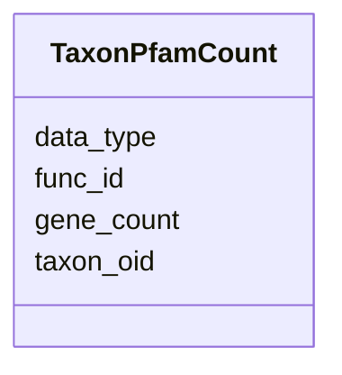

# Class: TaxonPfamCount 


URI: [img_ext:TaxonPfamCount](https://w3id.org/jgi/img_ext/TaxonPfamCount)





<!-- no inheritance hierarchy -->


## Slots

| Name | Cardinality and Range | Description | Inheritance |
| ---  | --- | --- | --- |
| [taxon_oid](taxon_oid.md) | 0..1 <br/> [Integer](Integer.md) |  | direct |
| [data_type](data_type.md) | 0..1 <br/> [String](String.md) |  | direct |
| [func_id](func_id.md) | 0..1 <br/> [String](String.md) |  | direct |
| [gene_count](gene_count.md) | 0..1 <br/> [Float](Float.md) |  | direct |


## Identifier and Mapping Information


### Schema Source


* from schema: https://w3id.org/jgi/img_ext


## Mappings

| Mapping Type | Mapped Value |
| ---  | ---  |
| self | img_ext:TaxonPfamCount |
| native | img_ext:TaxonPfamCount |


## LinkML Source

<!-- TODO: investigate https://stackoverflow.com/questions/37606292/how-to-create-tabbed-code-blocks-in-mkdocs-or-sphinx -->

### Direct

<details>
```yaml
name: taxon_pfam_count
from_schema: https://w3id.org/jgi/img_ext
attributes:
  taxon_oid:
    name: taxon_oid
    from_schema: https://w3id.org/jgi/img_ext
    domain_of:
    - dt_all_phylo_taxon_stats
    - dt_phylo_taxon_stats
    - myimg_bio_cluster_np
    - np_biosynthesis_source
    - taxon_cathfunfam_count
    - taxon_cog_count
    - taxon_ec_count
    - taxon_ko_count
    - taxon_pfam_count
    - taxon_smart_count
    - taxon_supfam_count
    - taxon_tigr_count
    - taxon_update_request
    range: integer
    required: false
  data_type:
    name: data_type
    from_schema: https://w3id.org/jgi/img_ext
    domain_of:
    - dt_all_phylo_taxon_stats
    - dt_phylo_taxon_stats
    - taxon_cathfunfam_count
    - taxon_cog_count
    - taxon_ec_count
    - taxon_ko_count
    - taxon_pfam_count
    - taxon_smart_count
    - taxon_supfam_count
    - taxon_tigr_count
    range: string
    required: false
  func_id:
    name: func_id
    from_schema: https://w3id.org/jgi/img_ext
    domain_of:
    - taxon_cathfunfam_count
    - taxon_cog_count
    - taxon_ec_count
    - taxon_ko_count
    - taxon_pfam_count
    - taxon_smart_count
    - taxon_supfam_count
    - taxon_tigr_count
    range: string
    required: false
  gene_count:
    name: gene_count
    from_schema: https://w3id.org/jgi/img_ext
    domain_of:
    - taxon_cathfunfam_count
    - taxon_cog_count
    - taxon_ec_count
    - taxon_ko_count
    - taxon_pfam_count
    - taxon_smart_count
    - taxon_supfam_count
    - taxon_tigr_count
    range: float
    required: false

```
</details>

### Induced

<details>
```yaml
name: taxon_pfam_count
from_schema: https://w3id.org/jgi/img_ext
attributes:
  taxon_oid:
    name: taxon_oid
    from_schema: https://w3id.org/jgi/img_ext
    alias: taxon_oid
    owner: taxon_pfam_count
    domain_of:
    - dt_all_phylo_taxon_stats
    - dt_phylo_taxon_stats
    - myimg_bio_cluster_np
    - np_biosynthesis_source
    - taxon_cathfunfam_count
    - taxon_cog_count
    - taxon_ec_count
    - taxon_ko_count
    - taxon_pfam_count
    - taxon_smart_count
    - taxon_supfam_count
    - taxon_tigr_count
    - taxon_update_request
    range: integer
    required: false
  data_type:
    name: data_type
    from_schema: https://w3id.org/jgi/img_ext
    alias: data_type
    owner: taxon_pfam_count
    domain_of:
    - dt_all_phylo_taxon_stats
    - dt_phylo_taxon_stats
    - taxon_cathfunfam_count
    - taxon_cog_count
    - taxon_ec_count
    - taxon_ko_count
    - taxon_pfam_count
    - taxon_smart_count
    - taxon_supfam_count
    - taxon_tigr_count
    range: string
    required: false
  func_id:
    name: func_id
    from_schema: https://w3id.org/jgi/img_ext
    alias: func_id
    owner: taxon_pfam_count
    domain_of:
    - taxon_cathfunfam_count
    - taxon_cog_count
    - taxon_ec_count
    - taxon_ko_count
    - taxon_pfam_count
    - taxon_smart_count
    - taxon_supfam_count
    - taxon_tigr_count
    range: string
    required: false
  gene_count:
    name: gene_count
    from_schema: https://w3id.org/jgi/img_ext
    alias: gene_count
    owner: taxon_pfam_count
    domain_of:
    - taxon_cathfunfam_count
    - taxon_cog_count
    - taxon_ec_count
    - taxon_ko_count
    - taxon_pfam_count
    - taxon_smart_count
    - taxon_supfam_count
    - taxon_tigr_count
    range: float
    required: false

```
</details>