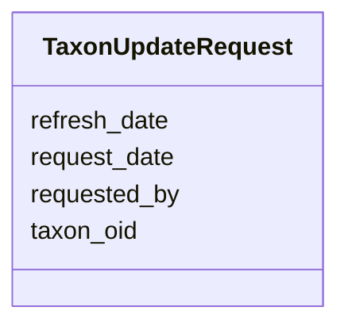

# Class: TaxonUpdateRequest 


URI: [img_ext:TaxonUpdateRequest](https://w3id.org/jgi/img_ext/TaxonUpdateRequest)





<!-- no inheritance hierarchy -->


## Slots

| Name | Cardinality and Range | Description | Inheritance |
| ---  | --- | --- | --- |
| [taxon_oid](taxon_oid.md) | 0..1 <br/> [Integer](Integer.md) |  | direct |
| [requested_by](requested_by.md) | 0..1 <br/> [Integer](Integer.md) |  | direct |
| [request_date](request_date.md) | 0..1 <br/> [Datetime](Datetime.md) |  | direct |
| [refresh_date](refresh_date.md) | 0..1 <br/> [Datetime](Datetime.md) |  | direct |


## Identifier and Mapping Information


### Schema Source


* from schema: https://w3id.org/jgi/img_ext


## Mappings

| Mapping Type | Mapped Value |
| ---  | ---  |
| self | img_ext:TaxonUpdateRequest |
| native | img_ext:TaxonUpdateRequest |


## LinkML Source

<!-- TODO: investigate https://stackoverflow.com/questions/37606292/how-to-create-tabbed-code-blocks-in-mkdocs-or-sphinx -->

### Direct

<details>
```yaml
name: taxon_update_request
from_schema: https://w3id.org/jgi/img_ext
attributes:
  taxon_oid:
    name: taxon_oid
    from_schema: https://w3id.org/jgi/img_ext
    domain_of:
    - dt_all_phylo_taxon_stats
    - dt_phylo_taxon_stats
    - myimg_bio_cluster_np
    - np_biosynthesis_source
    - taxon_cathfunfam_count
    - taxon_cog_count
    - taxon_ec_count
    - taxon_ko_count
    - taxon_pfam_count
    - taxon_smart_count
    - taxon_supfam_count
    - taxon_tigr_count
    - taxon_update_request
    range: integer
    required: false
  requested_by:
    name: requested_by
    from_schema: https://w3id.org/jgi/img_ext
    rank: 1000
    domain_of:
    - taxon_update_request
    range: integer
    required: false
  request_date:
    name: request_date
    from_schema: https://w3id.org/jgi/img_ext
    rank: 1000
    domain_of:
    - taxon_update_request
    range: datetime
    required: false
  refresh_date:
    name: refresh_date
    from_schema: https://w3id.org/jgi/img_ext
    rank: 1000
    domain_of:
    - taxon_update_request
    range: datetime
    required: false

```
</details>

### Induced

<details>
```yaml
name: taxon_update_request
from_schema: https://w3id.org/jgi/img_ext
attributes:
  taxon_oid:
    name: taxon_oid
    from_schema: https://w3id.org/jgi/img_ext
    alias: taxon_oid
    owner: taxon_update_request
    domain_of:
    - dt_all_phylo_taxon_stats
    - dt_phylo_taxon_stats
    - myimg_bio_cluster_np
    - np_biosynthesis_source
    - taxon_cathfunfam_count
    - taxon_cog_count
    - taxon_ec_count
    - taxon_ko_count
    - taxon_pfam_count
    - taxon_smart_count
    - taxon_supfam_count
    - taxon_tigr_count
    - taxon_update_request
    range: integer
    required: false
  requested_by:
    name: requested_by
    from_schema: https://w3id.org/jgi/img_ext
    rank: 1000
    alias: requested_by
    owner: taxon_update_request
    domain_of:
    - taxon_update_request
    range: integer
    required: false
  request_date:
    name: request_date
    from_schema: https://w3id.org/jgi/img_ext
    rank: 1000
    alias: request_date
    owner: taxon_update_request
    domain_of:
    - taxon_update_request
    range: datetime
    required: false
  refresh_date:
    name: refresh_date
    from_schema: https://w3id.org/jgi/img_ext
    rank: 1000
    alias: refresh_date
    owner: taxon_update_request
    domain_of:
    - taxon_update_request
    range: datetime
    required: false

```
</details>