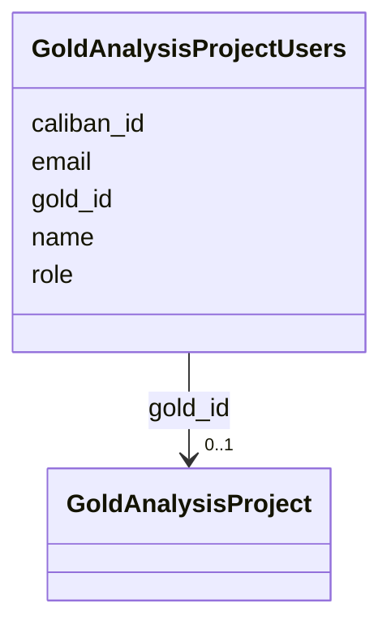

# Class: GoldAnalysisProjectUsers 


URI: [img_gold:GoldAnalysisProjectUsers](https://w3id.org/jgi/img_gold/GoldAnalysisProjectUsers)





<!-- no inheritance hierarchy -->


## Slots

| Name | Cardinality and Range | Description | Inheritance |
| ---  | --- | --- | --- |
| [gold_id](gold_id.md) | 0..1 <br/> [GoldAnalysisProject](GoldAnalysisProject.md) | Foreign key to gold_analysis_project | direct |
| [name](name.md) | 0..1 <br/> [String](String.md) |  | direct |
| [email](email.md) | 0..1 <br/> [String](String.md) |  | direct |
| [role](role.md) | 0..1 <br/> [String](String.md) |  | direct |
| [caliban_id](caliban_id.md) | 0..1 <br/> [Integer](Integer.md) |  | direct |


## Identifier and Mapping Information


### Schema Source


* from schema: https://w3id.org/jgi/img_gold


## Mappings

| Mapping Type | Mapped Value |
| ---  | ---  |
| self | img_gold:GoldAnalysisProjectUsers |
| native | img_gold:GoldAnalysisProjectUsers |


## LinkML Source

<!-- TODO: investigate https://stackoverflow.com/questions/37606292/how-to-create-tabbed-code-blocks-in-mkdocs-or-sphinx -->

### Direct

<details>
```yaml
name: gold_analysis_project_users
from_schema: https://w3id.org/jgi/img_gold
attributes:
  gold_id:
    name: gold_id
    description: Foreign key to gold_analysis_project
    from_schema: https://w3id.org/jgi/img_gold
    domain_of:
    - gold_analysis_project
    - gold_analysis_project_genbanks
    - gold_analysis_project_jgi_award_dois
    - gold_analysis_project_lookup2
    - gold_analysis_project_sra_runs
    - gold_analysis_project_users
    - gold_ap_genbank_anomalous_reasons
    - gold_ap_publications
    - gold_master_analysis_project
    - gold_master_biosample
    - gold_master_organism
    - gold_master_project
    - gold_master_study
    - gold_sequencing_project
    - gold_sp_cell_arrangement
    - gold_sp_collaborator
    - gold_sp_disease
    - gold_sp_energy_source
    - gold_sp_genome_publications
    - gold_sp_habitat
    - gold_sp_metabolism
    - gold_sp_phenotype
    - gold_sp_relevance
    - gold_sp_seq_center
    - gold_sp_seq_method
    - gold_sp_sra
    - gold_sp_study_gold_id
    - gold_study
    range: gold_analysis_project
    required: false
  name:
    name: name
    from_schema: https://w3id.org/jgi/img_gold
    rank: 1000
    domain_of:
    - gold_analysis_project_users
    - gold_master_contact
    - gold_master_institution
    - gold_sp_collaborator
    - gold_sp_seq_center
    range: string
    required: false
  email:
    name: email
    from_schema: https://w3id.org/jgi/img_gold
    rank: 1000
    domain_of:
    - gold_analysis_project_users
    - gold_master_contact
    range: string
    required: false
  role:
    name: role
    from_schema: https://w3id.org/jgi/img_gold
    rank: 1000
    domain_of:
    - gold_analysis_project_users
    range: string
    required: false
  caliban_id:
    name: caliban_id
    from_schema: https://w3id.org/jgi/img_gold
    domain_of:
    - gold_analysis_project
    - gold_analysis_project_users
    - gold_master_contact
    range: integer
    required: false

```
</details>

### Induced

<details>
```yaml
name: gold_analysis_project_users
from_schema: https://w3id.org/jgi/img_gold
attributes:
  gold_id:
    name: gold_id
    description: Foreign key to gold_analysis_project
    from_schema: https://w3id.org/jgi/img_gold
    alias: gold_id
    owner: gold_analysis_project_users
    domain_of:
    - gold_analysis_project
    - gold_analysis_project_genbanks
    - gold_analysis_project_jgi_award_dois
    - gold_analysis_project_lookup2
    - gold_analysis_project_sra_runs
    - gold_analysis_project_users
    - gold_ap_genbank_anomalous_reasons
    - gold_ap_publications
    - gold_master_analysis_project
    - gold_master_biosample
    - gold_master_organism
    - gold_master_project
    - gold_master_study
    - gold_sequencing_project
    - gold_sp_cell_arrangement
    - gold_sp_collaborator
    - gold_sp_disease
    - gold_sp_energy_source
    - gold_sp_genome_publications
    - gold_sp_habitat
    - gold_sp_metabolism
    - gold_sp_phenotype
    - gold_sp_relevance
    - gold_sp_seq_center
    - gold_sp_seq_method
    - gold_sp_sra
    - gold_sp_study_gold_id
    - gold_study
    range: gold_analysis_project
    required: false
  name:
    name: name
    from_schema: https://w3id.org/jgi/img_gold
    rank: 1000
    alias: name
    owner: gold_analysis_project_users
    domain_of:
    - gold_analysis_project_users
    - gold_master_contact
    - gold_master_institution
    - gold_sp_collaborator
    - gold_sp_seq_center
    range: string
    required: false
  email:
    name: email
    from_schema: https://w3id.org/jgi/img_gold
    rank: 1000
    alias: email
    owner: gold_analysis_project_users
    domain_of:
    - gold_analysis_project_users
    - gold_master_contact
    range: string
    required: false
  role:
    name: role
    from_schema: https://w3id.org/jgi/img_gold
    rank: 1000
    alias: role
    owner: gold_analysis_project_users
    domain_of:
    - gold_analysis_project_users
    range: string
    required: false
  caliban_id:
    name: caliban_id
    from_schema: https://w3id.org/jgi/img_gold
    alias: caliban_id
    owner: gold_analysis_project_users
    domain_of:
    - gold_analysis_project
    - gold_analysis_project_users
    - gold_master_contact
    range: integer
    required: false

```
</details>