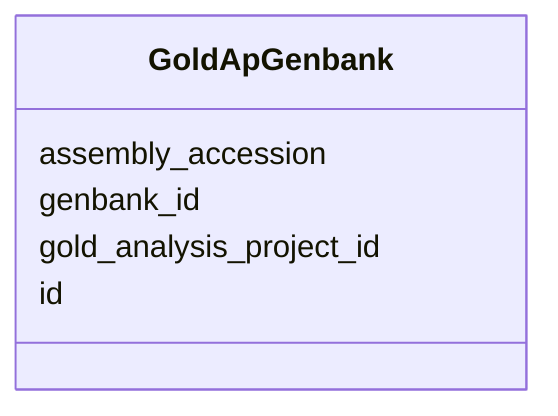

# Class: GoldApGenbank 


URI: [img_gold:GoldApGenbank](https://w3id.org/jgi/img_gold/GoldApGenbank)





<!-- no inheritance hierarchy -->


## Slots

| Name | Cardinality and Range | Description | Inheritance |
| ---  | --- | --- | --- |
| [id](id.md) | 0..1 <br/> [Integer](Integer.md) |  | direct |
| [gold_analysis_project_id](gold_analysis_project_id.md) | 0..1 <br/> [Integer](Integer.md) |  | direct |
| [genbank_id](genbank_id.md) | 0..1 <br/> [String](String.md) |  | direct |
| [assembly_accession](assembly_accession.md) | 0..1 <br/> [String](String.md) |  | direct |


## Identifier and Mapping Information


### Schema Source


* from schema: https://w3id.org/jgi/img_gold


## Mappings

| Mapping Type | Mapped Value |
| ---  | ---  |
| self | img_gold:GoldApGenbank |
| native | img_gold:GoldApGenbank |


## LinkML Source

<!-- TODO: investigate https://stackoverflow.com/questions/37606292/how-to-create-tabbed-code-blocks-in-mkdocs-or-sphinx -->

### Direct

<details>
```yaml
name: gold_ap_genbank
from_schema: https://w3id.org/jgi/img_gold
attributes:
  id:
    name: id
    from_schema: https://w3id.org/jgi/img_gold
    rank: 1000
    domain_of:
    - gold_ap_genbank
    - gold_master_cvap_status
    - gold_master_cvbiotic_relationship
    - gold_master_cvcell_arrangement
    - gold_master_cvdisease
    - gold_master_cvenergy_source
    - gold_master_cvhabitat
    - gold_master_cvmetabolism
    - gold_master_cvphenotype
    - gold_master_cvrelevance
    - gold_master_cvseq_quality
    - gold_master_cvseq_status
    - gold_master_institution
    - gold_master_longhurst_code
    - gold_master_sequencing_method
    - gold_master_timestamp
    range: integer
    required: false
  gold_analysis_project_id:
    name: gold_analysis_project_id
    from_schema: https://w3id.org/jgi/img_gold
    domain_of:
    - gold_analysis_project
    - gold_ap_genbank
    range: integer
    required: false
  genbank_id:
    name: genbank_id
    from_schema: https://w3id.org/jgi/img_gold
    domain_of:
    - gold_analysis_project_genbanks
    - gold_ap_genbank
    - gold_master_genbank
    range: string
    required: false
  assembly_accession:
    name: assembly_accession
    from_schema: https://w3id.org/jgi/img_gold
    domain_of:
    - gold_analysis_project_genbanks
    - gold_ap_genbank
    - gold_master_genbank
    range: string
    required: false

```
</details>

### Induced

<details>
```yaml
name: gold_ap_genbank
from_schema: https://w3id.org/jgi/img_gold
attributes:
  id:
    name: id
    from_schema: https://w3id.org/jgi/img_gold
    rank: 1000
    alias: id
    owner: gold_ap_genbank
    domain_of:
    - gold_ap_genbank
    - gold_master_cvap_status
    - gold_master_cvbiotic_relationship
    - gold_master_cvcell_arrangement
    - gold_master_cvdisease
    - gold_master_cvenergy_source
    - gold_master_cvhabitat
    - gold_master_cvmetabolism
    - gold_master_cvphenotype
    - gold_master_cvrelevance
    - gold_master_cvseq_quality
    - gold_master_cvseq_status
    - gold_master_institution
    - gold_master_longhurst_code
    - gold_master_sequencing_method
    - gold_master_timestamp
    range: integer
    required: false
  gold_analysis_project_id:
    name: gold_analysis_project_id
    from_schema: https://w3id.org/jgi/img_gold
    alias: gold_analysis_project_id
    owner: gold_ap_genbank
    domain_of:
    - gold_analysis_project
    - gold_ap_genbank
    range: integer
    required: false
  genbank_id:
    name: genbank_id
    from_schema: https://w3id.org/jgi/img_gold
    alias: genbank_id
    owner: gold_ap_genbank
    domain_of:
    - gold_analysis_project_genbanks
    - gold_ap_genbank
    - gold_master_genbank
    range: string
    required: false
  assembly_accession:
    name: assembly_accession
    from_schema: https://w3id.org/jgi/img_gold
    alias: assembly_accession
    owner: gold_ap_genbank
    domain_of:
    - gold_analysis_project_genbanks
    - gold_ap_genbank
    - gold_master_genbank
    range: string
    required: false

```
</details>