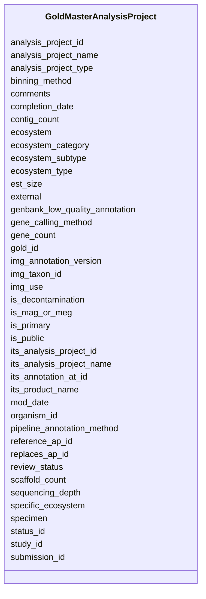

# Class: GoldMasterAnalysisProject 


URI: [img_gold:GoldMasterAnalysisProject](https://w3id.org/jgi/img_gold/GoldMasterAnalysisProject)





<!-- no inheritance hierarchy -->


## Slots

| Name | Cardinality and Range | Description | Inheritance |
| ---  | --- | --- | --- |
| [analysis_project_id](analysis_project_id.md) | 0..1 <br/> [Float](Float.md) |  | direct |
| [gold_id](gold_id.md) | 0..1 <br/> [String](String.md) |  | direct |
| [organism_id](organism_id.md) | 0..1 <br/> [Float](Float.md) |  | direct |
| [external](external.md) | 0..1 <br/> [String](String.md) |  | direct |
| [its_analysis_project_id](its_analysis_project_id.md) | 0..1 <br/> [Float](Float.md) |  | direct |
| [analysis_project_name](analysis_project_name.md) | 0..1 <br/> [String](String.md) |  | direct |
| [img_taxon_id](img_taxon_id.md) | 0..1 <br/> [Float](Float.md) |  | direct |
| [its_product_name](its_product_name.md) | 0..1 <br/> [String](String.md) |  | direct |
| [is_public](is_public.md) | 0..1 <br/> [String](String.md) |  | direct |
| [analysis_project_type](analysis_project_type.md) | 0..1 <br/> [String](String.md) |  | direct |
| [ecosystem](ecosystem.md) | 0..1 <br/> [String](String.md) |  | direct |
| [ecosystem_category](ecosystem_category.md) | 0..1 <br/> [String](String.md) |  | direct |
| [ecosystem_type](ecosystem_type.md) | 0..1 <br/> [String](String.md) |  | direct |
| [ecosystem_subtype](ecosystem_subtype.md) | 0..1 <br/> [String](String.md) |  | direct |
| [specific_ecosystem](specific_ecosystem.md) | 0..1 <br/> [String](String.md) |  | direct |
| [specimen](specimen.md) | 0..1 <br/> [String](String.md) |  | direct |
| [comments](comments.md) | 0..1 <br/> [String](String.md) |  | direct |
| [est_size](est_size.md) | 0..1 <br/> [Float](Float.md) |  | direct |
| [gene_count](gene_count.md) | 0..1 <br/> [Float](Float.md) |  | direct |
| [scaffold_count](scaffold_count.md) | 0..1 <br/> [Float](Float.md) |  | direct |
| [its_analysis_project_name](its_analysis_project_name.md) | 0..1 <br/> [String](String.md) |  | direct |
| [contig_count](contig_count.md) | 0..1 <br/> [Float](Float.md) |  | direct |
| [genbank_low_quality_annotation](genbank_low_quality_annotation.md) | 0..1 <br/> [String](String.md) |  | direct |
| [completion_date](completion_date.md) | 0..1 <br/> [Datetime](Datetime.md) |  | direct |
| [binning_method](binning_method.md) | 0..1 <br/> [String](String.md) |  | direct |
| [gene_calling_method](gene_calling_method.md) | 0..1 <br/> [String](String.md) |  | direct |
| [submission_id](submission_id.md) | 0..1 <br/> [Float](Float.md) |  | direct |
| [status_id](status_id.md) | 0..1 <br/> [Float](Float.md) |  | direct |
| [is_decontamination](is_decontamination.md) | 0..1 <br/> [String](String.md) |  | direct |
| [its_annotation_at_id](its_annotation_at_id.md) | 0..1 <br/> [Float](Float.md) |  | direct |
| [study_id](study_id.md) | 0..1 <br/> [Float](Float.md) |  | direct |
| [reference_ap_id](reference_ap_id.md) | 0..1 <br/> [Float](Float.md) |  | direct |
| [mod_date](mod_date.md) | 0..1 <br/> [Datetime](Datetime.md) |  | direct |
| [is_primary](is_primary.md) | 0..1 <br/> [String](String.md) |  | direct |
| [review_status](review_status.md) | 0..1 <br/> [String](String.md) |  | direct |
| [sequencing_depth](sequencing_depth.md) | 0..1 <br/> [String](String.md) |  | direct |
| [img_use](img_use.md) | 0..1 <br/> [String](String.md) |  | direct |
| [pipeline_annotation_method](pipeline_annotation_method.md) | 0..1 <br/> [String](String.md) |  | direct |
| [replaces_ap_id](replaces_ap_id.md) | 0..1 <br/> [Float](Float.md) |  | direct |
| [img_annotation_version](img_annotation_version.md) | 0..1 <br/> [String](String.md) |  | direct |
| [is_mag_or_meg](is_mag_or_meg.md) | 0..1 <br/> [String](String.md) |  | direct |


## Identifier and Mapping Information


### Schema Source


* from schema: https://w3id.org/jgi/img_gold


## Mappings

| Mapping Type | Mapped Value |
| ---  | ---  |
| self | img_gold:GoldMasterAnalysisProject |
| native | img_gold:GoldMasterAnalysisProject |


## LinkML Source

<!-- TODO: investigate https://stackoverflow.com/questions/37606292/how-to-create-tabbed-code-blocks-in-mkdocs-or-sphinx -->

### Direct

<details>
```yaml
name: gold_master_analysis_project
from_schema: https://w3id.org/jgi/img_gold
attributes:
  analysis_project_id:
    name: analysis_project_id
    from_schema: https://w3id.org/jgi/img_gold
    rank: 1000
    domain_of:
    - gold_master_analysis_project
    - gold_master_analysis_project_publication
    - gold_master_analysis_project_sra_run
    - gold_master_assembly
    - gold_master_dw_ap_data_utilization_status
    - gold_master_genbank
    - gold_master_permission
    - gold_master_project_analysis_project
    range: float
    required: false
  gold_id:
    name: gold_id
    from_schema: https://w3id.org/jgi/img_gold
    domain_of:
    - gold_analysis_project
    - gold_analysis_project_genbanks
    - gold_analysis_project_jgi_award_dois
    - gold_analysis_project_lookup2
    - gold_analysis_project_sra_runs
    - gold_analysis_project_users
    - gold_ap_genbank_anomalous_reasons
    - gold_ap_publications
    - gold_master_analysis_project
    - gold_master_biosample
    - gold_master_organism
    - gold_master_project
    - gold_master_study
    - gold_sequencing_project
    - gold_sp_cell_arrangement
    - gold_sp_collaborator
    - gold_sp_disease
    - gold_sp_energy_source
    - gold_sp_genome_publications
    - gold_sp_habitat
    - gold_sp_metabolism
    - gold_sp_phenotype
    - gold_sp_relevance
    - gold_sp_seq_center
    - gold_sp_seq_method
    - gold_sp_sra
    - gold_sp_study_gold_id
    - gold_study
    range: string
    required: false
  organism_id:
    name: organism_id
    from_schema: https://w3id.org/jgi/img_gold
    rank: 1000
    domain_of:
    - gold_master_analysis_project
    - gold_master_organism
    - gold_master_organism_biotic_rel
    - gold_master_organism_cell_arrangement
    - gold_master_organism_disease
    - gold_master_organism_energy_source
    - gold_master_organism_habitat
    - gold_master_organism_metabolism
    - gold_master_organism_phenotype
    - gold_master_permission
    - gold_master_project
    range: float
    required: false
  external:
    name: external
    from_schema: https://w3id.org/jgi/img_gold
    domain_of:
    - gold_analysis_project
    - gold_master_analysis_project
    range: string
    required: false
  its_analysis_project_id:
    name: its_analysis_project_id
    from_schema: https://w3id.org/jgi/img_gold
    domain_of:
    - gold_analysis_project
    - gold_master_analysis_project
    range: float
    required: false
  analysis_project_name:
    name: analysis_project_name
    from_schema: https://w3id.org/jgi/img_gold
    domain_of:
    - gold_analysis_project
    - gold_master_analysis_project
    range: string
    required: false
  img_taxon_id:
    name: img_taxon_id
    from_schema: https://w3id.org/jgi/img_gold
    rank: 1000
    domain_of:
    - gold_master_analysis_project
    range: float
    required: false
  its_product_name:
    name: its_product_name
    from_schema: https://w3id.org/jgi/img_gold
    rank: 1000
    domain_of:
    - gold_master_analysis_project
    range: string
    required: false
  is_public:
    name: is_public
    from_schema: https://w3id.org/jgi/img_gold
    rank: 1000
    domain_of:
    - gold_master_analysis_project
    - gold_master_biosample
    - gold_master_organism
    - gold_master_project
    - gold_master_study
    range: string
    required: false
  analysis_project_type:
    name: analysis_project_type
    from_schema: https://w3id.org/jgi/img_gold
    rank: 1000
    domain_of:
    - gold_master_analysis_project
    range: string
    required: false
  ecosystem:
    name: ecosystem
    from_schema: https://w3id.org/jgi/img_gold
    domain_of:
    - gold_analysis_project
    - gold_master_analysis_project
    - gold_master_biosample
    - gold_master_organism
    - gold_master_study
    - gold_sequencing_project
    - gold_study
    range: string
    required: false
  ecosystem_category:
    name: ecosystem_category
    from_schema: https://w3id.org/jgi/img_gold
    domain_of:
    - gold_analysis_project
    - gold_master_analysis_project
    - gold_master_biosample
    - gold_master_organism
    - gold_master_study
    - gold_sequencing_project
    - gold_study
    range: string
    required: false
  ecosystem_type:
    name: ecosystem_type
    from_schema: https://w3id.org/jgi/img_gold
    domain_of:
    - gold_analysis_project
    - gold_master_analysis_project
    - gold_master_biosample
    - gold_master_organism
    - gold_master_study
    - gold_sequencing_project
    - gold_study
    range: string
    required: false
  ecosystem_subtype:
    name: ecosystem_subtype
    from_schema: https://w3id.org/jgi/img_gold
    domain_of:
    - gold_analysis_project
    - gold_master_analysis_project
    - gold_master_biosample
    - gold_master_organism
    - gold_master_study
    - gold_sequencing_project
    - gold_study
    range: string
    required: false
  specific_ecosystem:
    name: specific_ecosystem
    from_schema: https://w3id.org/jgi/img_gold
    domain_of:
    - gold_analysis_project
    - gold_master_analysis_project
    - gold_master_biosample
    - gold_master_organism
    - gold_master_study
    - gold_sequencing_project
    - gold_study
    range: string
    required: false
  specimen:
    name: specimen
    from_schema: https://w3id.org/jgi/img_gold
    domain_of:
    - gold_analysis_project
    - gold_master_analysis_project
    range: string
    required: false
  comments:
    name: comments
    from_schema: https://w3id.org/jgi/img_gold
    domain_of:
    - gold_analysis_project
    - gold_master_analysis_project
    - gold_sequencing_project
    range: string
    required: false
  est_size:
    name: est_size
    from_schema: https://w3id.org/jgi/img_gold
    rank: 1000
    domain_of:
    - gold_master_analysis_project
    range: float
    required: false
  gene_count:
    name: gene_count
    from_schema: https://w3id.org/jgi/img_gold
    domain_of:
    - gold_analysis_project
    - gold_master_analysis_project
    range: float
    required: false
  scaffold_count:
    name: scaffold_count
    from_schema: https://w3id.org/jgi/img_gold
    domain_of:
    - gold_analysis_project
    - gold_master_analysis_project
    range: float
    required: false
  its_analysis_project_name:
    name: its_analysis_project_name
    from_schema: https://w3id.org/jgi/img_gold
    domain_of:
    - gold_analysis_project
    - gold_master_analysis_project
    range: string
    required: false
  contig_count:
    name: contig_count
    from_schema: https://w3id.org/jgi/img_gold
    domain_of:
    - gold_analysis_project
    - gold_master_analysis_project
    range: float
    required: false
  genbank_low_quality_annotation:
    name: genbank_low_quality_annotation
    from_schema: https://w3id.org/jgi/img_gold
    domain_of:
    - gold_analysis_project
    - gold_master_analysis_project
    range: string
    required: false
  completion_date:
    name: completion_date
    from_schema: https://w3id.org/jgi/img_gold
    domain_of:
    - gold_analysis_project
    - gold_master_analysis_project
    range: datetime
    required: false
  binning_method:
    name: binning_method
    from_schema: https://w3id.org/jgi/img_gold
    domain_of:
    - gold_analysis_project
    - gold_master_analysis_project
    range: string
    required: false
  gene_calling_method:
    name: gene_calling_method
    from_schema: https://w3id.org/jgi/img_gold
    domain_of:
    - gold_analysis_project
    - gold_master_analysis_project
    range: string
    required: false
  submission_id:
    name: submission_id
    from_schema: https://w3id.org/jgi/img_gold
    domain_of:
    - gold_analysis_project
    - gold_master_analysis_project
    range: float
    required: false
  status_id:
    name: status_id
    from_schema: https://w3id.org/jgi/img_gold
    rank: 1000
    domain_of:
    - gold_master_analysis_project
    range: float
    required: false
  is_decontamination:
    name: is_decontamination
    from_schema: https://w3id.org/jgi/img_gold
    domain_of:
    - gold_analysis_project
    - gold_master_analysis_project
    range: string
    required: false
  its_annotation_at_id:
    name: its_annotation_at_id
    from_schema: https://w3id.org/jgi/img_gold
    domain_of:
    - gold_analysis_project
    - gold_master_analysis_project
    range: float
    required: false
  study_id:
    name: study_id
    from_schema: https://w3id.org/jgi/img_gold
    rank: 1000
    domain_of:
    - gold_master_analysis_project
    - gold_master_permission
    - gold_master_study
    - gold_study
    range: float
    required: false
  reference_ap_id:
    name: reference_ap_id
    from_schema: https://w3id.org/jgi/img_gold
    rank: 1000
    domain_of:
    - gold_master_analysis_project
    range: float
    required: false
  mod_date:
    name: mod_date
    from_schema: https://w3id.org/jgi/img_gold
    domain_of:
    - gold_analysis_project
    - gold_master_analysis_project
    - gold_master_project
    - gold_master_study
    - gold_sequencing_project
    - gold_study
    range: datetime
    required: false
  is_primary:
    name: is_primary
    from_schema: https://w3id.org/jgi/img_gold
    rank: 1000
    domain_of:
    - gold_master_analysis_project
    range: string
    required: false
  review_status:
    name: review_status
    from_schema: https://w3id.org/jgi/img_gold
    domain_of:
    - gold_analysis_project
    - gold_master_analysis_project
    range: string
    required: false
  sequencing_depth:
    name: sequencing_depth
    from_schema: https://w3id.org/jgi/img_gold
    domain_of:
    - gold_analysis_project
    - gold_master_analysis_project
    - gold_sequencing_project
    range: string
    required: false
  img_use:
    name: img_use
    from_schema: https://w3id.org/jgi/img_gold
    domain_of:
    - gold_analysis_project
    - gold_master_analysis_project
    range: string
    required: false
  pipeline_annotation_method:
    name: pipeline_annotation_method
    from_schema: https://w3id.org/jgi/img_gold
    rank: 1000
    domain_of:
    - gold_master_analysis_project
    range: string
    required: false
  replaces_ap_id:
    name: replaces_ap_id
    from_schema: https://w3id.org/jgi/img_gold
    rank: 1000
    domain_of:
    - gold_master_analysis_project
    range: float
    required: false
  img_annotation_version:
    name: img_annotation_version
    from_schema: https://w3id.org/jgi/img_gold
    domain_of:
    - gold_analysis_project
    - gold_master_analysis_project
    range: string
    required: false
  is_mag_or_meg:
    name: is_mag_or_meg
    from_schema: https://w3id.org/jgi/img_gold
    rank: 1000
    domain_of:
    - gold_master_analysis_project
    range: string
    required: false

```
</details>

### Induced

<details>
```yaml
name: gold_master_analysis_project
from_schema: https://w3id.org/jgi/img_gold
attributes:
  analysis_project_id:
    name: analysis_project_id
    from_schema: https://w3id.org/jgi/img_gold
    rank: 1000
    alias: analysis_project_id
    owner: gold_master_analysis_project
    domain_of:
    - gold_master_analysis_project
    - gold_master_analysis_project_publication
    - gold_master_analysis_project_sra_run
    - gold_master_assembly
    - gold_master_dw_ap_data_utilization_status
    - gold_master_genbank
    - gold_master_permission
    - gold_master_project_analysis_project
    range: float
    required: false
  gold_id:
    name: gold_id
    from_schema: https://w3id.org/jgi/img_gold
    alias: gold_id
    owner: gold_master_analysis_project
    domain_of:
    - gold_analysis_project
    - gold_analysis_project_genbanks
    - gold_analysis_project_jgi_award_dois
    - gold_analysis_project_lookup2
    - gold_analysis_project_sra_runs
    - gold_analysis_project_users
    - gold_ap_genbank_anomalous_reasons
    - gold_ap_publications
    - gold_master_analysis_project
    - gold_master_biosample
    - gold_master_organism
    - gold_master_project
    - gold_master_study
    - gold_sequencing_project
    - gold_sp_cell_arrangement
    - gold_sp_collaborator
    - gold_sp_disease
    - gold_sp_energy_source
    - gold_sp_genome_publications
    - gold_sp_habitat
    - gold_sp_metabolism
    - gold_sp_phenotype
    - gold_sp_relevance
    - gold_sp_seq_center
    - gold_sp_seq_method
    - gold_sp_sra
    - gold_sp_study_gold_id
    - gold_study
    range: string
    required: false
  organism_id:
    name: organism_id
    from_schema: https://w3id.org/jgi/img_gold
    rank: 1000
    alias: organism_id
    owner: gold_master_analysis_project
    domain_of:
    - gold_master_analysis_project
    - gold_master_organism
    - gold_master_organism_biotic_rel
    - gold_master_organism_cell_arrangement
    - gold_master_organism_disease
    - gold_master_organism_energy_source
    - gold_master_organism_habitat
    - gold_master_organism_metabolism
    - gold_master_organism_phenotype
    - gold_master_permission
    - gold_master_project
    range: float
    required: false
  external:
    name: external
    from_schema: https://w3id.org/jgi/img_gold
    alias: external
    owner: gold_master_analysis_project
    domain_of:
    - gold_analysis_project
    - gold_master_analysis_project
    range: string
    required: false
  its_analysis_project_id:
    name: its_analysis_project_id
    from_schema: https://w3id.org/jgi/img_gold
    alias: its_analysis_project_id
    owner: gold_master_analysis_project
    domain_of:
    - gold_analysis_project
    - gold_master_analysis_project
    range: float
    required: false
  analysis_project_name:
    name: analysis_project_name
    from_schema: https://w3id.org/jgi/img_gold
    alias: analysis_project_name
    owner: gold_master_analysis_project
    domain_of:
    - gold_analysis_project
    - gold_master_analysis_project
    range: string
    required: false
  img_taxon_id:
    name: img_taxon_id
    from_schema: https://w3id.org/jgi/img_gold
    rank: 1000
    alias: img_taxon_id
    owner: gold_master_analysis_project
    domain_of:
    - gold_master_analysis_project
    range: float
    required: false
  its_product_name:
    name: its_product_name
    from_schema: https://w3id.org/jgi/img_gold
    rank: 1000
    alias: its_product_name
    owner: gold_master_analysis_project
    domain_of:
    - gold_master_analysis_project
    range: string
    required: false
  is_public:
    name: is_public
    from_schema: https://w3id.org/jgi/img_gold
    rank: 1000
    alias: is_public
    owner: gold_master_analysis_project
    domain_of:
    - gold_master_analysis_project
    - gold_master_biosample
    - gold_master_organism
    - gold_master_project
    - gold_master_study
    range: string
    required: false
  analysis_project_type:
    name: analysis_project_type
    from_schema: https://w3id.org/jgi/img_gold
    rank: 1000
    alias: analysis_project_type
    owner: gold_master_analysis_project
    domain_of:
    - gold_master_analysis_project
    range: string
    required: false
  ecosystem:
    name: ecosystem
    from_schema: https://w3id.org/jgi/img_gold
    alias: ecosystem
    owner: gold_master_analysis_project
    domain_of:
    - gold_analysis_project
    - gold_master_analysis_project
    - gold_master_biosample
    - gold_master_organism
    - gold_master_study
    - gold_sequencing_project
    - gold_study
    range: string
    required: false
  ecosystem_category:
    name: ecosystem_category
    from_schema: https://w3id.org/jgi/img_gold
    alias: ecosystem_category
    owner: gold_master_analysis_project
    domain_of:
    - gold_analysis_project
    - gold_master_analysis_project
    - gold_master_biosample
    - gold_master_organism
    - gold_master_study
    - gold_sequencing_project
    - gold_study
    range: string
    required: false
  ecosystem_type:
    name: ecosystem_type
    from_schema: https://w3id.org/jgi/img_gold
    alias: ecosystem_type
    owner: gold_master_analysis_project
    domain_of:
    - gold_analysis_project
    - gold_master_analysis_project
    - gold_master_biosample
    - gold_master_organism
    - gold_master_study
    - gold_sequencing_project
    - gold_study
    range: string
    required: false
  ecosystem_subtype:
    name: ecosystem_subtype
    from_schema: https://w3id.org/jgi/img_gold
    alias: ecosystem_subtype
    owner: gold_master_analysis_project
    domain_of:
    - gold_analysis_project
    - gold_master_analysis_project
    - gold_master_biosample
    - gold_master_organism
    - gold_master_study
    - gold_sequencing_project
    - gold_study
    range: string
    required: false
  specific_ecosystem:
    name: specific_ecosystem
    from_schema: https://w3id.org/jgi/img_gold
    alias: specific_ecosystem
    owner: gold_master_analysis_project
    domain_of:
    - gold_analysis_project
    - gold_master_analysis_project
    - gold_master_biosample
    - gold_master_organism
    - gold_master_study
    - gold_sequencing_project
    - gold_study
    range: string
    required: false
  specimen:
    name: specimen
    from_schema: https://w3id.org/jgi/img_gold
    alias: specimen
    owner: gold_master_analysis_project
    domain_of:
    - gold_analysis_project
    - gold_master_analysis_project
    range: string
    required: false
  comments:
    name: comments
    from_schema: https://w3id.org/jgi/img_gold
    alias: comments
    owner: gold_master_analysis_project
    domain_of:
    - gold_analysis_project
    - gold_master_analysis_project
    - gold_sequencing_project
    range: string
    required: false
  est_size:
    name: est_size
    from_schema: https://w3id.org/jgi/img_gold
    rank: 1000
    alias: est_size
    owner: gold_master_analysis_project
    domain_of:
    - gold_master_analysis_project
    range: float
    required: false
  gene_count:
    name: gene_count
    from_schema: https://w3id.org/jgi/img_gold
    alias: gene_count
    owner: gold_master_analysis_project
    domain_of:
    - gold_analysis_project
    - gold_master_analysis_project
    range: float
    required: false
  scaffold_count:
    name: scaffold_count
    from_schema: https://w3id.org/jgi/img_gold
    alias: scaffold_count
    owner: gold_master_analysis_project
    domain_of:
    - gold_analysis_project
    - gold_master_analysis_project
    range: float
    required: false
  its_analysis_project_name:
    name: its_analysis_project_name
    from_schema: https://w3id.org/jgi/img_gold
    alias: its_analysis_project_name
    owner: gold_master_analysis_project
    domain_of:
    - gold_analysis_project
    - gold_master_analysis_project
    range: string
    required: false
  contig_count:
    name: contig_count
    from_schema: https://w3id.org/jgi/img_gold
    alias: contig_count
    owner: gold_master_analysis_project
    domain_of:
    - gold_analysis_project
    - gold_master_analysis_project
    range: float
    required: false
  genbank_low_quality_annotation:
    name: genbank_low_quality_annotation
    from_schema: https://w3id.org/jgi/img_gold
    alias: genbank_low_quality_annotation
    owner: gold_master_analysis_project
    domain_of:
    - gold_analysis_project
    - gold_master_analysis_project
    range: string
    required: false
  completion_date:
    name: completion_date
    from_schema: https://w3id.org/jgi/img_gold
    alias: completion_date
    owner: gold_master_analysis_project
    domain_of:
    - gold_analysis_project
    - gold_master_analysis_project
    range: datetime
    required: false
  binning_method:
    name: binning_method
    from_schema: https://w3id.org/jgi/img_gold
    alias: binning_method
    owner: gold_master_analysis_project
    domain_of:
    - gold_analysis_project
    - gold_master_analysis_project
    range: string
    required: false
  gene_calling_method:
    name: gene_calling_method
    from_schema: https://w3id.org/jgi/img_gold
    alias: gene_calling_method
    owner: gold_master_analysis_project
    domain_of:
    - gold_analysis_project
    - gold_master_analysis_project
    range: string
    required: false
  submission_id:
    name: submission_id
    from_schema: https://w3id.org/jgi/img_gold
    alias: submission_id
    owner: gold_master_analysis_project
    domain_of:
    - gold_analysis_project
    - gold_master_analysis_project
    range: float
    required: false
  status_id:
    name: status_id
    from_schema: https://w3id.org/jgi/img_gold
    rank: 1000
    alias: status_id
    owner: gold_master_analysis_project
    domain_of:
    - gold_master_analysis_project
    range: float
    required: false
  is_decontamination:
    name: is_decontamination
    from_schema: https://w3id.org/jgi/img_gold
    alias: is_decontamination
    owner: gold_master_analysis_project
    domain_of:
    - gold_analysis_project
    - gold_master_analysis_project
    range: string
    required: false
  its_annotation_at_id:
    name: its_annotation_at_id
    from_schema: https://w3id.org/jgi/img_gold
    alias: its_annotation_at_id
    owner: gold_master_analysis_project
    domain_of:
    - gold_analysis_project
    - gold_master_analysis_project
    range: float
    required: false
  study_id:
    name: study_id
    from_schema: https://w3id.org/jgi/img_gold
    rank: 1000
    alias: study_id
    owner: gold_master_analysis_project
    domain_of:
    - gold_master_analysis_project
    - gold_master_permission
    - gold_master_study
    - gold_study
    range: float
    required: false
  reference_ap_id:
    name: reference_ap_id
    from_schema: https://w3id.org/jgi/img_gold
    rank: 1000
    alias: reference_ap_id
    owner: gold_master_analysis_project
    domain_of:
    - gold_master_analysis_project
    range: float
    required: false
  mod_date:
    name: mod_date
    from_schema: https://w3id.org/jgi/img_gold
    alias: mod_date
    owner: gold_master_analysis_project
    domain_of:
    - gold_analysis_project
    - gold_master_analysis_project
    - gold_master_project
    - gold_master_study
    - gold_sequencing_project
    - gold_study
    range: datetime
    required: false
  is_primary:
    name: is_primary
    from_schema: https://w3id.org/jgi/img_gold
    rank: 1000
    alias: is_primary
    owner: gold_master_analysis_project
    domain_of:
    - gold_master_analysis_project
    range: string
    required: false
  review_status:
    name: review_status
    from_schema: https://w3id.org/jgi/img_gold
    alias: review_status
    owner: gold_master_analysis_project
    domain_of:
    - gold_analysis_project
    - gold_master_analysis_project
    range: string
    required: false
  sequencing_depth:
    name: sequencing_depth
    from_schema: https://w3id.org/jgi/img_gold
    alias: sequencing_depth
    owner: gold_master_analysis_project
    domain_of:
    - gold_analysis_project
    - gold_master_analysis_project
    - gold_sequencing_project
    range: string
    required: false
  img_use:
    name: img_use
    from_schema: https://w3id.org/jgi/img_gold
    alias: img_use
    owner: gold_master_analysis_project
    domain_of:
    - gold_analysis_project
    - gold_master_analysis_project
    range: string
    required: false
  pipeline_annotation_method:
    name: pipeline_annotation_method
    from_schema: https://w3id.org/jgi/img_gold
    rank: 1000
    alias: pipeline_annotation_method
    owner: gold_master_analysis_project
    domain_of:
    - gold_master_analysis_project
    range: string
    required: false
  replaces_ap_id:
    name: replaces_ap_id
    from_schema: https://w3id.org/jgi/img_gold
    rank: 1000
    alias: replaces_ap_id
    owner: gold_master_analysis_project
    domain_of:
    - gold_master_analysis_project
    range: float
    required: false
  img_annotation_version:
    name: img_annotation_version
    from_schema: https://w3id.org/jgi/img_gold
    alias: img_annotation_version
    owner: gold_master_analysis_project
    domain_of:
    - gold_analysis_project
    - gold_master_analysis_project
    range: string
    required: false
  is_mag_or_meg:
    name: is_mag_or_meg
    from_schema: https://w3id.org/jgi/img_gold
    rank: 1000
    alias: is_mag_or_meg
    owner: gold_master_analysis_project
    domain_of:
    - gold_master_analysis_project
    range: string
    required: false

```
</details>