# Class: GoldMasterBiosample 


URI: [img_gold:GoldMasterBiosample](https://w3id.org/jgi/img_gold/GoldMasterBiosample)

```mermaid
 classDiagram
    class GoldMasterBiosample
    click GoldMasterBiosample href "../GoldMasterBiosample/"
      GoldMasterBiosample : active
        
      GoldMasterBiosample : altitude
        
      GoldMasterBiosample : altitude2
        
      GoldMasterBiosample : biosample_id
        
      GoldMasterBiosample : chlorophyll_concentration
        
      GoldMasterBiosample : depth
        
      GoldMasterBiosample : depth2
        
      GoldMasterBiosample : ecosystem
        
      GoldMasterBiosample : ecosystem_category
        
      GoldMasterBiosample : ecosystem_subtype
        
      GoldMasterBiosample : ecosystem_type
        
      GoldMasterBiosample : elevation
        
      GoldMasterBiosample : elevation2
        
      GoldMasterBiosample : geographic_location
        
      GoldMasterBiosample : gold_id
        
      GoldMasterBiosample : growth_temperature
        
      GoldMasterBiosample : habitat
        
      GoldMasterBiosample : host_body_site
        
      GoldMasterBiosample : host_body_subsite
        
      GoldMasterBiosample : host_gender
        
      GoldMasterBiosample : host_name
        
      GoldMasterBiosample : host_taxonomy_id
        
      GoldMasterBiosample : is_public
        
      GoldMasterBiosample : latitude
        
      GoldMasterBiosample : longhurst_code
        
      GoldMasterBiosample : longitude
        
      GoldMasterBiosample : mrn
        
      GoldMasterBiosample : ncbi_taxonomy_id
        
      GoldMasterBiosample : nitrate_concentration
        
      GoldMasterBiosample : oxygen_concentration
        
      GoldMasterBiosample : patient_visit_number
        
      GoldMasterBiosample : ph1
        
      GoldMasterBiosample : ph2
        
      GoldMasterBiosample : pressure
        
      GoldMasterBiosample : proport_isolation
        
      GoldMasterBiosample : proport_ocean
        
      GoldMasterBiosample : proport_station
        
      GoldMasterBiosample : proport_woa_dissolved_oxygen
        
      GoldMasterBiosample : proport_woa_nitrate
        
      GoldMasterBiosample : proport_woa_phosphate
        
      GoldMasterBiosample : proport_woa_salinity
        
      GoldMasterBiosample : proport_woa_silicate
        
      GoldMasterBiosample : proport_woa_temperature
        
      GoldMasterBiosample : salinity_concentration
        
      GoldMasterBiosample : sample_collection_day
        
      GoldMasterBiosample : sample_collection_month
        
      GoldMasterBiosample : sample_collection_site
        
      GoldMasterBiosample : sample_collection_year
        
      GoldMasterBiosample : sample_isolation_country_id
        
      GoldMasterBiosample : specific_ecosystem
        
      GoldMasterBiosample : subsurface_depth
        
      GoldMasterBiosample : subsurface_depth2
        
      
```





<!-- no inheritance hierarchy -->


## Slots

| Name | Cardinality and Range | Description | Inheritance |
| ---  | --- | --- | --- |
| [biosample_id](biosample_id.md) | 0..1 <br/> [Float](Float.md) |  | direct |
| [gold_id](gold_id.md) | 0..1 <br/> [String](String.md) |  | direct |
| [active](active.md) | 0..1 <br/> [String](String.md) |  | direct |
| [is_public](is_public.md) | 0..1 <br/> [String](String.md) |  | direct |
| [ncbi_taxonomy_id](ncbi_taxonomy_id.md) | 0..1 <br/> [Float](Float.md) |  | direct |
| [sample_collection_site](sample_collection_site.md) | 0..1 <br/> [String](String.md) |  | direct |
| [sample_isolation_country_id](sample_isolation_country_id.md) | 0..1 <br/> [Float](Float.md) |  | direct |
| [sample_collection_year](sample_collection_year.md) | 0..1 <br/> [Float](Float.md) |  | direct |
| [sample_collection_month](sample_collection_month.md) | 0..1 <br/> [Float](Float.md) |  | direct |
| [sample_collection_day](sample_collection_day.md) | 0..1 <br/> [Float](Float.md) |  | direct |
| [geographic_location](geographic_location.md) | 0..1 <br/> [String](String.md) |  | direct |
| [latitude](latitude.md) | 0..1 <br/> [Float](Float.md) |  | direct |
| [longitude](longitude.md) | 0..1 <br/> [Float](Float.md) |  | direct |
| [host_name](host_name.md) | 0..1 <br/> [String](String.md) |  | direct |
| [host_gender](host_gender.md) | 0..1 <br/> [String](String.md) |  | direct |
| [host_taxonomy_id](host_taxonomy_id.md) | 0..1 <br/> [Float](Float.md) |  | direct |
| [ecosystem](ecosystem.md) | 0..1 <br/> [String](String.md) |  | direct |
| [ecosystem_category](ecosystem_category.md) | 0..1 <br/> [String](String.md) |  | direct |
| [ecosystem_type](ecosystem_type.md) | 0..1 <br/> [String](String.md) |  | direct |
| [ecosystem_subtype](ecosystem_subtype.md) | 0..1 <br/> [String](String.md) |  | direct |
| [specific_ecosystem](specific_ecosystem.md) | 0..1 <br/> [String](String.md) |  | direct |
| [host_body_site](host_body_site.md) | 0..1 <br/> [String](String.md) |  | direct |
| [host_body_subsite](host_body_subsite.md) | 0..1 <br/> [String](String.md) |  | direct |
| [mrn](mrn.md) | 0..1 <br/> [String](String.md) |  | direct |
| [patient_visit_number](patient_visit_number.md) | 0..1 <br/> [Float](Float.md) |  | direct |
| [longhurst_code](longhurst_code.md) | 0..1 <br/> [String](String.md) |  | direct |
| [proport_ocean](proport_ocean.md) | 0..1 <br/> [String](String.md) |  | direct |
| [proport_isolation](proport_isolation.md) | 0..1 <br/> [String](String.md) |  | direct |
| [proport_station](proport_station.md) | 0..1 <br/> [String](String.md) |  | direct |
| [proport_woa_temperature](proport_woa_temperature.md) | 0..1 <br/> [Float](Float.md) |  | direct |
| [proport_woa_salinity](proport_woa_salinity.md) | 0..1 <br/> [Float](Float.md) |  | direct |
| [proport_woa_dissolved_oxygen](proport_woa_dissolved_oxygen.md) | 0..1 <br/> [Float](Float.md) |  | direct |
| [proport_woa_silicate](proport_woa_silicate.md) | 0..1 <br/> [Float](Float.md) |  | direct |
| [proport_woa_phosphate](proport_woa_phosphate.md) | 0..1 <br/> [Float](Float.md) |  | direct |
| [proport_woa_nitrate](proport_woa_nitrate.md) | 0..1 <br/> [Float](Float.md) |  | direct |
| [growth_temperature](growth_temperature.md) | 0..1 <br/> [Float](Float.md) |  | direct |
| [pressure](pressure.md) | 0..1 <br/> [String](String.md) |  | direct |
| [chlorophyll_concentration](chlorophyll_concentration.md) | 0..1 <br/> [String](String.md) |  | direct |
| [oxygen_concentration](oxygen_concentration.md) | 0..1 <br/> [String](String.md) |  | direct |
| [salinity_concentration](salinity_concentration.md) | 0..1 <br/> [String](String.md) |  | direct |
| [nitrate_concentration](nitrate_concentration.md) | 0..1 <br/> [String](String.md) |  | direct |
| [ph1](ph1.md) | 0..1 <br/> [Float](Float.md) |  | direct |
| [ph2](ph2.md) | 0..1 <br/> [Float](Float.md) |  | direct |
| [depth](depth.md) | 0..1 <br/> [Float](Float.md) |  | direct |
| [depth2](depth2.md) | 0..1 <br/> [Float](Float.md) |  | direct |
| [altitude](altitude.md) | 0..1 <br/> [Float](Float.md) |  | direct |
| [altitude2](altitude2.md) | 0..1 <br/> [Float](Float.md) |  | direct |
| [elevation](elevation.md) | 0..1 <br/> [Float](Float.md) |  | direct |
| [elevation2](elevation2.md) | 0..1 <br/> [Float](Float.md) |  | direct |
| [subsurface_depth](subsurface_depth.md) | 0..1 <br/> [Float](Float.md) |  | direct |
| [subsurface_depth2](subsurface_depth2.md) | 0..1 <br/> [Float](Float.md) |  | direct |
| [habitat](habitat.md) | 0..1 <br/> [String](String.md) |  | direct |


## Identifier and Mapping Information


### Schema Source


* from schema: https://w3id.org/jgi/img_gold


## Mappings

| Mapping Type | Mapped Value |
| ---  | ---  |
| self | img_gold:GoldMasterBiosample |
| native | img_gold:GoldMasterBiosample |


## LinkML Source

<!-- TODO: investigate https://stackoverflow.com/questions/37606292/how-to-create-tabbed-code-blocks-in-mkdocs-or-sphinx -->

### Direct

<details>
```yaml
name: gold_master_biosample
from_schema: https://w3id.org/jgi/img_gold
attributes:
  biosample_id:
    name: biosample_id
    from_schema: https://w3id.org/jgi/img_gold
    rank: 1000
    domain_of:
    - gold_master_biosample
    - gold_master_permission
    - gold_master_project_biosample
    range: float
    required: false
  gold_id:
    name: gold_id
    from_schema: https://w3id.org/jgi/img_gold
    domain_of:
    - gold_analysis_project
    - gold_analysis_project_genbanks
    - gold_analysis_project_jgi_award_dois
    - gold_analysis_project_lookup2
    - gold_analysis_project_sra_runs
    - gold_analysis_project_users
    - gold_ap_genbank_anomalous_reasons
    - gold_ap_publications
    - gold_master_analysis_project
    - gold_master_biosample
    - gold_master_organism
    - gold_master_project
    - gold_master_study
    - gold_sequencing_project
    - gold_sp_cell_arrangement
    - gold_sp_collaborator
    - gold_sp_disease
    - gold_sp_energy_source
    - gold_sp_genome_publications
    - gold_sp_habitat
    - gold_sp_metabolism
    - gold_sp_phenotype
    - gold_sp_relevance
    - gold_sp_seq_center
    - gold_sp_seq_method
    - gold_sp_sra
    - gold_sp_study_gold_id
    - gold_study
    range: string
    required: false
  active:
    name: active
    from_schema: https://w3id.org/jgi/img_gold
    rank: 1000
    domain_of:
    - gold_master_biosample
    - gold_master_organism
    - gold_master_project
    - gold_master_study
    range: string
    required: false
  is_public:
    name: is_public
    from_schema: https://w3id.org/jgi/img_gold
    domain_of:
    - gold_master_analysis_project
    - gold_master_biosample
    - gold_master_organism
    - gold_master_project
    - gold_master_study
    range: string
    required: false
  ncbi_taxonomy_id:
    name: ncbi_taxonomy_id
    from_schema: https://w3id.org/jgi/img_gold
    rank: 1000
    domain_of:
    - gold_master_biosample
    - gold_master_organism
    range: float
    required: false
  sample_collection_site:
    name: sample_collection_site
    from_schema: https://w3id.org/jgi/img_gold
    rank: 1000
    domain_of:
    - gold_master_biosample
    - gold_master_organism
    range: string
    required: false
  sample_isolation_country_id:
    name: sample_isolation_country_id
    from_schema: https://w3id.org/jgi/img_gold
    rank: 1000
    domain_of:
    - gold_master_biosample
    - gold_master_organism
    range: float
    required: false
  sample_collection_year:
    name: sample_collection_year
    from_schema: https://w3id.org/jgi/img_gold
    rank: 1000
    domain_of:
    - gold_master_biosample
    range: float
    required: false
  sample_collection_month:
    name: sample_collection_month
    from_schema: https://w3id.org/jgi/img_gold
    rank: 1000
    domain_of:
    - gold_master_biosample
    range: float
    required: false
  sample_collection_day:
    name: sample_collection_day
    from_schema: https://w3id.org/jgi/img_gold
    rank: 1000
    domain_of:
    - gold_master_biosample
    range: float
    required: false
  geographic_location:
    name: geographic_location
    from_schema: https://w3id.org/jgi/img_gold
    rank: 1000
    domain_of:
    - gold_master_biosample
    - gold_master_organism
    range: string
    required: false
  latitude:
    name: latitude
    from_schema: https://w3id.org/jgi/img_gold
    rank: 1000
    domain_of:
    - gold_master_biosample
    - gold_master_organism
    - gold_sequencing_project
    range: float
    required: false
  longitude:
    name: longitude
    from_schema: https://w3id.org/jgi/img_gold
    rank: 1000
    domain_of:
    - gold_master_biosample
    - gold_master_organism
    - gold_sequencing_project
    range: float
    required: false
  host_name:
    name: host_name
    from_schema: https://w3id.org/jgi/img_gold
    rank: 1000
    domain_of:
    - gold_master_biosample
    - gold_master_organism
    - gold_sequencing_project
    range: string
    required: false
  host_gender:
    name: host_gender
    from_schema: https://w3id.org/jgi/img_gold
    rank: 1000
    domain_of:
    - gold_master_biosample
    - gold_sequencing_project
    range: string
    required: false
  host_taxonomy_id:
    name: host_taxonomy_id
    from_schema: https://w3id.org/jgi/img_gold
    rank: 1000
    domain_of:
    - gold_master_biosample
    range: float
    required: false
  ecosystem:
    name: ecosystem
    from_schema: https://w3id.org/jgi/img_gold
    domain_of:
    - gold_analysis_project
    - gold_master_analysis_project
    - gold_master_biosample
    - gold_master_organism
    - gold_master_study
    - gold_sequencing_project
    - gold_study
    range: string
    required: false
  ecosystem_category:
    name: ecosystem_category
    from_schema: https://w3id.org/jgi/img_gold
    domain_of:
    - gold_analysis_project
    - gold_master_analysis_project
    - gold_master_biosample
    - gold_master_organism
    - gold_master_study
    - gold_sequencing_project
    - gold_study
    range: string
    required: false
  ecosystem_type:
    name: ecosystem_type
    from_schema: https://w3id.org/jgi/img_gold
    domain_of:
    - gold_analysis_project
    - gold_master_analysis_project
    - gold_master_biosample
    - gold_master_organism
    - gold_master_study
    - gold_sequencing_project
    - gold_study
    range: string
    required: false
  ecosystem_subtype:
    name: ecosystem_subtype
    from_schema: https://w3id.org/jgi/img_gold
    domain_of:
    - gold_analysis_project
    - gold_master_analysis_project
    - gold_master_biosample
    - gold_master_organism
    - gold_master_study
    - gold_sequencing_project
    - gold_study
    range: string
    required: false
  specific_ecosystem:
    name: specific_ecosystem
    from_schema: https://w3id.org/jgi/img_gold
    domain_of:
    - gold_analysis_project
    - gold_master_analysis_project
    - gold_master_biosample
    - gold_master_organism
    - gold_master_study
    - gold_sequencing_project
    - gold_study
    range: string
    required: false
  host_body_site:
    name: host_body_site
    from_schema: https://w3id.org/jgi/img_gold
    rank: 1000
    domain_of:
    - gold_master_biosample
    - gold_master_organism
    range: string
    required: false
  host_body_subsite:
    name: host_body_subsite
    from_schema: https://w3id.org/jgi/img_gold
    rank: 1000
    domain_of:
    - gold_master_biosample
    - gold_master_organism
    range: string
    required: false
  mrn:
    name: mrn
    from_schema: https://w3id.org/jgi/img_gold
    rank: 1000
    domain_of:
    - gold_master_biosample
    - gold_sequencing_project
    range: string
    required: false
  patient_visit_number:
    name: patient_visit_number
    from_schema: https://w3id.org/jgi/img_gold
    rank: 1000
    domain_of:
    - gold_master_biosample
    range: float
    required: false
  longhurst_code:
    name: longhurst_code
    from_schema: https://w3id.org/jgi/img_gold
    rank: 1000
    domain_of:
    - gold_master_biosample
    - gold_sequencing_project
    range: string
    required: false
  proport_ocean:
    name: proport_ocean
    from_schema: https://w3id.org/jgi/img_gold
    rank: 1000
    domain_of:
    - gold_master_biosample
    - gold_master_organism
    - gold_sequencing_project
    range: string
    required: false
  proport_isolation:
    name: proport_isolation
    from_schema: https://w3id.org/jgi/img_gold
    rank: 1000
    domain_of:
    - gold_master_biosample
    - gold_master_organism
    - gold_sequencing_project
    range: string
    required: false
  proport_station:
    name: proport_station
    from_schema: https://w3id.org/jgi/img_gold
    rank: 1000
    domain_of:
    - gold_master_biosample
    - gold_master_organism
    - gold_sequencing_project
    range: string
    required: false
  proport_woa_temperature:
    name: proport_woa_temperature
    from_schema: https://w3id.org/jgi/img_gold
    rank: 1000
    domain_of:
    - gold_master_biosample
    - gold_master_organism
    - gold_sequencing_project
    range: float
    required: false
  proport_woa_salinity:
    name: proport_woa_salinity
    from_schema: https://w3id.org/jgi/img_gold
    rank: 1000
    domain_of:
    - gold_master_biosample
    - gold_master_organism
    - gold_sequencing_project
    range: float
    required: false
  proport_woa_dissolved_oxygen:
    name: proport_woa_dissolved_oxygen
    from_schema: https://w3id.org/jgi/img_gold
    rank: 1000
    domain_of:
    - gold_master_biosample
    - gold_master_organism
    - gold_sequencing_project
    range: float
    required: false
  proport_woa_silicate:
    name: proport_woa_silicate
    from_schema: https://w3id.org/jgi/img_gold
    rank: 1000
    domain_of:
    - gold_master_biosample
    - gold_master_organism
    - gold_sequencing_project
    range: float
    required: false
  proport_woa_phosphate:
    name: proport_woa_phosphate
    from_schema: https://w3id.org/jgi/img_gold
    rank: 1000
    domain_of:
    - gold_master_biosample
    - gold_master_organism
    - gold_sequencing_project
    range: float
    required: false
  proport_woa_nitrate:
    name: proport_woa_nitrate
    from_schema: https://w3id.org/jgi/img_gold
    rank: 1000
    domain_of:
    - gold_master_biosample
    - gold_master_organism
    - gold_sequencing_project
    range: float
    required: false
  growth_temperature:
    name: growth_temperature
    from_schema: https://w3id.org/jgi/img_gold
    rank: 1000
    domain_of:
    - gold_master_biosample
    range: float
    required: false
  pressure:
    name: pressure
    from_schema: https://w3id.org/jgi/img_gold
    rank: 1000
    domain_of:
    - gold_master_biosample
    - gold_master_organism
    - gold_sequencing_project
    range: string
    required: false
  chlorophyll_concentration:
    name: chlorophyll_concentration
    from_schema: https://w3id.org/jgi/img_gold
    rank: 1000
    domain_of:
    - gold_master_biosample
    - gold_master_organism
    - gold_sequencing_project
    range: string
    required: false
  oxygen_concentration:
    name: oxygen_concentration
    from_schema: https://w3id.org/jgi/img_gold
    rank: 1000
    domain_of:
    - gold_master_biosample
    - gold_master_organism
    - gold_sequencing_project
    range: string
    required: false
  salinity_concentration:
    name: salinity_concentration
    from_schema: https://w3id.org/jgi/img_gold
    rank: 1000
    domain_of:
    - gold_master_biosample
    - gold_master_organism
    - gold_sequencing_project
    range: string
    required: false
  nitrate_concentration:
    name: nitrate_concentration
    from_schema: https://w3id.org/jgi/img_gold
    rank: 1000
    domain_of:
    - gold_master_biosample
    - gold_master_organism
    - gold_sequencing_project
    range: string
    required: false
  ph1:
    name: ph1
    from_schema: https://w3id.org/jgi/img_gold
    rank: 1000
    domain_of:
    - gold_master_biosample
    - gold_master_organism
    range: float
    required: false
  ph2:
    name: ph2
    from_schema: https://w3id.org/jgi/img_gold
    rank: 1000
    domain_of:
    - gold_master_biosample
    - gold_master_organism
    range: float
    required: false
  depth:
    name: depth
    from_schema: https://w3id.org/jgi/img_gold
    rank: 1000
    domain_of:
    - gold_master_biosample
    - gold_master_organism
    - gold_sequencing_project
    range: float
    required: false
  depth2:
    name: depth2
    from_schema: https://w3id.org/jgi/img_gold
    rank: 1000
    domain_of:
    - gold_master_biosample
    - gold_master_organism
    range: float
    required: false
  altitude:
    name: altitude
    from_schema: https://w3id.org/jgi/img_gold
    rank: 1000
    domain_of:
    - gold_master_biosample
    - gold_master_organism
    - gold_sequencing_project
    range: float
    required: false
  altitude2:
    name: altitude2
    from_schema: https://w3id.org/jgi/img_gold
    rank: 1000
    domain_of:
    - gold_master_biosample
    - gold_master_organism
    range: float
    required: false
  elevation:
    name: elevation
    from_schema: https://w3id.org/jgi/img_gold
    rank: 1000
    domain_of:
    - gold_master_biosample
    - gold_master_organism
    range: float
    required: false
  elevation2:
    name: elevation2
    from_schema: https://w3id.org/jgi/img_gold
    rank: 1000
    domain_of:
    - gold_master_biosample
    - gold_master_organism
    range: float
    required: false
  subsurface_depth:
    name: subsurface_depth
    from_schema: https://w3id.org/jgi/img_gold
    rank: 1000
    domain_of:
    - gold_master_biosample
    range: float
    required: false
  subsurface_depth2:
    name: subsurface_depth2
    from_schema: https://w3id.org/jgi/img_gold
    rank: 1000
    domain_of:
    - gold_master_biosample
    - gold_master_organism
    range: float
    required: false
  habitat:
    name: habitat
    from_schema: https://w3id.org/jgi/img_gold
    rank: 1000
    domain_of:
    - gold_master_biosample
    - gold_sp_habitat
    range: string
    required: false

```
</details>

### Induced

<details>
```yaml
name: gold_master_biosample
from_schema: https://w3id.org/jgi/img_gold
attributes:
  biosample_id:
    name: biosample_id
    from_schema: https://w3id.org/jgi/img_gold
    rank: 1000
    alias: biosample_id
    owner: gold_master_biosample
    domain_of:
    - gold_master_biosample
    - gold_master_permission
    - gold_master_project_biosample
    range: float
    required: false
  gold_id:
    name: gold_id
    from_schema: https://w3id.org/jgi/img_gold
    alias: gold_id
    owner: gold_master_biosample
    domain_of:
    - gold_analysis_project
    - gold_analysis_project_genbanks
    - gold_analysis_project_jgi_award_dois
    - gold_analysis_project_lookup2
    - gold_analysis_project_sra_runs
    - gold_analysis_project_users
    - gold_ap_genbank_anomalous_reasons
    - gold_ap_publications
    - gold_master_analysis_project
    - gold_master_biosample
    - gold_master_organism
    - gold_master_project
    - gold_master_study
    - gold_sequencing_project
    - gold_sp_cell_arrangement
    - gold_sp_collaborator
    - gold_sp_disease
    - gold_sp_energy_source
    - gold_sp_genome_publications
    - gold_sp_habitat
    - gold_sp_metabolism
    - gold_sp_phenotype
    - gold_sp_relevance
    - gold_sp_seq_center
    - gold_sp_seq_method
    - gold_sp_sra
    - gold_sp_study_gold_id
    - gold_study
    range: string
    required: false
  active:
    name: active
    from_schema: https://w3id.org/jgi/img_gold
    rank: 1000
    alias: active
    owner: gold_master_biosample
    domain_of:
    - gold_master_biosample
    - gold_master_organism
    - gold_master_project
    - gold_master_study
    range: string
    required: false
  is_public:
    name: is_public
    from_schema: https://w3id.org/jgi/img_gold
    alias: is_public
    owner: gold_master_biosample
    domain_of:
    - gold_master_analysis_project
    - gold_master_biosample
    - gold_master_organism
    - gold_master_project
    - gold_master_study
    range: string
    required: false
  ncbi_taxonomy_id:
    name: ncbi_taxonomy_id
    from_schema: https://w3id.org/jgi/img_gold
    rank: 1000
    alias: ncbi_taxonomy_id
    owner: gold_master_biosample
    domain_of:
    - gold_master_biosample
    - gold_master_organism
    range: float
    required: false
  sample_collection_site:
    name: sample_collection_site
    from_schema: https://w3id.org/jgi/img_gold
    rank: 1000
    alias: sample_collection_site
    owner: gold_master_biosample
    domain_of:
    - gold_master_biosample
    - gold_master_organism
    range: string
    required: false
  sample_isolation_country_id:
    name: sample_isolation_country_id
    from_schema: https://w3id.org/jgi/img_gold
    rank: 1000
    alias: sample_isolation_country_id
    owner: gold_master_biosample
    domain_of:
    - gold_master_biosample
    - gold_master_organism
    range: float
    required: false
  sample_collection_year:
    name: sample_collection_year
    from_schema: https://w3id.org/jgi/img_gold
    rank: 1000
    alias: sample_collection_year
    owner: gold_master_biosample
    domain_of:
    - gold_master_biosample
    range: float
    required: false
  sample_collection_month:
    name: sample_collection_month
    from_schema: https://w3id.org/jgi/img_gold
    rank: 1000
    alias: sample_collection_month
    owner: gold_master_biosample
    domain_of:
    - gold_master_biosample
    range: float
    required: false
  sample_collection_day:
    name: sample_collection_day
    from_schema: https://w3id.org/jgi/img_gold
    rank: 1000
    alias: sample_collection_day
    owner: gold_master_biosample
    domain_of:
    - gold_master_biosample
    range: float
    required: false
  geographic_location:
    name: geographic_location
    from_schema: https://w3id.org/jgi/img_gold
    rank: 1000
    alias: geographic_location
    owner: gold_master_biosample
    domain_of:
    - gold_master_biosample
    - gold_master_organism
    range: string
    required: false
  latitude:
    name: latitude
    from_schema: https://w3id.org/jgi/img_gold
    rank: 1000
    alias: latitude
    owner: gold_master_biosample
    domain_of:
    - gold_master_biosample
    - gold_master_organism
    - gold_sequencing_project
    range: float
    required: false
  longitude:
    name: longitude
    from_schema: https://w3id.org/jgi/img_gold
    rank: 1000
    alias: longitude
    owner: gold_master_biosample
    domain_of:
    - gold_master_biosample
    - gold_master_organism
    - gold_sequencing_project
    range: float
    required: false
  host_name:
    name: host_name
    from_schema: https://w3id.org/jgi/img_gold
    rank: 1000
    alias: host_name
    owner: gold_master_biosample
    domain_of:
    - gold_master_biosample
    - gold_master_organism
    - gold_sequencing_project
    range: string
    required: false
  host_gender:
    name: host_gender
    from_schema: https://w3id.org/jgi/img_gold
    rank: 1000
    alias: host_gender
    owner: gold_master_biosample
    domain_of:
    - gold_master_biosample
    - gold_sequencing_project
    range: string
    required: false
  host_taxonomy_id:
    name: host_taxonomy_id
    from_schema: https://w3id.org/jgi/img_gold
    rank: 1000
    alias: host_taxonomy_id
    owner: gold_master_biosample
    domain_of:
    - gold_master_biosample
    range: float
    required: false
  ecosystem:
    name: ecosystem
    from_schema: https://w3id.org/jgi/img_gold
    alias: ecosystem
    owner: gold_master_biosample
    domain_of:
    - gold_analysis_project
    - gold_master_analysis_project
    - gold_master_biosample
    - gold_master_organism
    - gold_master_study
    - gold_sequencing_project
    - gold_study
    range: string
    required: false
  ecosystem_category:
    name: ecosystem_category
    from_schema: https://w3id.org/jgi/img_gold
    alias: ecosystem_category
    owner: gold_master_biosample
    domain_of:
    - gold_analysis_project
    - gold_master_analysis_project
    - gold_master_biosample
    - gold_master_organism
    - gold_master_study
    - gold_sequencing_project
    - gold_study
    range: string
    required: false
  ecosystem_type:
    name: ecosystem_type
    from_schema: https://w3id.org/jgi/img_gold
    alias: ecosystem_type
    owner: gold_master_biosample
    domain_of:
    - gold_analysis_project
    - gold_master_analysis_project
    - gold_master_biosample
    - gold_master_organism
    - gold_master_study
    - gold_sequencing_project
    - gold_study
    range: string
    required: false
  ecosystem_subtype:
    name: ecosystem_subtype
    from_schema: https://w3id.org/jgi/img_gold
    alias: ecosystem_subtype
    owner: gold_master_biosample
    domain_of:
    - gold_analysis_project
    - gold_master_analysis_project
    - gold_master_biosample
    - gold_master_organism
    - gold_master_study
    - gold_sequencing_project
    - gold_study
    range: string
    required: false
  specific_ecosystem:
    name: specific_ecosystem
    from_schema: https://w3id.org/jgi/img_gold
    alias: specific_ecosystem
    owner: gold_master_biosample
    domain_of:
    - gold_analysis_project
    - gold_master_analysis_project
    - gold_master_biosample
    - gold_master_organism
    - gold_master_study
    - gold_sequencing_project
    - gold_study
    range: string
    required: false
  host_body_site:
    name: host_body_site
    from_schema: https://w3id.org/jgi/img_gold
    rank: 1000
    alias: host_body_site
    owner: gold_master_biosample
    domain_of:
    - gold_master_biosample
    - gold_master_organism
    range: string
    required: false
  host_body_subsite:
    name: host_body_subsite
    from_schema: https://w3id.org/jgi/img_gold
    rank: 1000
    alias: host_body_subsite
    owner: gold_master_biosample
    domain_of:
    - gold_master_biosample
    - gold_master_organism
    range: string
    required: false
  mrn:
    name: mrn
    from_schema: https://w3id.org/jgi/img_gold
    rank: 1000
    alias: mrn
    owner: gold_master_biosample
    domain_of:
    - gold_master_biosample
    - gold_sequencing_project
    range: string
    required: false
  patient_visit_number:
    name: patient_visit_number
    from_schema: https://w3id.org/jgi/img_gold
    rank: 1000
    alias: patient_visit_number
    owner: gold_master_biosample
    domain_of:
    - gold_master_biosample
    range: float
    required: false
  longhurst_code:
    name: longhurst_code
    from_schema: https://w3id.org/jgi/img_gold
    rank: 1000
    alias: longhurst_code
    owner: gold_master_biosample
    domain_of:
    - gold_master_biosample
    - gold_sequencing_project
    range: string
    required: false
  proport_ocean:
    name: proport_ocean
    from_schema: https://w3id.org/jgi/img_gold
    rank: 1000
    alias: proport_ocean
    owner: gold_master_biosample
    domain_of:
    - gold_master_biosample
    - gold_master_organism
    - gold_sequencing_project
    range: string
    required: false
  proport_isolation:
    name: proport_isolation
    from_schema: https://w3id.org/jgi/img_gold
    rank: 1000
    alias: proport_isolation
    owner: gold_master_biosample
    domain_of:
    - gold_master_biosample
    - gold_master_organism
    - gold_sequencing_project
    range: string
    required: false
  proport_station:
    name: proport_station
    from_schema: https://w3id.org/jgi/img_gold
    rank: 1000
    alias: proport_station
    owner: gold_master_biosample
    domain_of:
    - gold_master_biosample
    - gold_master_organism
    - gold_sequencing_project
    range: string
    required: false
  proport_woa_temperature:
    name: proport_woa_temperature
    from_schema: https://w3id.org/jgi/img_gold
    rank: 1000
    alias: proport_woa_temperature
    owner: gold_master_biosample
    domain_of:
    - gold_master_biosample
    - gold_master_organism
    - gold_sequencing_project
    range: float
    required: false
  proport_woa_salinity:
    name: proport_woa_salinity
    from_schema: https://w3id.org/jgi/img_gold
    rank: 1000
    alias: proport_woa_salinity
    owner: gold_master_biosample
    domain_of:
    - gold_master_biosample
    - gold_master_organism
    - gold_sequencing_project
    range: float
    required: false
  proport_woa_dissolved_oxygen:
    name: proport_woa_dissolved_oxygen
    from_schema: https://w3id.org/jgi/img_gold
    rank: 1000
    alias: proport_woa_dissolved_oxygen
    owner: gold_master_biosample
    domain_of:
    - gold_master_biosample
    - gold_master_organism
    - gold_sequencing_project
    range: float
    required: false
  proport_woa_silicate:
    name: proport_woa_silicate
    from_schema: https://w3id.org/jgi/img_gold
    rank: 1000
    alias: proport_woa_silicate
    owner: gold_master_biosample
    domain_of:
    - gold_master_biosample
    - gold_master_organism
    - gold_sequencing_project
    range: float
    required: false
  proport_woa_phosphate:
    name: proport_woa_phosphate
    from_schema: https://w3id.org/jgi/img_gold
    rank: 1000
    alias: proport_woa_phosphate
    owner: gold_master_biosample
    domain_of:
    - gold_master_biosample
    - gold_master_organism
    - gold_sequencing_project
    range: float
    required: false
  proport_woa_nitrate:
    name: proport_woa_nitrate
    from_schema: https://w3id.org/jgi/img_gold
    rank: 1000
    alias: proport_woa_nitrate
    owner: gold_master_biosample
    domain_of:
    - gold_master_biosample
    - gold_master_organism
    - gold_sequencing_project
    range: float
    required: false
  growth_temperature:
    name: growth_temperature
    from_schema: https://w3id.org/jgi/img_gold
    rank: 1000
    alias: growth_temperature
    owner: gold_master_biosample
    domain_of:
    - gold_master_biosample
    range: float
    required: false
  pressure:
    name: pressure
    from_schema: https://w3id.org/jgi/img_gold
    rank: 1000
    alias: pressure
    owner: gold_master_biosample
    domain_of:
    - gold_master_biosample
    - gold_master_organism
    - gold_sequencing_project
    range: string
    required: false
  chlorophyll_concentration:
    name: chlorophyll_concentration
    from_schema: https://w3id.org/jgi/img_gold
    rank: 1000
    alias: chlorophyll_concentration
    owner: gold_master_biosample
    domain_of:
    - gold_master_biosample
    - gold_master_organism
    - gold_sequencing_project
    range: string
    required: false
  oxygen_concentration:
    name: oxygen_concentration
    from_schema: https://w3id.org/jgi/img_gold
    rank: 1000
    alias: oxygen_concentration
    owner: gold_master_biosample
    domain_of:
    - gold_master_biosample
    - gold_master_organism
    - gold_sequencing_project
    range: string
    required: false
  salinity_concentration:
    name: salinity_concentration
    from_schema: https://w3id.org/jgi/img_gold
    rank: 1000
    alias: salinity_concentration
    owner: gold_master_biosample
    domain_of:
    - gold_master_biosample
    - gold_master_organism
    - gold_sequencing_project
    range: string
    required: false
  nitrate_concentration:
    name: nitrate_concentration
    from_schema: https://w3id.org/jgi/img_gold
    rank: 1000
    alias: nitrate_concentration
    owner: gold_master_biosample
    domain_of:
    - gold_master_biosample
    - gold_master_organism
    - gold_sequencing_project
    range: string
    required: false
  ph1:
    name: ph1
    from_schema: https://w3id.org/jgi/img_gold
    rank: 1000
    alias: ph1
    owner: gold_master_biosample
    domain_of:
    - gold_master_biosample
    - gold_master_organism
    range: float
    required: false
  ph2:
    name: ph2
    from_schema: https://w3id.org/jgi/img_gold
    rank: 1000
    alias: ph2
    owner: gold_master_biosample
    domain_of:
    - gold_master_biosample
    - gold_master_organism
    range: float
    required: false
  depth:
    name: depth
    from_schema: https://w3id.org/jgi/img_gold
    rank: 1000
    alias: depth
    owner: gold_master_biosample
    domain_of:
    - gold_master_biosample
    - gold_master_organism
    - gold_sequencing_project
    range: float
    required: false
  depth2:
    name: depth2
    from_schema: https://w3id.org/jgi/img_gold
    rank: 1000
    alias: depth2
    owner: gold_master_biosample
    domain_of:
    - gold_master_biosample
    - gold_master_organism
    range: float
    required: false
  altitude:
    name: altitude
    from_schema: https://w3id.org/jgi/img_gold
    rank: 1000
    alias: altitude
    owner: gold_master_biosample
    domain_of:
    - gold_master_biosample
    - gold_master_organism
    - gold_sequencing_project
    range: float
    required: false
  altitude2:
    name: altitude2
    from_schema: https://w3id.org/jgi/img_gold
    rank: 1000
    alias: altitude2
    owner: gold_master_biosample
    domain_of:
    - gold_master_biosample
    - gold_master_organism
    range: float
    required: false
  elevation:
    name: elevation
    from_schema: https://w3id.org/jgi/img_gold
    rank: 1000
    alias: elevation
    owner: gold_master_biosample
    domain_of:
    - gold_master_biosample
    - gold_master_organism
    range: float
    required: false
  elevation2:
    name: elevation2
    from_schema: https://w3id.org/jgi/img_gold
    rank: 1000
    alias: elevation2
    owner: gold_master_biosample
    domain_of:
    - gold_master_biosample
    - gold_master_organism
    range: float
    required: false
  subsurface_depth:
    name: subsurface_depth
    from_schema: https://w3id.org/jgi/img_gold
    rank: 1000
    alias: subsurface_depth
    owner: gold_master_biosample
    domain_of:
    - gold_master_biosample
    range: float
    required: false
  subsurface_depth2:
    name: subsurface_depth2
    from_schema: https://w3id.org/jgi/img_gold
    rank: 1000
    alias: subsurface_depth2
    owner: gold_master_biosample
    domain_of:
    - gold_master_biosample
    - gold_master_organism
    range: float
    required: false
  habitat:
    name: habitat
    from_schema: https://w3id.org/jgi/img_gold
    rank: 1000
    alias: habitat
    owner: gold_master_biosample
    domain_of:
    - gold_master_biosample
    - gold_sp_habitat
    range: string
    required: false

```
</details>