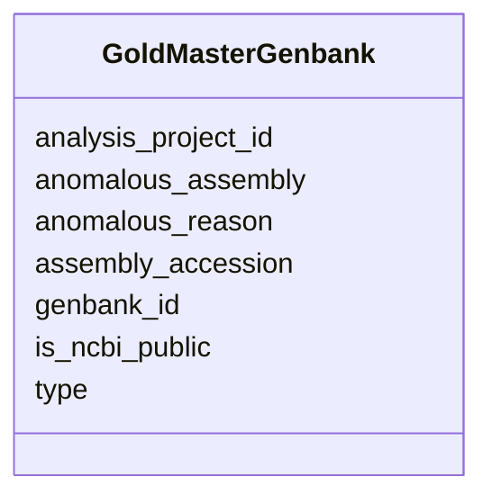

# Class: GoldMasterGenbank 


URI: [img_gold:GoldMasterGenbank](https://w3id.org/jgi/img_gold/GoldMasterGenbank)





<!-- no inheritance hierarchy -->


## Slots

| Name | Cardinality and Range | Description | Inheritance |
| ---  | --- | --- | --- |
| [analysis_project_id](analysis_project_id.md) | 0..1 <br/> [Float](Float.md) |  | direct |
| [genbank_id](genbank_id.md) | 0..1 <br/> [String](String.md) |  | direct |
| [assembly_accession](assembly_accession.md) | 0..1 <br/> [String](String.md) |  | direct |
| [type](type.md) | 0..1 <br/> [String](String.md) |  | direct |
| [is_ncbi_public](is_ncbi_public.md) | 0..1 <br/> [String](String.md) |  | direct |
| [anomalous_assembly](anomalous_assembly.md) | 0..1 <br/> [String](String.md) |  | direct |
| [anomalous_reason](anomalous_reason.md) | 0..1 <br/> [String](String.md) |  | direct |


## Identifier and Mapping Information


### Schema Source


* from schema: https://w3id.org/jgi/img_gold


## Mappings

| Mapping Type | Mapped Value |
| ---  | ---  |
| self | img_gold:GoldMasterGenbank |
| native | img_gold:GoldMasterGenbank |


## LinkML Source

<!-- TODO: investigate https://stackoverflow.com/questions/37606292/how-to-create-tabbed-code-blocks-in-mkdocs-or-sphinx -->

### Direct

<details>
```yaml
name: gold_master_genbank
from_schema: https://w3id.org/jgi/img_gold
attributes:
  analysis_project_id:
    name: analysis_project_id
    from_schema: https://w3id.org/jgi/img_gold
    domain_of:
    - gold_master_analysis_project
    - gold_master_analysis_project_publication
    - gold_master_analysis_project_sra_run
    - gold_master_assembly
    - gold_master_dw_ap_data_utilization_status
    - gold_master_genbank
    - gold_master_permission
    - gold_master_project_analysis_project
    range: float
    required: false
  genbank_id:
    name: genbank_id
    from_schema: https://w3id.org/jgi/img_gold
    domain_of:
    - gold_analysis_project_genbanks
    - gold_ap_genbank
    - gold_master_genbank
    range: string
    required: false
  assembly_accession:
    name: assembly_accession
    from_schema: https://w3id.org/jgi/img_gold
    domain_of:
    - gold_analysis_project_genbanks
    - gold_ap_genbank
    - gold_master_genbank
    range: string
    required: false
  type:
    name: type
    from_schema: https://w3id.org/jgi/img_gold
    domain_of:
    - gold_analysis_project_genbanks
    - gold_master_genbank
    range: string
    required: false
  is_ncbi_public:
    name: is_ncbi_public
    from_schema: https://w3id.org/jgi/img_gold
    rank: 1000
    domain_of:
    - gold_master_genbank
    range: string
    required: false
  anomalous_assembly:
    name: anomalous_assembly
    from_schema: https://w3id.org/jgi/img_gold
    rank: 1000
    domain_of:
    - gold_master_genbank
    range: string
    required: false
  anomalous_reason:
    name: anomalous_reason
    from_schema: https://w3id.org/jgi/img_gold
    rank: 1000
    domain_of:
    - gold_master_genbank
    range: string
    required: false

```
</details>

### Induced

<details>
```yaml
name: gold_master_genbank
from_schema: https://w3id.org/jgi/img_gold
attributes:
  analysis_project_id:
    name: analysis_project_id
    from_schema: https://w3id.org/jgi/img_gold
    alias: analysis_project_id
    owner: gold_master_genbank
    domain_of:
    - gold_master_analysis_project
    - gold_master_analysis_project_publication
    - gold_master_analysis_project_sra_run
    - gold_master_assembly
    - gold_master_dw_ap_data_utilization_status
    - gold_master_genbank
    - gold_master_permission
    - gold_master_project_analysis_project
    range: float
    required: false
  genbank_id:
    name: genbank_id
    from_schema: https://w3id.org/jgi/img_gold
    alias: genbank_id
    owner: gold_master_genbank
    domain_of:
    - gold_analysis_project_genbanks
    - gold_ap_genbank
    - gold_master_genbank
    range: string
    required: false
  assembly_accession:
    name: assembly_accession
    from_schema: https://w3id.org/jgi/img_gold
    alias: assembly_accession
    owner: gold_master_genbank
    domain_of:
    - gold_analysis_project_genbanks
    - gold_ap_genbank
    - gold_master_genbank
    range: string
    required: false
  type:
    name: type
    from_schema: https://w3id.org/jgi/img_gold
    alias: type
    owner: gold_master_genbank
    domain_of:
    - gold_analysis_project_genbanks
    - gold_master_genbank
    range: string
    required: false
  is_ncbi_public:
    name: is_ncbi_public
    from_schema: https://w3id.org/jgi/img_gold
    rank: 1000
    alias: is_ncbi_public
    owner: gold_master_genbank
    domain_of:
    - gold_master_genbank
    range: string
    required: false
  anomalous_assembly:
    name: anomalous_assembly
    from_schema: https://w3id.org/jgi/img_gold
    rank: 1000
    alias: anomalous_assembly
    owner: gold_master_genbank
    domain_of:
    - gold_master_genbank
    range: string
    required: false
  anomalous_reason:
    name: anomalous_reason
    from_schema: https://w3id.org/jgi/img_gold
    rank: 1000
    alias: anomalous_reason
    owner: gold_master_genbank
    domain_of:
    - gold_master_genbank
    range: string
    required: false

```
</details>