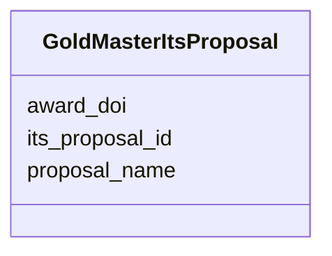

# Class: GoldMasterItsProposal 


URI: [img_gold:GoldMasterItsProposal](https://w3id.org/jgi/img_gold/GoldMasterItsProposal)





<!-- no inheritance hierarchy -->


## Slots

| Name | Cardinality and Range | Description | Inheritance |
| ---  | --- | --- | --- |
| [its_proposal_id](its_proposal_id.md) | 0..1 <br/> [Float](Float.md) |  | direct |
| [proposal_name](proposal_name.md) | 0..1 <br/> [String](String.md) |  | direct |
| [award_doi](award_doi.md) | 0..1 <br/> [String](String.md) |  | direct |


## Identifier and Mapping Information


### Schema Source


* from schema: https://w3id.org/jgi/img_gold


## Mappings

| Mapping Type | Mapped Value |
| ---  | ---  |
| self | img_gold:GoldMasterItsProposal |
| native | img_gold:GoldMasterItsProposal |


## LinkML Source

<!-- TODO: investigate https://stackoverflow.com/questions/37606292/how-to-create-tabbed-code-blocks-in-mkdocs-or-sphinx -->

### Direct

<details>
```yaml
name: gold_master_its_proposal
from_schema: https://w3id.org/jgi/img_gold
attributes:
  its_proposal_id:
    name: its_proposal_id
    from_schema: https://w3id.org/jgi/img_gold
    rank: 1000
    domain_of:
    - gold_master_its_proposal
    - gold_master_project
    - gold_sequencing_project
    range: float
    required: false
  proposal_name:
    name: proposal_name
    from_schema: https://w3id.org/jgi/img_gold
    rank: 1000
    domain_of:
    - gold_master_its_proposal
    range: string
    required: false
  award_doi:
    name: award_doi
    from_schema: https://w3id.org/jgi/img_gold
    rank: 1000
    domain_of:
    - gold_master_its_proposal
    range: string
    required: false

```
</details>

### Induced

<details>
```yaml
name: gold_master_its_proposal
from_schema: https://w3id.org/jgi/img_gold
attributes:
  its_proposal_id:
    name: its_proposal_id
    from_schema: https://w3id.org/jgi/img_gold
    rank: 1000
    alias: its_proposal_id
    owner: gold_master_its_proposal
    domain_of:
    - gold_master_its_proposal
    - gold_master_project
    - gold_sequencing_project
    range: float
    required: false
  proposal_name:
    name: proposal_name
    from_schema: https://w3id.org/jgi/img_gold
    rank: 1000
    alias: proposal_name
    owner: gold_master_its_proposal
    domain_of:
    - gold_master_its_proposal
    range: string
    required: false
  award_doi:
    name: award_doi
    from_schema: https://w3id.org/jgi/img_gold
    rank: 1000
    alias: award_doi
    owner: gold_master_its_proposal
    domain_of:
    - gold_master_its_proposal
    range: string
    required: false

```
</details>