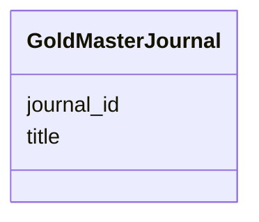

# Class: GoldMasterJournal 


URI: [img_gold:GoldMasterJournal](https://w3id.org/jgi/img_gold/GoldMasterJournal)





<!-- no inheritance hierarchy -->


## Slots

| Name | Cardinality and Range | Description | Inheritance |
| ---  | --- | --- | --- |
| [journal_id](journal_id.md) | 0..1 <br/> [Float](Float.md) |  | direct |
| [title](title.md) | 0..1 <br/> [String](String.md) |  | direct |


## Identifier and Mapping Information


### Schema Source


* from schema: https://w3id.org/jgi/img_gold


## Mappings

| Mapping Type | Mapped Value |
| ---  | ---  |
| self | img_gold:GoldMasterJournal |
| native | img_gold:GoldMasterJournal |


## LinkML Source

<!-- TODO: investigate https://stackoverflow.com/questions/37606292/how-to-create-tabbed-code-blocks-in-mkdocs-or-sphinx -->

### Direct

<details>
```yaml
name: gold_master_journal
from_schema: https://w3id.org/jgi/img_gold
attributes:
  journal_id:
    name: journal_id
    from_schema: https://w3id.org/jgi/img_gold
    rank: 1000
    domain_of:
    - gold_master_journal
    - gold_master_publication
    range: float
    required: false
  title:
    name: title
    from_schema: https://w3id.org/jgi/img_gold
    domain_of:
    - gold_ap_publications
    - gold_master_journal
    - gold_master_publication
    - gold_sp_genome_publications
    range: string
    required: false

```
</details>

### Induced

<details>
```yaml
name: gold_master_journal
from_schema: https://w3id.org/jgi/img_gold
attributes:
  journal_id:
    name: journal_id
    from_schema: https://w3id.org/jgi/img_gold
    rank: 1000
    alias: journal_id
    owner: gold_master_journal
    domain_of:
    - gold_master_journal
    - gold_master_publication
    range: float
    required: false
  title:
    name: title
    from_schema: https://w3id.org/jgi/img_gold
    alias: title
    owner: gold_master_journal
    domain_of:
    - gold_ap_publications
    - gold_master_journal
    - gold_master_publication
    - gold_sp_genome_publications
    range: string
    required: false

```
</details>