# Class: GoldMasterOrganism 


URI: [img_gold:GoldMasterOrganism](https://w3id.org/jgi/img_gold/GoldMasterOrganism)

```mermaid
 classDiagram
    class GoldMasterOrganism
    click GoldMasterOrganism href "../GoldMasterOrganism/"
      GoldMasterOrganism : active
        
      GoldMasterOrganism : altitude
        
      GoldMasterOrganism : altitude2
        
      GoldMasterOrganism : cell_shape
        
      GoldMasterOrganism : chlorophyll_concentration
        
      GoldMasterOrganism : clade
        
      GoldMasterOrganism : culture_type
        
      GoldMasterOrganism : cultured
        
      GoldMasterOrganism : depth
        
      GoldMasterOrganism : depth2
        
      GoldMasterOrganism : domain
        
      GoldMasterOrganism : ecosystem
        
      GoldMasterOrganism : ecosystem_category
        
      GoldMasterOrganism : ecosystem_subtype
        
      GoldMasterOrganism : ecosystem_type
        
      GoldMasterOrganism : ecotype
        
      GoldMasterOrganism : elevation
        
      GoldMasterOrganism : elevation2
        
      GoldMasterOrganism : genus
        
      GoldMasterOrganism : geographic_location
        
      GoldMasterOrganism : gold_id
        
      GoldMasterOrganism : gold_phylogeny
        
      GoldMasterOrganism : gram_stain
        
      GoldMasterOrganism : host_body_site
        
      GoldMasterOrganism : host_body_subsite
        
      GoldMasterOrganism : host_name
        
      GoldMasterOrganism : is_public
        
      GoldMasterOrganism : latitude
        
      GoldMasterOrganism : longitude
        
      GoldMasterOrganism : motility
        
      GoldMasterOrganism : ncbi_class
        
      GoldMasterOrganism : ncbi_family
        
      GoldMasterOrganism : ncbi_genus
        
      GoldMasterOrganism : ncbi_kingdom
        
      GoldMasterOrganism : ncbi_order
        
      GoldMasterOrganism : ncbi_phylum
        
      GoldMasterOrganism : ncbi_species
        
      GoldMasterOrganism : ncbi_superkingdom
        
      GoldMasterOrganism : ncbi_taxonomy_id
        
      GoldMasterOrganism : nitrate_concentration
        
      GoldMasterOrganism : organism_id
        
      GoldMasterOrganism : oxygen_concentration
        
      GoldMasterOrganism : oxygen_requirement
        
      GoldMasterOrganism : ph1
        
      GoldMasterOrganism : ph2
        
      GoldMasterOrganism : pressure
        
      GoldMasterOrganism : proport_isolation
        
      GoldMasterOrganism : proport_ocean
        
      GoldMasterOrganism : proport_station
        
      GoldMasterOrganism : proport_woa_dissolved_oxygen
        
      GoldMasterOrganism : proport_woa_nitrate
        
      GoldMasterOrganism : proport_woa_phosphate
        
      GoldMasterOrganism : proport_woa_salinity
        
      GoldMasterOrganism : proport_woa_silicate
        
      GoldMasterOrganism : proport_woa_temperature
        
      GoldMasterOrganism : salinity
        
      GoldMasterOrganism : salinity_concentration
        
      GoldMasterOrganism : sample_collection_site
        
      GoldMasterOrganism : sample_collection_temperature
        
      GoldMasterOrganism : sample_isolation_country_id
        
      GoldMasterOrganism : species
        
      GoldMasterOrganism : specific_ecosystem
        
      GoldMasterOrganism : sporulation
        
      GoldMasterOrganism : strain
        
      GoldMasterOrganism : subsurface_depth1
        
      GoldMasterOrganism : subsurface_depth2
        
      GoldMasterOrganism : temperature_range
        
      GoldMasterOrganism : type_strain
        
      GoldMasterOrganism : uncultured_type
        
      GoldMasterOrganism : viral_group
        
      GoldMasterOrganism : viral_subgroup
        
      
```





<!-- no inheritance hierarchy -->


## Slots

| Name | Cardinality and Range | Description | Inheritance |
| ---  | --- | --- | --- |
| [organism_id](organism_id.md) | 0..1 <br/> [Float](Float.md) |  | direct |
| [gold_id](gold_id.md) | 0..1 <br/> [String](String.md) |  | direct |
| [active](active.md) | 0..1 <br/> [String](String.md) |  | direct |
| [is_public](is_public.md) | 0..1 <br/> [String](String.md) |  | direct |
| [ncbi_taxonomy_id](ncbi_taxonomy_id.md) | 0..1 <br/> [Float](Float.md) |  | direct |
| [domain](domain.md) | 0..1 <br/> [String](String.md) |  | direct |
| [ncbi_superkingdom](ncbi_superkingdom.md) | 0..1 <br/> [String](String.md) |  | direct |
| [ncbi_kingdom](ncbi_kingdom.md) | 0..1 <br/> [String](String.md) |  | direct |
| [ncbi_phylum](ncbi_phylum.md) | 0..1 <br/> [String](String.md) |  | direct |
| [ncbi_class](ncbi_class.md) | 0..1 <br/> [String](String.md) |  | direct |
| [ncbi_order](ncbi_order.md) | 0..1 <br/> [String](String.md) |  | direct |
| [ncbi_family](ncbi_family.md) | 0..1 <br/> [String](String.md) |  | direct |
| [ncbi_genus](ncbi_genus.md) | 0..1 <br/> [String](String.md) |  | direct |
| [ncbi_species](ncbi_species.md) | 0..1 <br/> [String](String.md) |  | direct |
| [cultured](cultured.md) | 0..1 <br/> [String](String.md) |  | direct |
| [strain](strain.md) | 0..1 <br/> [String](String.md) |  | direct |
| [genus](genus.md) | 0..1 <br/> [String](String.md) |  | direct |
| [species](species.md) | 0..1 <br/> [String](String.md) |  | direct |
| [gold_phylogeny](gold_phylogeny.md) | 0..1 <br/> [String](String.md) |  | direct |
| [uncultured_type](uncultured_type.md) | 0..1 <br/> [String](String.md) |  | direct |
| [culture_type](culture_type.md) | 0..1 <br/> [String](String.md) |  | direct |
| [latitude](latitude.md) | 0..1 <br/> [Float](Float.md) |  | direct |
| [longitude](longitude.md) | 0..1 <br/> [Float](Float.md) |  | direct |
| [altitude](altitude.md) | 0..1 <br/> [Float](Float.md) |  | direct |
| [altitude2](altitude2.md) | 0..1 <br/> [Float](Float.md) |  | direct |
| [depth](depth.md) | 0..1 <br/> [Float](Float.md) |  | direct |
| [depth2](depth2.md) | 0..1 <br/> [Float](Float.md) |  | direct |
| [elevation](elevation.md) | 0..1 <br/> [Float](Float.md) |  | direct |
| [elevation2](elevation2.md) | 0..1 <br/> [Float](Float.md) |  | direct |
| [subsurface_depth1](subsurface_depth1.md) | 0..1 <br/> [Float](Float.md) |  | direct |
| [subsurface_depth2](subsurface_depth2.md) | 0..1 <br/> [Float](Float.md) |  | direct |
| [clade](clade.md) | 0..1 <br/> [String](String.md) |  | direct |
| [sample_collection_site](sample_collection_site.md) | 0..1 <br/> [String](String.md) |  | direct |
| [oxygen_concentration](oxygen_concentration.md) | 0..1 <br/> [String](String.md) |  | direct |
| [oxygen_requirement](oxygen_requirement.md) | 0..1 <br/> [String](String.md) |  | direct |
| [cell_shape](cell_shape.md) | 0..1 <br/> [String](String.md) |  | direct |
| [motility](motility.md) | 0..1 <br/> [String](String.md) |  | direct |
| [sporulation](sporulation.md) | 0..1 <br/> [String](String.md) |  | direct |
| [temperature_range](temperature_range.md) | 0..1 <br/> [String](String.md) |  | direct |
| [salinity](salinity.md) | 0..1 <br/> [String](String.md) |  | direct |
| [sample_isolation_country_id](sample_isolation_country_id.md) | 0..1 <br/> [Float](Float.md) |  | direct |
| [geographic_location](geographic_location.md) | 0..1 <br/> [String](String.md) |  | direct |
| [gram_stain](gram_stain.md) | 0..1 <br/> [String](String.md) |  | direct |
| [host_name](host_name.md) | 0..1 <br/> [String](String.md) |  | direct |
| [type_strain](type_strain.md) | 0..1 <br/> [String](String.md) |  | direct |
| [ecosystem](ecosystem.md) | 0..1 <br/> [String](String.md) |  | direct |
| [ecosystem_category](ecosystem_category.md) | 0..1 <br/> [String](String.md) |  | direct |
| [ecosystem_type](ecosystem_type.md) | 0..1 <br/> [String](String.md) |  | direct |
| [ecosystem_subtype](ecosystem_subtype.md) | 0..1 <br/> [String](String.md) |  | direct |
| [specific_ecosystem](specific_ecosystem.md) | 0..1 <br/> [String](String.md) |  | direct |
| [host_body_site](host_body_site.md) | 0..1 <br/> [String](String.md) |  | direct |
| [host_body_subsite](host_body_subsite.md) | 0..1 <br/> [String](String.md) |  | direct |
| [ecotype](ecotype.md) | 0..1 <br/> [String](String.md) |  | direct |
| [proport_ocean](proport_ocean.md) | 0..1 <br/> [String](String.md) |  | direct |
| [proport_isolation](proport_isolation.md) | 0..1 <br/> [String](String.md) |  | direct |
| [proport_station](proport_station.md) | 0..1 <br/> [String](String.md) |  | direct |
| [proport_woa_temperature](proport_woa_temperature.md) | 0..1 <br/> [Float](Float.md) |  | direct |
| [proport_woa_salinity](proport_woa_salinity.md) | 0..1 <br/> [Float](Float.md) |  | direct |
| [proport_woa_dissolved_oxygen](proport_woa_dissolved_oxygen.md) | 0..1 <br/> [Float](Float.md) |  | direct |
| [proport_woa_silicate](proport_woa_silicate.md) | 0..1 <br/> [Float](Float.md) |  | direct |
| [proport_woa_phosphate](proport_woa_phosphate.md) | 0..1 <br/> [Float](Float.md) |  | direct |
| [proport_woa_nitrate](proport_woa_nitrate.md) | 0..1 <br/> [Float](Float.md) |  | direct |
| [viral_group](viral_group.md) | 0..1 <br/> [String](String.md) |  | direct |
| [viral_subgroup](viral_subgroup.md) | 0..1 <br/> [String](String.md) |  | direct |
| [sample_collection_temperature](sample_collection_temperature.md) | 0..1 <br/> [Float](Float.md) |  | direct |
| [pressure](pressure.md) | 0..1 <br/> [String](String.md) |  | direct |
| [chlorophyll_concentration](chlorophyll_concentration.md) | 0..1 <br/> [String](String.md) |  | direct |
| [salinity_concentration](salinity_concentration.md) | 0..1 <br/> [String](String.md) |  | direct |
| [nitrate_concentration](nitrate_concentration.md) | 0..1 <br/> [String](String.md) |  | direct |
| [ph1](ph1.md) | 0..1 <br/> [Float](Float.md) |  | direct |
| [ph2](ph2.md) | 0..1 <br/> [Float](Float.md) |  | direct |


## Identifier and Mapping Information


### Schema Source


* from schema: https://w3id.org/jgi/img_gold


## Mappings

| Mapping Type | Mapped Value |
| ---  | ---  |
| self | img_gold:GoldMasterOrganism |
| native | img_gold:GoldMasterOrganism |


## LinkML Source

<!-- TODO: investigate https://stackoverflow.com/questions/37606292/how-to-create-tabbed-code-blocks-in-mkdocs-or-sphinx -->

### Direct

<details>
```yaml
name: gold_master_organism
from_schema: https://w3id.org/jgi/img_gold
attributes:
  organism_id:
    name: organism_id
    from_schema: https://w3id.org/jgi/img_gold
    domain_of:
    - gold_master_analysis_project
    - gold_master_organism
    - gold_master_organism_biotic_rel
    - gold_master_organism_cell_arrangement
    - gold_master_organism_disease
    - gold_master_organism_energy_source
    - gold_master_organism_habitat
    - gold_master_organism_metabolism
    - gold_master_organism_phenotype
    - gold_master_permission
    - gold_master_project
    range: float
    required: false
  gold_id:
    name: gold_id
    from_schema: https://w3id.org/jgi/img_gold
    domain_of:
    - gold_analysis_project
    - gold_analysis_project_genbanks
    - gold_analysis_project_jgi_award_dois
    - gold_analysis_project_lookup2
    - gold_analysis_project_sra_runs
    - gold_analysis_project_users
    - gold_ap_genbank_anomalous_reasons
    - gold_ap_publications
    - gold_master_analysis_project
    - gold_master_biosample
    - gold_master_organism
    - gold_master_project
    - gold_master_study
    - gold_sequencing_project
    - gold_sp_cell_arrangement
    - gold_sp_collaborator
    - gold_sp_disease
    - gold_sp_energy_source
    - gold_sp_genome_publications
    - gold_sp_habitat
    - gold_sp_metabolism
    - gold_sp_phenotype
    - gold_sp_relevance
    - gold_sp_seq_center
    - gold_sp_seq_method
    - gold_sp_sra
    - gold_sp_study_gold_id
    - gold_study
    range: string
    required: false
  active:
    name: active
    from_schema: https://w3id.org/jgi/img_gold
    domain_of:
    - gold_master_biosample
    - gold_master_organism
    - gold_master_project
    - gold_master_study
    range: string
    required: false
  is_public:
    name: is_public
    from_schema: https://w3id.org/jgi/img_gold
    domain_of:
    - gold_master_analysis_project
    - gold_master_biosample
    - gold_master_organism
    - gold_master_project
    - gold_master_study
    range: string
    required: false
  ncbi_taxonomy_id:
    name: ncbi_taxonomy_id
    from_schema: https://w3id.org/jgi/img_gold
    domain_of:
    - gold_master_biosample
    - gold_master_organism
    range: float
    required: false
  domain:
    name: domain
    from_schema: https://w3id.org/jgi/img_gold
    domain_of:
    - gold_analysis_project
    - gold_master_organism
    - gold_sequencing_project
    range: string
    required: false
  ncbi_superkingdom:
    name: ncbi_superkingdom
    from_schema: https://w3id.org/jgi/img_gold
    domain_of:
    - gold_analysis_project
    - gold_master_organism
    range: string
    required: false
  ncbi_kingdom:
    name: ncbi_kingdom
    from_schema: https://w3id.org/jgi/img_gold
    rank: 1000
    domain_of:
    - gold_master_organism
    - gold_sequencing_project
    range: string
    required: false
  ncbi_phylum:
    name: ncbi_phylum
    from_schema: https://w3id.org/jgi/img_gold
    domain_of:
    - gold_analysis_project
    - gold_master_organism
    - gold_sequencing_project
    range: string
    required: false
  ncbi_class:
    name: ncbi_class
    from_schema: https://w3id.org/jgi/img_gold
    domain_of:
    - gold_analysis_project
    - gold_master_organism
    - gold_sequencing_project
    range: string
    required: false
  ncbi_order:
    name: ncbi_order
    from_schema: https://w3id.org/jgi/img_gold
    domain_of:
    - gold_analysis_project
    - gold_master_organism
    - gold_sequencing_project
    range: string
    required: false
  ncbi_family:
    name: ncbi_family
    from_schema: https://w3id.org/jgi/img_gold
    domain_of:
    - gold_analysis_project
    - gold_master_organism
    - gold_sequencing_project
    range: string
    required: false
  ncbi_genus:
    name: ncbi_genus
    from_schema: https://w3id.org/jgi/img_gold
    domain_of:
    - gold_analysis_project
    - gold_master_organism
    - gold_sequencing_project
    range: string
    required: false
  ncbi_species:
    name: ncbi_species
    from_schema: https://w3id.org/jgi/img_gold
    domain_of:
    - gold_analysis_project
    - gold_master_organism
    - gold_sequencing_project
    range: string
    required: false
  cultured:
    name: cultured
    from_schema: https://w3id.org/jgi/img_gold
    domain_of:
    - gold_analysis_project
    - gold_master_organism
    - gold_sequencing_project
    range: string
    required: false
  strain:
    name: strain
    from_schema: https://w3id.org/jgi/img_gold
    domain_of:
    - gold_analysis_project
    - gold_master_organism
    - gold_sequencing_project
    range: string
    required: false
  genus:
    name: genus
    from_schema: https://w3id.org/jgi/img_gold
    domain_of:
    - gold_analysis_project
    - gold_master_organism
    - gold_sequencing_project
    range: string
    required: false
  species:
    name: species
    from_schema: https://w3id.org/jgi/img_gold
    domain_of:
    - gold_analysis_project
    - gold_master_organism
    - gold_sequencing_project
    range: string
    required: false
  gold_phylogeny:
    name: gold_phylogeny
    from_schema: https://w3id.org/jgi/img_gold
    domain_of:
    - gold_analysis_project
    - gold_master_organism
    range: string
    required: false
  uncultured_type:
    name: uncultured_type
    from_schema: https://w3id.org/jgi/img_gold
    domain_of:
    - gold_analysis_project
    - gold_master_organism
    - gold_sequencing_project
    range: string
    required: false
  culture_type:
    name: culture_type
    from_schema: https://w3id.org/jgi/img_gold
    domain_of:
    - gold_analysis_project
    - gold_master_organism
    - gold_sequencing_project
    range: string
    required: false
  latitude:
    name: latitude
    from_schema: https://w3id.org/jgi/img_gold
    domain_of:
    - gold_master_biosample
    - gold_master_organism
    - gold_sequencing_project
    range: float
    required: false
  longitude:
    name: longitude
    from_schema: https://w3id.org/jgi/img_gold
    domain_of:
    - gold_master_biosample
    - gold_master_organism
    - gold_sequencing_project
    range: float
    required: false
  altitude:
    name: altitude
    from_schema: https://w3id.org/jgi/img_gold
    domain_of:
    - gold_master_biosample
    - gold_master_organism
    - gold_sequencing_project
    range: float
    required: false
  altitude2:
    name: altitude2
    from_schema: https://w3id.org/jgi/img_gold
    domain_of:
    - gold_master_biosample
    - gold_master_organism
    range: float
    required: false
  depth:
    name: depth
    from_schema: https://w3id.org/jgi/img_gold
    domain_of:
    - gold_master_biosample
    - gold_master_organism
    - gold_sequencing_project
    range: float
    required: false
  depth2:
    name: depth2
    from_schema: https://w3id.org/jgi/img_gold
    domain_of:
    - gold_master_biosample
    - gold_master_organism
    range: float
    required: false
  elevation:
    name: elevation
    from_schema: https://w3id.org/jgi/img_gold
    domain_of:
    - gold_master_biosample
    - gold_master_organism
    range: float
    required: false
  elevation2:
    name: elevation2
    from_schema: https://w3id.org/jgi/img_gold
    domain_of:
    - gold_master_biosample
    - gold_master_organism
    range: float
    required: false
  subsurface_depth1:
    name: subsurface_depth1
    from_schema: https://w3id.org/jgi/img_gold
    rank: 1000
    domain_of:
    - gold_master_organism
    range: float
    required: false
  subsurface_depth2:
    name: subsurface_depth2
    from_schema: https://w3id.org/jgi/img_gold
    domain_of:
    - gold_master_biosample
    - gold_master_organism
    range: float
    required: false
  clade:
    name: clade
    from_schema: https://w3id.org/jgi/img_gold
    rank: 1000
    domain_of:
    - gold_master_organism
    - gold_sequencing_project
    range: string
    required: false
  sample_collection_site:
    name: sample_collection_site
    from_schema: https://w3id.org/jgi/img_gold
    domain_of:
    - gold_master_biosample
    - gold_master_organism
    range: string
    required: false
  oxygen_concentration:
    name: oxygen_concentration
    from_schema: https://w3id.org/jgi/img_gold
    domain_of:
    - gold_master_biosample
    - gold_master_organism
    - gold_sequencing_project
    range: string
    required: false
  oxygen_requirement:
    name: oxygen_requirement
    from_schema: https://w3id.org/jgi/img_gold
    rank: 1000
    domain_of:
    - gold_master_organism
    range: string
    required: false
  cell_shape:
    name: cell_shape
    from_schema: https://w3id.org/jgi/img_gold
    rank: 1000
    domain_of:
    - gold_master_organism
    - gold_sequencing_project
    range: string
    required: false
  motility:
    name: motility
    from_schema: https://w3id.org/jgi/img_gold
    rank: 1000
    domain_of:
    - gold_master_organism
    - gold_sequencing_project
    range: string
    required: false
  sporulation:
    name: sporulation
    from_schema: https://w3id.org/jgi/img_gold
    rank: 1000
    domain_of:
    - gold_master_organism
    - gold_sequencing_project
    range: string
    required: false
  temperature_range:
    name: temperature_range
    from_schema: https://w3id.org/jgi/img_gold
    rank: 1000
    domain_of:
    - gold_master_organism
    range: string
    required: false
  salinity:
    name: salinity
    from_schema: https://w3id.org/jgi/img_gold
    rank: 1000
    domain_of:
    - gold_master_organism
    - gold_sequencing_project
    range: string
    required: false
  sample_isolation_country_id:
    name: sample_isolation_country_id
    from_schema: https://w3id.org/jgi/img_gold
    domain_of:
    - gold_master_biosample
    - gold_master_organism
    range: float
    required: false
  geographic_location:
    name: geographic_location
    from_schema: https://w3id.org/jgi/img_gold
    domain_of:
    - gold_master_biosample
    - gold_master_organism
    range: string
    required: false
  gram_stain:
    name: gram_stain
    from_schema: https://w3id.org/jgi/img_gold
    rank: 1000
    domain_of:
    - gold_master_organism
    - gold_sequencing_project
    range: string
    required: false
  host_name:
    name: host_name
    from_schema: https://w3id.org/jgi/img_gold
    domain_of:
    - gold_master_biosample
    - gold_master_organism
    - gold_sequencing_project
    range: string
    required: false
  type_strain:
    name: type_strain
    from_schema: https://w3id.org/jgi/img_gold
    rank: 1000
    domain_of:
    - gold_master_organism
    - gold_sequencing_project
    range: string
    required: false
  ecosystem:
    name: ecosystem
    from_schema: https://w3id.org/jgi/img_gold
    domain_of:
    - gold_analysis_project
    - gold_master_analysis_project
    - gold_master_biosample
    - gold_master_organism
    - gold_master_study
    - gold_sequencing_project
    - gold_study
    range: string
    required: false
  ecosystem_category:
    name: ecosystem_category
    from_schema: https://w3id.org/jgi/img_gold
    domain_of:
    - gold_analysis_project
    - gold_master_analysis_project
    - gold_master_biosample
    - gold_master_organism
    - gold_master_study
    - gold_sequencing_project
    - gold_study
    range: string
    required: false
  ecosystem_type:
    name: ecosystem_type
    from_schema: https://w3id.org/jgi/img_gold
    domain_of:
    - gold_analysis_project
    - gold_master_analysis_project
    - gold_master_biosample
    - gold_master_organism
    - gold_master_study
    - gold_sequencing_project
    - gold_study
    range: string
    required: false
  ecosystem_subtype:
    name: ecosystem_subtype
    from_schema: https://w3id.org/jgi/img_gold
    domain_of:
    - gold_analysis_project
    - gold_master_analysis_project
    - gold_master_biosample
    - gold_master_organism
    - gold_master_study
    - gold_sequencing_project
    - gold_study
    range: string
    required: false
  specific_ecosystem:
    name: specific_ecosystem
    from_schema: https://w3id.org/jgi/img_gold
    domain_of:
    - gold_analysis_project
    - gold_master_analysis_project
    - gold_master_biosample
    - gold_master_organism
    - gold_master_study
    - gold_sequencing_project
    - gold_study
    range: string
    required: false
  host_body_site:
    name: host_body_site
    from_schema: https://w3id.org/jgi/img_gold
    domain_of:
    - gold_master_biosample
    - gold_master_organism
    range: string
    required: false
  host_body_subsite:
    name: host_body_subsite
    from_schema: https://w3id.org/jgi/img_gold
    domain_of:
    - gold_master_biosample
    - gold_master_organism
    range: string
    required: false
  ecotype:
    name: ecotype
    from_schema: https://w3id.org/jgi/img_gold
    rank: 1000
    domain_of:
    - gold_master_organism
    - gold_sequencing_project
    range: string
    required: false
  proport_ocean:
    name: proport_ocean
    from_schema: https://w3id.org/jgi/img_gold
    domain_of:
    - gold_master_biosample
    - gold_master_organism
    - gold_sequencing_project
    range: string
    required: false
  proport_isolation:
    name: proport_isolation
    from_schema: https://w3id.org/jgi/img_gold
    domain_of:
    - gold_master_biosample
    - gold_master_organism
    - gold_sequencing_project
    range: string
    required: false
  proport_station:
    name: proport_station
    from_schema: https://w3id.org/jgi/img_gold
    domain_of:
    - gold_master_biosample
    - gold_master_organism
    - gold_sequencing_project
    range: string
    required: false
  proport_woa_temperature:
    name: proport_woa_temperature
    from_schema: https://w3id.org/jgi/img_gold
    domain_of:
    - gold_master_biosample
    - gold_master_organism
    - gold_sequencing_project
    range: float
    required: false
  proport_woa_salinity:
    name: proport_woa_salinity
    from_schema: https://w3id.org/jgi/img_gold
    domain_of:
    - gold_master_biosample
    - gold_master_organism
    - gold_sequencing_project
    range: float
    required: false
  proport_woa_dissolved_oxygen:
    name: proport_woa_dissolved_oxygen
    from_schema: https://w3id.org/jgi/img_gold
    domain_of:
    - gold_master_biosample
    - gold_master_organism
    - gold_sequencing_project
    range: float
    required: false
  proport_woa_silicate:
    name: proport_woa_silicate
    from_schema: https://w3id.org/jgi/img_gold
    domain_of:
    - gold_master_biosample
    - gold_master_organism
    - gold_sequencing_project
    range: float
    required: false
  proport_woa_phosphate:
    name: proport_woa_phosphate
    from_schema: https://w3id.org/jgi/img_gold
    domain_of:
    - gold_master_biosample
    - gold_master_organism
    - gold_sequencing_project
    range: float
    required: false
  proport_woa_nitrate:
    name: proport_woa_nitrate
    from_schema: https://w3id.org/jgi/img_gold
    domain_of:
    - gold_master_biosample
    - gold_master_organism
    - gold_sequencing_project
    range: float
    required: false
  viral_group:
    name: viral_group
    from_schema: https://w3id.org/jgi/img_gold
    rank: 1000
    domain_of:
    - gold_master_organism
    - gold_sequencing_project
    range: string
    required: false
  viral_subgroup:
    name: viral_subgroup
    from_schema: https://w3id.org/jgi/img_gold
    rank: 1000
    domain_of:
    - gold_master_organism
    - gold_sequencing_project
    range: string
    required: false
  sample_collection_temperature:
    name: sample_collection_temperature
    from_schema: https://w3id.org/jgi/img_gold
    rank: 1000
    domain_of:
    - gold_master_organism
    range: float
    required: false
  pressure:
    name: pressure
    from_schema: https://w3id.org/jgi/img_gold
    domain_of:
    - gold_master_biosample
    - gold_master_organism
    - gold_sequencing_project
    range: string
    required: false
  chlorophyll_concentration:
    name: chlorophyll_concentration
    from_schema: https://w3id.org/jgi/img_gold
    domain_of:
    - gold_master_biosample
    - gold_master_organism
    - gold_sequencing_project
    range: string
    required: false
  salinity_concentration:
    name: salinity_concentration
    from_schema: https://w3id.org/jgi/img_gold
    domain_of:
    - gold_master_biosample
    - gold_master_organism
    - gold_sequencing_project
    range: string
    required: false
  nitrate_concentration:
    name: nitrate_concentration
    from_schema: https://w3id.org/jgi/img_gold
    domain_of:
    - gold_master_biosample
    - gold_master_organism
    - gold_sequencing_project
    range: string
    required: false
  ph1:
    name: ph1
    from_schema: https://w3id.org/jgi/img_gold
    domain_of:
    - gold_master_biosample
    - gold_master_organism
    range: float
    required: false
  ph2:
    name: ph2
    from_schema: https://w3id.org/jgi/img_gold
    domain_of:
    - gold_master_biosample
    - gold_master_organism
    range: float
    required: false

```
</details>

### Induced

<details>
```yaml
name: gold_master_organism
from_schema: https://w3id.org/jgi/img_gold
attributes:
  organism_id:
    name: organism_id
    from_schema: https://w3id.org/jgi/img_gold
    alias: organism_id
    owner: gold_master_organism
    domain_of:
    - gold_master_analysis_project
    - gold_master_organism
    - gold_master_organism_biotic_rel
    - gold_master_organism_cell_arrangement
    - gold_master_organism_disease
    - gold_master_organism_energy_source
    - gold_master_organism_habitat
    - gold_master_organism_metabolism
    - gold_master_organism_phenotype
    - gold_master_permission
    - gold_master_project
    range: float
    required: false
  gold_id:
    name: gold_id
    from_schema: https://w3id.org/jgi/img_gold
    alias: gold_id
    owner: gold_master_organism
    domain_of:
    - gold_analysis_project
    - gold_analysis_project_genbanks
    - gold_analysis_project_jgi_award_dois
    - gold_analysis_project_lookup2
    - gold_analysis_project_sra_runs
    - gold_analysis_project_users
    - gold_ap_genbank_anomalous_reasons
    - gold_ap_publications
    - gold_master_analysis_project
    - gold_master_biosample
    - gold_master_organism
    - gold_master_project
    - gold_master_study
    - gold_sequencing_project
    - gold_sp_cell_arrangement
    - gold_sp_collaborator
    - gold_sp_disease
    - gold_sp_energy_source
    - gold_sp_genome_publications
    - gold_sp_habitat
    - gold_sp_metabolism
    - gold_sp_phenotype
    - gold_sp_relevance
    - gold_sp_seq_center
    - gold_sp_seq_method
    - gold_sp_sra
    - gold_sp_study_gold_id
    - gold_study
    range: string
    required: false
  active:
    name: active
    from_schema: https://w3id.org/jgi/img_gold
    alias: active
    owner: gold_master_organism
    domain_of:
    - gold_master_biosample
    - gold_master_organism
    - gold_master_project
    - gold_master_study
    range: string
    required: false
  is_public:
    name: is_public
    from_schema: https://w3id.org/jgi/img_gold
    alias: is_public
    owner: gold_master_organism
    domain_of:
    - gold_master_analysis_project
    - gold_master_biosample
    - gold_master_organism
    - gold_master_project
    - gold_master_study
    range: string
    required: false
  ncbi_taxonomy_id:
    name: ncbi_taxonomy_id
    from_schema: https://w3id.org/jgi/img_gold
    alias: ncbi_taxonomy_id
    owner: gold_master_organism
    domain_of:
    - gold_master_biosample
    - gold_master_organism
    range: float
    required: false
  domain:
    name: domain
    from_schema: https://w3id.org/jgi/img_gold
    alias: domain
    owner: gold_master_organism
    domain_of:
    - gold_analysis_project
    - gold_master_organism
    - gold_sequencing_project
    range: string
    required: false
  ncbi_superkingdom:
    name: ncbi_superkingdom
    from_schema: https://w3id.org/jgi/img_gold
    alias: ncbi_superkingdom
    owner: gold_master_organism
    domain_of:
    - gold_analysis_project
    - gold_master_organism
    range: string
    required: false
  ncbi_kingdom:
    name: ncbi_kingdom
    from_schema: https://w3id.org/jgi/img_gold
    rank: 1000
    alias: ncbi_kingdom
    owner: gold_master_organism
    domain_of:
    - gold_master_organism
    - gold_sequencing_project
    range: string
    required: false
  ncbi_phylum:
    name: ncbi_phylum
    from_schema: https://w3id.org/jgi/img_gold
    alias: ncbi_phylum
    owner: gold_master_organism
    domain_of:
    - gold_analysis_project
    - gold_master_organism
    - gold_sequencing_project
    range: string
    required: false
  ncbi_class:
    name: ncbi_class
    from_schema: https://w3id.org/jgi/img_gold
    alias: ncbi_class
    owner: gold_master_organism
    domain_of:
    - gold_analysis_project
    - gold_master_organism
    - gold_sequencing_project
    range: string
    required: false
  ncbi_order:
    name: ncbi_order
    from_schema: https://w3id.org/jgi/img_gold
    alias: ncbi_order
    owner: gold_master_organism
    domain_of:
    - gold_analysis_project
    - gold_master_organism
    - gold_sequencing_project
    range: string
    required: false
  ncbi_family:
    name: ncbi_family
    from_schema: https://w3id.org/jgi/img_gold
    alias: ncbi_family
    owner: gold_master_organism
    domain_of:
    - gold_analysis_project
    - gold_master_organism
    - gold_sequencing_project
    range: string
    required: false
  ncbi_genus:
    name: ncbi_genus
    from_schema: https://w3id.org/jgi/img_gold
    alias: ncbi_genus
    owner: gold_master_organism
    domain_of:
    - gold_analysis_project
    - gold_master_organism
    - gold_sequencing_project
    range: string
    required: false
  ncbi_species:
    name: ncbi_species
    from_schema: https://w3id.org/jgi/img_gold
    alias: ncbi_species
    owner: gold_master_organism
    domain_of:
    - gold_analysis_project
    - gold_master_organism
    - gold_sequencing_project
    range: string
    required: false
  cultured:
    name: cultured
    from_schema: https://w3id.org/jgi/img_gold
    alias: cultured
    owner: gold_master_organism
    domain_of:
    - gold_analysis_project
    - gold_master_organism
    - gold_sequencing_project
    range: string
    required: false
  strain:
    name: strain
    from_schema: https://w3id.org/jgi/img_gold
    alias: strain
    owner: gold_master_organism
    domain_of:
    - gold_analysis_project
    - gold_master_organism
    - gold_sequencing_project
    range: string
    required: false
  genus:
    name: genus
    from_schema: https://w3id.org/jgi/img_gold
    alias: genus
    owner: gold_master_organism
    domain_of:
    - gold_analysis_project
    - gold_master_organism
    - gold_sequencing_project
    range: string
    required: false
  species:
    name: species
    from_schema: https://w3id.org/jgi/img_gold
    alias: species
    owner: gold_master_organism
    domain_of:
    - gold_analysis_project
    - gold_master_organism
    - gold_sequencing_project
    range: string
    required: false
  gold_phylogeny:
    name: gold_phylogeny
    from_schema: https://w3id.org/jgi/img_gold
    alias: gold_phylogeny
    owner: gold_master_organism
    domain_of:
    - gold_analysis_project
    - gold_master_organism
    range: string
    required: false
  uncultured_type:
    name: uncultured_type
    from_schema: https://w3id.org/jgi/img_gold
    alias: uncultured_type
    owner: gold_master_organism
    domain_of:
    - gold_analysis_project
    - gold_master_organism
    - gold_sequencing_project
    range: string
    required: false
  culture_type:
    name: culture_type
    from_schema: https://w3id.org/jgi/img_gold
    alias: culture_type
    owner: gold_master_organism
    domain_of:
    - gold_analysis_project
    - gold_master_organism
    - gold_sequencing_project
    range: string
    required: false
  latitude:
    name: latitude
    from_schema: https://w3id.org/jgi/img_gold
    alias: latitude
    owner: gold_master_organism
    domain_of:
    - gold_master_biosample
    - gold_master_organism
    - gold_sequencing_project
    range: float
    required: false
  longitude:
    name: longitude
    from_schema: https://w3id.org/jgi/img_gold
    alias: longitude
    owner: gold_master_organism
    domain_of:
    - gold_master_biosample
    - gold_master_organism
    - gold_sequencing_project
    range: float
    required: false
  altitude:
    name: altitude
    from_schema: https://w3id.org/jgi/img_gold
    alias: altitude
    owner: gold_master_organism
    domain_of:
    - gold_master_biosample
    - gold_master_organism
    - gold_sequencing_project
    range: float
    required: false
  altitude2:
    name: altitude2
    from_schema: https://w3id.org/jgi/img_gold
    alias: altitude2
    owner: gold_master_organism
    domain_of:
    - gold_master_biosample
    - gold_master_organism
    range: float
    required: false
  depth:
    name: depth
    from_schema: https://w3id.org/jgi/img_gold
    alias: depth
    owner: gold_master_organism
    domain_of:
    - gold_master_biosample
    - gold_master_organism
    - gold_sequencing_project
    range: float
    required: false
  depth2:
    name: depth2
    from_schema: https://w3id.org/jgi/img_gold
    alias: depth2
    owner: gold_master_organism
    domain_of:
    - gold_master_biosample
    - gold_master_organism
    range: float
    required: false
  elevation:
    name: elevation
    from_schema: https://w3id.org/jgi/img_gold
    alias: elevation
    owner: gold_master_organism
    domain_of:
    - gold_master_biosample
    - gold_master_organism
    range: float
    required: false
  elevation2:
    name: elevation2
    from_schema: https://w3id.org/jgi/img_gold
    alias: elevation2
    owner: gold_master_organism
    domain_of:
    - gold_master_biosample
    - gold_master_organism
    range: float
    required: false
  subsurface_depth1:
    name: subsurface_depth1
    from_schema: https://w3id.org/jgi/img_gold
    rank: 1000
    alias: subsurface_depth1
    owner: gold_master_organism
    domain_of:
    - gold_master_organism
    range: float
    required: false
  subsurface_depth2:
    name: subsurface_depth2
    from_schema: https://w3id.org/jgi/img_gold
    alias: subsurface_depth2
    owner: gold_master_organism
    domain_of:
    - gold_master_biosample
    - gold_master_organism
    range: float
    required: false
  clade:
    name: clade
    from_schema: https://w3id.org/jgi/img_gold
    rank: 1000
    alias: clade
    owner: gold_master_organism
    domain_of:
    - gold_master_organism
    - gold_sequencing_project
    range: string
    required: false
  sample_collection_site:
    name: sample_collection_site
    from_schema: https://w3id.org/jgi/img_gold
    alias: sample_collection_site
    owner: gold_master_organism
    domain_of:
    - gold_master_biosample
    - gold_master_organism
    range: string
    required: false
  oxygen_concentration:
    name: oxygen_concentration
    from_schema: https://w3id.org/jgi/img_gold
    alias: oxygen_concentration
    owner: gold_master_organism
    domain_of:
    - gold_master_biosample
    - gold_master_organism
    - gold_sequencing_project
    range: string
    required: false
  oxygen_requirement:
    name: oxygen_requirement
    from_schema: https://w3id.org/jgi/img_gold
    rank: 1000
    alias: oxygen_requirement
    owner: gold_master_organism
    domain_of:
    - gold_master_organism
    range: string
    required: false
  cell_shape:
    name: cell_shape
    from_schema: https://w3id.org/jgi/img_gold
    rank: 1000
    alias: cell_shape
    owner: gold_master_organism
    domain_of:
    - gold_master_organism
    - gold_sequencing_project
    range: string
    required: false
  motility:
    name: motility
    from_schema: https://w3id.org/jgi/img_gold
    rank: 1000
    alias: motility
    owner: gold_master_organism
    domain_of:
    - gold_master_organism
    - gold_sequencing_project
    range: string
    required: false
  sporulation:
    name: sporulation
    from_schema: https://w3id.org/jgi/img_gold
    rank: 1000
    alias: sporulation
    owner: gold_master_organism
    domain_of:
    - gold_master_organism
    - gold_sequencing_project
    range: string
    required: false
  temperature_range:
    name: temperature_range
    from_schema: https://w3id.org/jgi/img_gold
    rank: 1000
    alias: temperature_range
    owner: gold_master_organism
    domain_of:
    - gold_master_organism
    range: string
    required: false
  salinity:
    name: salinity
    from_schema: https://w3id.org/jgi/img_gold
    rank: 1000
    alias: salinity
    owner: gold_master_organism
    domain_of:
    - gold_master_organism
    - gold_sequencing_project
    range: string
    required: false
  sample_isolation_country_id:
    name: sample_isolation_country_id
    from_schema: https://w3id.org/jgi/img_gold
    alias: sample_isolation_country_id
    owner: gold_master_organism
    domain_of:
    - gold_master_biosample
    - gold_master_organism
    range: float
    required: false
  geographic_location:
    name: geographic_location
    from_schema: https://w3id.org/jgi/img_gold
    alias: geographic_location
    owner: gold_master_organism
    domain_of:
    - gold_master_biosample
    - gold_master_organism
    range: string
    required: false
  gram_stain:
    name: gram_stain
    from_schema: https://w3id.org/jgi/img_gold
    rank: 1000
    alias: gram_stain
    owner: gold_master_organism
    domain_of:
    - gold_master_organism
    - gold_sequencing_project
    range: string
    required: false
  host_name:
    name: host_name
    from_schema: https://w3id.org/jgi/img_gold
    alias: host_name
    owner: gold_master_organism
    domain_of:
    - gold_master_biosample
    - gold_master_organism
    - gold_sequencing_project
    range: string
    required: false
  type_strain:
    name: type_strain
    from_schema: https://w3id.org/jgi/img_gold
    rank: 1000
    alias: type_strain
    owner: gold_master_organism
    domain_of:
    - gold_master_organism
    - gold_sequencing_project
    range: string
    required: false
  ecosystem:
    name: ecosystem
    from_schema: https://w3id.org/jgi/img_gold
    alias: ecosystem
    owner: gold_master_organism
    domain_of:
    - gold_analysis_project
    - gold_master_analysis_project
    - gold_master_biosample
    - gold_master_organism
    - gold_master_study
    - gold_sequencing_project
    - gold_study
    range: string
    required: false
  ecosystem_category:
    name: ecosystem_category
    from_schema: https://w3id.org/jgi/img_gold
    alias: ecosystem_category
    owner: gold_master_organism
    domain_of:
    - gold_analysis_project
    - gold_master_analysis_project
    - gold_master_biosample
    - gold_master_organism
    - gold_master_study
    - gold_sequencing_project
    - gold_study
    range: string
    required: false
  ecosystem_type:
    name: ecosystem_type
    from_schema: https://w3id.org/jgi/img_gold
    alias: ecosystem_type
    owner: gold_master_organism
    domain_of:
    - gold_analysis_project
    - gold_master_analysis_project
    - gold_master_biosample
    - gold_master_organism
    - gold_master_study
    - gold_sequencing_project
    - gold_study
    range: string
    required: false
  ecosystem_subtype:
    name: ecosystem_subtype
    from_schema: https://w3id.org/jgi/img_gold
    alias: ecosystem_subtype
    owner: gold_master_organism
    domain_of:
    - gold_analysis_project
    - gold_master_analysis_project
    - gold_master_biosample
    - gold_master_organism
    - gold_master_study
    - gold_sequencing_project
    - gold_study
    range: string
    required: false
  specific_ecosystem:
    name: specific_ecosystem
    from_schema: https://w3id.org/jgi/img_gold
    alias: specific_ecosystem
    owner: gold_master_organism
    domain_of:
    - gold_analysis_project
    - gold_master_analysis_project
    - gold_master_biosample
    - gold_master_organism
    - gold_master_study
    - gold_sequencing_project
    - gold_study
    range: string
    required: false
  host_body_site:
    name: host_body_site
    from_schema: https://w3id.org/jgi/img_gold
    alias: host_body_site
    owner: gold_master_organism
    domain_of:
    - gold_master_biosample
    - gold_master_organism
    range: string
    required: false
  host_body_subsite:
    name: host_body_subsite
    from_schema: https://w3id.org/jgi/img_gold
    alias: host_body_subsite
    owner: gold_master_organism
    domain_of:
    - gold_master_biosample
    - gold_master_organism
    range: string
    required: false
  ecotype:
    name: ecotype
    from_schema: https://w3id.org/jgi/img_gold
    rank: 1000
    alias: ecotype
    owner: gold_master_organism
    domain_of:
    - gold_master_organism
    - gold_sequencing_project
    range: string
    required: false
  proport_ocean:
    name: proport_ocean
    from_schema: https://w3id.org/jgi/img_gold
    alias: proport_ocean
    owner: gold_master_organism
    domain_of:
    - gold_master_biosample
    - gold_master_organism
    - gold_sequencing_project
    range: string
    required: false
  proport_isolation:
    name: proport_isolation
    from_schema: https://w3id.org/jgi/img_gold
    alias: proport_isolation
    owner: gold_master_organism
    domain_of:
    - gold_master_biosample
    - gold_master_organism
    - gold_sequencing_project
    range: string
    required: false
  proport_station:
    name: proport_station
    from_schema: https://w3id.org/jgi/img_gold
    alias: proport_station
    owner: gold_master_organism
    domain_of:
    - gold_master_biosample
    - gold_master_organism
    - gold_sequencing_project
    range: string
    required: false
  proport_woa_temperature:
    name: proport_woa_temperature
    from_schema: https://w3id.org/jgi/img_gold
    alias: proport_woa_temperature
    owner: gold_master_organism
    domain_of:
    - gold_master_biosample
    - gold_master_organism
    - gold_sequencing_project
    range: float
    required: false
  proport_woa_salinity:
    name: proport_woa_salinity
    from_schema: https://w3id.org/jgi/img_gold
    alias: proport_woa_salinity
    owner: gold_master_organism
    domain_of:
    - gold_master_biosample
    - gold_master_organism
    - gold_sequencing_project
    range: float
    required: false
  proport_woa_dissolved_oxygen:
    name: proport_woa_dissolved_oxygen
    from_schema: https://w3id.org/jgi/img_gold
    alias: proport_woa_dissolved_oxygen
    owner: gold_master_organism
    domain_of:
    - gold_master_biosample
    - gold_master_organism
    - gold_sequencing_project
    range: float
    required: false
  proport_woa_silicate:
    name: proport_woa_silicate
    from_schema: https://w3id.org/jgi/img_gold
    alias: proport_woa_silicate
    owner: gold_master_organism
    domain_of:
    - gold_master_biosample
    - gold_master_organism
    - gold_sequencing_project
    range: float
    required: false
  proport_woa_phosphate:
    name: proport_woa_phosphate
    from_schema: https://w3id.org/jgi/img_gold
    alias: proport_woa_phosphate
    owner: gold_master_organism
    domain_of:
    - gold_master_biosample
    - gold_master_organism
    - gold_sequencing_project
    range: float
    required: false
  proport_woa_nitrate:
    name: proport_woa_nitrate
    from_schema: https://w3id.org/jgi/img_gold
    alias: proport_woa_nitrate
    owner: gold_master_organism
    domain_of:
    - gold_master_biosample
    - gold_master_organism
    - gold_sequencing_project
    range: float
    required: false
  viral_group:
    name: viral_group
    from_schema: https://w3id.org/jgi/img_gold
    rank: 1000
    alias: viral_group
    owner: gold_master_organism
    domain_of:
    - gold_master_organism
    - gold_sequencing_project
    range: string
    required: false
  viral_subgroup:
    name: viral_subgroup
    from_schema: https://w3id.org/jgi/img_gold
    rank: 1000
    alias: viral_subgroup
    owner: gold_master_organism
    domain_of:
    - gold_master_organism
    - gold_sequencing_project
    range: string
    required: false
  sample_collection_temperature:
    name: sample_collection_temperature
    from_schema: https://w3id.org/jgi/img_gold
    rank: 1000
    alias: sample_collection_temperature
    owner: gold_master_organism
    domain_of:
    - gold_master_organism
    range: float
    required: false
  pressure:
    name: pressure
    from_schema: https://w3id.org/jgi/img_gold
    alias: pressure
    owner: gold_master_organism
    domain_of:
    - gold_master_biosample
    - gold_master_organism
    - gold_sequencing_project
    range: string
    required: false
  chlorophyll_concentration:
    name: chlorophyll_concentration
    from_schema: https://w3id.org/jgi/img_gold
    alias: chlorophyll_concentration
    owner: gold_master_organism
    domain_of:
    - gold_master_biosample
    - gold_master_organism
    - gold_sequencing_project
    range: string
    required: false
  salinity_concentration:
    name: salinity_concentration
    from_schema: https://w3id.org/jgi/img_gold
    alias: salinity_concentration
    owner: gold_master_organism
    domain_of:
    - gold_master_biosample
    - gold_master_organism
    - gold_sequencing_project
    range: string
    required: false
  nitrate_concentration:
    name: nitrate_concentration
    from_schema: https://w3id.org/jgi/img_gold
    alias: nitrate_concentration
    owner: gold_master_organism
    domain_of:
    - gold_master_biosample
    - gold_master_organism
    - gold_sequencing_project
    range: string
    required: false
  ph1:
    name: ph1
    from_schema: https://w3id.org/jgi/img_gold
    alias: ph1
    owner: gold_master_organism
    domain_of:
    - gold_master_biosample
    - gold_master_organism
    range: float
    required: false
  ph2:
    name: ph2
    from_schema: https://w3id.org/jgi/img_gold
    alias: ph2
    owner: gold_master_organism
    domain_of:
    - gold_master_biosample
    - gold_master_organism
    range: float
    required: false

```
</details>