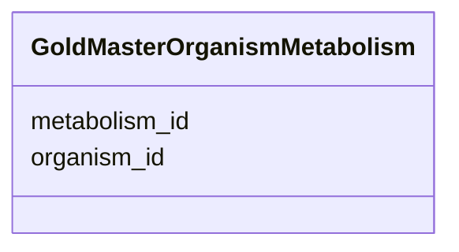

# Class: GoldMasterOrganismMetabolism 


URI: [img_gold:GoldMasterOrganismMetabolism](https://w3id.org/jgi/img_gold/GoldMasterOrganismMetabolism)





<!-- no inheritance hierarchy -->


## Slots

| Name | Cardinality and Range | Description | Inheritance |
| ---  | --- | --- | --- |
| [organism_id](organism_id.md) | 0..1 <br/> [Float](Float.md) |  | direct |
| [metabolism_id](metabolism_id.md) | 0..1 <br/> [Float](Float.md) |  | direct |


## Identifier and Mapping Information


### Schema Source


* from schema: https://w3id.org/jgi/img_gold


## Mappings

| Mapping Type | Mapped Value |
| ---  | ---  |
| self | img_gold:GoldMasterOrganismMetabolism |
| native | img_gold:GoldMasterOrganismMetabolism |


## LinkML Source

<!-- TODO: investigate https://stackoverflow.com/questions/37606292/how-to-create-tabbed-code-blocks-in-mkdocs-or-sphinx -->

### Direct

<details>
```yaml
name: gold_master_organism_metabolism
from_schema: https://w3id.org/jgi/img_gold
attributes:
  organism_id:
    name: organism_id
    from_schema: https://w3id.org/jgi/img_gold
    domain_of:
    - gold_master_analysis_project
    - gold_master_organism
    - gold_master_organism_biotic_rel
    - gold_master_organism_cell_arrangement
    - gold_master_organism_disease
    - gold_master_organism_energy_source
    - gold_master_organism_habitat
    - gold_master_organism_metabolism
    - gold_master_organism_phenotype
    - gold_master_permission
    - gold_master_project
    range: float
    required: false
  metabolism_id:
    name: metabolism_id
    from_schema: https://w3id.org/jgi/img_gold
    rank: 1000
    domain_of:
    - gold_master_organism_metabolism
    range: float
    required: false

```
</details>

### Induced

<details>
```yaml
name: gold_master_organism_metabolism
from_schema: https://w3id.org/jgi/img_gold
attributes:
  organism_id:
    name: organism_id
    from_schema: https://w3id.org/jgi/img_gold
    alias: organism_id
    owner: gold_master_organism_metabolism
    domain_of:
    - gold_master_analysis_project
    - gold_master_organism
    - gold_master_organism_biotic_rel
    - gold_master_organism_cell_arrangement
    - gold_master_organism_disease
    - gold_master_organism_energy_source
    - gold_master_organism_habitat
    - gold_master_organism_metabolism
    - gold_master_organism_phenotype
    - gold_master_permission
    - gold_master_project
    range: float
    required: false
  metabolism_id:
    name: metabolism_id
    from_schema: https://w3id.org/jgi/img_gold
    rank: 1000
    alias: metabolism_id
    owner: gold_master_organism_metabolism
    domain_of:
    - gold_master_organism_metabolism
    range: float
    required: false

```
</details>