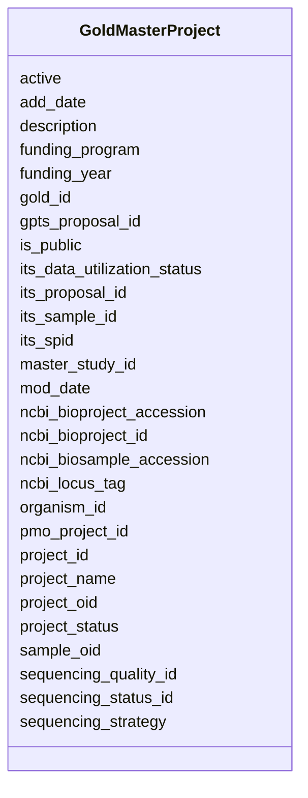

# Class: GoldMasterProject 


URI: [img_gold:GoldMasterProject](https://w3id.org/jgi/img_gold/GoldMasterProject)





<!-- no inheritance hierarchy -->


## Slots

| Name | Cardinality and Range | Description | Inheritance |
| ---  | --- | --- | --- |
| [project_id](project_id.md) | 0..1 <br/> [Float](Float.md) |  | direct |
| [gold_id](gold_id.md) | 0..1 <br/> [String](String.md) |  | direct |
| [project_name](project_name.md) | 0..1 <br/> [String](String.md) |  | direct |
| [active](active.md) | 0..1 <br/> [String](String.md) |  | direct |
| [is_public](is_public.md) | 0..1 <br/> [String](String.md) |  | direct |
| [add_date](add_date.md) | 0..1 <br/> [Datetime](Datetime.md) |  | direct |
| [mod_date](mod_date.md) | 0..1 <br/> [Datetime](Datetime.md) |  | direct |
| [master_study_id](master_study_id.md) | 0..1 <br/> [Float](Float.md) |  | direct |
| [organism_id](organism_id.md) | 0..1 <br/> [Float](Float.md) |  | direct |
| [ncbi_bioproject_id](ncbi_bioproject_id.md) | 0..1 <br/> [Float](Float.md) |  | direct |
| [its_proposal_id](its_proposal_id.md) | 0..1 <br/> [Float](Float.md) |  | direct |
| [gpts_proposal_id](gpts_proposal_id.md) | 0..1 <br/> [Float](Float.md) |  | direct |
| [its_spid](its_spid.md) | 0..1 <br/> [Float](Float.md) |  | direct |
| [its_sample_id](its_sample_id.md) | 0..1 <br/> [Float](Float.md) |  | direct |
| [pmo_project_id](pmo_project_id.md) | 0..1 <br/> [Float](Float.md) |  | direct |
| [sequencing_strategy](sequencing_strategy.md) | 0..1 <br/> [String](String.md) |  | direct |
| [project_status](project_status.md) | 0..1 <br/> [String](String.md) |  | direct |
| [ncbi_bioproject_accession](ncbi_bioproject_accession.md) | 0..1 <br/> [String](String.md) |  | direct |
| [ncbi_biosample_accession](ncbi_biosample_accession.md) | 0..1 <br/> [String](String.md) |  | direct |
| [its_data_utilization_status](its_data_utilization_status.md) | 0..1 <br/> [String](String.md) |  | direct |
| [sequencing_status_id](sequencing_status_id.md) | 0..1 <br/> [Float](Float.md) |  | direct |
| [sequencing_quality_id](sequencing_quality_id.md) | 0..1 <br/> [Float](Float.md) |  | direct |
| [ncbi_locus_tag](ncbi_locus_tag.md) | 0..1 <br/> [String](String.md) |  | direct |
| [description](description.md) | 0..1 <br/> [String](String.md) |  | direct |
| [funding_program](funding_program.md) | 0..1 <br/> [String](String.md) |  | direct |
| [funding_year](funding_year.md) | 0..1 <br/> [Float](Float.md) |  | direct |
| [project_oid](project_oid.md) | 0..1 <br/> [Float](Float.md) |  | direct |
| [sample_oid](sample_oid.md) | 0..1 <br/> [Float](Float.md) |  | direct |


## Identifier and Mapping Information


### Schema Source


* from schema: https://w3id.org/jgi/img_gold


## Mappings

| Mapping Type | Mapped Value |
| ---  | ---  |
| self | img_gold:GoldMasterProject |
| native | img_gold:GoldMasterProject |


## LinkML Source

<!-- TODO: investigate https://stackoverflow.com/questions/37606292/how-to-create-tabbed-code-blocks-in-mkdocs-or-sphinx -->

### Direct

<details>
```yaml
name: gold_master_project
from_schema: https://w3id.org/jgi/img_gold
attributes:
  project_id:
    name: project_id
    from_schema: https://w3id.org/jgi/img_gold
    domain_of:
    - gold_master_hmp_project
    - gold_master_permission
    - gold_master_project
    - gold_master_project_analysis_project
    - gold_master_project_biosample
    - gold_master_project_collaborator
    - gold_master_project_genome_publication
    - gold_master_project_relevance
    - gold_master_project_sequencing_center
    - gold_master_project_sequencing_method
    - gold_master_sra_experiment
    - gold_sequencing_project
    range: float
    required: false
  gold_id:
    name: gold_id
    from_schema: https://w3id.org/jgi/img_gold
    domain_of:
    - gold_analysis_project
    - gold_analysis_project_genbanks
    - gold_analysis_project_jgi_award_dois
    - gold_analysis_project_lookup2
    - gold_analysis_project_sra_runs
    - gold_analysis_project_users
    - gold_ap_genbank_anomalous_reasons
    - gold_ap_publications
    - gold_master_analysis_project
    - gold_master_biosample
    - gold_master_organism
    - gold_master_project
    - gold_master_study
    - gold_sequencing_project
    - gold_sp_cell_arrangement
    - gold_sp_collaborator
    - gold_sp_disease
    - gold_sp_energy_source
    - gold_sp_genome_publications
    - gold_sp_habitat
    - gold_sp_metabolism
    - gold_sp_phenotype
    - gold_sp_relevance
    - gold_sp_seq_center
    - gold_sp_seq_method
    - gold_sp_sra
    - gold_sp_study_gold_id
    - gold_study
    range: string
    required: false
  project_name:
    name: project_name
    from_schema: https://w3id.org/jgi/img_gold
    rank: 1000
    domain_of:
    - gold_master_project
    range: string
    required: false
  active:
    name: active
    from_schema: https://w3id.org/jgi/img_gold
    domain_of:
    - gold_master_biosample
    - gold_master_organism
    - gold_master_project
    - gold_master_study
    range: string
    required: false
  is_public:
    name: is_public
    from_schema: https://w3id.org/jgi/img_gold
    domain_of:
    - gold_master_analysis_project
    - gold_master_biosample
    - gold_master_organism
    - gold_master_project
    - gold_master_study
    range: string
    required: false
  add_date:
    name: add_date
    from_schema: https://w3id.org/jgi/img_gold
    rank: 1000
    domain_of:
    - gold_master_project
    - gold_master_study
    - gold_sequencing_project
    range: datetime
    required: false
  mod_date:
    name: mod_date
    from_schema: https://w3id.org/jgi/img_gold
    domain_of:
    - gold_analysis_project
    - gold_master_analysis_project
    - gold_master_project
    - gold_master_study
    - gold_sequencing_project
    - gold_study
    range: datetime
    required: false
  master_study_id:
    name: master_study_id
    from_schema: https://w3id.org/jgi/img_gold
    rank: 1000
    domain_of:
    - gold_master_project
    range: float
    required: false
  organism_id:
    name: organism_id
    from_schema: https://w3id.org/jgi/img_gold
    domain_of:
    - gold_master_analysis_project
    - gold_master_organism
    - gold_master_organism_biotic_rel
    - gold_master_organism_cell_arrangement
    - gold_master_organism_disease
    - gold_master_organism_energy_source
    - gold_master_organism_habitat
    - gold_master_organism_metabolism
    - gold_master_organism_phenotype
    - gold_master_permission
    - gold_master_project
    range: float
    required: false
  ncbi_bioproject_id:
    name: ncbi_bioproject_id
    from_schema: https://w3id.org/jgi/img_gold
    rank: 1000
    domain_of:
    - gold_master_project
    range: float
    required: false
  its_proposal_id:
    name: its_proposal_id
    from_schema: https://w3id.org/jgi/img_gold
    domain_of:
    - gold_master_its_proposal
    - gold_master_project
    - gold_sequencing_project
    range: float
    required: false
  gpts_proposal_id:
    name: gpts_proposal_id
    from_schema: https://w3id.org/jgi/img_gold
    rank: 1000
    domain_of:
    - gold_master_project
    - gold_sequencing_project
    range: float
    required: false
  its_spid:
    name: its_spid
    from_schema: https://w3id.org/jgi/img_gold
    domain_of:
    - gold_analysis_project_lookup2
    - gold_master_project
    - gold_sequencing_project
    range: float
    required: false
  its_sample_id:
    name: its_sample_id
    from_schema: https://w3id.org/jgi/img_gold
    rank: 1000
    domain_of:
    - gold_master_project
    range: float
    required: false
  pmo_project_id:
    name: pmo_project_id
    from_schema: https://w3id.org/jgi/img_gold
    domain_of:
    - gold_analysis_project_lookup2
    - gold_master_project
    - gold_sequencing_project
    range: float
    required: false
  sequencing_strategy:
    name: sequencing_strategy
    from_schema: https://w3id.org/jgi/img_gold
    rank: 1000
    domain_of:
    - gold_master_project
    - gold_sequencing_project
    range: string
    required: false
  project_status:
    name: project_status
    from_schema: https://w3id.org/jgi/img_gold
    rank: 1000
    domain_of:
    - gold_master_project
    - gold_sequencing_project
    range: string
    required: false
  ncbi_bioproject_accession:
    name: ncbi_bioproject_accession
    from_schema: https://w3id.org/jgi/img_gold
    rank: 1000
    domain_of:
    - gold_master_project
    range: string
    required: false
  ncbi_biosample_accession:
    name: ncbi_biosample_accession
    from_schema: https://w3id.org/jgi/img_gold
    rank: 1000
    domain_of:
    - gold_master_project
    range: string
    required: false
  its_data_utilization_status:
    name: its_data_utilization_status
    from_schema: https://w3id.org/jgi/img_gold
    domain_of:
    - gold_analysis_project
    - gold_master_project
    - gold_sequencing_project
    range: string
    required: false
  sequencing_status_id:
    name: sequencing_status_id
    from_schema: https://w3id.org/jgi/img_gold
    rank: 1000
    domain_of:
    - gold_master_project
    range: float
    required: false
  sequencing_quality_id:
    name: sequencing_quality_id
    from_schema: https://w3id.org/jgi/img_gold
    rank: 1000
    domain_of:
    - gold_master_project
    range: float
    required: false
  ncbi_locus_tag:
    name: ncbi_locus_tag
    from_schema: https://w3id.org/jgi/img_gold
    rank: 1000
    domain_of:
    - gold_master_project
    range: string
    required: false
  description:
    name: description
    from_schema: https://w3id.org/jgi/img_gold
    domain_of:
    - gold_master_longhurst_code
    - gold_master_project
    - gold_sequencing_project
    range: string
    required: false
  funding_program:
    name: funding_program
    from_schema: https://w3id.org/jgi/img_gold
    rank: 1000
    domain_of:
    - gold_master_project
    - gold_sequencing_project
    range: string
    required: false
  funding_year:
    name: funding_year
    from_schema: https://w3id.org/jgi/img_gold
    rank: 1000
    domain_of:
    - gold_master_project
    - gold_sequencing_project
    range: float
    required: false
  project_oid:
    name: project_oid
    from_schema: https://w3id.org/jgi/img_gold
    domain_of:
    - gold_analysis_project_lookup2
    - gold_img_nat_prod_entity
    - gold_master_project
    range: float
    required: false
  sample_oid:
    name: sample_oid
    from_schema: https://w3id.org/jgi/img_gold
    domain_of:
    - gold_analysis_project_lookup2
    - gold_master_project
    range: float
    required: false

```
</details>

### Induced

<details>
```yaml
name: gold_master_project
from_schema: https://w3id.org/jgi/img_gold
attributes:
  project_id:
    name: project_id
    from_schema: https://w3id.org/jgi/img_gold
    alias: project_id
    owner: gold_master_project
    domain_of:
    - gold_master_hmp_project
    - gold_master_permission
    - gold_master_project
    - gold_master_project_analysis_project
    - gold_master_project_biosample
    - gold_master_project_collaborator
    - gold_master_project_genome_publication
    - gold_master_project_relevance
    - gold_master_project_sequencing_center
    - gold_master_project_sequencing_method
    - gold_master_sra_experiment
    - gold_sequencing_project
    range: float
    required: false
  gold_id:
    name: gold_id
    from_schema: https://w3id.org/jgi/img_gold
    alias: gold_id
    owner: gold_master_project
    domain_of:
    - gold_analysis_project
    - gold_analysis_project_genbanks
    - gold_analysis_project_jgi_award_dois
    - gold_analysis_project_lookup2
    - gold_analysis_project_sra_runs
    - gold_analysis_project_users
    - gold_ap_genbank_anomalous_reasons
    - gold_ap_publications
    - gold_master_analysis_project
    - gold_master_biosample
    - gold_master_organism
    - gold_master_project
    - gold_master_study
    - gold_sequencing_project
    - gold_sp_cell_arrangement
    - gold_sp_collaborator
    - gold_sp_disease
    - gold_sp_energy_source
    - gold_sp_genome_publications
    - gold_sp_habitat
    - gold_sp_metabolism
    - gold_sp_phenotype
    - gold_sp_relevance
    - gold_sp_seq_center
    - gold_sp_seq_method
    - gold_sp_sra
    - gold_sp_study_gold_id
    - gold_study
    range: string
    required: false
  project_name:
    name: project_name
    from_schema: https://w3id.org/jgi/img_gold
    rank: 1000
    alias: project_name
    owner: gold_master_project
    domain_of:
    - gold_master_project
    range: string
    required: false
  active:
    name: active
    from_schema: https://w3id.org/jgi/img_gold
    alias: active
    owner: gold_master_project
    domain_of:
    - gold_master_biosample
    - gold_master_organism
    - gold_master_project
    - gold_master_study
    range: string
    required: false
  is_public:
    name: is_public
    from_schema: https://w3id.org/jgi/img_gold
    alias: is_public
    owner: gold_master_project
    domain_of:
    - gold_master_analysis_project
    - gold_master_biosample
    - gold_master_organism
    - gold_master_project
    - gold_master_study
    range: string
    required: false
  add_date:
    name: add_date
    from_schema: https://w3id.org/jgi/img_gold
    rank: 1000
    alias: add_date
    owner: gold_master_project
    domain_of:
    - gold_master_project
    - gold_master_study
    - gold_sequencing_project
    range: datetime
    required: false
  mod_date:
    name: mod_date
    from_schema: https://w3id.org/jgi/img_gold
    alias: mod_date
    owner: gold_master_project
    domain_of:
    - gold_analysis_project
    - gold_master_analysis_project
    - gold_master_project
    - gold_master_study
    - gold_sequencing_project
    - gold_study
    range: datetime
    required: false
  master_study_id:
    name: master_study_id
    from_schema: https://w3id.org/jgi/img_gold
    rank: 1000
    alias: master_study_id
    owner: gold_master_project
    domain_of:
    - gold_master_project
    range: float
    required: false
  organism_id:
    name: organism_id
    from_schema: https://w3id.org/jgi/img_gold
    alias: organism_id
    owner: gold_master_project
    domain_of:
    - gold_master_analysis_project
    - gold_master_organism
    - gold_master_organism_biotic_rel
    - gold_master_organism_cell_arrangement
    - gold_master_organism_disease
    - gold_master_organism_energy_source
    - gold_master_organism_habitat
    - gold_master_organism_metabolism
    - gold_master_organism_phenotype
    - gold_master_permission
    - gold_master_project
    range: float
    required: false
  ncbi_bioproject_id:
    name: ncbi_bioproject_id
    from_schema: https://w3id.org/jgi/img_gold
    rank: 1000
    alias: ncbi_bioproject_id
    owner: gold_master_project
    domain_of:
    - gold_master_project
    range: float
    required: false
  its_proposal_id:
    name: its_proposal_id
    from_schema: https://w3id.org/jgi/img_gold
    alias: its_proposal_id
    owner: gold_master_project
    domain_of:
    - gold_master_its_proposal
    - gold_master_project
    - gold_sequencing_project
    range: float
    required: false
  gpts_proposal_id:
    name: gpts_proposal_id
    from_schema: https://w3id.org/jgi/img_gold
    rank: 1000
    alias: gpts_proposal_id
    owner: gold_master_project
    domain_of:
    - gold_master_project
    - gold_sequencing_project
    range: float
    required: false
  its_spid:
    name: its_spid
    from_schema: https://w3id.org/jgi/img_gold
    alias: its_spid
    owner: gold_master_project
    domain_of:
    - gold_analysis_project_lookup2
    - gold_master_project
    - gold_sequencing_project
    range: float
    required: false
  its_sample_id:
    name: its_sample_id
    from_schema: https://w3id.org/jgi/img_gold
    rank: 1000
    alias: its_sample_id
    owner: gold_master_project
    domain_of:
    - gold_master_project
    range: float
    required: false
  pmo_project_id:
    name: pmo_project_id
    from_schema: https://w3id.org/jgi/img_gold
    alias: pmo_project_id
    owner: gold_master_project
    domain_of:
    - gold_analysis_project_lookup2
    - gold_master_project
    - gold_sequencing_project
    range: float
    required: false
  sequencing_strategy:
    name: sequencing_strategy
    from_schema: https://w3id.org/jgi/img_gold
    rank: 1000
    alias: sequencing_strategy
    owner: gold_master_project
    domain_of:
    - gold_master_project
    - gold_sequencing_project
    range: string
    required: false
  project_status:
    name: project_status
    from_schema: https://w3id.org/jgi/img_gold
    rank: 1000
    alias: project_status
    owner: gold_master_project
    domain_of:
    - gold_master_project
    - gold_sequencing_project
    range: string
    required: false
  ncbi_bioproject_accession:
    name: ncbi_bioproject_accession
    from_schema: https://w3id.org/jgi/img_gold
    rank: 1000
    alias: ncbi_bioproject_accession
    owner: gold_master_project
    domain_of:
    - gold_master_project
    range: string
    required: false
  ncbi_biosample_accession:
    name: ncbi_biosample_accession
    from_schema: https://w3id.org/jgi/img_gold
    rank: 1000
    alias: ncbi_biosample_accession
    owner: gold_master_project
    domain_of:
    - gold_master_project
    range: string
    required: false
  its_data_utilization_status:
    name: its_data_utilization_status
    from_schema: https://w3id.org/jgi/img_gold
    alias: its_data_utilization_status
    owner: gold_master_project
    domain_of:
    - gold_analysis_project
    - gold_master_project
    - gold_sequencing_project
    range: string
    required: false
  sequencing_status_id:
    name: sequencing_status_id
    from_schema: https://w3id.org/jgi/img_gold
    rank: 1000
    alias: sequencing_status_id
    owner: gold_master_project
    domain_of:
    - gold_master_project
    range: float
    required: false
  sequencing_quality_id:
    name: sequencing_quality_id
    from_schema: https://w3id.org/jgi/img_gold
    rank: 1000
    alias: sequencing_quality_id
    owner: gold_master_project
    domain_of:
    - gold_master_project
    range: float
    required: false
  ncbi_locus_tag:
    name: ncbi_locus_tag
    from_schema: https://w3id.org/jgi/img_gold
    rank: 1000
    alias: ncbi_locus_tag
    owner: gold_master_project
    domain_of:
    - gold_master_project
    range: string
    required: false
  description:
    name: description
    from_schema: https://w3id.org/jgi/img_gold
    alias: description
    owner: gold_master_project
    domain_of:
    - gold_master_longhurst_code
    - gold_master_project
    - gold_sequencing_project
    range: string
    required: false
  funding_program:
    name: funding_program
    from_schema: https://w3id.org/jgi/img_gold
    rank: 1000
    alias: funding_program
    owner: gold_master_project
    domain_of:
    - gold_master_project
    - gold_sequencing_project
    range: string
    required: false
  funding_year:
    name: funding_year
    from_schema: https://w3id.org/jgi/img_gold
    rank: 1000
    alias: funding_year
    owner: gold_master_project
    domain_of:
    - gold_master_project
    - gold_sequencing_project
    range: float
    required: false
  project_oid:
    name: project_oid
    from_schema: https://w3id.org/jgi/img_gold
    alias: project_oid
    owner: gold_master_project
    domain_of:
    - gold_analysis_project_lookup2
    - gold_img_nat_prod_entity
    - gold_master_project
    range: float
    required: false
  sample_oid:
    name: sample_oid
    from_schema: https://w3id.org/jgi/img_gold
    alias: sample_oid
    owner: gold_master_project
    domain_of:
    - gold_analysis_project_lookup2
    - gold_master_project
    range: float
    required: false

```
</details>