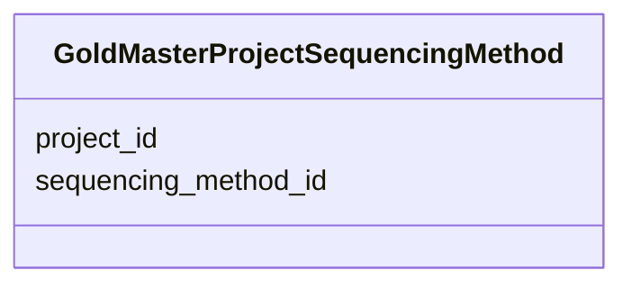

# Class: GoldMasterProjectSequencingMethod 


URI: [img_gold:GoldMasterProjectSequencingMethod](https://w3id.org/jgi/img_gold/GoldMasterProjectSequencingMethod)





<!-- no inheritance hierarchy -->


## Slots

| Name | Cardinality and Range | Description | Inheritance |
| ---  | --- | --- | --- |
| [project_id](project_id.md) | 0..1 <br/> [Float](Float.md) |  | direct |
| [sequencing_method_id](sequencing_method_id.md) | 0..1 <br/> [Float](Float.md) |  | direct |


## Identifier and Mapping Information


### Schema Source


* from schema: https://w3id.org/jgi/img_gold


## Mappings

| Mapping Type | Mapped Value |
| ---  | ---  |
| self | img_gold:GoldMasterProjectSequencingMethod |
| native | img_gold:GoldMasterProjectSequencingMethod |


## LinkML Source

<!-- TODO: investigate https://stackoverflow.com/questions/37606292/how-to-create-tabbed-code-blocks-in-mkdocs-or-sphinx -->

### Direct

<details>
```yaml
name: gold_master_project_sequencing_method
from_schema: https://w3id.org/jgi/img_gold
attributes:
  project_id:
    name: project_id
    from_schema: https://w3id.org/jgi/img_gold
    domain_of:
    - gold_master_hmp_project
    - gold_master_permission
    - gold_master_project
    - gold_master_project_analysis_project
    - gold_master_project_biosample
    - gold_master_project_collaborator
    - gold_master_project_genome_publication
    - gold_master_project_relevance
    - gold_master_project_sequencing_center
    - gold_master_project_sequencing_method
    - gold_master_sra_experiment
    - gold_sequencing_project
    range: float
    required: false
  sequencing_method_id:
    name: sequencing_method_id
    from_schema: https://w3id.org/jgi/img_gold
    rank: 1000
    domain_of:
    - gold_master_project_sequencing_method
    range: float
    required: false

```
</details>

### Induced

<details>
```yaml
name: gold_master_project_sequencing_method
from_schema: https://w3id.org/jgi/img_gold
attributes:
  project_id:
    name: project_id
    from_schema: https://w3id.org/jgi/img_gold
    alias: project_id
    owner: gold_master_project_sequencing_method
    domain_of:
    - gold_master_hmp_project
    - gold_master_permission
    - gold_master_project
    - gold_master_project_analysis_project
    - gold_master_project_biosample
    - gold_master_project_collaborator
    - gold_master_project_genome_publication
    - gold_master_project_relevance
    - gold_master_project_sequencing_center
    - gold_master_project_sequencing_method
    - gold_master_sra_experiment
    - gold_sequencing_project
    range: float
    required: false
  sequencing_method_id:
    name: sequencing_method_id
    from_schema: https://w3id.org/jgi/img_gold
    rank: 1000
    alias: sequencing_method_id
    owner: gold_master_project_sequencing_method
    domain_of:
    - gold_master_project_sequencing_method
    range: float
    required: false

```
</details>