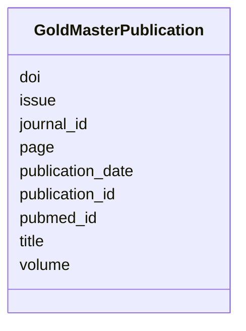

# Class: GoldMasterPublication 


URI: [img_gold:GoldMasterPublication](https://w3id.org/jgi/img_gold/GoldMasterPublication)





<!-- no inheritance hierarchy -->


## Slots

| Name | Cardinality and Range | Description | Inheritance |
| ---  | --- | --- | --- |
| [publication_id](publication_id.md) | 0..1 <br/> [Float](Float.md) |  | direct |
| [pubmed_id](pubmed_id.md) | 0..1 <br/> [Float](Float.md) |  | direct |
| [journal_id](journal_id.md) | 0..1 <br/> [Float](Float.md) |  | direct |
| [volume](volume.md) | 0..1 <br/> [String](String.md) |  | direct |
| [issue](issue.md) | 0..1 <br/> [String](String.md) |  | direct |
| [page](page.md) | 0..1 <br/> [String](String.md) |  | direct |
| [title](title.md) | 0..1 <br/> [String](String.md) |  | direct |
| [publication_date](publication_date.md) | 0..1 <br/> [Datetime](Datetime.md) |  | direct |
| [doi](doi.md) | 0..1 <br/> [String](String.md) |  | direct |


## Identifier and Mapping Information


### Schema Source


* from schema: https://w3id.org/jgi/img_gold


## Mappings

| Mapping Type | Mapped Value |
| ---  | ---  |
| self | img_gold:GoldMasterPublication |
| native | img_gold:GoldMasterPublication |


## LinkML Source

<!-- TODO: investigate https://stackoverflow.com/questions/37606292/how-to-create-tabbed-code-blocks-in-mkdocs-or-sphinx -->

### Direct

<details>
```yaml
name: gold_master_publication
from_schema: https://w3id.org/jgi/img_gold
attributes:
  publication_id:
    name: publication_id
    from_schema: https://w3id.org/jgi/img_gold
    domain_of:
    - gold_master_analysis_project_publication
    - gold_master_project_genome_publication
    - gold_master_publication
    range: float
    required: false
  pubmed_id:
    name: pubmed_id
    from_schema: https://w3id.org/jgi/img_gold
    domain_of:
    - gold_ap_publications
    - gold_master_publication
    - gold_sp_genome_publications
    range: float
    required: false
  journal_id:
    name: journal_id
    from_schema: https://w3id.org/jgi/img_gold
    domain_of:
    - gold_master_journal
    - gold_master_publication
    range: float
    required: false
  volume:
    name: volume
    from_schema: https://w3id.org/jgi/img_gold
    domain_of:
    - gold_ap_publications
    - gold_master_publication
    - gold_sp_genome_publications
    range: string
    required: false
  issue:
    name: issue
    from_schema: https://w3id.org/jgi/img_gold
    domain_of:
    - gold_ap_publications
    - gold_master_publication
    - gold_sp_genome_publications
    range: string
    required: false
  page:
    name: page
    from_schema: https://w3id.org/jgi/img_gold
    domain_of:
    - gold_ap_publications
    - gold_master_publication
    - gold_sp_genome_publications
    range: string
    required: false
  title:
    name: title
    from_schema: https://w3id.org/jgi/img_gold
    domain_of:
    - gold_ap_publications
    - gold_master_journal
    - gold_master_publication
    - gold_sp_genome_publications
    range: string
    required: false
  publication_date:
    name: publication_date
    from_schema: https://w3id.org/jgi/img_gold
    domain_of:
    - gold_ap_publications
    - gold_master_publication
    - gold_sp_genome_publications
    range: datetime
    required: false
  doi:
    name: doi
    from_schema: https://w3id.org/jgi/img_gold
    domain_of:
    - gold_ap_publications
    - gold_master_publication
    - gold_sp_genome_publications
    range: string
    required: false

```
</details>

### Induced

<details>
```yaml
name: gold_master_publication
from_schema: https://w3id.org/jgi/img_gold
attributes:
  publication_id:
    name: publication_id
    from_schema: https://w3id.org/jgi/img_gold
    alias: publication_id
    owner: gold_master_publication
    domain_of:
    - gold_master_analysis_project_publication
    - gold_master_project_genome_publication
    - gold_master_publication
    range: float
    required: false
  pubmed_id:
    name: pubmed_id
    from_schema: https://w3id.org/jgi/img_gold
    alias: pubmed_id
    owner: gold_master_publication
    domain_of:
    - gold_ap_publications
    - gold_master_publication
    - gold_sp_genome_publications
    range: float
    required: false
  journal_id:
    name: journal_id
    from_schema: https://w3id.org/jgi/img_gold
    alias: journal_id
    owner: gold_master_publication
    domain_of:
    - gold_master_journal
    - gold_master_publication
    range: float
    required: false
  volume:
    name: volume
    from_schema: https://w3id.org/jgi/img_gold
    alias: volume
    owner: gold_master_publication
    domain_of:
    - gold_ap_publications
    - gold_master_publication
    - gold_sp_genome_publications
    range: string
    required: false
  issue:
    name: issue
    from_schema: https://w3id.org/jgi/img_gold
    alias: issue
    owner: gold_master_publication
    domain_of:
    - gold_ap_publications
    - gold_master_publication
    - gold_sp_genome_publications
    range: string
    required: false
  page:
    name: page
    from_schema: https://w3id.org/jgi/img_gold
    alias: page
    owner: gold_master_publication
    domain_of:
    - gold_ap_publications
    - gold_master_publication
    - gold_sp_genome_publications
    range: string
    required: false
  title:
    name: title
    from_schema: https://w3id.org/jgi/img_gold
    alias: title
    owner: gold_master_publication
    domain_of:
    - gold_ap_publications
    - gold_master_journal
    - gold_master_publication
    - gold_sp_genome_publications
    range: string
    required: false
  publication_date:
    name: publication_date
    from_schema: https://w3id.org/jgi/img_gold
    alias: publication_date
    owner: gold_master_publication
    domain_of:
    - gold_ap_publications
    - gold_master_publication
    - gold_sp_genome_publications
    range: datetime
    required: false
  doi:
    name: doi
    from_schema: https://w3id.org/jgi/img_gold
    alias: doi
    owner: gold_master_publication
    domain_of:
    - gold_ap_publications
    - gold_master_publication
    - gold_sp_genome_publications
    range: string
    required: false

```
</details>