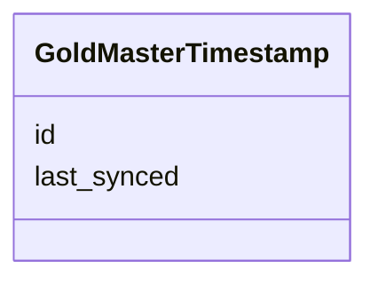

# Class: GoldMasterTimestamp 


URI: [img_gold:GoldMasterTimestamp](https://w3id.org/jgi/img_gold/GoldMasterTimestamp)





<!-- no inheritance hierarchy -->


## Slots

| Name | Cardinality and Range | Description | Inheritance |
| ---  | --- | --- | --- |
| [id](id.md) | 0..1 <br/> [Integer](Integer.md) |  | direct |
| [last_synced](last_synced.md) | 0..1 <br/> [Datetime](Datetime.md) |  | direct |


## Identifier and Mapping Information


### Schema Source


* from schema: https://w3id.org/jgi/img_gold


## Mappings

| Mapping Type | Mapped Value |
| ---  | ---  |
| self | img_gold:GoldMasterTimestamp |
| native | img_gold:GoldMasterTimestamp |


## LinkML Source

<!-- TODO: investigate https://stackoverflow.com/questions/37606292/how-to-create-tabbed-code-blocks-in-mkdocs-or-sphinx -->

### Direct

<details>
```yaml
name: gold_master_timestamp
from_schema: https://w3id.org/jgi/img_gold
attributes:
  id:
    name: id
    from_schema: https://w3id.org/jgi/img_gold
    domain_of:
    - gold_ap_genbank
    - gold_master_cvap_status
    - gold_master_cvbiotic_relationship
    - gold_master_cvcell_arrangement
    - gold_master_cvdisease
    - gold_master_cvenergy_source
    - gold_master_cvhabitat
    - gold_master_cvmetabolism
    - gold_master_cvphenotype
    - gold_master_cvrelevance
    - gold_master_cvseq_quality
    - gold_master_cvseq_status
    - gold_master_institution
    - gold_master_longhurst_code
    - gold_master_sequencing_method
    - gold_master_timestamp
    range: integer
    required: false
  last_synced:
    name: last_synced
    from_schema: https://w3id.org/jgi/img_gold
    rank: 1000
    domain_of:
    - gold_master_timestamp
    range: datetime
    required: false

```
</details>

### Induced

<details>
```yaml
name: gold_master_timestamp
from_schema: https://w3id.org/jgi/img_gold
attributes:
  id:
    name: id
    from_schema: https://w3id.org/jgi/img_gold
    alias: id
    owner: gold_master_timestamp
    domain_of:
    - gold_ap_genbank
    - gold_master_cvap_status
    - gold_master_cvbiotic_relationship
    - gold_master_cvcell_arrangement
    - gold_master_cvdisease
    - gold_master_cvenergy_source
    - gold_master_cvhabitat
    - gold_master_cvmetabolism
    - gold_master_cvphenotype
    - gold_master_cvrelevance
    - gold_master_cvseq_quality
    - gold_master_cvseq_status
    - gold_master_institution
    - gold_master_longhurst_code
    - gold_master_sequencing_method
    - gold_master_timestamp
    range: integer
    required: false
  last_synced:
    name: last_synced
    from_schema: https://w3id.org/jgi/img_gold
    rank: 1000
    alias: last_synced
    owner: gold_master_timestamp
    domain_of:
    - gold_master_timestamp
    range: datetime
    required: false

```
</details>