# Class: GoldSequencingProject 


URI: [img_gold:GoldSequencingProject](https://w3id.org/jgi/img_gold/GoldSequencingProject)

```mermaid
 classDiagram
    class GoldSequencingProject
    click GoldSequencingProject href "../GoldSequencingProject/"
      GoldSequencingProject : add_date
        
      GoldSequencingProject : altitude
        
      GoldSequencingProject : altitude_in_meters
        
      GoldSequencingProject : altitude_in_meters2
        
      GoldSequencingProject : bioproject_accession
        
      GoldSequencingProject : biosample_accession
        
      GoldSequencingProject : biosample_gold_id
        
      GoldSequencingProject : biotic_rel
        
      GoldSequencingProject : cell_shape
        
      GoldSequencingProject : chlorophyll_concentration
        
      GoldSequencingProject : clade
        
      GoldSequencingProject : comments
        
      GoldSequencingProject : contact_oid
        
      GoldSequencingProject : culture_type
        
      GoldSequencingProject : cultured
        
      GoldSequencingProject : date_collected
        
      GoldSequencingProject : depth
        
      GoldSequencingProject : depth_in_meters
        
      GoldSequencingProject : depth_in_meters2
        
      GoldSequencingProject : description
        
      GoldSequencingProject : display_name
        
      GoldSequencingProject : domain
        
      GoldSequencingProject : ecosystem
        
      GoldSequencingProject : ecosystem_category
        
      GoldSequencingProject : ecosystem_subtype
        
      GoldSequencingProject : ecosystem_type
        
      GoldSequencingProject : ecotype
        
      GoldSequencingProject : elevation_in_meters
        
      GoldSequencingProject : elevation_in_meters2
        
      GoldSequencingProject : funding_program
        
      GoldSequencingProject : funding_year
        
      GoldSequencingProject : genus
        
      GoldSequencingProject : geo_location
        
      GoldSequencingProject : gold_id
        
      GoldSequencingProject : gpts_proposal_id
        
      GoldSequencingProject : gram_stain
        
      GoldSequencingProject : hmp_id
        
      GoldSequencingProject : host_gender
        
      GoldSequencingProject : host_name
        
      GoldSequencingProject : host_ncbi_taxid
        
      GoldSequencingProject : img_taxon_oid
        
      GoldSequencingProject : iso_country
        
      GoldSequencingProject : isolation
        
      GoldSequencingProject : its_data_utilization_status
        
      GoldSequencingProject : its_proposal_id
        
      GoldSequencingProject : its_proposal_name
        
      GoldSequencingProject : its_spid
        
      GoldSequencingProject : latitude
        
      GoldSequencingProject : latitude_n
        
      GoldSequencingProject : legacy_project_type
        
      GoldSequencingProject : locus_tag
        
      GoldSequencingProject : longhurst_code
        
      GoldSequencingProject : longhurst_description
        
      GoldSequencingProject : longitude
        
      GoldSequencingProject : longitude_n
        
      GoldSequencingProject : mod_date
        
      GoldSequencingProject : modified_by
        
      GoldSequencingProject : motility
        
      GoldSequencingProject : mrn
        
      GoldSequencingProject : ncbi_class
        
      GoldSequencingProject : ncbi_family
        
      GoldSequencingProject : ncbi_genus
        
      GoldSequencingProject : ncbi_kingdom
        
      GoldSequencingProject : ncbi_order
        
      GoldSequencingProject : ncbi_phylum
        
      GoldSequencingProject : ncbi_project_id
        
      GoldSequencingProject : ncbi_species
        
      GoldSequencingProject : ncbi_taxon_id
        
      GoldSequencingProject : nitrate_concentration
        
      GoldSequencingProject : oxygen_concentration
        
      GoldSequencingProject : oxygen_req
        
      GoldSequencingProject : ph
        
      GoldSequencingProject : phylogeny
        
      GoldSequencingProject : pi_email
        
      GoldSequencingProject : pi_name
        
      GoldSequencingProject : pm_email
        
      GoldSequencingProject : pm_name
        
      GoldSequencingProject : pmo_project_id
        
      GoldSequencingProject : pressure
        
      GoldSequencingProject : project_id
        
      GoldSequencingProject : project_status
        
      GoldSequencingProject : proport_isolation
        
      GoldSequencingProject : proport_ocean
        
      GoldSequencingProject : proport_station
        
      GoldSequencingProject : proport_woa_dissolved_oxygen
        
      GoldSequencingProject : proport_woa_nitrate
        
      GoldSequencingProject : proport_woa_phosphate
        
      GoldSequencingProject : proport_woa_salinity
        
      GoldSequencingProject : proport_woa_silicate
        
      GoldSequencingProject : proport_woa_temperature
        
      GoldSequencingProject : replicate_num
        
      GoldSequencingProject : salinity
        
      GoldSequencingProject : salinity_concentration
        
      GoldSequencingProject : sample_body_site
        
      GoldSequencingProject : sample_body_subsite
        
      GoldSequencingProject : sample_collect_temp
        
      GoldSequencingProject : seq_quality
        
      GoldSequencingProject : seq_status
        
      GoldSequencingProject : sequencing_depth
        
      GoldSequencingProject : sequencing_quality
        
      GoldSequencingProject : sequencing_status
        
      GoldSequencingProject : sequencing_strategy
        
      GoldSequencingProject : species
        
      GoldSequencingProject : specific_ecosystem
        
      GoldSequencingProject : sporulation
        
      GoldSequencingProject : strain
        
      GoldSequencingProject : subsurface_depth_in_meters
        
      GoldSequencingProject : subsurface_depth_in_meters2
        
      GoldSequencingProject : temp_range
        
      GoldSequencingProject : type_strain
        
      GoldSequencingProject : uncultured_type
        
      GoldSequencingProject : viral_group
        
      GoldSequencingProject : viral_subgroup
        
      GoldSequencingProject : visit_num
        
      
```





<!-- no inheritance hierarchy -->


## Slots

| Name | Cardinality and Range | Description | Inheritance |
| ---  | --- | --- | --- |
| [gold_id](gold_id.md) | 0..1 <br/> [String](String.md) |  | direct |
| [display_name](display_name.md) | 0..1 <br/> [String](String.md) |  | direct |
| [strain](strain.md) | 0..1 <br/> [String](String.md) |  | direct |
| [phylogeny](phylogeny.md) | 0..1 <br/> [String](String.md) |  | direct |
| [ncbi_taxon_id](ncbi_taxon_id.md) | 0..1 <br/> [String](String.md) |  | direct |
| [domain](domain.md) | 0..1 <br/> [String](String.md) |  | direct |
| [ncbi_kingdom](ncbi_kingdom.md) | 0..1 <br/> [String](String.md) |  | direct |
| [ncbi_phylum](ncbi_phylum.md) | 0..1 <br/> [String](String.md) |  | direct |
| [ncbi_class](ncbi_class.md) | 0..1 <br/> [String](String.md) |  | direct |
| [ncbi_order](ncbi_order.md) | 0..1 <br/> [String](String.md) |  | direct |
| [ncbi_family](ncbi_family.md) | 0..1 <br/> [String](String.md) |  | direct |
| [ncbi_genus](ncbi_genus.md) | 0..1 <br/> [String](String.md) |  | direct |
| [ncbi_species](ncbi_species.md) | 0..1 <br/> [String](String.md) |  | direct |
| [clade](clade.md) | 0..1 <br/> [String](String.md) |  | direct |
| [ncbi_project_id](ncbi_project_id.md) | 0..1 <br/> [Integer](Integer.md) |  | direct |
| [isolation](isolation.md) | 0..1 <br/> [String](String.md) |  | direct |
| [oxygen_req](oxygen_req.md) | 0..1 <br/> [String](String.md) |  | direct |
| [cell_shape](cell_shape.md) | 0..1 <br/> [String](String.md) |  | direct |
| [motility](motility.md) | 0..1 <br/> [String](String.md) |  | direct |
| [sporulation](sporulation.md) | 0..1 <br/> [String](String.md) |  | direct |
| [temp_range](temp_range.md) | 0..1 <br/> [String](String.md) |  | direct |
| [salinity](salinity.md) | 0..1 <br/> [String](String.md) |  | direct |
| [comments](comments.md) | 0..1 <br/> [String](String.md) |  | direct |
| [seq_status](seq_status.md) | 0..1 <br/> [String](String.md) |  | direct |
| [img_taxon_oid](img_taxon_oid.md) | 0..1 <br/> [Integer](Integer.md) |  | direct |
| [add_date](add_date.md) | 0..1 <br/> [Datetime](Datetime.md) |  | direct |
| [mod_date](mod_date.md) | 0..1 <br/> [Datetime](Datetime.md) |  | direct |
| [modified_by](modified_by.md) | 0..1 <br/> [Integer](Integer.md) |  | direct |
| [contact_oid](contact_oid.md) | 0..1 <br/> [Integer](Integer.md) |  | direct |
| [iso_country](iso_country.md) | 0..1 <br/> [String](String.md) |  | direct |
| [date_collected](date_collected.md) | 0..1 <br/> [String](String.md) |  | direct |
| [geo_location](geo_location.md) | 0..1 <br/> [String](String.md) |  | direct |
| [latitude](latitude.md) | 0..1 <br/> [String](String.md) |  | direct |
| [longitude](longitude.md) | 0..1 <br/> [String](String.md) |  | direct |
| [altitude](altitude.md) | 0..1 <br/> [String](String.md) |  | direct |
| [gram_stain](gram_stain.md) | 0..1 <br/> [String](String.md) |  | direct |
| [host_name](host_name.md) | 0..1 <br/> [String](String.md) |  | direct |
| [host_gender](host_gender.md) | 0..1 <br/> [String](String.md) |  | direct |
| [host_ncbi_taxid](host_ncbi_taxid.md) | 0..1 <br/> [Integer](Integer.md) |  | direct |
| [biotic_rel](biotic_rel.md) | 0..1 <br/> [String](String.md) |  | direct |
| [hmp_id](hmp_id.md) | 0..1 <br/> [Integer](Integer.md) |  | direct |
| [locus_tag](locus_tag.md) | 0..1 <br/> [String](String.md) |  | direct |
| [funding_program](funding_program.md) | 0..1 <br/> [String](String.md) |  | direct |
| [type_strain](type_strain.md) | 0..1 <br/> [String](String.md) |  | direct |
| [ecosystem](ecosystem.md) | 0..1 <br/> [String](String.md) |  | direct |
| [ecosystem_category](ecosystem_category.md) | 0..1 <br/> [String](String.md) |  | direct |
| [ecosystem_type](ecosystem_type.md) | 0..1 <br/> [String](String.md) |  | direct |
| [ecosystem_subtype](ecosystem_subtype.md) | 0..1 <br/> [String](String.md) |  | direct |
| [specific_ecosystem](specific_ecosystem.md) | 0..1 <br/> [String](String.md) |  | direct |
| [sample_body_site](sample_body_site.md) | 0..1 <br/> [String](String.md) |  | direct |
| [sample_body_subsite](sample_body_subsite.md) | 0..1 <br/> [String](String.md) |  | direct |
| [mrn](mrn.md) | 0..1 <br/> [Integer](Integer.md) |  | direct |
| [visit_num](visit_num.md) | 0..1 <br/> [Integer](Integer.md) |  | direct |
| [replicate_num](replicate_num.md) | 0..1 <br/> [Integer](Integer.md) |  | direct |
| [pmo_project_id](pmo_project_id.md) | 0..1 <br/> [Integer](Integer.md) |  | direct |
| [project_id](project_id.md) | 0..1 <br/> [Integer](Integer.md) |  | direct |
| [cultured](cultured.md) | 0..1 <br/> [String](String.md) |  | direct |
| [uncultured_type](uncultured_type.md) | 0..1 <br/> [String](String.md) |  | direct |
| [culture_type](culture_type.md) | 0..1 <br/> [String](String.md) |  | direct |
| [bioproject_accession](bioproject_accession.md) | 0..1 <br/> [String](String.md) |  | direct |
| [biosample_accession](biosample_accession.md) | 0..1 <br/> [String](String.md) |  | direct |
| [its_spid](its_spid.md) | 0..1 <br/> [Integer](Integer.md) |  | direct |
| [pi_email](pi_email.md) | 0..1 <br/> [String](String.md) |  | direct |
| [pi_name](pi_name.md) | 0..1 <br/> [String](String.md) |  | direct |
| [legacy_project_type](legacy_project_type.md) | 0..1 <br/> [String](String.md) |  | direct |
| [seq_quality](seq_quality.md) | 0..1 <br/> [String](String.md) |  | direct |
| [depth](depth.md) | 0..1 <br/> [String](String.md) |  | direct |
| [sequencing_strategy](sequencing_strategy.md) | 0..1 <br/> [String](String.md) |  | direct |
| [pm_email](pm_email.md) | 0..1 <br/> [String](String.md) |  | direct |
| [pm_name](pm_name.md) | 0..1 <br/> [String](String.md) |  | direct |
| [ecotype](ecotype.md) | 0..1 <br/> [String](String.md) |  | direct |
| [longhurst_code](longhurst_code.md) | 0..1 <br/> [String](String.md) |  | direct |
| [longhurst_description](longhurst_description.md) | 0..1 <br/> [String](String.md) |  | direct |
| [project_status](project_status.md) | 0..1 <br/> [String](String.md) |  | direct |
| [sequencing_quality](sequencing_quality.md) | 0..1 <br/> [String](String.md) |  | direct |
| [sequencing_depth](sequencing_depth.md) | 0..1 <br/> [String](String.md) |  | direct |
| [genus](genus.md) | 0..1 <br/> [String](String.md) |  | direct |
| [species](species.md) | 0..1 <br/> [String](String.md) |  | direct |
| [proport_ocean](proport_ocean.md) | 0..1 <br/> [String](String.md) |  | direct |
| [proport_isolation](proport_isolation.md) | 0..1 <br/> [String](String.md) |  | direct |
| [proport_station](proport_station.md) | 0..1 <br/> [String](String.md) |  | direct |
| [proport_woa_temperature](proport_woa_temperature.md) | 0..1 <br/> [Float](Float.md) |  | direct |
| [proport_woa_salinity](proport_woa_salinity.md) | 0..1 <br/> [Float](Float.md) |  | direct |
| [proport_woa_dissolved_oxygen](proport_woa_dissolved_oxygen.md) | 0..1 <br/> [Float](Float.md) |  | direct |
| [proport_woa_silicate](proport_woa_silicate.md) | 0..1 <br/> [Float](Float.md) |  | direct |
| [proport_woa_phosphate](proport_woa_phosphate.md) | 0..1 <br/> [Float](Float.md) |  | direct |
| [proport_woa_nitrate](proport_woa_nitrate.md) | 0..1 <br/> [Float](Float.md) |  | direct |
| [viral_group](viral_group.md) | 0..1 <br/> [String](String.md) |  | direct |
| [viral_subgroup](viral_subgroup.md) | 0..1 <br/> [String](String.md) |  | direct |
| [gpts_proposal_id](gpts_proposal_id.md) | 0..1 <br/> [Integer](Integer.md) |  | direct |
| [its_proposal_id](its_proposal_id.md) | 0..1 <br/> [Integer](Integer.md) |  | direct |
| [sample_collect_temp](sample_collect_temp.md) | 0..1 <br/> [String](String.md) |  | direct |
| [pressure](pressure.md) | 0..1 <br/> [String](String.md) |  | direct |
| [chlorophyll_concentration](chlorophyll_concentration.md) | 0..1 <br/> [String](String.md) |  | direct |
| [oxygen_concentration](oxygen_concentration.md) | 0..1 <br/> [String](String.md) |  | direct |
| [salinity_concentration](salinity_concentration.md) | 0..1 <br/> [String](String.md) |  | direct |
| [nitrate_concentration](nitrate_concentration.md) | 0..1 <br/> [String](String.md) |  | direct |
| [ph](ph.md) | 0..1 <br/> [String](String.md) |  | direct |
| [sequencing_status](sequencing_status.md) | 0..1 <br/> [String](String.md) |  | direct |
| [funding_year](funding_year.md) | 0..1 <br/> [Integer](Integer.md) |  | direct |
| [latitude_n](latitude_n.md) | 0..1 <br/> [Float](Float.md) |  | direct |
| [longitude_n](longitude_n.md) | 0..1 <br/> [Float](Float.md) |  | direct |
| [altitude_in_meters](altitude_in_meters.md) | 0..1 <br/> [Float](Float.md) |  | direct |
| [altitude_in_meters2](altitude_in_meters2.md) | 0..1 <br/> [Float](Float.md) |  | direct |
| [depth_in_meters](depth_in_meters.md) | 0..1 <br/> [Float](Float.md) |  | direct |
| [depth_in_meters2](depth_in_meters2.md) | 0..1 <br/> [Float](Float.md) |  | direct |
| [elevation_in_meters](elevation_in_meters.md) | 0..1 <br/> [Float](Float.md) |  | direct |
| [elevation_in_meters2](elevation_in_meters2.md) | 0..1 <br/> [Float](Float.md) |  | direct |
| [subsurface_depth_in_meters](subsurface_depth_in_meters.md) | 0..1 <br/> [Float](Float.md) |  | direct |
| [subsurface_depth_in_meters2](subsurface_depth_in_meters2.md) | 0..1 <br/> [Float](Float.md) |  | direct |
| [its_data_utilization_status](its_data_utilization_status.md) | 0..1 <br/> [String](String.md) |  | direct |
| [its_proposal_name](its_proposal_name.md) | 0..1 <br/> [String](String.md) |  | direct |
| [biosample_gold_id](biosample_gold_id.md) | 0..1 <br/> [String](String.md) |  | direct |
| [description](description.md) | 0..1 <br/> [String](String.md) |  | direct |


## Usages

| used by | used in | type | used |
| ---  | --- | --- | --- |
| [GoldSpCellArrangement](GoldSpCellArrangement.md) | [gold_id](gold_id.md) | range | [GoldSequencingProject](GoldSequencingProject.md) |
| [GoldSpCollaborator](GoldSpCollaborator.md) | [gold_id](gold_id.md) | range | [GoldSequencingProject](GoldSequencingProject.md) |
| [GoldSpDisease](GoldSpDisease.md) | [gold_id](gold_id.md) | range | [GoldSequencingProject](GoldSequencingProject.md) |
| [GoldSpEnergySource](GoldSpEnergySource.md) | [gold_id](gold_id.md) | range | [GoldSequencingProject](GoldSequencingProject.md) |
| [GoldSpGenomePublications](GoldSpGenomePublications.md) | [gold_id](gold_id.md) | range | [GoldSequencingProject](GoldSequencingProject.md) |
| [GoldSpHabitat](GoldSpHabitat.md) | [gold_id](gold_id.md) | range | [GoldSequencingProject](GoldSequencingProject.md) |
| [GoldSpMetabolism](GoldSpMetabolism.md) | [gold_id](gold_id.md) | range | [GoldSequencingProject](GoldSequencingProject.md) |
| [GoldSpPhenotype](GoldSpPhenotype.md) | [gold_id](gold_id.md) | range | [GoldSequencingProject](GoldSequencingProject.md) |
| [GoldSpRelevance](GoldSpRelevance.md) | [gold_id](gold_id.md) | range | [GoldSequencingProject](GoldSequencingProject.md) |
| [GoldSpSeqCenter](GoldSpSeqCenter.md) | [gold_id](gold_id.md) | range | [GoldSequencingProject](GoldSequencingProject.md) |
| [GoldSpSeqMethod](GoldSpSeqMethod.md) | [gold_id](gold_id.md) | range | [GoldSequencingProject](GoldSequencingProject.md) |
| [GoldSpStudyGoldId](GoldSpStudyGoldId.md) | [gold_id](gold_id.md) | range | [GoldSequencingProject](GoldSequencingProject.md) |


## Identifier and Mapping Information


### Schema Source


* from schema: https://w3id.org/jgi/img_gold


## Mappings

| Mapping Type | Mapped Value |
| ---  | ---  |
| self | img_gold:GoldSequencingProject |
| native | img_gold:GoldSequencingProject |


## LinkML Source

<!-- TODO: investigate https://stackoverflow.com/questions/37606292/how-to-create-tabbed-code-blocks-in-mkdocs-or-sphinx -->

### Direct

<details>
```yaml
name: gold_sequencing_project
from_schema: https://w3id.org/jgi/img_gold
attributes:
  gold_id:
    name: gold_id
    from_schema: https://w3id.org/jgi/img_gold
    domain_of:
    - gold_analysis_project
    - gold_analysis_project_genbanks
    - gold_analysis_project_jgi_award_dois
    - gold_analysis_project_lookup2
    - gold_analysis_project_sra_runs
    - gold_analysis_project_users
    - gold_ap_genbank_anomalous_reasons
    - gold_ap_publications
    - gold_master_analysis_project
    - gold_master_biosample
    - gold_master_organism
    - gold_master_project
    - gold_master_study
    - gold_sequencing_project
    - gold_sp_cell_arrangement
    - gold_sp_collaborator
    - gold_sp_disease
    - gold_sp_energy_source
    - gold_sp_genome_publications
    - gold_sp_habitat
    - gold_sp_metabolism
    - gold_sp_phenotype
    - gold_sp_relevance
    - gold_sp_seq_center
    - gold_sp_seq_method
    - gold_sp_sra
    - gold_sp_study_gold_id
    - gold_study
    range: string
    required: false
  display_name:
    name: display_name
    from_schema: https://w3id.org/jgi/img_gold
    rank: 1000
    domain_of:
    - gold_sequencing_project
    range: string
    required: false
  strain:
    name: strain
    from_schema: https://w3id.org/jgi/img_gold
    domain_of:
    - gold_analysis_project
    - gold_master_organism
    - gold_sequencing_project
    range: string
    required: false
  phylogeny:
    name: phylogeny
    from_schema: https://w3id.org/jgi/img_gold
    rank: 1000
    domain_of:
    - gold_sequencing_project
    range: string
    required: false
  ncbi_taxon_id:
    name: ncbi_taxon_id
    from_schema: https://w3id.org/jgi/img_gold
    rank: 1000
    domain_of:
    - gold_sequencing_project
    range: string
    required: false
  domain:
    name: domain
    from_schema: https://w3id.org/jgi/img_gold
    domain_of:
    - gold_analysis_project
    - gold_master_organism
    - gold_sequencing_project
    range: string
    required: false
  ncbi_kingdom:
    name: ncbi_kingdom
    from_schema: https://w3id.org/jgi/img_gold
    domain_of:
    - gold_master_organism
    - gold_sequencing_project
    range: string
    required: false
  ncbi_phylum:
    name: ncbi_phylum
    from_schema: https://w3id.org/jgi/img_gold
    domain_of:
    - gold_analysis_project
    - gold_master_organism
    - gold_sequencing_project
    range: string
    required: false
  ncbi_class:
    name: ncbi_class
    from_schema: https://w3id.org/jgi/img_gold
    domain_of:
    - gold_analysis_project
    - gold_master_organism
    - gold_sequencing_project
    range: string
    required: false
  ncbi_order:
    name: ncbi_order
    from_schema: https://w3id.org/jgi/img_gold
    domain_of:
    - gold_analysis_project
    - gold_master_organism
    - gold_sequencing_project
    range: string
    required: false
  ncbi_family:
    name: ncbi_family
    from_schema: https://w3id.org/jgi/img_gold
    domain_of:
    - gold_analysis_project
    - gold_master_organism
    - gold_sequencing_project
    range: string
    required: false
  ncbi_genus:
    name: ncbi_genus
    from_schema: https://w3id.org/jgi/img_gold
    domain_of:
    - gold_analysis_project
    - gold_master_organism
    - gold_sequencing_project
    range: string
    required: false
  ncbi_species:
    name: ncbi_species
    from_schema: https://w3id.org/jgi/img_gold
    domain_of:
    - gold_analysis_project
    - gold_master_organism
    - gold_sequencing_project
    range: string
    required: false
  clade:
    name: clade
    from_schema: https://w3id.org/jgi/img_gold
    domain_of:
    - gold_master_organism
    - gold_sequencing_project
    range: string
    required: false
  ncbi_project_id:
    name: ncbi_project_id
    from_schema: https://w3id.org/jgi/img_gold
    rank: 1000
    domain_of:
    - gold_sequencing_project
    range: integer
    required: false
  isolation:
    name: isolation
    from_schema: https://w3id.org/jgi/img_gold
    rank: 1000
    domain_of:
    - gold_sequencing_project
    range: string
    required: false
  oxygen_req:
    name: oxygen_req
    from_schema: https://w3id.org/jgi/img_gold
    rank: 1000
    domain_of:
    - gold_sequencing_project
    range: string
    required: false
  cell_shape:
    name: cell_shape
    from_schema: https://w3id.org/jgi/img_gold
    domain_of:
    - gold_master_organism
    - gold_sequencing_project
    range: string
    required: false
  motility:
    name: motility
    from_schema: https://w3id.org/jgi/img_gold
    domain_of:
    - gold_master_organism
    - gold_sequencing_project
    range: string
    required: false
  sporulation:
    name: sporulation
    from_schema: https://w3id.org/jgi/img_gold
    domain_of:
    - gold_master_organism
    - gold_sequencing_project
    range: string
    required: false
  temp_range:
    name: temp_range
    from_schema: https://w3id.org/jgi/img_gold
    rank: 1000
    domain_of:
    - gold_sequencing_project
    range: string
    required: false
  salinity:
    name: salinity
    from_schema: https://w3id.org/jgi/img_gold
    domain_of:
    - gold_master_organism
    - gold_sequencing_project
    range: string
    required: false
  comments:
    name: comments
    from_schema: https://w3id.org/jgi/img_gold
    domain_of:
    - gold_analysis_project
    - gold_master_analysis_project
    - gold_sequencing_project
    range: string
    required: false
  seq_status:
    name: seq_status
    from_schema: https://w3id.org/jgi/img_gold
    rank: 1000
    domain_of:
    - gold_sequencing_project
    range: string
    required: false
  img_taxon_oid:
    name: img_taxon_oid
    from_schema: https://w3id.org/jgi/img_gold
    rank: 1000
    domain_of:
    - gold_sequencing_project
    range: integer
    required: false
  add_date:
    name: add_date
    from_schema: https://w3id.org/jgi/img_gold
    domain_of:
    - gold_master_project
    - gold_master_study
    - gold_sequencing_project
    range: datetime
    required: false
  mod_date:
    name: mod_date
    from_schema: https://w3id.org/jgi/img_gold
    domain_of:
    - gold_analysis_project
    - gold_master_analysis_project
    - gold_master_project
    - gold_master_study
    - gold_sequencing_project
    - gold_study
    range: datetime
    required: false
  modified_by:
    name: modified_by
    from_schema: https://w3id.org/jgi/img_gold
    rank: 1000
    domain_of:
    - gold_sequencing_project
    range: integer
    required: false
  contact_oid:
    name: contact_oid
    from_schema: https://w3id.org/jgi/img_gold
    rank: 1000
    domain_of:
    - gold_sequencing_project
    - gold_study
    range: integer
    required: false
  iso_country:
    name: iso_country
    from_schema: https://w3id.org/jgi/img_gold
    rank: 1000
    domain_of:
    - gold_sequencing_project
    range: string
    required: false
  date_collected:
    name: date_collected
    from_schema: https://w3id.org/jgi/img_gold
    rank: 1000
    domain_of:
    - gold_sequencing_project
    range: string
    required: false
  geo_location:
    name: geo_location
    from_schema: https://w3id.org/jgi/img_gold
    rank: 1000
    domain_of:
    - gold_sequencing_project
    range: string
    required: false
  latitude:
    name: latitude
    from_schema: https://w3id.org/jgi/img_gold
    domain_of:
    - gold_master_biosample
    - gold_master_organism
    - gold_sequencing_project
    range: string
    required: false
  longitude:
    name: longitude
    from_schema: https://w3id.org/jgi/img_gold
    domain_of:
    - gold_master_biosample
    - gold_master_organism
    - gold_sequencing_project
    range: string
    required: false
  altitude:
    name: altitude
    from_schema: https://w3id.org/jgi/img_gold
    domain_of:
    - gold_master_biosample
    - gold_master_organism
    - gold_sequencing_project
    range: string
    required: false
  gram_stain:
    name: gram_stain
    from_schema: https://w3id.org/jgi/img_gold
    domain_of:
    - gold_master_organism
    - gold_sequencing_project
    range: string
    required: false
  host_name:
    name: host_name
    from_schema: https://w3id.org/jgi/img_gold
    domain_of:
    - gold_master_biosample
    - gold_master_organism
    - gold_sequencing_project
    range: string
    required: false
  host_gender:
    name: host_gender
    from_schema: https://w3id.org/jgi/img_gold
    domain_of:
    - gold_master_biosample
    - gold_sequencing_project
    range: string
    required: false
  host_ncbi_taxid:
    name: host_ncbi_taxid
    from_schema: https://w3id.org/jgi/img_gold
    rank: 1000
    domain_of:
    - gold_sequencing_project
    range: integer
    required: false
  biotic_rel:
    name: biotic_rel
    from_schema: https://w3id.org/jgi/img_gold
    rank: 1000
    domain_of:
    - gold_sequencing_project
    range: string
    required: false
  hmp_id:
    name: hmp_id
    from_schema: https://w3id.org/jgi/img_gold
    domain_of:
    - gold_master_hmp_project
    - gold_sequencing_project
    range: integer
    required: false
  locus_tag:
    name: locus_tag
    from_schema: https://w3id.org/jgi/img_gold
    domain_of:
    - gold_analysis_project
    - gold_sequencing_project
    range: string
    required: false
  funding_program:
    name: funding_program
    from_schema: https://w3id.org/jgi/img_gold
    domain_of:
    - gold_master_project
    - gold_sequencing_project
    range: string
    required: false
  type_strain:
    name: type_strain
    from_schema: https://w3id.org/jgi/img_gold
    domain_of:
    - gold_master_organism
    - gold_sequencing_project
    range: string
    required: false
  ecosystem:
    name: ecosystem
    from_schema: https://w3id.org/jgi/img_gold
    domain_of:
    - gold_analysis_project
    - gold_master_analysis_project
    - gold_master_biosample
    - gold_master_organism
    - gold_master_study
    - gold_sequencing_project
    - gold_study
    range: string
    required: false
  ecosystem_category:
    name: ecosystem_category
    from_schema: https://w3id.org/jgi/img_gold
    domain_of:
    - gold_analysis_project
    - gold_master_analysis_project
    - gold_master_biosample
    - gold_master_organism
    - gold_master_study
    - gold_sequencing_project
    - gold_study
    range: string
    required: false
  ecosystem_type:
    name: ecosystem_type
    from_schema: https://w3id.org/jgi/img_gold
    domain_of:
    - gold_analysis_project
    - gold_master_analysis_project
    - gold_master_biosample
    - gold_master_organism
    - gold_master_study
    - gold_sequencing_project
    - gold_study
    range: string
    required: false
  ecosystem_subtype:
    name: ecosystem_subtype
    from_schema: https://w3id.org/jgi/img_gold
    domain_of:
    - gold_analysis_project
    - gold_master_analysis_project
    - gold_master_biosample
    - gold_master_organism
    - gold_master_study
    - gold_sequencing_project
    - gold_study
    range: string
    required: false
  specific_ecosystem:
    name: specific_ecosystem
    from_schema: https://w3id.org/jgi/img_gold
    domain_of:
    - gold_analysis_project
    - gold_master_analysis_project
    - gold_master_biosample
    - gold_master_organism
    - gold_master_study
    - gold_sequencing_project
    - gold_study
    range: string
    required: false
  sample_body_site:
    name: sample_body_site
    from_schema: https://w3id.org/jgi/img_gold
    rank: 1000
    domain_of:
    - gold_sequencing_project
    range: string
    required: false
  sample_body_subsite:
    name: sample_body_subsite
    from_schema: https://w3id.org/jgi/img_gold
    rank: 1000
    domain_of:
    - gold_sequencing_project
    range: string
    required: false
  mrn:
    name: mrn
    from_schema: https://w3id.org/jgi/img_gold
    domain_of:
    - gold_master_biosample
    - gold_sequencing_project
    range: integer
    required: false
  visit_num:
    name: visit_num
    from_schema: https://w3id.org/jgi/img_gold
    rank: 1000
    domain_of:
    - gold_sequencing_project
    range: integer
    required: false
  replicate_num:
    name: replicate_num
    from_schema: https://w3id.org/jgi/img_gold
    rank: 1000
    domain_of:
    - gold_sequencing_project
    range: integer
    required: false
  pmo_project_id:
    name: pmo_project_id
    from_schema: https://w3id.org/jgi/img_gold
    domain_of:
    - gold_analysis_project_lookup2
    - gold_master_project
    - gold_sequencing_project
    range: integer
    required: false
  project_id:
    name: project_id
    from_schema: https://w3id.org/jgi/img_gold
    domain_of:
    - gold_master_hmp_project
    - gold_master_permission
    - gold_master_project
    - gold_master_project_analysis_project
    - gold_master_project_biosample
    - gold_master_project_collaborator
    - gold_master_project_genome_publication
    - gold_master_project_relevance
    - gold_master_project_sequencing_center
    - gold_master_project_sequencing_method
    - gold_master_sra_experiment
    - gold_sequencing_project
    range: integer
    required: false
  cultured:
    name: cultured
    from_schema: https://w3id.org/jgi/img_gold
    domain_of:
    - gold_analysis_project
    - gold_master_organism
    - gold_sequencing_project
    range: string
    required: false
  uncultured_type:
    name: uncultured_type
    from_schema: https://w3id.org/jgi/img_gold
    domain_of:
    - gold_analysis_project
    - gold_master_organism
    - gold_sequencing_project
    range: string
    required: false
  culture_type:
    name: culture_type
    from_schema: https://w3id.org/jgi/img_gold
    domain_of:
    - gold_analysis_project
    - gold_master_organism
    - gold_sequencing_project
    range: string
    required: false
  bioproject_accession:
    name: bioproject_accession
    from_schema: https://w3id.org/jgi/img_gold
    rank: 1000
    domain_of:
    - gold_sequencing_project
    range: string
    required: false
  biosample_accession:
    name: biosample_accession
    from_schema: https://w3id.org/jgi/img_gold
    rank: 1000
    domain_of:
    - gold_sequencing_project
    range: string
    required: false
  its_spid:
    name: its_spid
    from_schema: https://w3id.org/jgi/img_gold
    domain_of:
    - gold_analysis_project_lookup2
    - gold_master_project
    - gold_sequencing_project
    range: integer
    required: false
  pi_email:
    name: pi_email
    from_schema: https://w3id.org/jgi/img_gold
    domain_of:
    - gold_analysis_project
    - gold_sequencing_project
    range: string
    required: false
  pi_name:
    name: pi_name
    from_schema: https://w3id.org/jgi/img_gold
    domain_of:
    - gold_analysis_project
    - gold_sequencing_project
    range: string
    required: false
  legacy_project_type:
    name: legacy_project_type
    from_schema: https://w3id.org/jgi/img_gold
    rank: 1000
    domain_of:
    - gold_sequencing_project
    range: string
    required: false
  seq_quality:
    name: seq_quality
    from_schema: https://w3id.org/jgi/img_gold
    rank: 1000
    domain_of:
    - gold_sequencing_project
    range: string
    required: false
  depth:
    name: depth
    from_schema: https://w3id.org/jgi/img_gold
    domain_of:
    - gold_master_biosample
    - gold_master_organism
    - gold_sequencing_project
    range: string
    required: false
  sequencing_strategy:
    name: sequencing_strategy
    from_schema: https://w3id.org/jgi/img_gold
    domain_of:
    - gold_master_project
    - gold_sequencing_project
    range: string
    required: false
  pm_email:
    name: pm_email
    from_schema: https://w3id.org/jgi/img_gold
    rank: 1000
    domain_of:
    - gold_sequencing_project
    range: string
    required: false
  pm_name:
    name: pm_name
    from_schema: https://w3id.org/jgi/img_gold
    rank: 1000
    domain_of:
    - gold_sequencing_project
    range: string
    required: false
  ecotype:
    name: ecotype
    from_schema: https://w3id.org/jgi/img_gold
    domain_of:
    - gold_master_organism
    - gold_sequencing_project
    range: string
    required: false
  longhurst_code:
    name: longhurst_code
    from_schema: https://w3id.org/jgi/img_gold
    domain_of:
    - gold_master_biosample
    - gold_sequencing_project
    range: string
    required: false
  longhurst_description:
    name: longhurst_description
    from_schema: https://w3id.org/jgi/img_gold
    rank: 1000
    domain_of:
    - gold_sequencing_project
    range: string
    required: false
  project_status:
    name: project_status
    from_schema: https://w3id.org/jgi/img_gold
    domain_of:
    - gold_master_project
    - gold_sequencing_project
    range: string
    required: false
  sequencing_quality:
    name: sequencing_quality
    from_schema: https://w3id.org/jgi/img_gold
    rank: 1000
    domain_of:
    - gold_sequencing_project
    range: string
    required: false
  sequencing_depth:
    name: sequencing_depth
    from_schema: https://w3id.org/jgi/img_gold
    domain_of:
    - gold_analysis_project
    - gold_master_analysis_project
    - gold_sequencing_project
    range: string
    required: false
  genus:
    name: genus
    from_schema: https://w3id.org/jgi/img_gold
    domain_of:
    - gold_analysis_project
    - gold_master_organism
    - gold_sequencing_project
    range: string
    required: false
  species:
    name: species
    from_schema: https://w3id.org/jgi/img_gold
    domain_of:
    - gold_analysis_project
    - gold_master_organism
    - gold_sequencing_project
    range: string
    required: false
  proport_ocean:
    name: proport_ocean
    from_schema: https://w3id.org/jgi/img_gold
    domain_of:
    - gold_master_biosample
    - gold_master_organism
    - gold_sequencing_project
    range: string
    required: false
  proport_isolation:
    name: proport_isolation
    from_schema: https://w3id.org/jgi/img_gold
    domain_of:
    - gold_master_biosample
    - gold_master_organism
    - gold_sequencing_project
    range: string
    required: false
  proport_station:
    name: proport_station
    from_schema: https://w3id.org/jgi/img_gold
    domain_of:
    - gold_master_biosample
    - gold_master_organism
    - gold_sequencing_project
    range: string
    required: false
  proport_woa_temperature:
    name: proport_woa_temperature
    from_schema: https://w3id.org/jgi/img_gold
    domain_of:
    - gold_master_biosample
    - gold_master_organism
    - gold_sequencing_project
    range: float
    required: false
  proport_woa_salinity:
    name: proport_woa_salinity
    from_schema: https://w3id.org/jgi/img_gold
    domain_of:
    - gold_master_biosample
    - gold_master_organism
    - gold_sequencing_project
    range: float
    required: false
  proport_woa_dissolved_oxygen:
    name: proport_woa_dissolved_oxygen
    from_schema: https://w3id.org/jgi/img_gold
    domain_of:
    - gold_master_biosample
    - gold_master_organism
    - gold_sequencing_project
    range: float
    required: false
  proport_woa_silicate:
    name: proport_woa_silicate
    from_schema: https://w3id.org/jgi/img_gold
    domain_of:
    - gold_master_biosample
    - gold_master_organism
    - gold_sequencing_project
    range: float
    required: false
  proport_woa_phosphate:
    name: proport_woa_phosphate
    from_schema: https://w3id.org/jgi/img_gold
    domain_of:
    - gold_master_biosample
    - gold_master_organism
    - gold_sequencing_project
    range: float
    required: false
  proport_woa_nitrate:
    name: proport_woa_nitrate
    from_schema: https://w3id.org/jgi/img_gold
    domain_of:
    - gold_master_biosample
    - gold_master_organism
    - gold_sequencing_project
    range: float
    required: false
  viral_group:
    name: viral_group
    from_schema: https://w3id.org/jgi/img_gold
    domain_of:
    - gold_master_organism
    - gold_sequencing_project
    range: string
    required: false
  viral_subgroup:
    name: viral_subgroup
    from_schema: https://w3id.org/jgi/img_gold
    domain_of:
    - gold_master_organism
    - gold_sequencing_project
    range: string
    required: false
  gpts_proposal_id:
    name: gpts_proposal_id
    from_schema: https://w3id.org/jgi/img_gold
    domain_of:
    - gold_master_project
    - gold_sequencing_project
    range: integer
    required: false
  its_proposal_id:
    name: its_proposal_id
    from_schema: https://w3id.org/jgi/img_gold
    domain_of:
    - gold_master_its_proposal
    - gold_master_project
    - gold_sequencing_project
    range: integer
    required: false
  sample_collect_temp:
    name: sample_collect_temp
    from_schema: https://w3id.org/jgi/img_gold
    rank: 1000
    domain_of:
    - gold_sequencing_project
    range: string
    required: false
  pressure:
    name: pressure
    from_schema: https://w3id.org/jgi/img_gold
    domain_of:
    - gold_master_biosample
    - gold_master_organism
    - gold_sequencing_project
    range: string
    required: false
  chlorophyll_concentration:
    name: chlorophyll_concentration
    from_schema: https://w3id.org/jgi/img_gold
    domain_of:
    - gold_master_biosample
    - gold_master_organism
    - gold_sequencing_project
    range: string
    required: false
  oxygen_concentration:
    name: oxygen_concentration
    from_schema: https://w3id.org/jgi/img_gold
    domain_of:
    - gold_master_biosample
    - gold_master_organism
    - gold_sequencing_project
    range: string
    required: false
  salinity_concentration:
    name: salinity_concentration
    from_schema: https://w3id.org/jgi/img_gold
    domain_of:
    - gold_master_biosample
    - gold_master_organism
    - gold_sequencing_project
    range: string
    required: false
  nitrate_concentration:
    name: nitrate_concentration
    from_schema: https://w3id.org/jgi/img_gold
    domain_of:
    - gold_master_biosample
    - gold_master_organism
    - gold_sequencing_project
    range: string
    required: false
  ph:
    name: ph
    from_schema: https://w3id.org/jgi/img_gold
    rank: 1000
    domain_of:
    - gold_sequencing_project
    range: string
    required: false
  sequencing_status:
    name: sequencing_status
    from_schema: https://w3id.org/jgi/img_gold
    rank: 1000
    domain_of:
    - gold_sequencing_project
    range: string
    required: false
  funding_year:
    name: funding_year
    from_schema: https://w3id.org/jgi/img_gold
    domain_of:
    - gold_master_project
    - gold_sequencing_project
    range: integer
    required: false
  latitude_n:
    name: latitude_n
    from_schema: https://w3id.org/jgi/img_gold
    rank: 1000
    domain_of:
    - gold_sequencing_project
    range: float
    required: false
  longitude_n:
    name: longitude_n
    from_schema: https://w3id.org/jgi/img_gold
    rank: 1000
    domain_of:
    - gold_sequencing_project
    range: float
    required: false
  altitude_in_meters:
    name: altitude_in_meters
    from_schema: https://w3id.org/jgi/img_gold
    rank: 1000
    domain_of:
    - gold_sequencing_project
    range: float
    required: false
  altitude_in_meters2:
    name: altitude_in_meters2
    from_schema: https://w3id.org/jgi/img_gold
    rank: 1000
    domain_of:
    - gold_sequencing_project
    range: float
    required: false
  depth_in_meters:
    name: depth_in_meters
    from_schema: https://w3id.org/jgi/img_gold
    rank: 1000
    domain_of:
    - gold_sequencing_project
    range: float
    required: false
  depth_in_meters2:
    name: depth_in_meters2
    from_schema: https://w3id.org/jgi/img_gold
    rank: 1000
    domain_of:
    - gold_sequencing_project
    range: float
    required: false
  elevation_in_meters:
    name: elevation_in_meters
    from_schema: https://w3id.org/jgi/img_gold
    rank: 1000
    domain_of:
    - gold_sequencing_project
    range: float
    required: false
  elevation_in_meters2:
    name: elevation_in_meters2
    from_schema: https://w3id.org/jgi/img_gold
    rank: 1000
    domain_of:
    - gold_sequencing_project
    range: float
    required: false
  subsurface_depth_in_meters:
    name: subsurface_depth_in_meters
    from_schema: https://w3id.org/jgi/img_gold
    rank: 1000
    domain_of:
    - gold_sequencing_project
    range: float
    required: false
  subsurface_depth_in_meters2:
    name: subsurface_depth_in_meters2
    from_schema: https://w3id.org/jgi/img_gold
    rank: 1000
    domain_of:
    - gold_sequencing_project
    range: float
    required: false
  its_data_utilization_status:
    name: its_data_utilization_status
    from_schema: https://w3id.org/jgi/img_gold
    domain_of:
    - gold_analysis_project
    - gold_master_project
    - gold_sequencing_project
    range: string
    required: false
  its_proposal_name:
    name: its_proposal_name
    from_schema: https://w3id.org/jgi/img_gold
    rank: 1000
    domain_of:
    - gold_sequencing_project
    range: string
    required: false
  biosample_gold_id:
    name: biosample_gold_id
    from_schema: https://w3id.org/jgi/img_gold
    rank: 1000
    domain_of:
    - gold_sequencing_project
    range: string
    required: false
  description:
    name: description
    from_schema: https://w3id.org/jgi/img_gold
    domain_of:
    - gold_master_longhurst_code
    - gold_master_project
    - gold_sequencing_project
    range: string
    required: false

```
</details>

### Induced

<details>
```yaml
name: gold_sequencing_project
from_schema: https://w3id.org/jgi/img_gold
attributes:
  gold_id:
    name: gold_id
    from_schema: https://w3id.org/jgi/img_gold
    alias: gold_id
    owner: gold_sequencing_project
    domain_of:
    - gold_analysis_project
    - gold_analysis_project_genbanks
    - gold_analysis_project_jgi_award_dois
    - gold_analysis_project_lookup2
    - gold_analysis_project_sra_runs
    - gold_analysis_project_users
    - gold_ap_genbank_anomalous_reasons
    - gold_ap_publications
    - gold_master_analysis_project
    - gold_master_biosample
    - gold_master_organism
    - gold_master_project
    - gold_master_study
    - gold_sequencing_project
    - gold_sp_cell_arrangement
    - gold_sp_collaborator
    - gold_sp_disease
    - gold_sp_energy_source
    - gold_sp_genome_publications
    - gold_sp_habitat
    - gold_sp_metabolism
    - gold_sp_phenotype
    - gold_sp_relevance
    - gold_sp_seq_center
    - gold_sp_seq_method
    - gold_sp_sra
    - gold_sp_study_gold_id
    - gold_study
    range: string
    required: false
  display_name:
    name: display_name
    from_schema: https://w3id.org/jgi/img_gold
    rank: 1000
    alias: display_name
    owner: gold_sequencing_project
    domain_of:
    - gold_sequencing_project
    range: string
    required: false
  strain:
    name: strain
    from_schema: https://w3id.org/jgi/img_gold
    alias: strain
    owner: gold_sequencing_project
    domain_of:
    - gold_analysis_project
    - gold_master_organism
    - gold_sequencing_project
    range: string
    required: false
  phylogeny:
    name: phylogeny
    from_schema: https://w3id.org/jgi/img_gold
    rank: 1000
    alias: phylogeny
    owner: gold_sequencing_project
    domain_of:
    - gold_sequencing_project
    range: string
    required: false
  ncbi_taxon_id:
    name: ncbi_taxon_id
    from_schema: https://w3id.org/jgi/img_gold
    rank: 1000
    alias: ncbi_taxon_id
    owner: gold_sequencing_project
    domain_of:
    - gold_sequencing_project
    range: string
    required: false
  domain:
    name: domain
    from_schema: https://w3id.org/jgi/img_gold
    alias: domain
    owner: gold_sequencing_project
    domain_of:
    - gold_analysis_project
    - gold_master_organism
    - gold_sequencing_project
    range: string
    required: false
  ncbi_kingdom:
    name: ncbi_kingdom
    from_schema: https://w3id.org/jgi/img_gold
    alias: ncbi_kingdom
    owner: gold_sequencing_project
    domain_of:
    - gold_master_organism
    - gold_sequencing_project
    range: string
    required: false
  ncbi_phylum:
    name: ncbi_phylum
    from_schema: https://w3id.org/jgi/img_gold
    alias: ncbi_phylum
    owner: gold_sequencing_project
    domain_of:
    - gold_analysis_project
    - gold_master_organism
    - gold_sequencing_project
    range: string
    required: false
  ncbi_class:
    name: ncbi_class
    from_schema: https://w3id.org/jgi/img_gold
    alias: ncbi_class
    owner: gold_sequencing_project
    domain_of:
    - gold_analysis_project
    - gold_master_organism
    - gold_sequencing_project
    range: string
    required: false
  ncbi_order:
    name: ncbi_order
    from_schema: https://w3id.org/jgi/img_gold
    alias: ncbi_order
    owner: gold_sequencing_project
    domain_of:
    - gold_analysis_project
    - gold_master_organism
    - gold_sequencing_project
    range: string
    required: false
  ncbi_family:
    name: ncbi_family
    from_schema: https://w3id.org/jgi/img_gold
    alias: ncbi_family
    owner: gold_sequencing_project
    domain_of:
    - gold_analysis_project
    - gold_master_organism
    - gold_sequencing_project
    range: string
    required: false
  ncbi_genus:
    name: ncbi_genus
    from_schema: https://w3id.org/jgi/img_gold
    alias: ncbi_genus
    owner: gold_sequencing_project
    domain_of:
    - gold_analysis_project
    - gold_master_organism
    - gold_sequencing_project
    range: string
    required: false
  ncbi_species:
    name: ncbi_species
    from_schema: https://w3id.org/jgi/img_gold
    alias: ncbi_species
    owner: gold_sequencing_project
    domain_of:
    - gold_analysis_project
    - gold_master_organism
    - gold_sequencing_project
    range: string
    required: false
  clade:
    name: clade
    from_schema: https://w3id.org/jgi/img_gold
    alias: clade
    owner: gold_sequencing_project
    domain_of:
    - gold_master_organism
    - gold_sequencing_project
    range: string
    required: false
  ncbi_project_id:
    name: ncbi_project_id
    from_schema: https://w3id.org/jgi/img_gold
    rank: 1000
    alias: ncbi_project_id
    owner: gold_sequencing_project
    domain_of:
    - gold_sequencing_project
    range: integer
    required: false
  isolation:
    name: isolation
    from_schema: https://w3id.org/jgi/img_gold
    rank: 1000
    alias: isolation
    owner: gold_sequencing_project
    domain_of:
    - gold_sequencing_project
    range: string
    required: false
  oxygen_req:
    name: oxygen_req
    from_schema: https://w3id.org/jgi/img_gold
    rank: 1000
    alias: oxygen_req
    owner: gold_sequencing_project
    domain_of:
    - gold_sequencing_project
    range: string
    required: false
  cell_shape:
    name: cell_shape
    from_schema: https://w3id.org/jgi/img_gold
    alias: cell_shape
    owner: gold_sequencing_project
    domain_of:
    - gold_master_organism
    - gold_sequencing_project
    range: string
    required: false
  motility:
    name: motility
    from_schema: https://w3id.org/jgi/img_gold
    alias: motility
    owner: gold_sequencing_project
    domain_of:
    - gold_master_organism
    - gold_sequencing_project
    range: string
    required: false
  sporulation:
    name: sporulation
    from_schema: https://w3id.org/jgi/img_gold
    alias: sporulation
    owner: gold_sequencing_project
    domain_of:
    - gold_master_organism
    - gold_sequencing_project
    range: string
    required: false
  temp_range:
    name: temp_range
    from_schema: https://w3id.org/jgi/img_gold
    rank: 1000
    alias: temp_range
    owner: gold_sequencing_project
    domain_of:
    - gold_sequencing_project
    range: string
    required: false
  salinity:
    name: salinity
    from_schema: https://w3id.org/jgi/img_gold
    alias: salinity
    owner: gold_sequencing_project
    domain_of:
    - gold_master_organism
    - gold_sequencing_project
    range: string
    required: false
  comments:
    name: comments
    from_schema: https://w3id.org/jgi/img_gold
    alias: comments
    owner: gold_sequencing_project
    domain_of:
    - gold_analysis_project
    - gold_master_analysis_project
    - gold_sequencing_project
    range: string
    required: false
  seq_status:
    name: seq_status
    from_schema: https://w3id.org/jgi/img_gold
    rank: 1000
    alias: seq_status
    owner: gold_sequencing_project
    domain_of:
    - gold_sequencing_project
    range: string
    required: false
  img_taxon_oid:
    name: img_taxon_oid
    from_schema: https://w3id.org/jgi/img_gold
    rank: 1000
    alias: img_taxon_oid
    owner: gold_sequencing_project
    domain_of:
    - gold_sequencing_project
    range: integer
    required: false
  add_date:
    name: add_date
    from_schema: https://w3id.org/jgi/img_gold
    alias: add_date
    owner: gold_sequencing_project
    domain_of:
    - gold_master_project
    - gold_master_study
    - gold_sequencing_project
    range: datetime
    required: false
  mod_date:
    name: mod_date
    from_schema: https://w3id.org/jgi/img_gold
    alias: mod_date
    owner: gold_sequencing_project
    domain_of:
    - gold_analysis_project
    - gold_master_analysis_project
    - gold_master_project
    - gold_master_study
    - gold_sequencing_project
    - gold_study
    range: datetime
    required: false
  modified_by:
    name: modified_by
    from_schema: https://w3id.org/jgi/img_gold
    rank: 1000
    alias: modified_by
    owner: gold_sequencing_project
    domain_of:
    - gold_sequencing_project
    range: integer
    required: false
  contact_oid:
    name: contact_oid
    from_schema: https://w3id.org/jgi/img_gold
    rank: 1000
    alias: contact_oid
    owner: gold_sequencing_project
    domain_of:
    - gold_sequencing_project
    - gold_study
    range: integer
    required: false
  iso_country:
    name: iso_country
    from_schema: https://w3id.org/jgi/img_gold
    rank: 1000
    alias: iso_country
    owner: gold_sequencing_project
    domain_of:
    - gold_sequencing_project
    range: string
    required: false
  date_collected:
    name: date_collected
    from_schema: https://w3id.org/jgi/img_gold
    rank: 1000
    alias: date_collected
    owner: gold_sequencing_project
    domain_of:
    - gold_sequencing_project
    range: string
    required: false
  geo_location:
    name: geo_location
    from_schema: https://w3id.org/jgi/img_gold
    rank: 1000
    alias: geo_location
    owner: gold_sequencing_project
    domain_of:
    - gold_sequencing_project
    range: string
    required: false
  latitude:
    name: latitude
    from_schema: https://w3id.org/jgi/img_gold
    alias: latitude
    owner: gold_sequencing_project
    domain_of:
    - gold_master_biosample
    - gold_master_organism
    - gold_sequencing_project
    range: string
    required: false
  longitude:
    name: longitude
    from_schema: https://w3id.org/jgi/img_gold
    alias: longitude
    owner: gold_sequencing_project
    domain_of:
    - gold_master_biosample
    - gold_master_organism
    - gold_sequencing_project
    range: string
    required: false
  altitude:
    name: altitude
    from_schema: https://w3id.org/jgi/img_gold
    alias: altitude
    owner: gold_sequencing_project
    domain_of:
    - gold_master_biosample
    - gold_master_organism
    - gold_sequencing_project
    range: string
    required: false
  gram_stain:
    name: gram_stain
    from_schema: https://w3id.org/jgi/img_gold
    alias: gram_stain
    owner: gold_sequencing_project
    domain_of:
    - gold_master_organism
    - gold_sequencing_project
    range: string
    required: false
  host_name:
    name: host_name
    from_schema: https://w3id.org/jgi/img_gold
    alias: host_name
    owner: gold_sequencing_project
    domain_of:
    - gold_master_biosample
    - gold_master_organism
    - gold_sequencing_project
    range: string
    required: false
  host_gender:
    name: host_gender
    from_schema: https://w3id.org/jgi/img_gold
    alias: host_gender
    owner: gold_sequencing_project
    domain_of:
    - gold_master_biosample
    - gold_sequencing_project
    range: string
    required: false
  host_ncbi_taxid:
    name: host_ncbi_taxid
    from_schema: https://w3id.org/jgi/img_gold
    rank: 1000
    alias: host_ncbi_taxid
    owner: gold_sequencing_project
    domain_of:
    - gold_sequencing_project
    range: integer
    required: false
  biotic_rel:
    name: biotic_rel
    from_schema: https://w3id.org/jgi/img_gold
    rank: 1000
    alias: biotic_rel
    owner: gold_sequencing_project
    domain_of:
    - gold_sequencing_project
    range: string
    required: false
  hmp_id:
    name: hmp_id
    from_schema: https://w3id.org/jgi/img_gold
    alias: hmp_id
    owner: gold_sequencing_project
    domain_of:
    - gold_master_hmp_project
    - gold_sequencing_project
    range: integer
    required: false
  locus_tag:
    name: locus_tag
    from_schema: https://w3id.org/jgi/img_gold
    alias: locus_tag
    owner: gold_sequencing_project
    domain_of:
    - gold_analysis_project
    - gold_sequencing_project
    range: string
    required: false
  funding_program:
    name: funding_program
    from_schema: https://w3id.org/jgi/img_gold
    alias: funding_program
    owner: gold_sequencing_project
    domain_of:
    - gold_master_project
    - gold_sequencing_project
    range: string
    required: false
  type_strain:
    name: type_strain
    from_schema: https://w3id.org/jgi/img_gold
    alias: type_strain
    owner: gold_sequencing_project
    domain_of:
    - gold_master_organism
    - gold_sequencing_project
    range: string
    required: false
  ecosystem:
    name: ecosystem
    from_schema: https://w3id.org/jgi/img_gold
    alias: ecosystem
    owner: gold_sequencing_project
    domain_of:
    - gold_analysis_project
    - gold_master_analysis_project
    - gold_master_biosample
    - gold_master_organism
    - gold_master_study
    - gold_sequencing_project
    - gold_study
    range: string
    required: false
  ecosystem_category:
    name: ecosystem_category
    from_schema: https://w3id.org/jgi/img_gold
    alias: ecosystem_category
    owner: gold_sequencing_project
    domain_of:
    - gold_analysis_project
    - gold_master_analysis_project
    - gold_master_biosample
    - gold_master_organism
    - gold_master_study
    - gold_sequencing_project
    - gold_study
    range: string
    required: false
  ecosystem_type:
    name: ecosystem_type
    from_schema: https://w3id.org/jgi/img_gold
    alias: ecosystem_type
    owner: gold_sequencing_project
    domain_of:
    - gold_analysis_project
    - gold_master_analysis_project
    - gold_master_biosample
    - gold_master_organism
    - gold_master_study
    - gold_sequencing_project
    - gold_study
    range: string
    required: false
  ecosystem_subtype:
    name: ecosystem_subtype
    from_schema: https://w3id.org/jgi/img_gold
    alias: ecosystem_subtype
    owner: gold_sequencing_project
    domain_of:
    - gold_analysis_project
    - gold_master_analysis_project
    - gold_master_biosample
    - gold_master_organism
    - gold_master_study
    - gold_sequencing_project
    - gold_study
    range: string
    required: false
  specific_ecosystem:
    name: specific_ecosystem
    from_schema: https://w3id.org/jgi/img_gold
    alias: specific_ecosystem
    owner: gold_sequencing_project
    domain_of:
    - gold_analysis_project
    - gold_master_analysis_project
    - gold_master_biosample
    - gold_master_organism
    - gold_master_study
    - gold_sequencing_project
    - gold_study
    range: string
    required: false
  sample_body_site:
    name: sample_body_site
    from_schema: https://w3id.org/jgi/img_gold
    rank: 1000
    alias: sample_body_site
    owner: gold_sequencing_project
    domain_of:
    - gold_sequencing_project
    range: string
    required: false
  sample_body_subsite:
    name: sample_body_subsite
    from_schema: https://w3id.org/jgi/img_gold
    rank: 1000
    alias: sample_body_subsite
    owner: gold_sequencing_project
    domain_of:
    - gold_sequencing_project
    range: string
    required: false
  mrn:
    name: mrn
    from_schema: https://w3id.org/jgi/img_gold
    alias: mrn
    owner: gold_sequencing_project
    domain_of:
    - gold_master_biosample
    - gold_sequencing_project
    range: integer
    required: false
  visit_num:
    name: visit_num
    from_schema: https://w3id.org/jgi/img_gold
    rank: 1000
    alias: visit_num
    owner: gold_sequencing_project
    domain_of:
    - gold_sequencing_project
    range: integer
    required: false
  replicate_num:
    name: replicate_num
    from_schema: https://w3id.org/jgi/img_gold
    rank: 1000
    alias: replicate_num
    owner: gold_sequencing_project
    domain_of:
    - gold_sequencing_project
    range: integer
    required: false
  pmo_project_id:
    name: pmo_project_id
    from_schema: https://w3id.org/jgi/img_gold
    alias: pmo_project_id
    owner: gold_sequencing_project
    domain_of:
    - gold_analysis_project_lookup2
    - gold_master_project
    - gold_sequencing_project
    range: integer
    required: false
  project_id:
    name: project_id
    from_schema: https://w3id.org/jgi/img_gold
    alias: project_id
    owner: gold_sequencing_project
    domain_of:
    - gold_master_hmp_project
    - gold_master_permission
    - gold_master_project
    - gold_master_project_analysis_project
    - gold_master_project_biosample
    - gold_master_project_collaborator
    - gold_master_project_genome_publication
    - gold_master_project_relevance
    - gold_master_project_sequencing_center
    - gold_master_project_sequencing_method
    - gold_master_sra_experiment
    - gold_sequencing_project
    range: integer
    required: false
  cultured:
    name: cultured
    from_schema: https://w3id.org/jgi/img_gold
    alias: cultured
    owner: gold_sequencing_project
    domain_of:
    - gold_analysis_project
    - gold_master_organism
    - gold_sequencing_project
    range: string
    required: false
  uncultured_type:
    name: uncultured_type
    from_schema: https://w3id.org/jgi/img_gold
    alias: uncultured_type
    owner: gold_sequencing_project
    domain_of:
    - gold_analysis_project
    - gold_master_organism
    - gold_sequencing_project
    range: string
    required: false
  culture_type:
    name: culture_type
    from_schema: https://w3id.org/jgi/img_gold
    alias: culture_type
    owner: gold_sequencing_project
    domain_of:
    - gold_analysis_project
    - gold_master_organism
    - gold_sequencing_project
    range: string
    required: false
  bioproject_accession:
    name: bioproject_accession
    from_schema: https://w3id.org/jgi/img_gold
    rank: 1000
    alias: bioproject_accession
    owner: gold_sequencing_project
    domain_of:
    - gold_sequencing_project
    range: string
    required: false
  biosample_accession:
    name: biosample_accession
    from_schema: https://w3id.org/jgi/img_gold
    rank: 1000
    alias: biosample_accession
    owner: gold_sequencing_project
    domain_of:
    - gold_sequencing_project
    range: string
    required: false
  its_spid:
    name: its_spid
    from_schema: https://w3id.org/jgi/img_gold
    alias: its_spid
    owner: gold_sequencing_project
    domain_of:
    - gold_analysis_project_lookup2
    - gold_master_project
    - gold_sequencing_project
    range: integer
    required: false
  pi_email:
    name: pi_email
    from_schema: https://w3id.org/jgi/img_gold
    alias: pi_email
    owner: gold_sequencing_project
    domain_of:
    - gold_analysis_project
    - gold_sequencing_project
    range: string
    required: false
  pi_name:
    name: pi_name
    from_schema: https://w3id.org/jgi/img_gold
    alias: pi_name
    owner: gold_sequencing_project
    domain_of:
    - gold_analysis_project
    - gold_sequencing_project
    range: string
    required: false
  legacy_project_type:
    name: legacy_project_type
    from_schema: https://w3id.org/jgi/img_gold
    rank: 1000
    alias: legacy_project_type
    owner: gold_sequencing_project
    domain_of:
    - gold_sequencing_project
    range: string
    required: false
  seq_quality:
    name: seq_quality
    from_schema: https://w3id.org/jgi/img_gold
    rank: 1000
    alias: seq_quality
    owner: gold_sequencing_project
    domain_of:
    - gold_sequencing_project
    range: string
    required: false
  depth:
    name: depth
    from_schema: https://w3id.org/jgi/img_gold
    alias: depth
    owner: gold_sequencing_project
    domain_of:
    - gold_master_biosample
    - gold_master_organism
    - gold_sequencing_project
    range: string
    required: false
  sequencing_strategy:
    name: sequencing_strategy
    from_schema: https://w3id.org/jgi/img_gold
    alias: sequencing_strategy
    owner: gold_sequencing_project
    domain_of:
    - gold_master_project
    - gold_sequencing_project
    range: string
    required: false
  pm_email:
    name: pm_email
    from_schema: https://w3id.org/jgi/img_gold
    rank: 1000
    alias: pm_email
    owner: gold_sequencing_project
    domain_of:
    - gold_sequencing_project
    range: string
    required: false
  pm_name:
    name: pm_name
    from_schema: https://w3id.org/jgi/img_gold
    rank: 1000
    alias: pm_name
    owner: gold_sequencing_project
    domain_of:
    - gold_sequencing_project
    range: string
    required: false
  ecotype:
    name: ecotype
    from_schema: https://w3id.org/jgi/img_gold
    alias: ecotype
    owner: gold_sequencing_project
    domain_of:
    - gold_master_organism
    - gold_sequencing_project
    range: string
    required: false
  longhurst_code:
    name: longhurst_code
    from_schema: https://w3id.org/jgi/img_gold
    alias: longhurst_code
    owner: gold_sequencing_project
    domain_of:
    - gold_master_biosample
    - gold_sequencing_project
    range: string
    required: false
  longhurst_description:
    name: longhurst_description
    from_schema: https://w3id.org/jgi/img_gold
    rank: 1000
    alias: longhurst_description
    owner: gold_sequencing_project
    domain_of:
    - gold_sequencing_project
    range: string
    required: false
  project_status:
    name: project_status
    from_schema: https://w3id.org/jgi/img_gold
    alias: project_status
    owner: gold_sequencing_project
    domain_of:
    - gold_master_project
    - gold_sequencing_project
    range: string
    required: false
  sequencing_quality:
    name: sequencing_quality
    from_schema: https://w3id.org/jgi/img_gold
    rank: 1000
    alias: sequencing_quality
    owner: gold_sequencing_project
    domain_of:
    - gold_sequencing_project
    range: string
    required: false
  sequencing_depth:
    name: sequencing_depth
    from_schema: https://w3id.org/jgi/img_gold
    alias: sequencing_depth
    owner: gold_sequencing_project
    domain_of:
    - gold_analysis_project
    - gold_master_analysis_project
    - gold_sequencing_project
    range: string
    required: false
  genus:
    name: genus
    from_schema: https://w3id.org/jgi/img_gold
    alias: genus
    owner: gold_sequencing_project
    domain_of:
    - gold_analysis_project
    - gold_master_organism
    - gold_sequencing_project
    range: string
    required: false
  species:
    name: species
    from_schema: https://w3id.org/jgi/img_gold
    alias: species
    owner: gold_sequencing_project
    domain_of:
    - gold_analysis_project
    - gold_master_organism
    - gold_sequencing_project
    range: string
    required: false
  proport_ocean:
    name: proport_ocean
    from_schema: https://w3id.org/jgi/img_gold
    alias: proport_ocean
    owner: gold_sequencing_project
    domain_of:
    - gold_master_biosample
    - gold_master_organism
    - gold_sequencing_project
    range: string
    required: false
  proport_isolation:
    name: proport_isolation
    from_schema: https://w3id.org/jgi/img_gold
    alias: proport_isolation
    owner: gold_sequencing_project
    domain_of:
    - gold_master_biosample
    - gold_master_organism
    - gold_sequencing_project
    range: string
    required: false
  proport_station:
    name: proport_station
    from_schema: https://w3id.org/jgi/img_gold
    alias: proport_station
    owner: gold_sequencing_project
    domain_of:
    - gold_master_biosample
    - gold_master_organism
    - gold_sequencing_project
    range: string
    required: false
  proport_woa_temperature:
    name: proport_woa_temperature
    from_schema: https://w3id.org/jgi/img_gold
    alias: proport_woa_temperature
    owner: gold_sequencing_project
    domain_of:
    - gold_master_biosample
    - gold_master_organism
    - gold_sequencing_project
    range: float
    required: false
  proport_woa_salinity:
    name: proport_woa_salinity
    from_schema: https://w3id.org/jgi/img_gold
    alias: proport_woa_salinity
    owner: gold_sequencing_project
    domain_of:
    - gold_master_biosample
    - gold_master_organism
    - gold_sequencing_project
    range: float
    required: false
  proport_woa_dissolved_oxygen:
    name: proport_woa_dissolved_oxygen
    from_schema: https://w3id.org/jgi/img_gold
    alias: proport_woa_dissolved_oxygen
    owner: gold_sequencing_project
    domain_of:
    - gold_master_biosample
    - gold_master_organism
    - gold_sequencing_project
    range: float
    required: false
  proport_woa_silicate:
    name: proport_woa_silicate
    from_schema: https://w3id.org/jgi/img_gold
    alias: proport_woa_silicate
    owner: gold_sequencing_project
    domain_of:
    - gold_master_biosample
    - gold_master_organism
    - gold_sequencing_project
    range: float
    required: false
  proport_woa_phosphate:
    name: proport_woa_phosphate
    from_schema: https://w3id.org/jgi/img_gold
    alias: proport_woa_phosphate
    owner: gold_sequencing_project
    domain_of:
    - gold_master_biosample
    - gold_master_organism
    - gold_sequencing_project
    range: float
    required: false
  proport_woa_nitrate:
    name: proport_woa_nitrate
    from_schema: https://w3id.org/jgi/img_gold
    alias: proport_woa_nitrate
    owner: gold_sequencing_project
    domain_of:
    - gold_master_biosample
    - gold_master_organism
    - gold_sequencing_project
    range: float
    required: false
  viral_group:
    name: viral_group
    from_schema: https://w3id.org/jgi/img_gold
    alias: viral_group
    owner: gold_sequencing_project
    domain_of:
    - gold_master_organism
    - gold_sequencing_project
    range: string
    required: false
  viral_subgroup:
    name: viral_subgroup
    from_schema: https://w3id.org/jgi/img_gold
    alias: viral_subgroup
    owner: gold_sequencing_project
    domain_of:
    - gold_master_organism
    - gold_sequencing_project
    range: string
    required: false
  gpts_proposal_id:
    name: gpts_proposal_id
    from_schema: https://w3id.org/jgi/img_gold
    alias: gpts_proposal_id
    owner: gold_sequencing_project
    domain_of:
    - gold_master_project
    - gold_sequencing_project
    range: integer
    required: false
  its_proposal_id:
    name: its_proposal_id
    from_schema: https://w3id.org/jgi/img_gold
    alias: its_proposal_id
    owner: gold_sequencing_project
    domain_of:
    - gold_master_its_proposal
    - gold_master_project
    - gold_sequencing_project
    range: integer
    required: false
  sample_collect_temp:
    name: sample_collect_temp
    from_schema: https://w3id.org/jgi/img_gold
    rank: 1000
    alias: sample_collect_temp
    owner: gold_sequencing_project
    domain_of:
    - gold_sequencing_project
    range: string
    required: false
  pressure:
    name: pressure
    from_schema: https://w3id.org/jgi/img_gold
    alias: pressure
    owner: gold_sequencing_project
    domain_of:
    - gold_master_biosample
    - gold_master_organism
    - gold_sequencing_project
    range: string
    required: false
  chlorophyll_concentration:
    name: chlorophyll_concentration
    from_schema: https://w3id.org/jgi/img_gold
    alias: chlorophyll_concentration
    owner: gold_sequencing_project
    domain_of:
    - gold_master_biosample
    - gold_master_organism
    - gold_sequencing_project
    range: string
    required: false
  oxygen_concentration:
    name: oxygen_concentration
    from_schema: https://w3id.org/jgi/img_gold
    alias: oxygen_concentration
    owner: gold_sequencing_project
    domain_of:
    - gold_master_biosample
    - gold_master_organism
    - gold_sequencing_project
    range: string
    required: false
  salinity_concentration:
    name: salinity_concentration
    from_schema: https://w3id.org/jgi/img_gold
    alias: salinity_concentration
    owner: gold_sequencing_project
    domain_of:
    - gold_master_biosample
    - gold_master_organism
    - gold_sequencing_project
    range: string
    required: false
  nitrate_concentration:
    name: nitrate_concentration
    from_schema: https://w3id.org/jgi/img_gold
    alias: nitrate_concentration
    owner: gold_sequencing_project
    domain_of:
    - gold_master_biosample
    - gold_master_organism
    - gold_sequencing_project
    range: string
    required: false
  ph:
    name: ph
    from_schema: https://w3id.org/jgi/img_gold
    rank: 1000
    alias: ph
    owner: gold_sequencing_project
    domain_of:
    - gold_sequencing_project
    range: string
    required: false
  sequencing_status:
    name: sequencing_status
    from_schema: https://w3id.org/jgi/img_gold
    rank: 1000
    alias: sequencing_status
    owner: gold_sequencing_project
    domain_of:
    - gold_sequencing_project
    range: string
    required: false
  funding_year:
    name: funding_year
    from_schema: https://w3id.org/jgi/img_gold
    alias: funding_year
    owner: gold_sequencing_project
    domain_of:
    - gold_master_project
    - gold_sequencing_project
    range: integer
    required: false
  latitude_n:
    name: latitude_n
    from_schema: https://w3id.org/jgi/img_gold
    rank: 1000
    alias: latitude_n
    owner: gold_sequencing_project
    domain_of:
    - gold_sequencing_project
    range: float
    required: false
  longitude_n:
    name: longitude_n
    from_schema: https://w3id.org/jgi/img_gold
    rank: 1000
    alias: longitude_n
    owner: gold_sequencing_project
    domain_of:
    - gold_sequencing_project
    range: float
    required: false
  altitude_in_meters:
    name: altitude_in_meters
    from_schema: https://w3id.org/jgi/img_gold
    rank: 1000
    alias: altitude_in_meters
    owner: gold_sequencing_project
    domain_of:
    - gold_sequencing_project
    range: float
    required: false
  altitude_in_meters2:
    name: altitude_in_meters2
    from_schema: https://w3id.org/jgi/img_gold
    rank: 1000
    alias: altitude_in_meters2
    owner: gold_sequencing_project
    domain_of:
    - gold_sequencing_project
    range: float
    required: false
  depth_in_meters:
    name: depth_in_meters
    from_schema: https://w3id.org/jgi/img_gold
    rank: 1000
    alias: depth_in_meters
    owner: gold_sequencing_project
    domain_of:
    - gold_sequencing_project
    range: float
    required: false
  depth_in_meters2:
    name: depth_in_meters2
    from_schema: https://w3id.org/jgi/img_gold
    rank: 1000
    alias: depth_in_meters2
    owner: gold_sequencing_project
    domain_of:
    - gold_sequencing_project
    range: float
    required: false
  elevation_in_meters:
    name: elevation_in_meters
    from_schema: https://w3id.org/jgi/img_gold
    rank: 1000
    alias: elevation_in_meters
    owner: gold_sequencing_project
    domain_of:
    - gold_sequencing_project
    range: float
    required: false
  elevation_in_meters2:
    name: elevation_in_meters2
    from_schema: https://w3id.org/jgi/img_gold
    rank: 1000
    alias: elevation_in_meters2
    owner: gold_sequencing_project
    domain_of:
    - gold_sequencing_project
    range: float
    required: false
  subsurface_depth_in_meters:
    name: subsurface_depth_in_meters
    from_schema: https://w3id.org/jgi/img_gold
    rank: 1000
    alias: subsurface_depth_in_meters
    owner: gold_sequencing_project
    domain_of:
    - gold_sequencing_project
    range: float
    required: false
  subsurface_depth_in_meters2:
    name: subsurface_depth_in_meters2
    from_schema: https://w3id.org/jgi/img_gold
    rank: 1000
    alias: subsurface_depth_in_meters2
    owner: gold_sequencing_project
    domain_of:
    - gold_sequencing_project
    range: float
    required: false
  its_data_utilization_status:
    name: its_data_utilization_status
    from_schema: https://w3id.org/jgi/img_gold
    alias: its_data_utilization_status
    owner: gold_sequencing_project
    domain_of:
    - gold_analysis_project
    - gold_master_project
    - gold_sequencing_project
    range: string
    required: false
  its_proposal_name:
    name: its_proposal_name
    from_schema: https://w3id.org/jgi/img_gold
    rank: 1000
    alias: its_proposal_name
    owner: gold_sequencing_project
    domain_of:
    - gold_sequencing_project
    range: string
    required: false
  biosample_gold_id:
    name: biosample_gold_id
    from_schema: https://w3id.org/jgi/img_gold
    rank: 1000
    alias: biosample_gold_id
    owner: gold_sequencing_project
    domain_of:
    - gold_sequencing_project
    range: string
    required: false
  description:
    name: description
    from_schema: https://w3id.org/jgi/img_gold
    alias: description
    owner: gold_sequencing_project
    domain_of:
    - gold_master_longhurst_code
    - gold_master_project
    - gold_sequencing_project
    range: string
    required: false

```
</details>