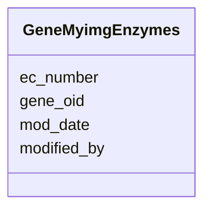

# Class: GeneMyimgEnzymes 


URI: [img_i_taxon:GeneMyimgEnzymes](https://w3id.org/jgi/img_i_taxon/GeneMyimgEnzymes)





<!-- no inheritance hierarchy -->


## Slots

| Name | Cardinality and Range | Description | Inheritance |
| ---  | --- | --- | --- |
| [gene_oid](gene_oid.md) | 0..1 <br/> [Integer](Integer.md) |  | direct |
| [ec_number](ec_number.md) | 0..1 <br/> [String](String.md) |  | direct |
| [modified_by](modified_by.md) | 0..1 <br/> [Integer](Integer.md) |  | direct |
| [mod_date](mod_date.md) | 0..1 <br/> [Datetime](Datetime.md) |  | direct |


## Identifier and Mapping Information


### Schema Source


* from schema: https://w3id.org/jgi/img_i_taxon


## Mappings

| Mapping Type | Mapped Value |
| ---  | ---  |
| self | img_i_taxon:GeneMyimgEnzymes |
| native | img_i_taxon:GeneMyimgEnzymes |


## LinkML Source

<!-- TODO: investigate https://stackoverflow.com/questions/37606292/how-to-create-tabbed-code-blocks-in-mkdocs-or-sphinx -->

### Direct

<details>
```yaml
name: gene_myimg_enzymes
from_schema: https://w3id.org/jgi/img_i_taxon
attributes:
  gene_oid:
    name: gene_oid
    from_schema: https://w3id.org/jgi/img_i_taxon
    rank: 1000
    domain_of:
    - gene_myimg_enzymes
    - gene_myimg_terms
    range: integer
    required: false
  ec_number:
    name: ec_number
    from_schema: https://w3id.org/jgi/img_i_taxon
    rank: 1000
    domain_of:
    - gene_myimg_enzymes
    range: string
    required: false
  modified_by:
    name: modified_by
    from_schema: https://w3id.org/jgi/img_i_taxon
    rank: 1000
    domain_of:
    - gene_myimg_enzymes
    - gene_myimg_terms
    - i_taxon_original_070323
    - taxon
    - taxon_history
    range: integer
    required: false
  mod_date:
    name: mod_date
    from_schema: https://w3id.org/jgi/img_i_taxon
    rank: 1000
    domain_of:
    - gene_myimg_enzymes
    - gene_myimg_terms
    - i_taxon_original_070323
    - taxon
    - taxon_history
    range: datetime
    required: false

```
</details>

### Induced

<details>
```yaml
name: gene_myimg_enzymes
from_schema: https://w3id.org/jgi/img_i_taxon
attributes:
  gene_oid:
    name: gene_oid
    from_schema: https://w3id.org/jgi/img_i_taxon
    rank: 1000
    alias: gene_oid
    owner: gene_myimg_enzymes
    domain_of:
    - gene_myimg_enzymes
    - gene_myimg_terms
    range: integer
    required: false
  ec_number:
    name: ec_number
    from_schema: https://w3id.org/jgi/img_i_taxon
    rank: 1000
    alias: ec_number
    owner: gene_myimg_enzymes
    domain_of:
    - gene_myimg_enzymes
    range: string
    required: false
  modified_by:
    name: modified_by
    from_schema: https://w3id.org/jgi/img_i_taxon
    rank: 1000
    alias: modified_by
    owner: gene_myimg_enzymes
    domain_of:
    - gene_myimg_enzymes
    - gene_myimg_terms
    - i_taxon_original_070323
    - taxon
    - taxon_history
    range: integer
    required: false
  mod_date:
    name: mod_date
    from_schema: https://w3id.org/jgi/img_i_taxon
    rank: 1000
    alias: mod_date
    owner: gene_myimg_enzymes
    domain_of:
    - gene_myimg_enzymes
    - gene_myimg_terms
    - i_taxon_original_070323
    - taxon
    - taxon_history
    range: datetime
    required: false

```
</details>