# Class: ITaxonOriginal070323 


URI: [img_i_taxon:ITaxonOriginal070323](https://w3id.org/jgi/img_i_taxon/ITaxonOriginal070323)

```mermaid
 classDiagram
    class ITaxonOriginal070323
    click ITaxonOriginal070323 href "../ITaxonOriginal070323/"
      ITaxonOriginal070323 : add_date
        
      ITaxonOriginal070323 : analysis_product_name
        
      ITaxonOriginal070323 : analysis_project_id
        
      ITaxonOriginal070323 : analysis_project_type
        
      ITaxonOriginal070323 : ani_species
        
      ITaxonOriginal070323 : combined_sample_flag
        
      ITaxonOriginal070323 : comments
        
      ITaxonOriginal070323 : distmatrix_date
        
      ITaxonOriginal070323 : domain
        
      ITaxonOriginal070323 : edit_flag
        
      ITaxonOriginal070323 : env_sample
        
      ITaxonOriginal070323 : family
        
      ITaxonOriginal070323 : funding_agency
        
      ITaxonOriginal070323 : gbk_project_id
        
      ITaxonOriginal070323 : genome_completion
        
      ITaxonOriginal070323 : genome_type
        
      ITaxonOriginal070323 : genus
        
      ITaxonOriginal070323 : gold_id
        
      ITaxonOriginal070323 : gram_stain
        
      ITaxonOriginal070323 : has_coverage
        
      ITaxonOriginal070323 : high_quality_flag
        
      ITaxonOriginal070323 : host_ncbi_taxon_id
        
      ITaxonOriginal070323 : img_ec_flag
        
      ITaxonOriginal070323 : img_product_flag
        
      ITaxonOriginal070323 : img_version
        
      ITaxonOriginal070323 : in_file
        
      ITaxonOriginal070323 : ir_class
        
      ITaxonOriginal070323 : ir_order
        
      ITaxonOriginal070323 : is_big_euk
        
      ITaxonOriginal070323 : is_low_quality
        
      ITaxonOriginal070323 : is_nr
        
      ITaxonOriginal070323 : is_pangenome
        
      ITaxonOriginal070323 : is_proxygene_set
        
      ITaxonOriginal070323 : is_public
        
      ITaxonOriginal070323 : is_replaced
        
      ITaxonOriginal070323 : is_std_reference
        
      ITaxonOriginal070323 : its_ap_id
        
      ITaxonOriginal070323 : jgi_project_id
        
      ITaxonOriginal070323 : jgi_rnd_flag
        
      ITaxonOriginal070323 : jgi_species_code
        
      ITaxonOriginal070323 : legacy_gold_id
        
      ITaxonOriginal070323 : lock_date
        
      ITaxonOriginal070323 : locked_by
        
      ITaxonOriginal070323 : mod_date
        
      ITaxonOriginal070323 : modified_by
        
      ITaxonOriginal070323 : ncbi_bioproject_id
        
      ITaxonOriginal070323 : ncbi_project_id
        
      ITaxonOriginal070323 : ncbi_species_code
        
      ITaxonOriginal070323 : ncbi_taxon_id
        
      ITaxonOriginal070323 : obsolete_flag
        
      ITaxonOriginal070323 : ornl_species_code
        
      ITaxonOriginal070323 : phylodist_date
        
      ITaxonOriginal070323 : phylodist_method
        
      ITaxonOriginal070323 : phylum
        
      ITaxonOriginal070323 : project
        
      ITaxonOriginal070323 : proposal_name
        
      ITaxonOriginal070323 : refseq_project_id
        
      ITaxonOriginal070323 : release_date
        
      ITaxonOriginal070323 : sample_gold_id
        
      ITaxonOriginal070323 : seq_center
        
      ITaxonOriginal070323 : seq_status
        
      ITaxonOriginal070323 : sequencing_gold_id
        
      ITaxonOriginal070323 : species
        
      ITaxonOriginal070323 : strain
        
      ITaxonOriginal070323 : study_gold_id
        
      ITaxonOriginal070323 : submission_id
        
      ITaxonOriginal070323 : taxon_display_name
        
      ITaxonOriginal070323 : taxon_name
        
      ITaxonOriginal070323 : taxon_oid
        
      ITaxonOriginal070323 : taxonomy_lock
        
      
```





<!-- no inheritance hierarchy -->


## Slots

| Name | Cardinality and Range | Description | Inheritance |
| ---  | --- | --- | --- |
| [taxon_oid](taxon_oid.md) | 0..1 <br/> [Integer](Integer.md) |  | direct |
| [taxon_name](taxon_name.md) | 0..1 <br/> [String](String.md) |  | direct |
| [genus](genus.md) | 0..1 <br/> [String](String.md) |  | direct |
| [species](species.md) | 0..1 <br/> [String](String.md) |  | direct |
| [strain](strain.md) | 0..1 <br/> [String](String.md) |  | direct |
| [taxon_display_name](taxon_display_name.md) | 0..1 <br/> [String](String.md) |  | direct |
| [ncbi_taxon_id](ncbi_taxon_id.md) | 0..1 <br/> [Integer](Integer.md) |  | direct |
| [domain](domain.md) | 0..1 <br/> [String](String.md) |  | direct |
| [phylum](phylum.md) | 0..1 <br/> [String](String.md) |  | direct |
| [ir_class](ir_class.md) | 0..1 <br/> [String](String.md) |  | direct |
| [ir_order](ir_order.md) | 0..1 <br/> [String](String.md) |  | direct |
| [family](family.md) | 0..1 <br/> [String](String.md) |  | direct |
| [jgi_species_code](jgi_species_code.md) | 0..1 <br/> [String](String.md) |  | direct |
| [comments](comments.md) | 0..1 <br/> [String](String.md) |  | direct |
| [env_sample](env_sample.md) | 0..1 <br/> [Integer](Integer.md) |  | direct |
| [seq_status](seq_status.md) | 0..1 <br/> [String](String.md) |  | direct |
| [seq_center](seq_center.md) | 0..1 <br/> [String](String.md) |  | direct |
| [is_public](is_public.md) | 0..1 <br/> [String](String.md) |  | direct |
| [is_replaced](is_replaced.md) | 0..1 <br/> [String](String.md) |  | direct |
| [img_ec_flag](img_ec_flag.md) | 0..1 <br/> [String](String.md) |  | direct |
| [funding_agency](funding_agency.md) | 0..1 <br/> [String](String.md) |  | direct |
| [jgi_project_id](jgi_project_id.md) | 0..1 <br/> [Integer](Integer.md) |  | direct |
| [img_version](img_version.md) | 0..1 <br/> [String](String.md) |  | direct |
| [ncbi_species_code](ncbi_species_code.md) | 0..1 <br/> [String](String.md) |  | direct |
| [ncbi_project_id](ncbi_project_id.md) | 0..1 <br/> [Integer](Integer.md) |  | direct |
| [gold_id](gold_id.md) | 0..1 <br/> [String](String.md) |  | direct |
| [release_date](release_date.md) | 0..1 <br/> [Datetime](Datetime.md) |  | direct |
| [add_date](add_date.md) | 0..1 <br/> [Datetime](Datetime.md) |  | direct |
| [ornl_species_code](ornl_species_code.md) | 0..1 <br/> [String](String.md) |  | direct |
| [is_big_euk](is_big_euk.md) | 0..1 <br/> [String](String.md) |  | direct |
| [host_ncbi_taxon_id](host_ncbi_taxon_id.md) | 0..1 <br/> [Float](Float.md) |  | direct |
| [is_std_reference](is_std_reference.md) | 0..1 <br/> [String](String.md) |  | direct |
| [mod_date](mod_date.md) | 0..1 <br/> [Datetime](Datetime.md) |  | direct |
| [modified_by](modified_by.md) | 0..1 <br/> [Integer](Integer.md) |  | direct |
| [project](project.md) | 0..1 <br/> [Integer](Integer.md) |  | direct |
| [genome_type](genome_type.md) | 0..1 <br/> [String](String.md) |  | direct |
| [gram_stain](gram_stain.md) | 0..1 <br/> [String](String.md) |  | direct |
| [is_proxygene_set](is_proxygene_set.md) | 0..1 <br/> [String](String.md) |  | direct |
| [obsolete_flag](obsolete_flag.md) | 0..1 <br/> [String](String.md) |  | direct |
| [is_pangenome](is_pangenome.md) | 0..1 <br/> [String](String.md) |  | direct |
| [edit_flag](edit_flag.md) | 0..1 <br/> [String](String.md) |  | direct |
| [submission_id](submission_id.md) | 0..1 <br/> [Float](Float.md) |  | direct |
| [img_product_flag](img_product_flag.md) | 0..1 <br/> [String](String.md) |  | direct |
| [refseq_project_id](refseq_project_id.md) | 0..1 <br/> [Integer](Integer.md) |  | direct |
| [gbk_project_id](gbk_project_id.md) | 0..1 <br/> [Integer](Integer.md) |  | direct |
| [is_low_quality](is_low_quality.md) | 0..1 <br/> [String](String.md) |  | direct |
| [phylodist_date](phylodist_date.md) | 0..1 <br/> [Datetime](Datetime.md) |  | direct |
| [proposal_name](proposal_name.md) | 0..1 <br/> [String](String.md) |  | direct |
| [sample_gold_id](sample_gold_id.md) | 0..1 <br/> [String](String.md) |  | direct |
| [phylodist_method](phylodist_method.md) | 0..1 <br/> [String](String.md) |  | direct |
| [in_file](in_file.md) | 0..1 <br/> [String](String.md) |  | direct |
| [ncbi_bioproject_id](ncbi_bioproject_id.md) | 0..1 <br/> [String](String.md) |  | direct |
| [combined_sample_flag](combined_sample_flag.md) | 0..1 <br/> [String](String.md) |  | direct |
| [high_quality_flag](high_quality_flag.md) | 0..1 <br/> [String](String.md) |  | direct |
| [taxonomy_lock](taxonomy_lock.md) | 0..1 <br/> [String](String.md) |  | direct |
| [locked_by](locked_by.md) | 0..1 <br/> [Integer](Integer.md) |  | direct |
| [lock_date](lock_date.md) | 0..1 <br/> [Datetime](Datetime.md) |  | direct |
| [distmatrix_date](distmatrix_date.md) | 0..1 <br/> [Datetime](Datetime.md) |  | direct |
| [analysis_project_id](analysis_project_id.md) | 0..1 <br/> [String](String.md) |  | direct |
| [legacy_gold_id](legacy_gold_id.md) | 0..1 <br/> [String](String.md) |  | direct |
| [ani_species](ani_species.md) | 0..1 <br/> [String](String.md) |  | direct |
| [study_gold_id](study_gold_id.md) | 0..1 <br/> [String](String.md) |  | direct |
| [sequencing_gold_id](sequencing_gold_id.md) | 0..1 <br/> [String](String.md) |  | direct |
| [genome_completion](genome_completion.md) | 0..1 <br/> [Float](Float.md) |  | direct |
| [is_nr](is_nr.md) | 0..1 <br/> [String](String.md) |  | direct |
| [its_ap_id](its_ap_id.md) | 0..1 <br/> [Integer](Integer.md) |  | direct |
| [analysis_product_name](analysis_product_name.md) | 0..1 <br/> [String](String.md) |  | direct |
| [analysis_project_type](analysis_project_type.md) | 0..1 <br/> [String](String.md) |  | direct |
| [jgi_rnd_flag](jgi_rnd_flag.md) | 0..1 <br/> [String](String.md) |  | direct |
| [has_coverage](has_coverage.md) | 0..1 <br/> [String](String.md) |  | direct |


## Identifier and Mapping Information


### Schema Source


* from schema: https://w3id.org/jgi/img_i_taxon


## Mappings

| Mapping Type | Mapped Value |
| ---  | ---  |
| self | img_i_taxon:ITaxonOriginal070323 |
| native | img_i_taxon:ITaxonOriginal070323 |


## LinkML Source

<!-- TODO: investigate https://stackoverflow.com/questions/37606292/how-to-create-tabbed-code-blocks-in-mkdocs-or-sphinx -->

### Direct

<details>
```yaml
name: i_taxon_original_070323
from_schema: https://w3id.org/jgi/img_i_taxon
attributes:
  taxon_oid:
    name: taxon_oid
    from_schema: https://w3id.org/jgi/img_i_taxon
    rank: 1000
    domain_of:
    - i_taxon_original_070323
    - replaced_metagenomes
    - taxon
    - taxon_history
    range: integer
    required: false
  taxon_name:
    name: taxon_name
    from_schema: https://w3id.org/jgi/img_i_taxon
    rank: 1000
    domain_of:
    - i_taxon_original_070323
    range: string
    required: false
  genus:
    name: genus
    from_schema: https://w3id.org/jgi/img_i_taxon
    rank: 1000
    domain_of:
    - i_taxon_original_070323
    - taxon
    range: string
    required: false
  species:
    name: species
    from_schema: https://w3id.org/jgi/img_i_taxon
    rank: 1000
    domain_of:
    - i_taxon_original_070323
    - taxon
    range: string
    required: false
  strain:
    name: strain
    from_schema: https://w3id.org/jgi/img_i_taxon
    rank: 1000
    domain_of:
    - i_taxon_original_070323
    - taxon
    range: string
    required: false
  taxon_display_name:
    name: taxon_display_name
    from_schema: https://w3id.org/jgi/img_i_taxon
    rank: 1000
    domain_of:
    - i_taxon_original_070323
    - taxon
    range: string
    required: false
  ncbi_taxon_id:
    name: ncbi_taxon_id
    from_schema: https://w3id.org/jgi/img_i_taxon
    rank: 1000
    domain_of:
    - i_taxon_original_070323
    - taxon
    range: integer
    required: false
  domain:
    name: domain
    from_schema: https://w3id.org/jgi/img_i_taxon
    rank: 1000
    domain_of:
    - i_taxon_original_070323
    - taxon
    range: string
    required: false
  phylum:
    name: phylum
    from_schema: https://w3id.org/jgi/img_i_taxon
    rank: 1000
    domain_of:
    - i_taxon_original_070323
    - taxon
    range: string
    required: false
  ir_class:
    name: ir_class
    from_schema: https://w3id.org/jgi/img_i_taxon
    rank: 1000
    domain_of:
    - i_taxon_original_070323
    - taxon
    range: string
    required: false
  ir_order:
    name: ir_order
    from_schema: https://w3id.org/jgi/img_i_taxon
    rank: 1000
    domain_of:
    - i_taxon_original_070323
    - taxon
    range: string
    required: false
  family:
    name: family
    from_schema: https://w3id.org/jgi/img_i_taxon
    rank: 1000
    domain_of:
    - i_taxon_original_070323
    - taxon
    range: string
    required: false
  jgi_species_code:
    name: jgi_species_code
    from_schema: https://w3id.org/jgi/img_i_taxon
    rank: 1000
    domain_of:
    - i_taxon_original_070323
    - taxon
    range: string
    required: false
  comments:
    name: comments
    from_schema: https://w3id.org/jgi/img_i_taxon
    rank: 1000
    domain_of:
    - i_taxon_original_070323
    - taxon
    range: string
    required: false
  env_sample:
    name: env_sample
    from_schema: https://w3id.org/jgi/img_i_taxon
    rank: 1000
    domain_of:
    - i_taxon_original_070323
    - scaffold
    range: integer
    required: false
  seq_status:
    name: seq_status
    from_schema: https://w3id.org/jgi/img_i_taxon
    rank: 1000
    domain_of:
    - i_taxon_original_070323
    - taxon
    range: string
    required: false
  seq_center:
    name: seq_center
    from_schema: https://w3id.org/jgi/img_i_taxon
    rank: 1000
    domain_of:
    - i_taxon_original_070323
    - taxon
    range: string
    required: false
  is_public:
    name: is_public
    from_schema: https://w3id.org/jgi/img_i_taxon
    rank: 1000
    domain_of:
    - i_taxon_original_070323
    - taxon
    range: string
    required: false
  is_replaced:
    name: is_replaced
    from_schema: https://w3id.org/jgi/img_i_taxon
    rank: 1000
    domain_of:
    - i_taxon_original_070323
    - taxon
    range: string
    required: false
  img_ec_flag:
    name: img_ec_flag
    from_schema: https://w3id.org/jgi/img_i_taxon
    rank: 1000
    domain_of:
    - i_taxon_original_070323
    range: string
    required: false
  funding_agency:
    name: funding_agency
    from_schema: https://w3id.org/jgi/img_i_taxon
    rank: 1000
    domain_of:
    - i_taxon_original_070323
    - taxon
    range: string
    required: false
  jgi_project_id:
    name: jgi_project_id
    from_schema: https://w3id.org/jgi/img_i_taxon
    rank: 1000
    domain_of:
    - i_taxon_original_070323
    - taxon
    range: integer
    required: false
  img_version:
    name: img_version
    from_schema: https://w3id.org/jgi/img_i_taxon
    rank: 1000
    domain_of:
    - i_taxon_original_070323
    - taxon
    range: string
    required: false
  ncbi_species_code:
    name: ncbi_species_code
    from_schema: https://w3id.org/jgi/img_i_taxon
    rank: 1000
    domain_of:
    - i_taxon_original_070323
    - taxon
    range: string
    required: false
  ncbi_project_id:
    name: ncbi_project_id
    from_schema: https://w3id.org/jgi/img_i_taxon
    rank: 1000
    domain_of:
    - i_taxon_original_070323
    range: integer
    required: false
  gold_id:
    name: gold_id
    from_schema: https://w3id.org/jgi/img_i_taxon
    rank: 1000
    domain_of:
    - i_taxon_original_070323
    range: string
    required: false
  release_date:
    name: release_date
    from_schema: https://w3id.org/jgi/img_i_taxon
    rank: 1000
    domain_of:
    - i_taxon_original_070323
    - taxon
    range: datetime
    required: false
  add_date:
    name: add_date
    from_schema: https://w3id.org/jgi/img_i_taxon
    rank: 1000
    domain_of:
    - i_taxon_original_070323
    - replaced_metagenomes
    - scaffold
    - taxon
    range: datetime
    required: false
  ornl_species_code:
    name: ornl_species_code
    from_schema: https://w3id.org/jgi/img_i_taxon
    rank: 1000
    domain_of:
    - i_taxon_original_070323
    range: string
    required: false
  is_big_euk:
    name: is_big_euk
    from_schema: https://w3id.org/jgi/img_i_taxon
    rank: 1000
    domain_of:
    - i_taxon_original_070323
    - taxon
    range: string
    required: false
  host_ncbi_taxon_id:
    name: host_ncbi_taxon_id
    from_schema: https://w3id.org/jgi/img_i_taxon
    rank: 1000
    domain_of:
    - i_taxon_original_070323
    - taxon
    range: float
    required: false
  is_std_reference:
    name: is_std_reference
    from_schema: https://w3id.org/jgi/img_i_taxon
    rank: 1000
    domain_of:
    - i_taxon_original_070323
    range: string
    required: false
  mod_date:
    name: mod_date
    from_schema: https://w3id.org/jgi/img_i_taxon
    domain_of:
    - gene_myimg_enzymes
    - gene_myimg_terms
    - i_taxon_original_070323
    - taxon
    - taxon_history
    range: datetime
    required: false
  modified_by:
    name: modified_by
    from_schema: https://w3id.org/jgi/img_i_taxon
    domain_of:
    - gene_myimg_enzymes
    - gene_myimg_terms
    - i_taxon_original_070323
    - taxon
    - taxon_history
    range: integer
    required: false
  project:
    name: project
    from_schema: https://w3id.org/jgi/img_i_taxon
    rank: 1000
    domain_of:
    - i_taxon_original_070323
    range: integer
    required: false
  genome_type:
    name: genome_type
    from_schema: https://w3id.org/jgi/img_i_taxon
    rank: 1000
    domain_of:
    - i_taxon_original_070323
    - taxon
    range: string
    required: false
  gram_stain:
    name: gram_stain
    from_schema: https://w3id.org/jgi/img_i_taxon
    rank: 1000
    domain_of:
    - i_taxon_original_070323
    - taxon
    range: string
    required: false
  is_proxygene_set:
    name: is_proxygene_set
    from_schema: https://w3id.org/jgi/img_i_taxon
    rank: 1000
    domain_of:
    - i_taxon_original_070323
    range: string
    required: false
  obsolete_flag:
    name: obsolete_flag
    from_schema: https://w3id.org/jgi/img_i_taxon
    rank: 1000
    domain_of:
    - i_taxon_original_070323
    - taxon
    range: string
    required: false
  is_pangenome:
    name: is_pangenome
    from_schema: https://w3id.org/jgi/img_i_taxon
    rank: 1000
    domain_of:
    - i_taxon_original_070323
    - taxon
    range: string
    required: false
  edit_flag:
    name: edit_flag
    from_schema: https://w3id.org/jgi/img_i_taxon
    rank: 1000
    domain_of:
    - i_taxon_original_070323
    range: string
    required: false
  submission_id:
    name: submission_id
    from_schema: https://w3id.org/jgi/img_i_taxon
    rank: 1000
    domain_of:
    - i_taxon_original_070323
    - taxon
    range: float
    required: false
  img_product_flag:
    name: img_product_flag
    from_schema: https://w3id.org/jgi/img_i_taxon
    rank: 1000
    domain_of:
    - i_taxon_original_070323
    range: string
    required: false
  refseq_project_id:
    name: refseq_project_id
    from_schema: https://w3id.org/jgi/img_i_taxon
    rank: 1000
    domain_of:
    - i_taxon_original_070323
    range: integer
    required: false
  gbk_project_id:
    name: gbk_project_id
    from_schema: https://w3id.org/jgi/img_i_taxon
    rank: 1000
    domain_of:
    - i_taxon_original_070323
    range: integer
    required: false
  is_low_quality:
    name: is_low_quality
    from_schema: https://w3id.org/jgi/img_i_taxon
    rank: 1000
    domain_of:
    - i_taxon_original_070323
    range: string
    required: false
  phylodist_date:
    name: phylodist_date
    from_schema: https://w3id.org/jgi/img_i_taxon
    rank: 1000
    domain_of:
    - i_taxon_original_070323
    - taxon
    range: datetime
    required: false
  proposal_name:
    name: proposal_name
    from_schema: https://w3id.org/jgi/img_i_taxon
    rank: 1000
    domain_of:
    - i_taxon_original_070323
    - taxon
    range: string
    required: false
  sample_gold_id:
    name: sample_gold_id
    from_schema: https://w3id.org/jgi/img_i_taxon
    rank: 1000
    domain_of:
    - i_taxon_original_070323
    - taxon
    range: string
    required: false
  phylodist_method:
    name: phylodist_method
    from_schema: https://w3id.org/jgi/img_i_taxon
    rank: 1000
    domain_of:
    - i_taxon_original_070323
    - taxon
    range: string
    required: false
  in_file:
    name: in_file
    from_schema: https://w3id.org/jgi/img_i_taxon
    rank: 1000
    domain_of:
    - i_taxon_original_070323
    - taxon
    range: string
    required: false
  ncbi_bioproject_id:
    name: ncbi_bioproject_id
    from_schema: https://w3id.org/jgi/img_i_taxon
    rank: 1000
    domain_of:
    - i_taxon_original_070323
    range: string
    required: false
  combined_sample_flag:
    name: combined_sample_flag
    from_schema: https://w3id.org/jgi/img_i_taxon
    rank: 1000
    domain_of:
    - i_taxon_original_070323
    - taxon
    range: string
    required: false
  high_quality_flag:
    name: high_quality_flag
    from_schema: https://w3id.org/jgi/img_i_taxon
    rank: 1000
    domain_of:
    - i_taxon_original_070323
    - taxon
    range: string
    required: false
  taxonomy_lock:
    name: taxonomy_lock
    from_schema: https://w3id.org/jgi/img_i_taxon
    rank: 1000
    domain_of:
    - i_taxon_original_070323
    range: string
    required: false
  locked_by:
    name: locked_by
    from_schema: https://w3id.org/jgi/img_i_taxon
    rank: 1000
    domain_of:
    - i_taxon_original_070323
    range: integer
    required: false
  lock_date:
    name: lock_date
    from_schema: https://w3id.org/jgi/img_i_taxon
    rank: 1000
    domain_of:
    - i_taxon_original_070323
    range: datetime
    required: false
  distmatrix_date:
    name: distmatrix_date
    from_schema: https://w3id.org/jgi/img_i_taxon
    rank: 1000
    domain_of:
    - i_taxon_original_070323
    range: datetime
    required: false
  analysis_project_id:
    name: analysis_project_id
    from_schema: https://w3id.org/jgi/img_i_taxon
    rank: 1000
    domain_of:
    - i_taxon_original_070323
    - taxon
    range: string
    required: false
  legacy_gold_id:
    name: legacy_gold_id
    from_schema: https://w3id.org/jgi/img_i_taxon
    rank: 1000
    domain_of:
    - i_taxon_original_070323
    range: string
    required: false
  ani_species:
    name: ani_species
    from_schema: https://w3id.org/jgi/img_i_taxon
    rank: 1000
    domain_of:
    - i_taxon_original_070323
    - taxon
    range: string
    required: false
  study_gold_id:
    name: study_gold_id
    from_schema: https://w3id.org/jgi/img_i_taxon
    rank: 1000
    domain_of:
    - i_taxon_original_070323
    - taxon
    range: string
    required: false
  sequencing_gold_id:
    name: sequencing_gold_id
    from_schema: https://w3id.org/jgi/img_i_taxon
    rank: 1000
    domain_of:
    - i_taxon_original_070323
    - taxon
    range: string
    required: false
  genome_completion:
    name: genome_completion
    from_schema: https://w3id.org/jgi/img_i_taxon
    rank: 1000
    domain_of:
    - i_taxon_original_070323
    - taxon
    range: float
    required: false
  is_nr:
    name: is_nr
    from_schema: https://w3id.org/jgi/img_i_taxon
    rank: 1000
    domain_of:
    - i_taxon_original_070323
    range: string
    required: false
  its_ap_id:
    name: its_ap_id
    from_schema: https://w3id.org/jgi/img_i_taxon
    rank: 1000
    domain_of:
    - i_taxon_original_070323
    - taxon
    range: integer
    required: false
  analysis_product_name:
    name: analysis_product_name
    from_schema: https://w3id.org/jgi/img_i_taxon
    rank: 1000
    domain_of:
    - i_taxon_original_070323
    - taxon
    range: string
    required: false
  analysis_project_type:
    name: analysis_project_type
    from_schema: https://w3id.org/jgi/img_i_taxon
    rank: 1000
    domain_of:
    - i_taxon_original_070323
    - taxon
    range: string
    required: false
  jgi_rnd_flag:
    name: jgi_rnd_flag
    from_schema: https://w3id.org/jgi/img_i_taxon
    rank: 1000
    domain_of:
    - i_taxon_original_070323
    - taxon
    range: string
    required: false
  has_coverage:
    name: has_coverage
    from_schema: https://w3id.org/jgi/img_i_taxon
    rank: 1000
    domain_of:
    - i_taxon_original_070323
    - taxon
    range: string
    required: false

```
</details>

### Induced

<details>
```yaml
name: i_taxon_original_070323
from_schema: https://w3id.org/jgi/img_i_taxon
attributes:
  taxon_oid:
    name: taxon_oid
    from_schema: https://w3id.org/jgi/img_i_taxon
    rank: 1000
    alias: taxon_oid
    owner: i_taxon_original_070323
    domain_of:
    - i_taxon_original_070323
    - replaced_metagenomes
    - taxon
    - taxon_history
    range: integer
    required: false
  taxon_name:
    name: taxon_name
    from_schema: https://w3id.org/jgi/img_i_taxon
    rank: 1000
    alias: taxon_name
    owner: i_taxon_original_070323
    domain_of:
    - i_taxon_original_070323
    range: string
    required: false
  genus:
    name: genus
    from_schema: https://w3id.org/jgi/img_i_taxon
    rank: 1000
    alias: genus
    owner: i_taxon_original_070323
    domain_of:
    - i_taxon_original_070323
    - taxon
    range: string
    required: false
  species:
    name: species
    from_schema: https://w3id.org/jgi/img_i_taxon
    rank: 1000
    alias: species
    owner: i_taxon_original_070323
    domain_of:
    - i_taxon_original_070323
    - taxon
    range: string
    required: false
  strain:
    name: strain
    from_schema: https://w3id.org/jgi/img_i_taxon
    rank: 1000
    alias: strain
    owner: i_taxon_original_070323
    domain_of:
    - i_taxon_original_070323
    - taxon
    range: string
    required: false
  taxon_display_name:
    name: taxon_display_name
    from_schema: https://w3id.org/jgi/img_i_taxon
    rank: 1000
    alias: taxon_display_name
    owner: i_taxon_original_070323
    domain_of:
    - i_taxon_original_070323
    - taxon
    range: string
    required: false
  ncbi_taxon_id:
    name: ncbi_taxon_id
    from_schema: https://w3id.org/jgi/img_i_taxon
    rank: 1000
    alias: ncbi_taxon_id
    owner: i_taxon_original_070323
    domain_of:
    - i_taxon_original_070323
    - taxon
    range: integer
    required: false
  domain:
    name: domain
    from_schema: https://w3id.org/jgi/img_i_taxon
    rank: 1000
    alias: domain
    owner: i_taxon_original_070323
    domain_of:
    - i_taxon_original_070323
    - taxon
    range: string
    required: false
  phylum:
    name: phylum
    from_schema: https://w3id.org/jgi/img_i_taxon
    rank: 1000
    alias: phylum
    owner: i_taxon_original_070323
    domain_of:
    - i_taxon_original_070323
    - taxon
    range: string
    required: false
  ir_class:
    name: ir_class
    from_schema: https://w3id.org/jgi/img_i_taxon
    rank: 1000
    alias: ir_class
    owner: i_taxon_original_070323
    domain_of:
    - i_taxon_original_070323
    - taxon
    range: string
    required: false
  ir_order:
    name: ir_order
    from_schema: https://w3id.org/jgi/img_i_taxon
    rank: 1000
    alias: ir_order
    owner: i_taxon_original_070323
    domain_of:
    - i_taxon_original_070323
    - taxon
    range: string
    required: false
  family:
    name: family
    from_schema: https://w3id.org/jgi/img_i_taxon
    rank: 1000
    alias: family
    owner: i_taxon_original_070323
    domain_of:
    - i_taxon_original_070323
    - taxon
    range: string
    required: false
  jgi_species_code:
    name: jgi_species_code
    from_schema: https://w3id.org/jgi/img_i_taxon
    rank: 1000
    alias: jgi_species_code
    owner: i_taxon_original_070323
    domain_of:
    - i_taxon_original_070323
    - taxon
    range: string
    required: false
  comments:
    name: comments
    from_schema: https://w3id.org/jgi/img_i_taxon
    rank: 1000
    alias: comments
    owner: i_taxon_original_070323
    domain_of:
    - i_taxon_original_070323
    - taxon
    range: string
    required: false
  env_sample:
    name: env_sample
    from_schema: https://w3id.org/jgi/img_i_taxon
    rank: 1000
    alias: env_sample
    owner: i_taxon_original_070323
    domain_of:
    - i_taxon_original_070323
    - scaffold
    range: integer
    required: false
  seq_status:
    name: seq_status
    from_schema: https://w3id.org/jgi/img_i_taxon
    rank: 1000
    alias: seq_status
    owner: i_taxon_original_070323
    domain_of:
    - i_taxon_original_070323
    - taxon
    range: string
    required: false
  seq_center:
    name: seq_center
    from_schema: https://w3id.org/jgi/img_i_taxon
    rank: 1000
    alias: seq_center
    owner: i_taxon_original_070323
    domain_of:
    - i_taxon_original_070323
    - taxon
    range: string
    required: false
  is_public:
    name: is_public
    from_schema: https://w3id.org/jgi/img_i_taxon
    rank: 1000
    alias: is_public
    owner: i_taxon_original_070323
    domain_of:
    - i_taxon_original_070323
    - taxon
    range: string
    required: false
  is_replaced:
    name: is_replaced
    from_schema: https://w3id.org/jgi/img_i_taxon
    rank: 1000
    alias: is_replaced
    owner: i_taxon_original_070323
    domain_of:
    - i_taxon_original_070323
    - taxon
    range: string
    required: false
  img_ec_flag:
    name: img_ec_flag
    from_schema: https://w3id.org/jgi/img_i_taxon
    rank: 1000
    alias: img_ec_flag
    owner: i_taxon_original_070323
    domain_of:
    - i_taxon_original_070323
    range: string
    required: false
  funding_agency:
    name: funding_agency
    from_schema: https://w3id.org/jgi/img_i_taxon
    rank: 1000
    alias: funding_agency
    owner: i_taxon_original_070323
    domain_of:
    - i_taxon_original_070323
    - taxon
    range: string
    required: false
  jgi_project_id:
    name: jgi_project_id
    from_schema: https://w3id.org/jgi/img_i_taxon
    rank: 1000
    alias: jgi_project_id
    owner: i_taxon_original_070323
    domain_of:
    - i_taxon_original_070323
    - taxon
    range: integer
    required: false
  img_version:
    name: img_version
    from_schema: https://w3id.org/jgi/img_i_taxon
    rank: 1000
    alias: img_version
    owner: i_taxon_original_070323
    domain_of:
    - i_taxon_original_070323
    - taxon
    range: string
    required: false
  ncbi_species_code:
    name: ncbi_species_code
    from_schema: https://w3id.org/jgi/img_i_taxon
    rank: 1000
    alias: ncbi_species_code
    owner: i_taxon_original_070323
    domain_of:
    - i_taxon_original_070323
    - taxon
    range: string
    required: false
  ncbi_project_id:
    name: ncbi_project_id
    from_schema: https://w3id.org/jgi/img_i_taxon
    rank: 1000
    alias: ncbi_project_id
    owner: i_taxon_original_070323
    domain_of:
    - i_taxon_original_070323
    range: integer
    required: false
  gold_id:
    name: gold_id
    from_schema: https://w3id.org/jgi/img_i_taxon
    rank: 1000
    alias: gold_id
    owner: i_taxon_original_070323
    domain_of:
    - i_taxon_original_070323
    range: string
    required: false
  release_date:
    name: release_date
    from_schema: https://w3id.org/jgi/img_i_taxon
    rank: 1000
    alias: release_date
    owner: i_taxon_original_070323
    domain_of:
    - i_taxon_original_070323
    - taxon
    range: datetime
    required: false
  add_date:
    name: add_date
    from_schema: https://w3id.org/jgi/img_i_taxon
    rank: 1000
    alias: add_date
    owner: i_taxon_original_070323
    domain_of:
    - i_taxon_original_070323
    - replaced_metagenomes
    - scaffold
    - taxon
    range: datetime
    required: false
  ornl_species_code:
    name: ornl_species_code
    from_schema: https://w3id.org/jgi/img_i_taxon
    rank: 1000
    alias: ornl_species_code
    owner: i_taxon_original_070323
    domain_of:
    - i_taxon_original_070323
    range: string
    required: false
  is_big_euk:
    name: is_big_euk
    from_schema: https://w3id.org/jgi/img_i_taxon
    rank: 1000
    alias: is_big_euk
    owner: i_taxon_original_070323
    domain_of:
    - i_taxon_original_070323
    - taxon
    range: string
    required: false
  host_ncbi_taxon_id:
    name: host_ncbi_taxon_id
    from_schema: https://w3id.org/jgi/img_i_taxon
    rank: 1000
    alias: host_ncbi_taxon_id
    owner: i_taxon_original_070323
    domain_of:
    - i_taxon_original_070323
    - taxon
    range: float
    required: false
  is_std_reference:
    name: is_std_reference
    from_schema: https://w3id.org/jgi/img_i_taxon
    rank: 1000
    alias: is_std_reference
    owner: i_taxon_original_070323
    domain_of:
    - i_taxon_original_070323
    range: string
    required: false
  mod_date:
    name: mod_date
    from_schema: https://w3id.org/jgi/img_i_taxon
    alias: mod_date
    owner: i_taxon_original_070323
    domain_of:
    - gene_myimg_enzymes
    - gene_myimg_terms
    - i_taxon_original_070323
    - taxon
    - taxon_history
    range: datetime
    required: false
  modified_by:
    name: modified_by
    from_schema: https://w3id.org/jgi/img_i_taxon
    alias: modified_by
    owner: i_taxon_original_070323
    domain_of:
    - gene_myimg_enzymes
    - gene_myimg_terms
    - i_taxon_original_070323
    - taxon
    - taxon_history
    range: integer
    required: false
  project:
    name: project
    from_schema: https://w3id.org/jgi/img_i_taxon
    rank: 1000
    alias: project
    owner: i_taxon_original_070323
    domain_of:
    - i_taxon_original_070323
    range: integer
    required: false
  genome_type:
    name: genome_type
    from_schema: https://w3id.org/jgi/img_i_taxon
    rank: 1000
    alias: genome_type
    owner: i_taxon_original_070323
    domain_of:
    - i_taxon_original_070323
    - taxon
    range: string
    required: false
  gram_stain:
    name: gram_stain
    from_schema: https://w3id.org/jgi/img_i_taxon
    rank: 1000
    alias: gram_stain
    owner: i_taxon_original_070323
    domain_of:
    - i_taxon_original_070323
    - taxon
    range: string
    required: false
  is_proxygene_set:
    name: is_proxygene_set
    from_schema: https://w3id.org/jgi/img_i_taxon
    rank: 1000
    alias: is_proxygene_set
    owner: i_taxon_original_070323
    domain_of:
    - i_taxon_original_070323
    range: string
    required: false
  obsolete_flag:
    name: obsolete_flag
    from_schema: https://w3id.org/jgi/img_i_taxon
    rank: 1000
    alias: obsolete_flag
    owner: i_taxon_original_070323
    domain_of:
    - i_taxon_original_070323
    - taxon
    range: string
    required: false
  is_pangenome:
    name: is_pangenome
    from_schema: https://w3id.org/jgi/img_i_taxon
    rank: 1000
    alias: is_pangenome
    owner: i_taxon_original_070323
    domain_of:
    - i_taxon_original_070323
    - taxon
    range: string
    required: false
  edit_flag:
    name: edit_flag
    from_schema: https://w3id.org/jgi/img_i_taxon
    rank: 1000
    alias: edit_flag
    owner: i_taxon_original_070323
    domain_of:
    - i_taxon_original_070323
    range: string
    required: false
  submission_id:
    name: submission_id
    from_schema: https://w3id.org/jgi/img_i_taxon
    rank: 1000
    alias: submission_id
    owner: i_taxon_original_070323
    domain_of:
    - i_taxon_original_070323
    - taxon
    range: float
    required: false
  img_product_flag:
    name: img_product_flag
    from_schema: https://w3id.org/jgi/img_i_taxon
    rank: 1000
    alias: img_product_flag
    owner: i_taxon_original_070323
    domain_of:
    - i_taxon_original_070323
    range: string
    required: false
  refseq_project_id:
    name: refseq_project_id
    from_schema: https://w3id.org/jgi/img_i_taxon
    rank: 1000
    alias: refseq_project_id
    owner: i_taxon_original_070323
    domain_of:
    - i_taxon_original_070323
    range: integer
    required: false
  gbk_project_id:
    name: gbk_project_id
    from_schema: https://w3id.org/jgi/img_i_taxon
    rank: 1000
    alias: gbk_project_id
    owner: i_taxon_original_070323
    domain_of:
    - i_taxon_original_070323
    range: integer
    required: false
  is_low_quality:
    name: is_low_quality
    from_schema: https://w3id.org/jgi/img_i_taxon
    rank: 1000
    alias: is_low_quality
    owner: i_taxon_original_070323
    domain_of:
    - i_taxon_original_070323
    range: string
    required: false
  phylodist_date:
    name: phylodist_date
    from_schema: https://w3id.org/jgi/img_i_taxon
    rank: 1000
    alias: phylodist_date
    owner: i_taxon_original_070323
    domain_of:
    - i_taxon_original_070323
    - taxon
    range: datetime
    required: false
  proposal_name:
    name: proposal_name
    from_schema: https://w3id.org/jgi/img_i_taxon
    rank: 1000
    alias: proposal_name
    owner: i_taxon_original_070323
    domain_of:
    - i_taxon_original_070323
    - taxon
    range: string
    required: false
  sample_gold_id:
    name: sample_gold_id
    from_schema: https://w3id.org/jgi/img_i_taxon
    rank: 1000
    alias: sample_gold_id
    owner: i_taxon_original_070323
    domain_of:
    - i_taxon_original_070323
    - taxon
    range: string
    required: false
  phylodist_method:
    name: phylodist_method
    from_schema: https://w3id.org/jgi/img_i_taxon
    rank: 1000
    alias: phylodist_method
    owner: i_taxon_original_070323
    domain_of:
    - i_taxon_original_070323
    - taxon
    range: string
    required: false
  in_file:
    name: in_file
    from_schema: https://w3id.org/jgi/img_i_taxon
    rank: 1000
    alias: in_file
    owner: i_taxon_original_070323
    domain_of:
    - i_taxon_original_070323
    - taxon
    range: string
    required: false
  ncbi_bioproject_id:
    name: ncbi_bioproject_id
    from_schema: https://w3id.org/jgi/img_i_taxon
    rank: 1000
    alias: ncbi_bioproject_id
    owner: i_taxon_original_070323
    domain_of:
    - i_taxon_original_070323
    range: string
    required: false
  combined_sample_flag:
    name: combined_sample_flag
    from_schema: https://w3id.org/jgi/img_i_taxon
    rank: 1000
    alias: combined_sample_flag
    owner: i_taxon_original_070323
    domain_of:
    - i_taxon_original_070323
    - taxon
    range: string
    required: false
  high_quality_flag:
    name: high_quality_flag
    from_schema: https://w3id.org/jgi/img_i_taxon
    rank: 1000
    alias: high_quality_flag
    owner: i_taxon_original_070323
    domain_of:
    - i_taxon_original_070323
    - taxon
    range: string
    required: false
  taxonomy_lock:
    name: taxonomy_lock
    from_schema: https://w3id.org/jgi/img_i_taxon
    rank: 1000
    alias: taxonomy_lock
    owner: i_taxon_original_070323
    domain_of:
    - i_taxon_original_070323
    range: string
    required: false
  locked_by:
    name: locked_by
    from_schema: https://w3id.org/jgi/img_i_taxon
    rank: 1000
    alias: locked_by
    owner: i_taxon_original_070323
    domain_of:
    - i_taxon_original_070323
    range: integer
    required: false
  lock_date:
    name: lock_date
    from_schema: https://w3id.org/jgi/img_i_taxon
    rank: 1000
    alias: lock_date
    owner: i_taxon_original_070323
    domain_of:
    - i_taxon_original_070323
    range: datetime
    required: false
  distmatrix_date:
    name: distmatrix_date
    from_schema: https://w3id.org/jgi/img_i_taxon
    rank: 1000
    alias: distmatrix_date
    owner: i_taxon_original_070323
    domain_of:
    - i_taxon_original_070323
    range: datetime
    required: false
  analysis_project_id:
    name: analysis_project_id
    from_schema: https://w3id.org/jgi/img_i_taxon
    rank: 1000
    alias: analysis_project_id
    owner: i_taxon_original_070323
    domain_of:
    - i_taxon_original_070323
    - taxon
    range: string
    required: false
  legacy_gold_id:
    name: legacy_gold_id
    from_schema: https://w3id.org/jgi/img_i_taxon
    rank: 1000
    alias: legacy_gold_id
    owner: i_taxon_original_070323
    domain_of:
    - i_taxon_original_070323
    range: string
    required: false
  ani_species:
    name: ani_species
    from_schema: https://w3id.org/jgi/img_i_taxon
    rank: 1000
    alias: ani_species
    owner: i_taxon_original_070323
    domain_of:
    - i_taxon_original_070323
    - taxon
    range: string
    required: false
  study_gold_id:
    name: study_gold_id
    from_schema: https://w3id.org/jgi/img_i_taxon
    rank: 1000
    alias: study_gold_id
    owner: i_taxon_original_070323
    domain_of:
    - i_taxon_original_070323
    - taxon
    range: string
    required: false
  sequencing_gold_id:
    name: sequencing_gold_id
    from_schema: https://w3id.org/jgi/img_i_taxon
    rank: 1000
    alias: sequencing_gold_id
    owner: i_taxon_original_070323
    domain_of:
    - i_taxon_original_070323
    - taxon
    range: string
    required: false
  genome_completion:
    name: genome_completion
    from_schema: https://w3id.org/jgi/img_i_taxon
    rank: 1000
    alias: genome_completion
    owner: i_taxon_original_070323
    domain_of:
    - i_taxon_original_070323
    - taxon
    range: float
    required: false
  is_nr:
    name: is_nr
    from_schema: https://w3id.org/jgi/img_i_taxon
    rank: 1000
    alias: is_nr
    owner: i_taxon_original_070323
    domain_of:
    - i_taxon_original_070323
    range: string
    required: false
  its_ap_id:
    name: its_ap_id
    from_schema: https://w3id.org/jgi/img_i_taxon
    rank: 1000
    alias: its_ap_id
    owner: i_taxon_original_070323
    domain_of:
    - i_taxon_original_070323
    - taxon
    range: integer
    required: false
  analysis_product_name:
    name: analysis_product_name
    from_schema: https://w3id.org/jgi/img_i_taxon
    rank: 1000
    alias: analysis_product_name
    owner: i_taxon_original_070323
    domain_of:
    - i_taxon_original_070323
    - taxon
    range: string
    required: false
  analysis_project_type:
    name: analysis_project_type
    from_schema: https://w3id.org/jgi/img_i_taxon
    rank: 1000
    alias: analysis_project_type
    owner: i_taxon_original_070323
    domain_of:
    - i_taxon_original_070323
    - taxon
    range: string
    required: false
  jgi_rnd_flag:
    name: jgi_rnd_flag
    from_schema: https://w3id.org/jgi/img_i_taxon
    rank: 1000
    alias: jgi_rnd_flag
    owner: i_taxon_original_070323
    domain_of:
    - i_taxon_original_070323
    - taxon
    range: string
    required: false
  has_coverage:
    name: has_coverage
    from_schema: https://w3id.org/jgi/img_i_taxon
    rank: 1000
    alias: has_coverage
    owner: i_taxon_original_070323
    domain_of:
    - i_taxon_original_070323
    - taxon
    range: string
    required: false

```
</details>