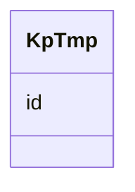

# Class: KpTmp 


URI: [img_i_taxon:KpTmp](https://w3id.org/jgi/img_i_taxon/KpTmp)





<!-- no inheritance hierarchy -->


## Slots

| Name | Cardinality and Range | Description | Inheritance |
| ---  | --- | --- | --- |
| [id](id.md) | 0..1 <br/> [Integer](Integer.md) |  | direct |


## Identifier and Mapping Information


### Schema Source


* from schema: https://w3id.org/jgi/img_i_taxon


## Mappings

| Mapping Type | Mapped Value |
| ---  | ---  |
| self | img_i_taxon:KpTmp |
| native | img_i_taxon:KpTmp |


## LinkML Source

<!-- TODO: investigate https://stackoverflow.com/questions/37606292/how-to-create-tabbed-code-blocks-in-mkdocs-or-sphinx -->

### Direct

<details>
```yaml
name: kp_tmp
from_schema: https://w3id.org/jgi/img_i_taxon
attributes:
  id:
    name: id
    from_schema: https://w3id.org/jgi/img_i_taxon
    rank: 1000
    domain_of:
    - kp_tmp
    range: integer
    required: false

```
</details>

### Induced

<details>
```yaml
name: kp_tmp
from_schema: https://w3id.org/jgi/img_i_taxon
attributes:
  id:
    name: id
    from_schema: https://w3id.org/jgi/img_i_taxon
    rank: 1000
    alias: id
    owner: kp_tmp
    domain_of:
    - kp_tmp
    range: integer
    required: false

```
</details>