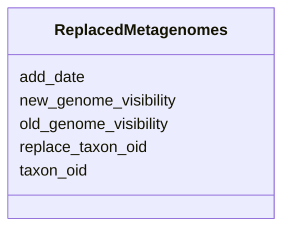

# Class: ReplacedMetagenomes 


URI: [img_i_taxon:ReplacedMetagenomes](https://w3id.org/jgi/img_i_taxon/ReplacedMetagenomes)





<!-- no inheritance hierarchy -->


## Slots

| Name | Cardinality and Range | Description | Inheritance |
| ---  | --- | --- | --- |
| [taxon_oid](taxon_oid.md) | 0..1 <br/> [Integer](Integer.md) |  | direct |
| [new_genome_visibility](new_genome_visibility.md) | 0..1 <br/> [String](String.md) |  | direct |
| [add_date](add_date.md) | 0..1 <br/> [Datetime](Datetime.md) |  | direct |
| [replace_taxon_oid](replace_taxon_oid.md) | 0..1 <br/> [Integer](Integer.md) |  | direct |
| [old_genome_visibility](old_genome_visibility.md) | 0..1 <br/> [String](String.md) |  | direct |


## Identifier and Mapping Information


### Schema Source


* from schema: https://w3id.org/jgi/img_i_taxon


## Mappings

| Mapping Type | Mapped Value |
| ---  | ---  |
| self | img_i_taxon:ReplacedMetagenomes |
| native | img_i_taxon:ReplacedMetagenomes |


## LinkML Source

<!-- TODO: investigate https://stackoverflow.com/questions/37606292/how-to-create-tabbed-code-blocks-in-mkdocs-or-sphinx -->

### Direct

<details>
```yaml
name: replaced_metagenomes
from_schema: https://w3id.org/jgi/img_i_taxon
attributes:
  taxon_oid:
    name: taxon_oid
    from_schema: https://w3id.org/jgi/img_i_taxon
    domain_of:
    - i_taxon_original_070323
    - replaced_metagenomes
    - taxon
    - taxon_history
    range: integer
    required: false
  new_genome_visibility:
    name: new_genome_visibility
    from_schema: https://w3id.org/jgi/img_i_taxon
    rank: 1000
    domain_of:
    - replaced_metagenomes
    range: string
    required: false
  add_date:
    name: add_date
    from_schema: https://w3id.org/jgi/img_i_taxon
    domain_of:
    - i_taxon_original_070323
    - replaced_metagenomes
    - scaffold
    - taxon
    range: datetime
    required: false
  replace_taxon_oid:
    name: replace_taxon_oid
    from_schema: https://w3id.org/jgi/img_i_taxon
    rank: 1000
    domain_of:
    - replaced_metagenomes
    range: integer
    required: false
  old_genome_visibility:
    name: old_genome_visibility
    from_schema: https://w3id.org/jgi/img_i_taxon
    rank: 1000
    domain_of:
    - replaced_metagenomes
    range: string
    required: false

```
</details>

### Induced

<details>
```yaml
name: replaced_metagenomes
from_schema: https://w3id.org/jgi/img_i_taxon
attributes:
  taxon_oid:
    name: taxon_oid
    from_schema: https://w3id.org/jgi/img_i_taxon
    alias: taxon_oid
    owner: replaced_metagenomes
    domain_of:
    - i_taxon_original_070323
    - replaced_metagenomes
    - taxon
    - taxon_history
    range: integer
    required: false
  new_genome_visibility:
    name: new_genome_visibility
    from_schema: https://w3id.org/jgi/img_i_taxon
    rank: 1000
    alias: new_genome_visibility
    owner: replaced_metagenomes
    domain_of:
    - replaced_metagenomes
    range: string
    required: false
  add_date:
    name: add_date
    from_schema: https://w3id.org/jgi/img_i_taxon
    alias: add_date
    owner: replaced_metagenomes
    domain_of:
    - i_taxon_original_070323
    - replaced_metagenomes
    - scaffold
    - taxon
    range: datetime
    required: false
  replace_taxon_oid:
    name: replace_taxon_oid
    from_schema: https://w3id.org/jgi/img_i_taxon
    rank: 1000
    alias: replace_taxon_oid
    owner: replaced_metagenomes
    domain_of:
    - replaced_metagenomes
    range: integer
    required: false
  old_genome_visibility:
    name: old_genome_visibility
    from_schema: https://w3id.org/jgi/img_i_taxon
    rank: 1000
    alias: old_genome_visibility
    owner: replaced_metagenomes
    domain_of:
    - replaced_metagenomes
    range: string
    required: false

```
</details>