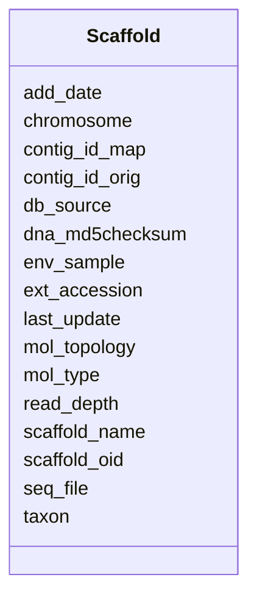

# Class: Scaffold 


URI: [img_i_taxon:Scaffold](https://w3id.org/jgi/img_i_taxon/Scaffold)





<!-- no inheritance hierarchy -->


## Slots

| Name | Cardinality and Range | Description | Inheritance |
| ---  | --- | --- | --- |
| [scaffold_oid](scaffold_oid.md) | 0..1 <br/> [Integer](Integer.md) |  | direct |
| [scaffold_name](scaffold_name.md) | 0..1 <br/> [String](String.md) |  | direct |
| [chromosome](chromosome.md) | 0..1 <br/> [String](String.md) |  | direct |
| [mol_topology](mol_topology.md) | 0..1 <br/> [String](String.md) |  | direct |
| [mol_type](mol_type.md) | 0..1 <br/> [String](String.md) |  | direct |
| [taxon](taxon.md) | 0..1 <br/> [Integer](Integer.md) |  | direct |
| [env_sample](env_sample.md) | 0..1 <br/> [Integer](Integer.md) |  | direct |
| [ext_accession](ext_accession.md) | 0..1 <br/> [String](String.md) |  | direct |
| [db_source](db_source.md) | 0..1 <br/> [String](String.md) |  | direct |
| [seq_file](seq_file.md) | 0..1 <br/> [String](String.md) |  | direct |
| [last_update](last_update.md) | 0..1 <br/> [Datetime](Datetime.md) |  | direct |
| [add_date](add_date.md) | 0..1 <br/> [Datetime](Datetime.md) |  | direct |
| [read_depth](read_depth.md) | 0..1 <br/> [Float](Float.md) |  | direct |
| [dna_md5checksum](dna_md5checksum.md) | 0..1 <br/> [String](String.md) |  | direct |
| [contig_id_map](contig_id_map.md) | 0..1 <br/> [String](String.md) |  | direct |
| [contig_id_orig](contig_id_orig.md) | 0..1 <br/> [String](String.md) |  | direct |


## Identifier and Mapping Information


### Schema Source


* from schema: https://w3id.org/jgi/img_i_taxon


## Mappings

| Mapping Type | Mapped Value |
| ---  | ---  |
| self | img_i_taxon:Scaffold |
| native | img_i_taxon:Scaffold |


## LinkML Source

<!-- TODO: investigate https://stackoverflow.com/questions/37606292/how-to-create-tabbed-code-blocks-in-mkdocs-or-sphinx -->

### Direct

<details>
```yaml
name: scaffold
from_schema: https://w3id.org/jgi/img_i_taxon
attributes:
  scaffold_oid:
    name: scaffold_oid
    from_schema: https://w3id.org/jgi/img_i_taxon
    rank: 1000
    domain_of:
    - scaffold
    range: integer
    required: false
  scaffold_name:
    name: scaffold_name
    from_schema: https://w3id.org/jgi/img_i_taxon
    rank: 1000
    domain_of:
    - scaffold
    range: string
    required: false
  chromosome:
    name: chromosome
    from_schema: https://w3id.org/jgi/img_i_taxon
    rank: 1000
    domain_of:
    - scaffold
    range: string
    required: false
  mol_topology:
    name: mol_topology
    from_schema: https://w3id.org/jgi/img_i_taxon
    rank: 1000
    domain_of:
    - scaffold
    range: string
    required: false
  mol_type:
    name: mol_type
    from_schema: https://w3id.org/jgi/img_i_taxon
    rank: 1000
    domain_of:
    - scaffold
    range: string
    required: false
  taxon:
    name: taxon
    from_schema: https://w3id.org/jgi/img_i_taxon
    rank: 1000
    domain_of:
    - scaffold
    range: integer
    required: false
  env_sample:
    name: env_sample
    from_schema: https://w3id.org/jgi/img_i_taxon
    domain_of:
    - i_taxon_original_070323
    - scaffold
    range: integer
    required: false
  ext_accession:
    name: ext_accession
    from_schema: https://w3id.org/jgi/img_i_taxon
    rank: 1000
    domain_of:
    - scaffold
    range: string
    required: false
  db_source:
    name: db_source
    from_schema: https://w3id.org/jgi/img_i_taxon
    rank: 1000
    domain_of:
    - scaffold
    range: string
    required: false
  seq_file:
    name: seq_file
    from_schema: https://w3id.org/jgi/img_i_taxon
    rank: 1000
    domain_of:
    - scaffold
    range: string
    required: false
  last_update:
    name: last_update
    from_schema: https://w3id.org/jgi/img_i_taxon
    rank: 1000
    domain_of:
    - scaffold
    range: datetime
    required: false
  add_date:
    name: add_date
    from_schema: https://w3id.org/jgi/img_i_taxon
    domain_of:
    - i_taxon_original_070323
    - replaced_metagenomes
    - scaffold
    - taxon
    range: datetime
    required: false
  read_depth:
    name: read_depth
    from_schema: https://w3id.org/jgi/img_i_taxon
    rank: 1000
    domain_of:
    - scaffold
    range: float
    required: false
  dna_md5checksum:
    name: dna_md5checksum
    from_schema: https://w3id.org/jgi/img_i_taxon
    rank: 1000
    domain_of:
    - scaffold
    range: string
    required: false
  contig_id_map:
    name: contig_id_map
    from_schema: https://w3id.org/jgi/img_i_taxon
    rank: 1000
    domain_of:
    - scaffold
    range: string
    required: false
  contig_id_orig:
    name: contig_id_orig
    from_schema: https://w3id.org/jgi/img_i_taxon
    rank: 1000
    domain_of:
    - scaffold
    range: string
    required: false

```
</details>

### Induced

<details>
```yaml
name: scaffold
from_schema: https://w3id.org/jgi/img_i_taxon
attributes:
  scaffold_oid:
    name: scaffold_oid
    from_schema: https://w3id.org/jgi/img_i_taxon
    rank: 1000
    alias: scaffold_oid
    owner: scaffold
    domain_of:
    - scaffold
    range: integer
    required: false
  scaffold_name:
    name: scaffold_name
    from_schema: https://w3id.org/jgi/img_i_taxon
    rank: 1000
    alias: scaffold_name
    owner: scaffold
    domain_of:
    - scaffold
    range: string
    required: false
  chromosome:
    name: chromosome
    from_schema: https://w3id.org/jgi/img_i_taxon
    rank: 1000
    alias: chromosome
    owner: scaffold
    domain_of:
    - scaffold
    range: string
    required: false
  mol_topology:
    name: mol_topology
    from_schema: https://w3id.org/jgi/img_i_taxon
    rank: 1000
    alias: mol_topology
    owner: scaffold
    domain_of:
    - scaffold
    range: string
    required: false
  mol_type:
    name: mol_type
    from_schema: https://w3id.org/jgi/img_i_taxon
    rank: 1000
    alias: mol_type
    owner: scaffold
    domain_of:
    - scaffold
    range: string
    required: false
  taxon:
    name: taxon
    from_schema: https://w3id.org/jgi/img_i_taxon
    rank: 1000
    alias: taxon
    owner: scaffold
    domain_of:
    - scaffold
    range: integer
    required: false
  env_sample:
    name: env_sample
    from_schema: https://w3id.org/jgi/img_i_taxon
    alias: env_sample
    owner: scaffold
    domain_of:
    - i_taxon_original_070323
    - scaffold
    range: integer
    required: false
  ext_accession:
    name: ext_accession
    from_schema: https://w3id.org/jgi/img_i_taxon
    rank: 1000
    alias: ext_accession
    owner: scaffold
    domain_of:
    - scaffold
    range: string
    required: false
  db_source:
    name: db_source
    from_schema: https://w3id.org/jgi/img_i_taxon
    rank: 1000
    alias: db_source
    owner: scaffold
    domain_of:
    - scaffold
    range: string
    required: false
  seq_file:
    name: seq_file
    from_schema: https://w3id.org/jgi/img_i_taxon
    rank: 1000
    alias: seq_file
    owner: scaffold
    domain_of:
    - scaffold
    range: string
    required: false
  last_update:
    name: last_update
    from_schema: https://w3id.org/jgi/img_i_taxon
    rank: 1000
    alias: last_update
    owner: scaffold
    domain_of:
    - scaffold
    range: datetime
    required: false
  add_date:
    name: add_date
    from_schema: https://w3id.org/jgi/img_i_taxon
    alias: add_date
    owner: scaffold
    domain_of:
    - i_taxon_original_070323
    - replaced_metagenomes
    - scaffold
    - taxon
    range: datetime
    required: false
  read_depth:
    name: read_depth
    from_schema: https://w3id.org/jgi/img_i_taxon
    rank: 1000
    alias: read_depth
    owner: scaffold
    domain_of:
    - scaffold
    range: float
    required: false
  dna_md5checksum:
    name: dna_md5checksum
    from_schema: https://w3id.org/jgi/img_i_taxon
    rank: 1000
    alias: dna_md5checksum
    owner: scaffold
    domain_of:
    - scaffold
    range: string
    required: false
  contig_id_map:
    name: contig_id_map
    from_schema: https://w3id.org/jgi/img_i_taxon
    rank: 1000
    alias: contig_id_map
    owner: scaffold
    domain_of:
    - scaffold
    range: string
    required: false
  contig_id_orig:
    name: contig_id_orig
    from_schema: https://w3id.org/jgi/img_i_taxon
    rank: 1000
    alias: contig_id_orig
    owner: scaffold
    domain_of:
    - scaffold
    range: string
    required: false

```
</details>