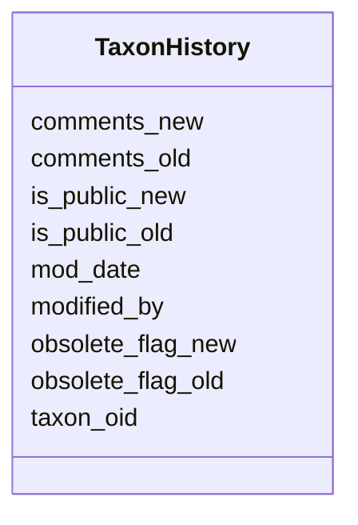

# Class: TaxonHistory 


URI: [img_i_taxon:TaxonHistory](https://w3id.org/jgi/img_i_taxon/TaxonHistory)





<!-- no inheritance hierarchy -->


## Slots

| Name | Cardinality and Range | Description | Inheritance |
| ---  | --- | --- | --- |
| [taxon_oid](taxon_oid.md) | 0..1 <br/> [Float](Float.md) |  | direct |
| [modified_by](modified_by.md) | 0..1 <br/> [Float](Float.md) |  | direct |
| [mod_date](mod_date.md) | 0..1 <br/> [Datetime](Datetime.md) |  | direct |
| [comments_old](comments_old.md) | 0..1 <br/> [String](String.md) |  | direct |
| [is_public_old](is_public_old.md) | 0..1 <br/> [String](String.md) |  | direct |
| [obsolete_flag_old](obsolete_flag_old.md) | 0..1 <br/> [String](String.md) |  | direct |
| [is_public_new](is_public_new.md) | 0..1 <br/> [String](String.md) |  | direct |
| [obsolete_flag_new](obsolete_flag_new.md) | 0..1 <br/> [String](String.md) |  | direct |
| [comments_new](comments_new.md) | 0..1 <br/> [String](String.md) |  | direct |


## Identifier and Mapping Information


### Schema Source


* from schema: https://w3id.org/jgi/img_i_taxon


## Mappings

| Mapping Type | Mapped Value |
| ---  | ---  |
| self | img_i_taxon:TaxonHistory |
| native | img_i_taxon:TaxonHistory |


## LinkML Source

<!-- TODO: investigate https://stackoverflow.com/questions/37606292/how-to-create-tabbed-code-blocks-in-mkdocs-or-sphinx -->

### Direct

<details>
```yaml
name: taxon_history
from_schema: https://w3id.org/jgi/img_i_taxon
attributes:
  taxon_oid:
    name: taxon_oid
    from_schema: https://w3id.org/jgi/img_i_taxon
    domain_of:
    - i_taxon_original_070323
    - replaced_metagenomes
    - taxon
    - taxon_history
    range: float
    required: false
  modified_by:
    name: modified_by
    from_schema: https://w3id.org/jgi/img_i_taxon
    domain_of:
    - gene_myimg_enzymes
    - gene_myimg_terms
    - i_taxon_original_070323
    - taxon
    - taxon_history
    range: float
    required: false
  mod_date:
    name: mod_date
    from_schema: https://w3id.org/jgi/img_i_taxon
    domain_of:
    - gene_myimg_enzymes
    - gene_myimg_terms
    - i_taxon_original_070323
    - taxon
    - taxon_history
    range: datetime
    required: false
  comments_old:
    name: comments_old
    from_schema: https://w3id.org/jgi/img_i_taxon
    rank: 1000
    domain_of:
    - taxon_history
    range: string
    required: false
  is_public_old:
    name: is_public_old
    from_schema: https://w3id.org/jgi/img_i_taxon
    rank: 1000
    domain_of:
    - taxon_history
    range: string
    required: false
  obsolete_flag_old:
    name: obsolete_flag_old
    from_schema: https://w3id.org/jgi/img_i_taxon
    rank: 1000
    domain_of:
    - taxon_history
    range: string
    required: false
  is_public_new:
    name: is_public_new
    from_schema: https://w3id.org/jgi/img_i_taxon
    rank: 1000
    domain_of:
    - taxon_history
    range: string
    required: false
  obsolete_flag_new:
    name: obsolete_flag_new
    from_schema: https://w3id.org/jgi/img_i_taxon
    rank: 1000
    domain_of:
    - taxon_history
    range: string
    required: false
  comments_new:
    name: comments_new
    from_schema: https://w3id.org/jgi/img_i_taxon
    rank: 1000
    domain_of:
    - taxon_history
    range: string
    required: false

```
</details>

### Induced

<details>
```yaml
name: taxon_history
from_schema: https://w3id.org/jgi/img_i_taxon
attributes:
  taxon_oid:
    name: taxon_oid
    from_schema: https://w3id.org/jgi/img_i_taxon
    alias: taxon_oid
    owner: taxon_history
    domain_of:
    - i_taxon_original_070323
    - replaced_metagenomes
    - taxon
    - taxon_history
    range: float
    required: false
  modified_by:
    name: modified_by
    from_schema: https://w3id.org/jgi/img_i_taxon
    alias: modified_by
    owner: taxon_history
    domain_of:
    - gene_myimg_enzymes
    - gene_myimg_terms
    - i_taxon_original_070323
    - taxon
    - taxon_history
    range: float
    required: false
  mod_date:
    name: mod_date
    from_schema: https://w3id.org/jgi/img_i_taxon
    alias: mod_date
    owner: taxon_history
    domain_of:
    - gene_myimg_enzymes
    - gene_myimg_terms
    - i_taxon_original_070323
    - taxon
    - taxon_history
    range: datetime
    required: false
  comments_old:
    name: comments_old
    from_schema: https://w3id.org/jgi/img_i_taxon
    rank: 1000
    alias: comments_old
    owner: taxon_history
    domain_of:
    - taxon_history
    range: string
    required: false
  is_public_old:
    name: is_public_old
    from_schema: https://w3id.org/jgi/img_i_taxon
    rank: 1000
    alias: is_public_old
    owner: taxon_history
    domain_of:
    - taxon_history
    range: string
    required: false
  obsolete_flag_old:
    name: obsolete_flag_old
    from_schema: https://w3id.org/jgi/img_i_taxon
    rank: 1000
    alias: obsolete_flag_old
    owner: taxon_history
    domain_of:
    - taxon_history
    range: string
    required: false
  is_public_new:
    name: is_public_new
    from_schema: https://w3id.org/jgi/img_i_taxon
    rank: 1000
    alias: is_public_new
    owner: taxon_history
    domain_of:
    - taxon_history
    range: string
    required: false
  obsolete_flag_new:
    name: obsolete_flag_new
    from_schema: https://w3id.org/jgi/img_i_taxon
    rank: 1000
    alias: obsolete_flag_new
    owner: taxon_history
    domain_of:
    - taxon_history
    range: string
    required: false
  comments_new:
    name: comments_new
    from_schema: https://w3id.org/jgi/img_i_taxon
    rank: 1000
    alias: comments_new
    owner: taxon_history
    domain_of:
    - taxon_history
    range: string
    required: false

```
</details>