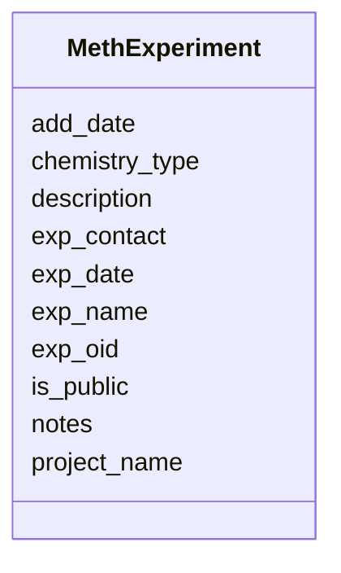

# Class: MethExperiment 


URI: [img_methylome:MethExperiment](https://w3id.org/jgi/img_methylome/MethExperiment)





<!-- no inheritance hierarchy -->


## Slots

| Name | Cardinality and Range | Description | Inheritance |
| ---  | --- | --- | --- |
| [exp_oid](exp_oid.md) | 0..1 <br/> [Integer](Integer.md) |  | direct |
| [project_name](project_name.md) | 0..1 <br/> [String](String.md) |  | direct |
| [exp_name](exp_name.md) | 0..1 <br/> [String](String.md) |  | direct |
| [description](description.md) | 0..1 <br/> [String](String.md) |  | direct |
| [exp_date](exp_date.md) | 0..1 <br/> [String](String.md) |  | direct |
| [exp_contact](exp_contact.md) | 0..1 <br/> [String](String.md) |  | direct |
| [add_date](add_date.md) | 0..1 <br/> [Datetime](Datetime.md) |  | direct |
| [notes](notes.md) | 0..1 <br/> [String](String.md) |  | direct |
| [is_public](is_public.md) | 0..1 <br/> [String](String.md) |  | direct |
| [chemistry_type](chemistry_type.md) | 0..1 <br/> [String](String.md) |  | direct |


## Usages

| used by | used in | type | used |
| ---  | --- | --- | --- |
| [MethExperimentExtLinks](MethExperimentExtLinks.md) | [exp_oid](exp_oid.md) | range | [MethExperiment](MethExperiment.md) |
| [MethExperimentPublications](MethExperimentPublications.md) | [exp_oid](exp_oid.md) | range | [MethExperiment](MethExperiment.md) |
| [MethFunctionCoverage](MethFunctionCoverage.md) | [exp_oid](exp_oid.md) | range | [MethExperiment](MethExperiment.md) |
| [MethMotifSummary](MethMotifSummary.md) | [experiment](experiment.md) | range | [MethExperiment](MethExperiment.md) |
| [MethSample](MethSample.md) | [experiment](experiment.md) | range | [MethExperiment](MethExperiment.md) |
| [MethStats](MethStats.md) | [exp_oid](exp_oid.md) | range | [MethExperiment](MethExperiment.md) |


## Identifier and Mapping Information


### Schema Source


* from schema: https://w3id.org/jgi/img_methylome


## Mappings

| Mapping Type | Mapped Value |
| ---  | ---  |
| self | img_methylome:MethExperiment |
| native | img_methylome:MethExperiment |


## LinkML Source

<!-- TODO: investigate https://stackoverflow.com/questions/37606292/how-to-create-tabbed-code-blocks-in-mkdocs-or-sphinx -->

### Direct

<details>
```yaml
name: meth_experiment
from_schema: https://w3id.org/jgi/img_methylome
attributes:
  exp_oid:
    name: exp_oid
    from_schema: https://w3id.org/jgi/img_methylome
    domain_of:
    - meth_exp
    - meth_experiment
    - meth_experiment_ext_links
    - meth_experiment_publications
    - meth_function_coverage
    - meth_stats
    range: integer
    required: false
  project_name:
    name: project_name
    from_schema: https://w3id.org/jgi/img_methylome
    domain_of:
    - meth_exp
    - meth_experiment
    range: string
    required: false
  exp_name:
    name: exp_name
    from_schema: https://w3id.org/jgi/img_methylome
    domain_of:
    - meth_exp
    - meth_experiment
    range: string
    required: false
  description:
    name: description
    from_schema: https://w3id.org/jgi/img_methylome
    domain_of:
    - meth_exp
    - meth_experiment
    - meth_sample
    range: string
    required: false
  exp_date:
    name: exp_date
    from_schema: https://w3id.org/jgi/img_methylome
    domain_of:
    - meth_exp
    - meth_experiment
    range: string
    required: false
  exp_contact:
    name: exp_contact
    from_schema: https://w3id.org/jgi/img_methylome
    domain_of:
    - meth_exp
    - meth_experiment
    range: string
    required: false
  add_date:
    name: add_date
    from_schema: https://w3id.org/jgi/img_methylome
    domain_of:
    - meth_exp
    - meth_experiment
    range: datetime
    required: false
  notes:
    name: notes
    from_schema: https://w3id.org/jgi/img_methylome
    domain_of:
    - meth_exp
    - meth_experiment
    range: string
    required: false
  is_public:
    name: is_public
    from_schema: https://w3id.org/jgi/img_methylome
    domain_of:
    - meth_exp
    - meth_experiment
    range: string
    required: false
  chemistry_type:
    name: chemistry_type
    from_schema: https://w3id.org/jgi/img_methylome
    domain_of:
    - meth_exp
    - meth_experiment
    range: string
    required: false

```
</details>

### Induced

<details>
```yaml
name: meth_experiment
from_schema: https://w3id.org/jgi/img_methylome
attributes:
  exp_oid:
    name: exp_oid
    from_schema: https://w3id.org/jgi/img_methylome
    alias: exp_oid
    owner: meth_experiment
    domain_of:
    - meth_exp
    - meth_experiment
    - meth_experiment_ext_links
    - meth_experiment_publications
    - meth_function_coverage
    - meth_stats
    range: integer
    required: false
  project_name:
    name: project_name
    from_schema: https://w3id.org/jgi/img_methylome
    alias: project_name
    owner: meth_experiment
    domain_of:
    - meth_exp
    - meth_experiment
    range: string
    required: false
  exp_name:
    name: exp_name
    from_schema: https://w3id.org/jgi/img_methylome
    alias: exp_name
    owner: meth_experiment
    domain_of:
    - meth_exp
    - meth_experiment
    range: string
    required: false
  description:
    name: description
    from_schema: https://w3id.org/jgi/img_methylome
    alias: description
    owner: meth_experiment
    domain_of:
    - meth_exp
    - meth_experiment
    - meth_sample
    range: string
    required: false
  exp_date:
    name: exp_date
    from_schema: https://w3id.org/jgi/img_methylome
    alias: exp_date
    owner: meth_experiment
    domain_of:
    - meth_exp
    - meth_experiment
    range: string
    required: false
  exp_contact:
    name: exp_contact
    from_schema: https://w3id.org/jgi/img_methylome
    alias: exp_contact
    owner: meth_experiment
    domain_of:
    - meth_exp
    - meth_experiment
    range: string
    required: false
  add_date:
    name: add_date
    from_schema: https://w3id.org/jgi/img_methylome
    alias: add_date
    owner: meth_experiment
    domain_of:
    - meth_exp
    - meth_experiment
    range: datetime
    required: false
  notes:
    name: notes
    from_schema: https://w3id.org/jgi/img_methylome
    alias: notes
    owner: meth_experiment
    domain_of:
    - meth_exp
    - meth_experiment
    range: string
    required: false
  is_public:
    name: is_public
    from_schema: https://w3id.org/jgi/img_methylome
    alias: is_public
    owner: meth_experiment
    domain_of:
    - meth_exp
    - meth_experiment
    range: string
    required: false
  chemistry_type:
    name: chemistry_type
    from_schema: https://w3id.org/jgi/img_methylome
    alias: chemistry_type
    owner: meth_experiment
    domain_of:
    - meth_exp
    - meth_experiment
    range: string
    required: false

```
</details>