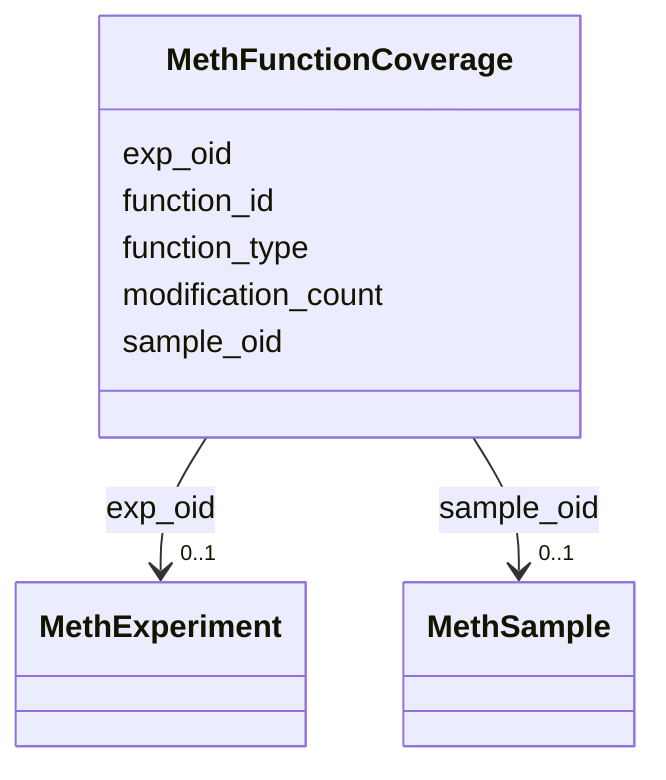

# Class: MethFunctionCoverage 


URI: [img_methylome:MethFunctionCoverage](https://w3id.org/jgi/img_methylome/MethFunctionCoverage)





<!-- no inheritance hierarchy -->


## Slots

| Name | Cardinality and Range | Description | Inheritance |
| ---  | --- | --- | --- |
| [exp_oid](exp_oid.md) | 0..1 <br/> [MethExperiment](MethExperiment.md) | Foreign key to meth_experiment | direct |
| [sample_oid](sample_oid.md) | 0..1 <br/> [MethSample](MethSample.md) | Foreign key to meth_sample | direct |
| [function_type](function_type.md) | 0..1 <br/> [String](String.md) |  | direct |
| [function_id](function_id.md) | 0..1 <br/> [String](String.md) |  | direct |
| [modification_count](modification_count.md) | 0..1 <br/> [Float](Float.md) |  | direct |


## Identifier and Mapping Information


### Schema Source


* from schema: https://w3id.org/jgi/img_methylome


## Mappings

| Mapping Type | Mapped Value |
| ---  | ---  |
| self | img_methylome:MethFunctionCoverage |
| native | img_methylome:MethFunctionCoverage |


## LinkML Source

<!-- TODO: investigate https://stackoverflow.com/questions/37606292/how-to-create-tabbed-code-blocks-in-mkdocs-or-sphinx -->

### Direct

<details>
```yaml
name: meth_function_coverage
from_schema: https://w3id.org/jgi/img_methylome
attributes:
  exp_oid:
    name: exp_oid
    description: Foreign key to meth_experiment
    from_schema: https://w3id.org/jgi/img_methylome
    domain_of:
    - meth_exp
    - meth_experiment
    - meth_experiment_ext_links
    - meth_experiment_publications
    - meth_function_coverage
    - meth_stats
    range: meth_experiment
    required: false
  sample_oid:
    name: sample_oid
    description: Foreign key to meth_sample
    from_schema: https://w3id.org/jgi/img_methylome
    rank: 1000
    domain_of:
    - meth_function_coverage
    - meth_sample
    - meth_stats
    range: meth_sample
    required: false
  function_type:
    name: function_type
    from_schema: https://w3id.org/jgi/img_methylome
    rank: 1000
    domain_of:
    - meth_function_coverage
    range: string
    required: false
  function_id:
    name: function_id
    from_schema: https://w3id.org/jgi/img_methylome
    rank: 1000
    domain_of:
    - meth_function_coverage
    range: string
    required: false
  modification_count:
    name: modification_count
    from_schema: https://w3id.org/jgi/img_methylome
    rank: 1000
    domain_of:
    - meth_function_coverage
    range: float
    required: false

```
</details>

### Induced

<details>
```yaml
name: meth_function_coverage
from_schema: https://w3id.org/jgi/img_methylome
attributes:
  exp_oid:
    name: exp_oid
    description: Foreign key to meth_experiment
    from_schema: https://w3id.org/jgi/img_methylome
    alias: exp_oid
    owner: meth_function_coverage
    domain_of:
    - meth_exp
    - meth_experiment
    - meth_experiment_ext_links
    - meth_experiment_publications
    - meth_function_coverage
    - meth_stats
    range: meth_experiment
    required: false
  sample_oid:
    name: sample_oid
    description: Foreign key to meth_sample
    from_schema: https://w3id.org/jgi/img_methylome
    rank: 1000
    alias: sample_oid
    owner: meth_function_coverage
    domain_of:
    - meth_function_coverage
    - meth_sample
    - meth_stats
    range: meth_sample
    required: false
  function_type:
    name: function_type
    from_schema: https://w3id.org/jgi/img_methylome
    rank: 1000
    alias: function_type
    owner: meth_function_coverage
    domain_of:
    - meth_function_coverage
    range: string
    required: false
  function_id:
    name: function_id
    from_schema: https://w3id.org/jgi/img_methylome
    rank: 1000
    alias: function_id
    owner: meth_function_coverage
    domain_of:
    - meth_function_coverage
    range: string
    required: false
  modification_count:
    name: modification_count
    from_schema: https://w3id.org/jgi/img_methylome
    rank: 1000
    alias: modification_count
    owner: meth_function_coverage
    domain_of:
    - meth_function_coverage
    range: float
    required: false

```
</details>