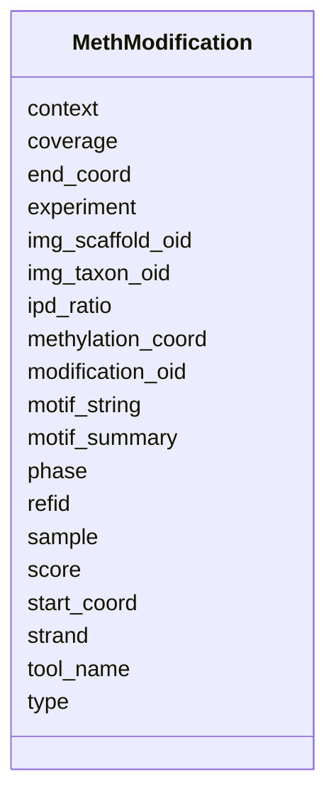

# Class: MethModification 


URI: [img_methylome:MethModification](https://w3id.org/jgi/img_methylome/MethModification)





<!-- no inheritance hierarchy -->


## Slots

| Name | Cardinality and Range | Description | Inheritance |
| ---  | --- | --- | --- |
| [modification_oid](modification_oid.md) | 0..1 <br/> [Integer](Integer.md) |  | direct |
| [motif_summary](motif_summary.md) | 0..1 <br/> [Integer](Integer.md) |  | direct |
| [refid](refid.md) | 0..1 <br/> [String](String.md) |  | direct |
| [img_scaffold_oid](img_scaffold_oid.md) | 0..1 <br/> [Integer](Integer.md) |  | direct |
| [img_taxon_oid](img_taxon_oid.md) | 0..1 <br/> [Integer](Integer.md) |  | direct |
| [tool_name](tool_name.md) | 0..1 <br/> [String](String.md) |  | direct |
| [type](type.md) | 0..1 <br/> [String](String.md) |  | direct |
| [start_coord](start_coord.md) | 0..1 <br/> [Float](Float.md) |  | direct |
| [end_coord](end_coord.md) | 0..1 <br/> [Float](Float.md) |  | direct |
| [score](score.md) | 0..1 <br/> [Float](Float.md) |  | direct |
| [strand](strand.md) | 0..1 <br/> [String](String.md) |  | direct |
| [phase](phase.md) | 0..1 <br/> [String](String.md) |  | direct |
| [ipd_ratio](ipd_ratio.md) | 0..1 <br/> [Float](Float.md) |  | direct |
| [context](context.md) | 0..1 <br/> [String](String.md) |  | direct |
| [coverage](coverage.md) | 0..1 <br/> [Float](Float.md) |  | direct |
| [motif_string](motif_string.md) | 0..1 <br/> [String](String.md) |  | direct |
| [sample](sample.md) | 0..1 <br/> [Integer](Integer.md) |  | direct |
| [experiment](experiment.md) | 0..1 <br/> [Integer](Integer.md) |  | direct |
| [methylation_coord](methylation_coord.md) | 0..1 <br/> [Float](Float.md) |  | direct |


## Identifier and Mapping Information


### Schema Source


* from schema: https://w3id.org/jgi/img_methylome


## Mappings

| Mapping Type | Mapped Value |
| ---  | ---  |
| self | img_methylome:MethModification |
| native | img_methylome:MethModification |


## LinkML Source

<!-- TODO: investigate https://stackoverflow.com/questions/37606292/how-to-create-tabbed-code-blocks-in-mkdocs-or-sphinx -->

### Direct

<details>
```yaml
name: meth_modification
from_schema: https://w3id.org/jgi/img_methylome
attributes:
  modification_oid:
    name: modification_oid
    from_schema: https://w3id.org/jgi/img_methylome
    rank: 1000
    domain_of:
    - meth_modification
    range: integer
    required: false
  motif_summary:
    name: motif_summary
    from_schema: https://w3id.org/jgi/img_methylome
    rank: 1000
    domain_of:
    - meth_modification
    range: integer
    required: false
  refid:
    name: refid
    from_schema: https://w3id.org/jgi/img_methylome
    rank: 1000
    domain_of:
    - meth_modification
    - meth_motif
    range: string
    required: false
  img_scaffold_oid:
    name: img_scaffold_oid
    from_schema: https://w3id.org/jgi/img_methylome
    rank: 1000
    domain_of:
    - meth_modification
    - meth_motif
    range: integer
    required: false
  img_taxon_oid:
    name: img_taxon_oid
    from_schema: https://w3id.org/jgi/img_methylome
    rank: 1000
    domain_of:
    - meth_modification
    - meth_motif
    - meth_motif_summary
    - meth_sample
    range: integer
    required: false
  tool_name:
    name: tool_name
    from_schema: https://w3id.org/jgi/img_methylome
    rank: 1000
    domain_of:
    - meth_modification
    - meth_motif
    range: string
    required: false
  type:
    name: type
    from_schema: https://w3id.org/jgi/img_methylome
    rank: 1000
    domain_of:
    - meth_modification
    - meth_motif
    range: string
    required: false
  start_coord:
    name: start_coord
    from_schema: https://w3id.org/jgi/img_methylome
    rank: 1000
    domain_of:
    - meth_modification
    - meth_motif
    range: float
    required: false
  end_coord:
    name: end_coord
    from_schema: https://w3id.org/jgi/img_methylome
    rank: 1000
    domain_of:
    - meth_modification
    - meth_motif
    range: float
    required: false
  score:
    name: score
    from_schema: https://w3id.org/jgi/img_methylome
    rank: 1000
    domain_of:
    - meth_modification
    - meth_motif
    range: float
    required: false
  strand:
    name: strand
    from_schema: https://w3id.org/jgi/img_methylome
    rank: 1000
    domain_of:
    - meth_modification
    - meth_motif
    range: string
    required: false
  phase:
    name: phase
    from_schema: https://w3id.org/jgi/img_methylome
    rank: 1000
    domain_of:
    - meth_modification
    - meth_motif
    range: string
    required: false
  ipd_ratio:
    name: ipd_ratio
    from_schema: https://w3id.org/jgi/img_methylome
    rank: 1000
    domain_of:
    - meth_modification
    - meth_motif
    range: float
    required: false
  context:
    name: context
    from_schema: https://w3id.org/jgi/img_methylome
    rank: 1000
    domain_of:
    - meth_modification
    - meth_motif
    range: string
    required: false
  coverage:
    name: coverage
    from_schema: https://w3id.org/jgi/img_methylome
    rank: 1000
    domain_of:
    - meth_modification
    - meth_motif
    range: float
    required: false
  motif_string:
    name: motif_string
    from_schema: https://w3id.org/jgi/img_methylome
    rank: 1000
    domain_of:
    - meth_modification
    - meth_motif
    - meth_motif_summary
    range: string
    required: false
  sample:
    name: sample
    from_schema: https://w3id.org/jgi/img_methylome
    rank: 1000
    domain_of:
    - meth_modification
    - meth_motif
    - meth_motif_summary
    range: integer
    required: false
  experiment:
    name: experiment
    from_schema: https://w3id.org/jgi/img_methylome
    rank: 1000
    domain_of:
    - meth_modification
    - meth_motif
    - meth_motif_summary
    - meth_sample
    range: integer
    required: false
  methylation_coord:
    name: methylation_coord
    from_schema: https://w3id.org/jgi/img_methylome
    rank: 1000
    domain_of:
    - meth_modification
    range: float
    required: false

```
</details>

### Induced

<details>
```yaml
name: meth_modification
from_schema: https://w3id.org/jgi/img_methylome
attributes:
  modification_oid:
    name: modification_oid
    from_schema: https://w3id.org/jgi/img_methylome
    rank: 1000
    alias: modification_oid
    owner: meth_modification
    domain_of:
    - meth_modification
    range: integer
    required: false
  motif_summary:
    name: motif_summary
    from_schema: https://w3id.org/jgi/img_methylome
    rank: 1000
    alias: motif_summary
    owner: meth_modification
    domain_of:
    - meth_modification
    range: integer
    required: false
  refid:
    name: refid
    from_schema: https://w3id.org/jgi/img_methylome
    rank: 1000
    alias: refid
    owner: meth_modification
    domain_of:
    - meth_modification
    - meth_motif
    range: string
    required: false
  img_scaffold_oid:
    name: img_scaffold_oid
    from_schema: https://w3id.org/jgi/img_methylome
    rank: 1000
    alias: img_scaffold_oid
    owner: meth_modification
    domain_of:
    - meth_modification
    - meth_motif
    range: integer
    required: false
  img_taxon_oid:
    name: img_taxon_oid
    from_schema: https://w3id.org/jgi/img_methylome
    rank: 1000
    alias: img_taxon_oid
    owner: meth_modification
    domain_of:
    - meth_modification
    - meth_motif
    - meth_motif_summary
    - meth_sample
    range: integer
    required: false
  tool_name:
    name: tool_name
    from_schema: https://w3id.org/jgi/img_methylome
    rank: 1000
    alias: tool_name
    owner: meth_modification
    domain_of:
    - meth_modification
    - meth_motif
    range: string
    required: false
  type:
    name: type
    from_schema: https://w3id.org/jgi/img_methylome
    rank: 1000
    alias: type
    owner: meth_modification
    domain_of:
    - meth_modification
    - meth_motif
    range: string
    required: false
  start_coord:
    name: start_coord
    from_schema: https://w3id.org/jgi/img_methylome
    rank: 1000
    alias: start_coord
    owner: meth_modification
    domain_of:
    - meth_modification
    - meth_motif
    range: float
    required: false
  end_coord:
    name: end_coord
    from_schema: https://w3id.org/jgi/img_methylome
    rank: 1000
    alias: end_coord
    owner: meth_modification
    domain_of:
    - meth_modification
    - meth_motif
    range: float
    required: false
  score:
    name: score
    from_schema: https://w3id.org/jgi/img_methylome
    rank: 1000
    alias: score
    owner: meth_modification
    domain_of:
    - meth_modification
    - meth_motif
    range: float
    required: false
  strand:
    name: strand
    from_schema: https://w3id.org/jgi/img_methylome
    rank: 1000
    alias: strand
    owner: meth_modification
    domain_of:
    - meth_modification
    - meth_motif
    range: string
    required: false
  phase:
    name: phase
    from_schema: https://w3id.org/jgi/img_methylome
    rank: 1000
    alias: phase
    owner: meth_modification
    domain_of:
    - meth_modification
    - meth_motif
    range: string
    required: false
  ipd_ratio:
    name: ipd_ratio
    from_schema: https://w3id.org/jgi/img_methylome
    rank: 1000
    alias: ipd_ratio
    owner: meth_modification
    domain_of:
    - meth_modification
    - meth_motif
    range: float
    required: false
  context:
    name: context
    from_schema: https://w3id.org/jgi/img_methylome
    rank: 1000
    alias: context
    owner: meth_modification
    domain_of:
    - meth_modification
    - meth_motif
    range: string
    required: false
  coverage:
    name: coverage
    from_schema: https://w3id.org/jgi/img_methylome
    rank: 1000
    alias: coverage
    owner: meth_modification
    domain_of:
    - meth_modification
    - meth_motif
    range: float
    required: false
  motif_string:
    name: motif_string
    from_schema: https://w3id.org/jgi/img_methylome
    rank: 1000
    alias: motif_string
    owner: meth_modification
    domain_of:
    - meth_modification
    - meth_motif
    - meth_motif_summary
    range: string
    required: false
  sample:
    name: sample
    from_schema: https://w3id.org/jgi/img_methylome
    rank: 1000
    alias: sample
    owner: meth_modification
    domain_of:
    - meth_modification
    - meth_motif
    - meth_motif_summary
    range: integer
    required: false
  experiment:
    name: experiment
    from_schema: https://w3id.org/jgi/img_methylome
    rank: 1000
    alias: experiment
    owner: meth_modification
    domain_of:
    - meth_modification
    - meth_motif
    - meth_motif_summary
    - meth_sample
    range: integer
    required: false
  methylation_coord:
    name: methylation_coord
    from_schema: https://w3id.org/jgi/img_methylome
    rank: 1000
    alias: methylation_coord
    owner: meth_modification
    domain_of:
    - meth_modification
    range: float
    required: false

```
</details>