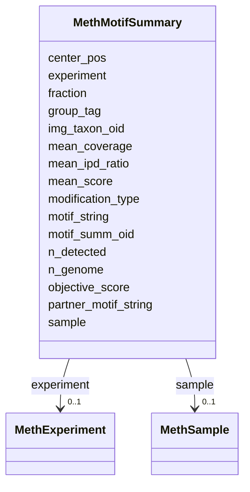

# Class: MethMotifSummary 


URI: [img_methylome:MethMotifSummary](https://w3id.org/jgi/img_methylome/MethMotifSummary)





<!-- no inheritance hierarchy -->


## Slots

| Name | Cardinality and Range | Description | Inheritance |
| ---  | --- | --- | --- |
| [motif_summ_oid](motif_summ_oid.md) | 0..1 <br/> [Integer](Integer.md) |  | direct |
| [experiment](experiment.md) | 0..1 <br/> [MethExperiment](MethExperiment.md) | Foreign key to meth_experiment | direct |
| [sample](sample.md) | 0..1 <br/> [MethSample](MethSample.md) | Foreign key to meth_sample | direct |
| [img_taxon_oid](img_taxon_oid.md) | 0..1 <br/> [Integer](Integer.md) |  | direct |
| [motif_string](motif_string.md) | 0..1 <br/> [String](String.md) |  | direct |
| [center_pos](center_pos.md) | 0..1 <br/> [Float](Float.md) |  | direct |
| [fraction](fraction.md) | 0..1 <br/> [Float](Float.md) |  | direct |
| [n_detected](n_detected.md) | 0..1 <br/> [Float](Float.md) |  | direct |
| [n_genome](n_genome.md) | 0..1 <br/> [Float](Float.md) |  | direct |
| [group_tag](group_tag.md) | 0..1 <br/> [String](String.md) |  | direct |
| [partner_motif_string](partner_motif_string.md) | 0..1 <br/> [String](String.md) |  | direct |
| [mean_score](mean_score.md) | 0..1 <br/> [Float](Float.md) |  | direct |
| [mean_ipd_ratio](mean_ipd_ratio.md) | 0..1 <br/> [Float](Float.md) |  | direct |
| [mean_coverage](mean_coverage.md) | 0..1 <br/> [Float](Float.md) |  | direct |
| [objective_score](objective_score.md) | 0..1 <br/> [Float](Float.md) |  | direct |
| [modification_type](modification_type.md) | 0..1 <br/> [String](String.md) |  | direct |


## Identifier and Mapping Information


### Schema Source


* from schema: https://w3id.org/jgi/img_methylome


## Mappings

| Mapping Type | Mapped Value |
| ---  | ---  |
| self | img_methylome:MethMotifSummary |
| native | img_methylome:MethMotifSummary |


## LinkML Source

<!-- TODO: investigate https://stackoverflow.com/questions/37606292/how-to-create-tabbed-code-blocks-in-mkdocs-or-sphinx -->

### Direct

<details>
```yaml
name: meth_motif_summary
from_schema: https://w3id.org/jgi/img_methylome
attributes:
  motif_summ_oid:
    name: motif_summ_oid
    from_schema: https://w3id.org/jgi/img_methylome
    rank: 1000
    domain_of:
    - meth_motif_summary
    range: integer
    required: false
  experiment:
    name: experiment
    description: Foreign key to meth_experiment
    from_schema: https://w3id.org/jgi/img_methylome
    domain_of:
    - meth_modification
    - meth_motif
    - meth_motif_summary
    - meth_sample
    range: meth_experiment
    required: false
  sample:
    name: sample
    description: Foreign key to meth_sample
    from_schema: https://w3id.org/jgi/img_methylome
    domain_of:
    - meth_modification
    - meth_motif
    - meth_motif_summary
    range: meth_sample
    required: false
  img_taxon_oid:
    name: img_taxon_oid
    from_schema: https://w3id.org/jgi/img_methylome
    domain_of:
    - meth_modification
    - meth_motif
    - meth_motif_summary
    - meth_sample
    range: integer
    required: false
  motif_string:
    name: motif_string
    from_schema: https://w3id.org/jgi/img_methylome
    domain_of:
    - meth_modification
    - meth_motif
    - meth_motif_summary
    range: string
    required: false
  center_pos:
    name: center_pos
    from_schema: https://w3id.org/jgi/img_methylome
    rank: 1000
    domain_of:
    - meth_motif_summary
    range: float
    required: false
  fraction:
    name: fraction
    from_schema: https://w3id.org/jgi/img_methylome
    rank: 1000
    domain_of:
    - meth_motif_summary
    range: float
    required: false
  n_detected:
    name: n_detected
    from_schema: https://w3id.org/jgi/img_methylome
    rank: 1000
    domain_of:
    - meth_motif_summary
    range: float
    required: false
  n_genome:
    name: n_genome
    from_schema: https://w3id.org/jgi/img_methylome
    rank: 1000
    domain_of:
    - meth_motif_summary
    range: float
    required: false
  group_tag:
    name: group_tag
    from_schema: https://w3id.org/jgi/img_methylome
    rank: 1000
    domain_of:
    - meth_motif_summary
    range: string
    required: false
  partner_motif_string:
    name: partner_motif_string
    from_schema: https://w3id.org/jgi/img_methylome
    rank: 1000
    domain_of:
    - meth_motif_summary
    range: string
    required: false
  mean_score:
    name: mean_score
    from_schema: https://w3id.org/jgi/img_methylome
    rank: 1000
    domain_of:
    - meth_motif_summary
    range: float
    required: false
  mean_ipd_ratio:
    name: mean_ipd_ratio
    from_schema: https://w3id.org/jgi/img_methylome
    rank: 1000
    domain_of:
    - meth_motif_summary
    range: float
    required: false
  mean_coverage:
    name: mean_coverage
    from_schema: https://w3id.org/jgi/img_methylome
    rank: 1000
    domain_of:
    - meth_motif_summary
    range: float
    required: false
  objective_score:
    name: objective_score
    from_schema: https://w3id.org/jgi/img_methylome
    rank: 1000
    domain_of:
    - meth_motif_summary
    range: float
    required: false
  modification_type:
    name: modification_type
    from_schema: https://w3id.org/jgi/img_methylome
    rank: 1000
    domain_of:
    - meth_motif_summary
    range: string
    required: false

```
</details>

### Induced

<details>
```yaml
name: meth_motif_summary
from_schema: https://w3id.org/jgi/img_methylome
attributes:
  motif_summ_oid:
    name: motif_summ_oid
    from_schema: https://w3id.org/jgi/img_methylome
    rank: 1000
    alias: motif_summ_oid
    owner: meth_motif_summary
    domain_of:
    - meth_motif_summary
    range: integer
    required: false
  experiment:
    name: experiment
    description: Foreign key to meth_experiment
    from_schema: https://w3id.org/jgi/img_methylome
    alias: experiment
    owner: meth_motif_summary
    domain_of:
    - meth_modification
    - meth_motif
    - meth_motif_summary
    - meth_sample
    range: meth_experiment
    required: false
  sample:
    name: sample
    description: Foreign key to meth_sample
    from_schema: https://w3id.org/jgi/img_methylome
    alias: sample
    owner: meth_motif_summary
    domain_of:
    - meth_modification
    - meth_motif
    - meth_motif_summary
    range: meth_sample
    required: false
  img_taxon_oid:
    name: img_taxon_oid
    from_schema: https://w3id.org/jgi/img_methylome
    alias: img_taxon_oid
    owner: meth_motif_summary
    domain_of:
    - meth_modification
    - meth_motif
    - meth_motif_summary
    - meth_sample
    range: integer
    required: false
  motif_string:
    name: motif_string
    from_schema: https://w3id.org/jgi/img_methylome
    alias: motif_string
    owner: meth_motif_summary
    domain_of:
    - meth_modification
    - meth_motif
    - meth_motif_summary
    range: string
    required: false
  center_pos:
    name: center_pos
    from_schema: https://w3id.org/jgi/img_methylome
    rank: 1000
    alias: center_pos
    owner: meth_motif_summary
    domain_of:
    - meth_motif_summary
    range: float
    required: false
  fraction:
    name: fraction
    from_schema: https://w3id.org/jgi/img_methylome
    rank: 1000
    alias: fraction
    owner: meth_motif_summary
    domain_of:
    - meth_motif_summary
    range: float
    required: false
  n_detected:
    name: n_detected
    from_schema: https://w3id.org/jgi/img_methylome
    rank: 1000
    alias: n_detected
    owner: meth_motif_summary
    domain_of:
    - meth_motif_summary
    range: float
    required: false
  n_genome:
    name: n_genome
    from_schema: https://w3id.org/jgi/img_methylome
    rank: 1000
    alias: n_genome
    owner: meth_motif_summary
    domain_of:
    - meth_motif_summary
    range: float
    required: false
  group_tag:
    name: group_tag
    from_schema: https://w3id.org/jgi/img_methylome
    rank: 1000
    alias: group_tag
    owner: meth_motif_summary
    domain_of:
    - meth_motif_summary
    range: string
    required: false
  partner_motif_string:
    name: partner_motif_string
    from_schema: https://w3id.org/jgi/img_methylome
    rank: 1000
    alias: partner_motif_string
    owner: meth_motif_summary
    domain_of:
    - meth_motif_summary
    range: string
    required: false
  mean_score:
    name: mean_score
    from_schema: https://w3id.org/jgi/img_methylome
    rank: 1000
    alias: mean_score
    owner: meth_motif_summary
    domain_of:
    - meth_motif_summary
    range: float
    required: false
  mean_ipd_ratio:
    name: mean_ipd_ratio
    from_schema: https://w3id.org/jgi/img_methylome
    rank: 1000
    alias: mean_ipd_ratio
    owner: meth_motif_summary
    domain_of:
    - meth_motif_summary
    range: float
    required: false
  mean_coverage:
    name: mean_coverage
    from_schema: https://w3id.org/jgi/img_methylome
    rank: 1000
    alias: mean_coverage
    owner: meth_motif_summary
    domain_of:
    - meth_motif_summary
    range: float
    required: false
  objective_score:
    name: objective_score
    from_schema: https://w3id.org/jgi/img_methylome
    rank: 1000
    alias: objective_score
    owner: meth_motif_summary
    domain_of:
    - meth_motif_summary
    range: float
    required: false
  modification_type:
    name: modification_type
    from_schema: https://w3id.org/jgi/img_methylome
    rank: 1000
    alias: modification_type
    owner: meth_motif_summary
    domain_of:
    - meth_motif_summary
    range: string
    required: false

```
</details>