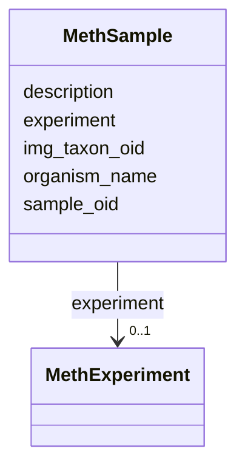

# Class: MethSample 


URI: [img_methylome:MethSample](https://w3id.org/jgi/img_methylome/MethSample)





<!-- no inheritance hierarchy -->


## Slots

| Name | Cardinality and Range | Description | Inheritance |
| ---  | --- | --- | --- |
| [sample_oid](sample_oid.md) | 0..1 <br/> [Integer](Integer.md) |  | direct |
| [description](description.md) | 0..1 <br/> [String](String.md) |  | direct |
| [organism_name](organism_name.md) | 0..1 <br/> [String](String.md) |  | direct |
| [img_taxon_oid](img_taxon_oid.md) | 0..1 <br/> [Integer](Integer.md) |  | direct |
| [experiment](experiment.md) | 0..1 <br/> [MethExperiment](MethExperiment.md) | Foreign key to meth_experiment | direct |


## Usages

| used by | used in | type | used |
| ---  | --- | --- | --- |
| [MethFunctionCoverage](MethFunctionCoverage.md) | [sample_oid](sample_oid.md) | range | [MethSample](MethSample.md) |
| [MethMotifSummary](MethMotifSummary.md) | [sample](sample.md) | range | [MethSample](MethSample.md) |
| [MethStats](MethStats.md) | [sample_oid](sample_oid.md) | range | [MethSample](MethSample.md) |


## Identifier and Mapping Information


### Schema Source


* from schema: https://w3id.org/jgi/img_methylome


## Mappings

| Mapping Type | Mapped Value |
| ---  | ---  |
| self | img_methylome:MethSample |
| native | img_methylome:MethSample |


## LinkML Source

<!-- TODO: investigate https://stackoverflow.com/questions/37606292/how-to-create-tabbed-code-blocks-in-mkdocs-or-sphinx -->

### Direct

<details>
```yaml
name: meth_sample
from_schema: https://w3id.org/jgi/img_methylome
attributes:
  sample_oid:
    name: sample_oid
    from_schema: https://w3id.org/jgi/img_methylome
    domain_of:
    - meth_function_coverage
    - meth_sample
    - meth_stats
    range: integer
    required: false
  description:
    name: description
    from_schema: https://w3id.org/jgi/img_methylome
    domain_of:
    - meth_exp
    - meth_experiment
    - meth_sample
    range: string
    required: false
  organism_name:
    name: organism_name
    from_schema: https://w3id.org/jgi/img_methylome
    rank: 1000
    domain_of:
    - meth_sample
    range: string
    required: false
  img_taxon_oid:
    name: img_taxon_oid
    from_schema: https://w3id.org/jgi/img_methylome
    domain_of:
    - meth_modification
    - meth_motif
    - meth_motif_summary
    - meth_sample
    range: integer
    required: false
  experiment:
    name: experiment
    description: Foreign key to meth_experiment
    from_schema: https://w3id.org/jgi/img_methylome
    domain_of:
    - meth_modification
    - meth_motif
    - meth_motif_summary
    - meth_sample
    range: meth_experiment
    required: false

```
</details>

### Induced

<details>
```yaml
name: meth_sample
from_schema: https://w3id.org/jgi/img_methylome
attributes:
  sample_oid:
    name: sample_oid
    from_schema: https://w3id.org/jgi/img_methylome
    alias: sample_oid
    owner: meth_sample
    domain_of:
    - meth_function_coverage
    - meth_sample
    - meth_stats
    range: integer
    required: false
  description:
    name: description
    from_schema: https://w3id.org/jgi/img_methylome
    alias: description
    owner: meth_sample
    domain_of:
    - meth_exp
    - meth_experiment
    - meth_sample
    range: string
    required: false
  organism_name:
    name: organism_name
    from_schema: https://w3id.org/jgi/img_methylome
    rank: 1000
    alias: organism_name
    owner: meth_sample
    domain_of:
    - meth_sample
    range: string
    required: false
  img_taxon_oid:
    name: img_taxon_oid
    from_schema: https://w3id.org/jgi/img_methylome
    alias: img_taxon_oid
    owner: meth_sample
    domain_of:
    - meth_modification
    - meth_motif
    - meth_motif_summary
    - meth_sample
    range: integer
    required: false
  experiment:
    name: experiment
    description: Foreign key to meth_experiment
    from_schema: https://w3id.org/jgi/img_methylome
    alias: experiment
    owner: meth_sample
    domain_of:
    - meth_modification
    - meth_motif
    - meth_motif_summary
    - meth_sample
    range: meth_experiment
    required: false

```
</details>