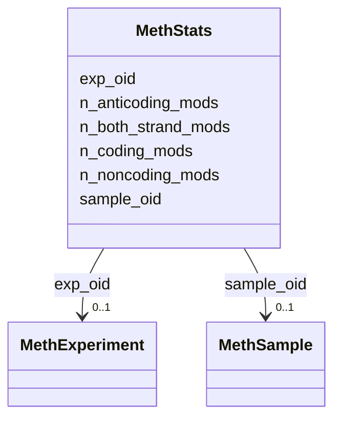

# Class: MethStats 


URI: [img_methylome:MethStats](https://w3id.org/jgi/img_methylome/MethStats)





<!-- no inheritance hierarchy -->


## Slots

| Name | Cardinality and Range | Description | Inheritance |
| ---  | --- | --- | --- |
| [exp_oid](exp_oid.md) | 0..1 <br/> [MethExperiment](MethExperiment.md) | Foreign key to meth_experiment | direct |
| [sample_oid](sample_oid.md) | 0..1 <br/> [MethSample](MethSample.md) | Foreign key to meth_sample | direct |
| [n_coding_mods](n_coding_mods.md) | 0..1 <br/> [Float](Float.md) |  | direct |
| [n_anticoding_mods](n_anticoding_mods.md) | 0..1 <br/> [Float](Float.md) |  | direct |
| [n_noncoding_mods](n_noncoding_mods.md) | 0..1 <br/> [Float](Float.md) |  | direct |
| [n_both_strand_mods](n_both_strand_mods.md) | 0..1 <br/> [Float](Float.md) |  | direct |


## Identifier and Mapping Information


### Schema Source


* from schema: https://w3id.org/jgi/img_methylome


## Mappings

| Mapping Type | Mapped Value |
| ---  | ---  |
| self | img_methylome:MethStats |
| native | img_methylome:MethStats |


## LinkML Source

<!-- TODO: investigate https://stackoverflow.com/questions/37606292/how-to-create-tabbed-code-blocks-in-mkdocs-or-sphinx -->

### Direct

<details>
```yaml
name: meth_stats
from_schema: https://w3id.org/jgi/img_methylome
attributes:
  exp_oid:
    name: exp_oid
    description: Foreign key to meth_experiment
    from_schema: https://w3id.org/jgi/img_methylome
    domain_of:
    - meth_exp
    - meth_experiment
    - meth_experiment_ext_links
    - meth_experiment_publications
    - meth_function_coverage
    - meth_stats
    range: meth_experiment
    required: false
  sample_oid:
    name: sample_oid
    description: Foreign key to meth_sample
    from_schema: https://w3id.org/jgi/img_methylome
    domain_of:
    - meth_function_coverage
    - meth_sample
    - meth_stats
    range: meth_sample
    required: false
  n_coding_mods:
    name: n_coding_mods
    from_schema: https://w3id.org/jgi/img_methylome
    rank: 1000
    domain_of:
    - meth_stats
    range: float
    required: false
  n_anticoding_mods:
    name: n_anticoding_mods
    from_schema: https://w3id.org/jgi/img_methylome
    rank: 1000
    domain_of:
    - meth_stats
    range: float
    required: false
  n_noncoding_mods:
    name: n_noncoding_mods
    from_schema: https://w3id.org/jgi/img_methylome
    rank: 1000
    domain_of:
    - meth_stats
    range: float
    required: false
  n_both_strand_mods:
    name: n_both_strand_mods
    from_schema: https://w3id.org/jgi/img_methylome
    rank: 1000
    domain_of:
    - meth_stats
    range: float
    required: false

```
</details>

### Induced

<details>
```yaml
name: meth_stats
from_schema: https://w3id.org/jgi/img_methylome
attributes:
  exp_oid:
    name: exp_oid
    description: Foreign key to meth_experiment
    from_schema: https://w3id.org/jgi/img_methylome
    alias: exp_oid
    owner: meth_stats
    domain_of:
    - meth_exp
    - meth_experiment
    - meth_experiment_ext_links
    - meth_experiment_publications
    - meth_function_coverage
    - meth_stats
    range: meth_experiment
    required: false
  sample_oid:
    name: sample_oid
    description: Foreign key to meth_sample
    from_schema: https://w3id.org/jgi/img_methylome
    alias: sample_oid
    owner: meth_stats
    domain_of:
    - meth_function_coverage
    - meth_sample
    - meth_stats
    range: meth_sample
    required: false
  n_coding_mods:
    name: n_coding_mods
    from_schema: https://w3id.org/jgi/img_methylome
    rank: 1000
    alias: n_coding_mods
    owner: meth_stats
    domain_of:
    - meth_stats
    range: float
    required: false
  n_anticoding_mods:
    name: n_anticoding_mods
    from_schema: https://w3id.org/jgi/img_methylome
    rank: 1000
    alias: n_anticoding_mods
    owner: meth_stats
    domain_of:
    - meth_stats
    range: float
    required: false
  n_noncoding_mods:
    name: n_noncoding_mods
    from_schema: https://w3id.org/jgi/img_methylome
    rank: 1000
    alias: n_noncoding_mods
    owner: meth_stats
    domain_of:
    - meth_stats
    range: float
    required: false
  n_both_strand_mods:
    name: n_both_strand_mods
    from_schema: https://w3id.org/jgi/img_methylome
    rank: 1000
    alias: n_both_strand_mods
    owner: meth_stats
    domain_of:
    - meth_stats
    range: float
    required: false

```
</details>