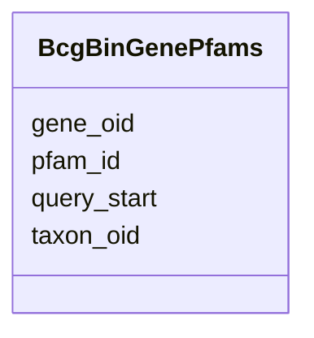

# Class: BcgBinGenePfams 


URI: [img_mysql_abc:BcgBinGenePfams](https://w3id.org/jgi/img_mysql_abc/BcgBinGenePfams)





<!-- no inheritance hierarchy -->


## Slots

| Name | Cardinality and Range | Description | Inheritance |
| ---  | --- | --- | --- |
| [gene_oid](gene_oid.md) | 0..1 <br/> [String](String.md) |  | direct |
| [pfam_id](pfam_id.md) | 0..1 <br/> [String](String.md) |  | direct |
| [query_start](query_start.md) | 0..1 <br/> [Integer](Integer.md) |  | direct |
| [taxon_oid](taxon_oid.md) | 0..1 <br/> [Integer](Integer.md) |  | direct |


## Identifier and Mapping Information


### Schema Source


* from schema: https://w3id.org/jgi/img_mysql_abc


## Mappings

| Mapping Type | Mapped Value |
| ---  | ---  |
| self | img_mysql_abc:BcgBinGenePfams |
| native | img_mysql_abc:BcgBinGenePfams |


## LinkML Source

<!-- TODO: investigate https://stackoverflow.com/questions/37606292/how-to-create-tabbed-code-blocks-in-mkdocs-or-sphinx -->

### Direct

<details>
```yaml
name: bcg_bin_gene_pfams
from_schema: https://w3id.org/jgi/img_mysql_abc
attributes:
  gene_oid:
    name: gene_oid
    from_schema: https://w3id.org/jgi/img_mysql_abc
    rank: 1000
    domain_of:
    - bcg_bin_gene_pfams
    - bcg_bin_region_genes
    - bcg_gene_pfams
    - bcg_gene_pfams_obs
    - bcg_region_genes
    - bcg_region_genes_new
    - tmp_genes
    range: string
    required: false
  pfam_id:
    name: pfam_id
    from_schema: https://w3id.org/jgi/img_mysql_abc
    rank: 1000
    domain_of:
    - bcg_bin_gene_pfams
    - bcg_gene_pfams
    - bcg_gene_pfams_obs
    range: string
    required: false
  query_start:
    name: query_start
    from_schema: https://w3id.org/jgi/img_mysql_abc
    rank: 1000
    domain_of:
    - bcg_bin_gene_pfams
    - bcg_gene_pfams
    - bcg_gene_pfams_obs
    range: integer
    required: false
  taxon_oid:
    name: taxon_oid
    from_schema: https://w3id.org/jgi/img_mysql_abc
    domain_of:
    - asv5_taxons
    - bcg_bin_gene_pfams
    - bcg_bin_region
    - bcg_bin_region_genes
    - bcg_region
    - bcg_region_ext_links
    - bcg_region_genes
    - bcg_region_genes_new
    - bcg_region_new
    - bcg_region_sms
    - taxon_bcg_type
    - tmp_genes
    range: integer
    required: false

```
</details>

### Induced

<details>
```yaml
name: bcg_bin_gene_pfams
from_schema: https://w3id.org/jgi/img_mysql_abc
attributes:
  gene_oid:
    name: gene_oid
    from_schema: https://w3id.org/jgi/img_mysql_abc
    rank: 1000
    alias: gene_oid
    owner: bcg_bin_gene_pfams
    domain_of:
    - bcg_bin_gene_pfams
    - bcg_bin_region_genes
    - bcg_gene_pfams
    - bcg_gene_pfams_obs
    - bcg_region_genes
    - bcg_region_genes_new
    - tmp_genes
    range: string
    required: false
  pfam_id:
    name: pfam_id
    from_schema: https://w3id.org/jgi/img_mysql_abc
    rank: 1000
    alias: pfam_id
    owner: bcg_bin_gene_pfams
    domain_of:
    - bcg_bin_gene_pfams
    - bcg_gene_pfams
    - bcg_gene_pfams_obs
    range: string
    required: false
  query_start:
    name: query_start
    from_schema: https://w3id.org/jgi/img_mysql_abc
    rank: 1000
    alias: query_start
    owner: bcg_bin_gene_pfams
    domain_of:
    - bcg_bin_gene_pfams
    - bcg_gene_pfams
    - bcg_gene_pfams_obs
    range: integer
    required: false
  taxon_oid:
    name: taxon_oid
    from_schema: https://w3id.org/jgi/img_mysql_abc
    alias: taxon_oid
    owner: bcg_bin_gene_pfams
    domain_of:
    - asv5_taxons
    - bcg_bin_gene_pfams
    - bcg_bin_region
    - bcg_bin_region_genes
    - bcg_region
    - bcg_region_ext_links
    - bcg_region_genes
    - bcg_region_genes_new
    - bcg_region_new
    - bcg_region_sms
    - taxon_bcg_type
    - tmp_genes
    range: integer
    required: false

```
</details>