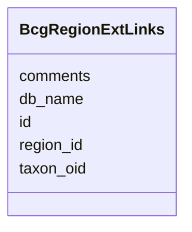

# Class: BcgRegionExtLinks 


URI: [img_mysql_abc:BcgRegionExtLinks](https://w3id.org/jgi/img_mysql_abc/BcgRegionExtLinks)





<!-- no inheritance hierarchy -->


## Slots

| Name | Cardinality and Range | Description | Inheritance |
| ---  | --- | --- | --- |
| [region_id](region_id.md) | 0..1 <br/> [String](String.md) |  | direct |
| [db_name](db_name.md) | 0..1 <br/> [String](String.md) |  | direct |
| [id](id.md) | 0..1 <br/> [String](String.md) |  | direct |
| [comments](comments.md) | 0..1 <br/> [String](String.md) |  | direct |
| [taxon_oid](taxon_oid.md) | 0..1 <br/> [Integer](Integer.md) |  | direct |


## Identifier and Mapping Information


### Schema Source


* from schema: https://w3id.org/jgi/img_mysql_abc


## Mappings

| Mapping Type | Mapped Value |
| ---  | ---  |
| self | img_mysql_abc:BcgRegionExtLinks |
| native | img_mysql_abc:BcgRegionExtLinks |


## LinkML Source

<!-- TODO: investigate https://stackoverflow.com/questions/37606292/how-to-create-tabbed-code-blocks-in-mkdocs-or-sphinx -->

### Direct

<details>
```yaml
name: bcg_region_ext_links
from_schema: https://w3id.org/jgi/img_mysql_abc
attributes:
  region_id:
    name: region_id
    from_schema: https://w3id.org/jgi/img_mysql_abc
    domain_of:
    - bcg_bin_region
    - bcg_bin_region_genes
    - bcg_region
    - bcg_region_ext_links
    - bcg_region_genes
    - bcg_region_genes_new
    - bcg_region_new
    - bcg_region_sms
    - bcg_region_stats
    range: string
    required: false
  db_name:
    name: db_name
    from_schema: https://w3id.org/jgi/img_mysql_abc
    rank: 1000
    domain_of:
    - bcg_region_ext_links
    range: string
    required: false
  id:
    name: id
    from_schema: https://w3id.org/jgi/img_mysql_abc
    rank: 1000
    domain_of:
    - bcg_region_ext_links
    range: string
    required: false
  comments:
    name: comments
    from_schema: https://w3id.org/jgi/img_mysql_abc
    rank: 1000
    domain_of:
    - bcg_region_ext_links
    range: string
    required: false
  taxon_oid:
    name: taxon_oid
    from_schema: https://w3id.org/jgi/img_mysql_abc
    domain_of:
    - asv5_taxons
    - bcg_bin_gene_pfams
    - bcg_bin_region
    - bcg_bin_region_genes
    - bcg_region
    - bcg_region_ext_links
    - bcg_region_genes
    - bcg_region_genes_new
    - bcg_region_new
    - bcg_region_sms
    - taxon_bcg_type
    - tmp_genes
    range: integer
    required: false

```
</details>

### Induced

<details>
```yaml
name: bcg_region_ext_links
from_schema: https://w3id.org/jgi/img_mysql_abc
attributes:
  region_id:
    name: region_id
    from_schema: https://w3id.org/jgi/img_mysql_abc
    alias: region_id
    owner: bcg_region_ext_links
    domain_of:
    - bcg_bin_region
    - bcg_bin_region_genes
    - bcg_region
    - bcg_region_ext_links
    - bcg_region_genes
    - bcg_region_genes_new
    - bcg_region_new
    - bcg_region_sms
    - bcg_region_stats
    range: string
    required: false
  db_name:
    name: db_name
    from_schema: https://w3id.org/jgi/img_mysql_abc
    rank: 1000
    alias: db_name
    owner: bcg_region_ext_links
    domain_of:
    - bcg_region_ext_links
    range: string
    required: false
  id:
    name: id
    from_schema: https://w3id.org/jgi/img_mysql_abc
    rank: 1000
    alias: id
    owner: bcg_region_ext_links
    domain_of:
    - bcg_region_ext_links
    range: string
    required: false
  comments:
    name: comments
    from_schema: https://w3id.org/jgi/img_mysql_abc
    rank: 1000
    alias: comments
    owner: bcg_region_ext_links
    domain_of:
    - bcg_region_ext_links
    range: string
    required: false
  taxon_oid:
    name: taxon_oid
    from_schema: https://w3id.org/jgi/img_mysql_abc
    alias: taxon_oid
    owner: bcg_region_ext_links
    domain_of:
    - asv5_taxons
    - bcg_bin_gene_pfams
    - bcg_bin_region
    - bcg_bin_region_genes
    - bcg_region
    - bcg_region_ext_links
    - bcg_region_genes
    - bcg_region_genes_new
    - bcg_region_new
    - bcg_region_sms
    - taxon_bcg_type
    - tmp_genes
    range: integer
    required: false

```
</details>