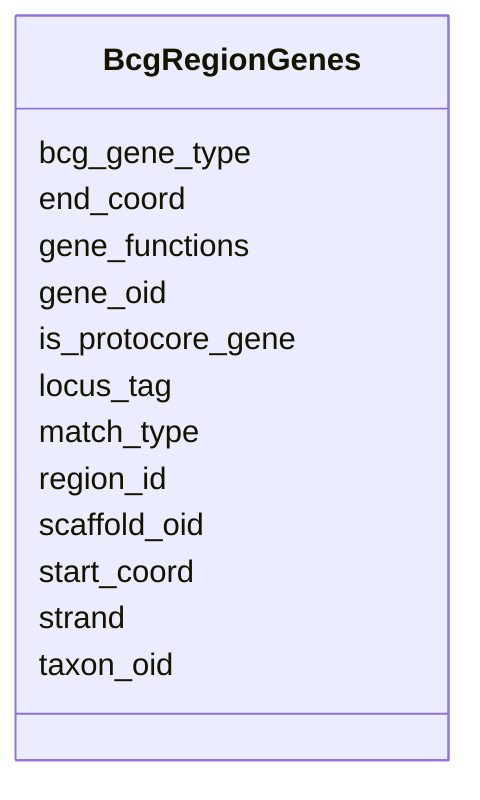

# Class: BcgRegionGenes 


URI: [img_mysql_abc:BcgRegionGenes](https://w3id.org/jgi/img_mysql_abc/BcgRegionGenes)





<!-- no inheritance hierarchy -->


## Slots

| Name | Cardinality and Range | Description | Inheritance |
| ---  | --- | --- | --- |
| [region_id](region_id.md) | 0..1 <br/> [String](String.md) |  | direct |
| [bcg_gene_type](bcg_gene_type.md) | 0..1 <br/> [String](String.md) |  | direct |
| [gene_oid](gene_oid.md) | 0..1 <br/> [Integer](Integer.md) |  | direct |
| [taxon_oid](taxon_oid.md) | 0..1 <br/> [Integer](Integer.md) |  | direct |
| [scaffold_oid](scaffold_oid.md) | 0..1 <br/> [Integer](Integer.md) |  | direct |
| [gene_functions](gene_functions.md) | 0..1 <br/> [String](String.md) |  | direct |
| [is_protocore_gene](is_protocore_gene.md) | 0..1 <br/> [String](String.md) |  | direct |
| [locus_tag](locus_tag.md) | 0..1 <br/> [String](String.md) |  | direct |
| [start_coord](start_coord.md) | 0..1 <br/> [Integer](Integer.md) |  | direct |
| [end_coord](end_coord.md) | 0..1 <br/> [Integer](Integer.md) |  | direct |
| [strand](strand.md) | 0..1 <br/> [String](String.md) |  | direct |
| [match_type](match_type.md) | 0..1 <br/> [String](String.md) |  | direct |


## Identifier and Mapping Information


### Schema Source


* from schema: https://w3id.org/jgi/img_mysql_abc


## Mappings

| Mapping Type | Mapped Value |
| ---  | ---  |
| self | img_mysql_abc:BcgRegionGenes |
| native | img_mysql_abc:BcgRegionGenes |


## LinkML Source

<!-- TODO: investigate https://stackoverflow.com/questions/37606292/how-to-create-tabbed-code-blocks-in-mkdocs-or-sphinx -->

### Direct

<details>
```yaml
name: bcg_region_genes
from_schema: https://w3id.org/jgi/img_mysql_abc
attributes:
  region_id:
    name: region_id
    from_schema: https://w3id.org/jgi/img_mysql_abc
    domain_of:
    - bcg_bin_region
    - bcg_bin_region_genes
    - bcg_region
    - bcg_region_ext_links
    - bcg_region_genes
    - bcg_region_genes_new
    - bcg_region_new
    - bcg_region_sms
    - bcg_region_stats
    range: string
    required: false
  bcg_gene_type:
    name: bcg_gene_type
    from_schema: https://w3id.org/jgi/img_mysql_abc
    domain_of:
    - bcg_bin_region_genes
    - bcg_region_genes
    - bcg_region_genes_new
    range: string
    required: false
  gene_oid:
    name: gene_oid
    from_schema: https://w3id.org/jgi/img_mysql_abc
    domain_of:
    - bcg_bin_gene_pfams
    - bcg_bin_region_genes
    - bcg_gene_pfams
    - bcg_gene_pfams_obs
    - bcg_region_genes
    - bcg_region_genes_new
    - tmp_genes
    range: integer
    required: false
  taxon_oid:
    name: taxon_oid
    from_schema: https://w3id.org/jgi/img_mysql_abc
    domain_of:
    - asv5_taxons
    - bcg_bin_gene_pfams
    - bcg_bin_region
    - bcg_bin_region_genes
    - bcg_region
    - bcg_region_ext_links
    - bcg_region_genes
    - bcg_region_genes_new
    - bcg_region_new
    - bcg_region_sms
    - taxon_bcg_type
    - tmp_genes
    range: integer
    required: false
  scaffold_oid:
    name: scaffold_oid
    from_schema: https://w3id.org/jgi/img_mysql_abc
    domain_of:
    - bcg_region
    - bcg_region_genes
    - bcg_region_genes_new
    - bcg_region_new
    - tmp_genes
    range: integer
    required: false
  gene_functions:
    name: gene_functions
    from_schema: https://w3id.org/jgi/img_mysql_abc
    domain_of:
    - bcg_bin_region_genes
    - bcg_region_genes
    - bcg_region_genes_new
    range: string
    required: false
  is_protocore_gene:
    name: is_protocore_gene
    from_schema: https://w3id.org/jgi/img_mysql_abc
    domain_of:
    - bcg_bin_region_genes
    - bcg_region_genes
    - bcg_region_genes_new
    range: string
    required: false
  locus_tag:
    name: locus_tag
    from_schema: https://w3id.org/jgi/img_mysql_abc
    rank: 1000
    domain_of:
    - bcg_region_genes
    range: string
    required: false
  start_coord:
    name: start_coord
    from_schema: https://w3id.org/jgi/img_mysql_abc
    domain_of:
    - bcg_bin_region
    - bcg_region
    - bcg_region_genes
    - bcg_region_new
    range: integer
    required: false
  end_coord:
    name: end_coord
    from_schema: https://w3id.org/jgi/img_mysql_abc
    domain_of:
    - bcg_bin_region
    - bcg_region
    - bcg_region_genes
    - bcg_region_new
    range: integer
    required: false
  strand:
    name: strand
    from_schema: https://w3id.org/jgi/img_mysql_abc
    rank: 1000
    domain_of:
    - bcg_region_genes
    range: string
    required: false
  match_type:
    name: match_type
    from_schema: https://w3id.org/jgi/img_mysql_abc
    rank: 1000
    domain_of:
    - bcg_region_genes
    range: string
    required: false

```
</details>

### Induced

<details>
```yaml
name: bcg_region_genes
from_schema: https://w3id.org/jgi/img_mysql_abc
attributes:
  region_id:
    name: region_id
    from_schema: https://w3id.org/jgi/img_mysql_abc
    alias: region_id
    owner: bcg_region_genes
    domain_of:
    - bcg_bin_region
    - bcg_bin_region_genes
    - bcg_region
    - bcg_region_ext_links
    - bcg_region_genes
    - bcg_region_genes_new
    - bcg_region_new
    - bcg_region_sms
    - bcg_region_stats
    range: string
    required: false
  bcg_gene_type:
    name: bcg_gene_type
    from_schema: https://w3id.org/jgi/img_mysql_abc
    alias: bcg_gene_type
    owner: bcg_region_genes
    domain_of:
    - bcg_bin_region_genes
    - bcg_region_genes
    - bcg_region_genes_new
    range: string
    required: false
  gene_oid:
    name: gene_oid
    from_schema: https://w3id.org/jgi/img_mysql_abc
    alias: gene_oid
    owner: bcg_region_genes
    domain_of:
    - bcg_bin_gene_pfams
    - bcg_bin_region_genes
    - bcg_gene_pfams
    - bcg_gene_pfams_obs
    - bcg_region_genes
    - bcg_region_genes_new
    - tmp_genes
    range: integer
    required: false
  taxon_oid:
    name: taxon_oid
    from_schema: https://w3id.org/jgi/img_mysql_abc
    alias: taxon_oid
    owner: bcg_region_genes
    domain_of:
    - asv5_taxons
    - bcg_bin_gene_pfams
    - bcg_bin_region
    - bcg_bin_region_genes
    - bcg_region
    - bcg_region_ext_links
    - bcg_region_genes
    - bcg_region_genes_new
    - bcg_region_new
    - bcg_region_sms
    - taxon_bcg_type
    - tmp_genes
    range: integer
    required: false
  scaffold_oid:
    name: scaffold_oid
    from_schema: https://w3id.org/jgi/img_mysql_abc
    alias: scaffold_oid
    owner: bcg_region_genes
    domain_of:
    - bcg_region
    - bcg_region_genes
    - bcg_region_genes_new
    - bcg_region_new
    - tmp_genes
    range: integer
    required: false
  gene_functions:
    name: gene_functions
    from_schema: https://w3id.org/jgi/img_mysql_abc
    alias: gene_functions
    owner: bcg_region_genes
    domain_of:
    - bcg_bin_region_genes
    - bcg_region_genes
    - bcg_region_genes_new
    range: string
    required: false
  is_protocore_gene:
    name: is_protocore_gene
    from_schema: https://w3id.org/jgi/img_mysql_abc
    alias: is_protocore_gene
    owner: bcg_region_genes
    domain_of:
    - bcg_bin_region_genes
    - bcg_region_genes
    - bcg_region_genes_new
    range: string
    required: false
  locus_tag:
    name: locus_tag
    from_schema: https://w3id.org/jgi/img_mysql_abc
    rank: 1000
    alias: locus_tag
    owner: bcg_region_genes
    domain_of:
    - bcg_region_genes
    range: string
    required: false
  start_coord:
    name: start_coord
    from_schema: https://w3id.org/jgi/img_mysql_abc
    alias: start_coord
    owner: bcg_region_genes
    domain_of:
    - bcg_bin_region
    - bcg_region
    - bcg_region_genes
    - bcg_region_new
    range: integer
    required: false
  end_coord:
    name: end_coord
    from_schema: https://w3id.org/jgi/img_mysql_abc
    alias: end_coord
    owner: bcg_region_genes
    domain_of:
    - bcg_bin_region
    - bcg_region
    - bcg_region_genes
    - bcg_region_new
    range: integer
    required: false
  strand:
    name: strand
    from_schema: https://w3id.org/jgi/img_mysql_abc
    rank: 1000
    alias: strand
    owner: bcg_region_genes
    domain_of:
    - bcg_region_genes
    range: string
    required: false
  match_type:
    name: match_type
    from_schema: https://w3id.org/jgi/img_mysql_abc
    rank: 1000
    alias: match_type
    owner: bcg_region_genes
    domain_of:
    - bcg_region_genes
    range: string
    required: false

```
</details>