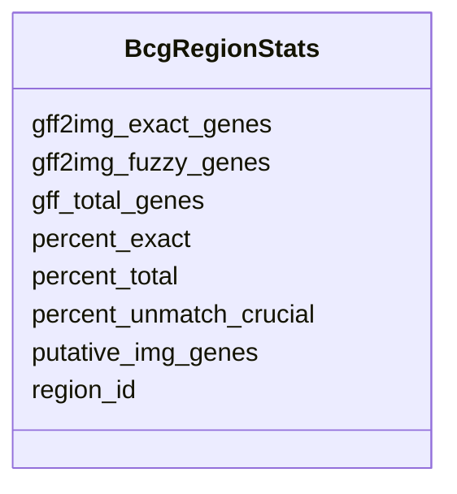

# Class: BcgRegionStats 


URI: [img_mysql_abc:BcgRegionStats](https://w3id.org/jgi/img_mysql_abc/BcgRegionStats)





<!-- no inheritance hierarchy -->


## Slots

| Name | Cardinality and Range | Description | Inheritance |
| ---  | --- | --- | --- |
| [region_id](region_id.md) | 0..1 <br/> [String](String.md) |  | direct |
| [gff_total_genes](gff_total_genes.md) | 0..1 <br/> [Integer](Integer.md) |  | direct |
| [gff2img_exact_genes](gff2img_exact_genes.md) | 0..1 <br/> [Integer](Integer.md) |  | direct |
| [gff2img_fuzzy_genes](gff2img_fuzzy_genes.md) | 0..1 <br/> [Integer](Integer.md) |  | direct |
| [putative_img_genes](putative_img_genes.md) | 0..1 <br/> [Integer](Integer.md) |  | direct |
| [percent_exact](percent_exact.md) | 0..1 <br/> [Float](Float.md) |  | direct |
| [percent_total](percent_total.md) | 0..1 <br/> [Float](Float.md) |  | direct |
| [percent_unmatch_crucial](percent_unmatch_crucial.md) | 0..1 <br/> [Float](Float.md) |  | direct |


## Identifier and Mapping Information


### Schema Source


* from schema: https://w3id.org/jgi/img_mysql_abc


## Mappings

| Mapping Type | Mapped Value |
| ---  | ---  |
| self | img_mysql_abc:BcgRegionStats |
| native | img_mysql_abc:BcgRegionStats |


## LinkML Source

<!-- TODO: investigate https://stackoverflow.com/questions/37606292/how-to-create-tabbed-code-blocks-in-mkdocs-or-sphinx -->

### Direct

<details>
```yaml
name: bcg_region_stats
from_schema: https://w3id.org/jgi/img_mysql_abc
attributes:
  region_id:
    name: region_id
    from_schema: https://w3id.org/jgi/img_mysql_abc
    domain_of:
    - bcg_bin_region
    - bcg_bin_region_genes
    - bcg_region
    - bcg_region_ext_links
    - bcg_region_genes
    - bcg_region_genes_new
    - bcg_region_new
    - bcg_region_sms
    - bcg_region_stats
    range: string
    required: false
  gff_total_genes:
    name: gff_total_genes
    from_schema: https://w3id.org/jgi/img_mysql_abc
    rank: 1000
    domain_of:
    - bcg_region_stats
    range: integer
    required: false
  gff2img_exact_genes:
    name: gff2img_exact_genes
    from_schema: https://w3id.org/jgi/img_mysql_abc
    rank: 1000
    domain_of:
    - bcg_region_stats
    range: integer
    required: false
  gff2img_fuzzy_genes:
    name: gff2img_fuzzy_genes
    from_schema: https://w3id.org/jgi/img_mysql_abc
    rank: 1000
    domain_of:
    - bcg_region_stats
    range: integer
    required: false
  putative_img_genes:
    name: putative_img_genes
    from_schema: https://w3id.org/jgi/img_mysql_abc
    rank: 1000
    domain_of:
    - bcg_region_stats
    range: integer
    required: false
  percent_exact:
    name: percent_exact
    from_schema: https://w3id.org/jgi/img_mysql_abc
    rank: 1000
    domain_of:
    - bcg_region_stats
    range: float
    required: false
  percent_total:
    name: percent_total
    from_schema: https://w3id.org/jgi/img_mysql_abc
    rank: 1000
    domain_of:
    - bcg_region_stats
    range: float
    required: false
  percent_unmatch_crucial:
    name: percent_unmatch_crucial
    from_schema: https://w3id.org/jgi/img_mysql_abc
    rank: 1000
    domain_of:
    - bcg_region_stats
    range: float
    required: false

```
</details>

### Induced

<details>
```yaml
name: bcg_region_stats
from_schema: https://w3id.org/jgi/img_mysql_abc
attributes:
  region_id:
    name: region_id
    from_schema: https://w3id.org/jgi/img_mysql_abc
    alias: region_id
    owner: bcg_region_stats
    domain_of:
    - bcg_bin_region
    - bcg_bin_region_genes
    - bcg_region
    - bcg_region_ext_links
    - bcg_region_genes
    - bcg_region_genes_new
    - bcg_region_new
    - bcg_region_sms
    - bcg_region_stats
    range: string
    required: false
  gff_total_genes:
    name: gff_total_genes
    from_schema: https://w3id.org/jgi/img_mysql_abc
    rank: 1000
    alias: gff_total_genes
    owner: bcg_region_stats
    domain_of:
    - bcg_region_stats
    range: integer
    required: false
  gff2img_exact_genes:
    name: gff2img_exact_genes
    from_schema: https://w3id.org/jgi/img_mysql_abc
    rank: 1000
    alias: gff2img_exact_genes
    owner: bcg_region_stats
    domain_of:
    - bcg_region_stats
    range: integer
    required: false
  gff2img_fuzzy_genes:
    name: gff2img_fuzzy_genes
    from_schema: https://w3id.org/jgi/img_mysql_abc
    rank: 1000
    alias: gff2img_fuzzy_genes
    owner: bcg_region_stats
    domain_of:
    - bcg_region_stats
    range: integer
    required: false
  putative_img_genes:
    name: putative_img_genes
    from_schema: https://w3id.org/jgi/img_mysql_abc
    rank: 1000
    alias: putative_img_genes
    owner: bcg_region_stats
    domain_of:
    - bcg_region_stats
    range: integer
    required: false
  percent_exact:
    name: percent_exact
    from_schema: https://w3id.org/jgi/img_mysql_abc
    rank: 1000
    alias: percent_exact
    owner: bcg_region_stats
    domain_of:
    - bcg_region_stats
    range: float
    required: false
  percent_total:
    name: percent_total
    from_schema: https://w3id.org/jgi/img_mysql_abc
    rank: 1000
    alias: percent_total
    owner: bcg_region_stats
    domain_of:
    - bcg_region_stats
    range: float
    required: false
  percent_unmatch_crucial:
    name: percent_unmatch_crucial
    from_schema: https://w3id.org/jgi/img_mysql_abc
    rank: 1000
    alias: percent_unmatch_crucial
    owner: bcg_region_stats
    domain_of:
    - bcg_region_stats
    range: float
    required: false

```
</details>