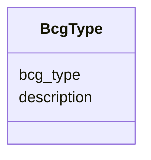

# Class: BcgType 


URI: [img_mysql_abc:BcgType](https://w3id.org/jgi/img_mysql_abc/BcgType)





<!-- no inheritance hierarchy -->


## Slots

| Name | Cardinality and Range | Description | Inheritance |
| ---  | --- | --- | --- |
| [bcg_type](bcg_type.md) | 0..1 <br/> [String](String.md) |  | direct |
| [description](description.md) | 0..1 <br/> [String](String.md) |  | direct |


## Identifier and Mapping Information


### Schema Source


* from schema: https://w3id.org/jgi/img_mysql_abc


## Mappings

| Mapping Type | Mapped Value |
| ---  | ---  |
| self | img_mysql_abc:BcgType |
| native | img_mysql_abc:BcgType |


## LinkML Source

<!-- TODO: investigate https://stackoverflow.com/questions/37606292/how-to-create-tabbed-code-blocks-in-mkdocs-or-sphinx -->

### Direct

<details>
```yaml
name: bcg_type
from_schema: https://w3id.org/jgi/img_mysql_abc
attributes:
  bcg_type:
    name: bcg_type
    from_schema: https://w3id.org/jgi/img_mysql_abc
    domain_of:
    - bcg_bin_region
    - bcg_region
    - bcg_region_new
    - bcg_type
    - taxon_bcg_type
    range: string
    required: false
  description:
    name: description
    from_schema: https://w3id.org/jgi/img_mysql_abc
    rank: 1000
    domain_of:
    - bcg_type
    range: string
    required: false

```
</details>

### Induced

<details>
```yaml
name: bcg_type
from_schema: https://w3id.org/jgi/img_mysql_abc
attributes:
  bcg_type:
    name: bcg_type
    from_schema: https://w3id.org/jgi/img_mysql_abc
    alias: bcg_type
    owner: bcg_type
    domain_of:
    - bcg_bin_region
    - bcg_region
    - bcg_region_new
    - bcg_type
    - taxon_bcg_type
    range: string
    required: false
  description:
    name: description
    from_schema: https://w3id.org/jgi/img_mysql_abc
    rank: 1000
    alias: description
    owner: bcg_type
    domain_of:
    - bcg_type
    range: string
    required: false

```
</details>