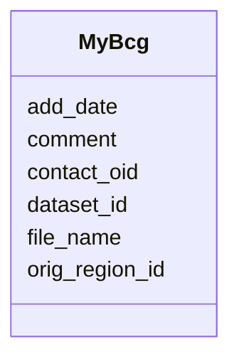

# Class: MyBcg 


URI: [img_mysql_abc:MyBcg](https://w3id.org/jgi/img_mysql_abc/MyBcg)





<!-- no inheritance hierarchy -->


## Slots

| Name | Cardinality and Range | Description | Inheritance |
| ---  | --- | --- | --- |
| [contact_oid](contact_oid.md) | 0..1 <br/> [Integer](Integer.md) |  | direct |
| [dataset_id](dataset_id.md) | 0..1 <br/> [String](String.md) |  | direct |
| [add_date](add_date.md) | 0..1 <br/> [Date](Date.md) |  | direct |
| [orig_region_id](orig_region_id.md) | 0..1 <br/> [String](String.md) |  | direct |
| [comment](comment.md) | 0..1 <br/> [String](String.md) |  | direct |
| [file_name](file_name.md) | 0..1 <br/> [String](String.md) |  | direct |


## Identifier and Mapping Information


### Schema Source


* from schema: https://w3id.org/jgi/img_mysql_abc


## Mappings

| Mapping Type | Mapped Value |
| ---  | ---  |
| self | img_mysql_abc:MyBcg |
| native | img_mysql_abc:MyBcg |


## LinkML Source

<!-- TODO: investigate https://stackoverflow.com/questions/37606292/how-to-create-tabbed-code-blocks-in-mkdocs-or-sphinx -->

### Direct

<details>
```yaml
name: my_bcg
from_schema: https://w3id.org/jgi/img_mysql_abc
attributes:
  contact_oid:
    name: contact_oid
    from_schema: https://w3id.org/jgi/img_mysql_abc
    rank: 1000
    domain_of:
    - my_bcg
    range: integer
    required: false
  dataset_id:
    name: dataset_id
    from_schema: https://w3id.org/jgi/img_mysql_abc
    rank: 1000
    domain_of:
    - my_bcg
    range: string
    required: false
  add_date:
    name: add_date
    from_schema: https://w3id.org/jgi/img_mysql_abc
    domain_of:
    - bcg_bin_region
    - bcg_region
    - bcg_region_new
    - my_bcg
    range: date
    required: false
  orig_region_id:
    name: orig_region_id
    from_schema: https://w3id.org/jgi/img_mysql_abc
    rank: 1000
    domain_of:
    - my_bcg
    range: string
    required: false
  comment:
    name: comment
    from_schema: https://w3id.org/jgi/img_mysql_abc
    rank: 1000
    domain_of:
    - my_bcg
    range: string
    required: false
  file_name:
    name: file_name
    from_schema: https://w3id.org/jgi/img_mysql_abc
    rank: 1000
    domain_of:
    - my_bcg
    range: string
    required: false

```
</details>

### Induced

<details>
```yaml
name: my_bcg
from_schema: https://w3id.org/jgi/img_mysql_abc
attributes:
  contact_oid:
    name: contact_oid
    from_schema: https://w3id.org/jgi/img_mysql_abc
    rank: 1000
    alias: contact_oid
    owner: my_bcg
    domain_of:
    - my_bcg
    range: integer
    required: false
  dataset_id:
    name: dataset_id
    from_schema: https://w3id.org/jgi/img_mysql_abc
    rank: 1000
    alias: dataset_id
    owner: my_bcg
    domain_of:
    - my_bcg
    range: string
    required: false
  add_date:
    name: add_date
    from_schema: https://w3id.org/jgi/img_mysql_abc
    alias: add_date
    owner: my_bcg
    domain_of:
    - bcg_bin_region
    - bcg_region
    - bcg_region_new
    - my_bcg
    range: date
    required: false
  orig_region_id:
    name: orig_region_id
    from_schema: https://w3id.org/jgi/img_mysql_abc
    rank: 1000
    alias: orig_region_id
    owner: my_bcg
    domain_of:
    - my_bcg
    range: string
    required: false
  comment:
    name: comment
    from_schema: https://w3id.org/jgi/img_mysql_abc
    rank: 1000
    alias: comment
    owner: my_bcg
    domain_of:
    - my_bcg
    range: string
    required: false
  file_name:
    name: file_name
    from_schema: https://w3id.org/jgi/img_mysql_abc
    rank: 1000
    alias: file_name
    owner: my_bcg
    domain_of:
    - my_bcg
    range: string
    required: false

```
</details>