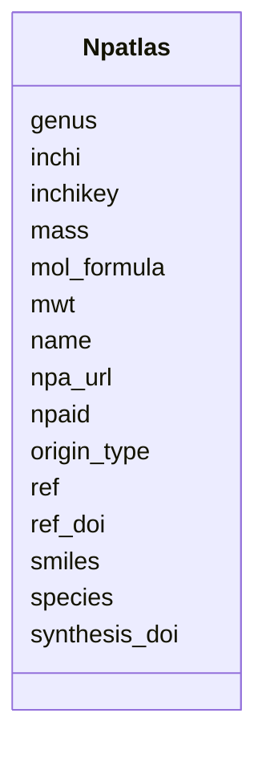

# Class: Npatlas 


URI: [img_mysql_abc:Npatlas](https://w3id.org/jgi/img_mysql_abc/Npatlas)





<!-- no inheritance hierarchy -->


## Slots

| Name | Cardinality and Range | Description | Inheritance |
| ---  | --- | --- | --- |
| [npaid](npaid.md) | 0..1 <br/> [String](String.md) |  | direct |
| [name](name.md) | 0..1 <br/> [String](String.md) |  | direct |
| [mol_formula](mol_formula.md) | 0..1 <br/> [String](String.md) |  | direct |
| [mass](mass.md) | 0..1 <br/> [Float](Float.md) |  | direct |
| [mwt](mwt.md) | 0..1 <br/> [Float](Float.md) |  | direct |
| [smiles](smiles.md) | 0..1 <br/> [String](String.md) |  | direct |
| [inchikey](inchikey.md) | 0..1 <br/> [String](String.md) |  | direct |
| [inchi](inchi.md) | 0..1 <br/> [String](String.md) |  | direct |
| [origin_type](origin_type.md) | 0..1 <br/> [String](String.md) |  | direct |
| [genus](genus.md) | 0..1 <br/> [String](String.md) |  | direct |
| [species](species.md) | 0..1 <br/> [String](String.md) |  | direct |
| [ref](ref.md) | 0..1 <br/> [String](String.md) |  | direct |
| [ref_doi](ref_doi.md) | 0..1 <br/> [String](String.md) |  | direct |
| [synthesis_doi](synthesis_doi.md) | 0..1 <br/> [String](String.md) |  | direct |
| [npa_url](npa_url.md) | 0..1 <br/> [String](String.md) |  | direct |


## Identifier and Mapping Information


### Schema Source


* from schema: https://w3id.org/jgi/img_mysql_abc


## Mappings

| Mapping Type | Mapped Value |
| ---  | ---  |
| self | img_mysql_abc:Npatlas |
| native | img_mysql_abc:Npatlas |


## LinkML Source

<!-- TODO: investigate https://stackoverflow.com/questions/37606292/how-to-create-tabbed-code-blocks-in-mkdocs-or-sphinx -->

### Direct

<details>
```yaml
name: npatlas
from_schema: https://w3id.org/jgi/img_mysql_abc
attributes:
  npaid:
    name: npaid
    from_schema: https://w3id.org/jgi/img_mysql_abc
    rank: 1000
    domain_of:
    - npatlas
    range: string
    required: false
  name:
    name: name
    from_schema: https://w3id.org/jgi/img_mysql_abc
    rank: 1000
    domain_of:
    - npatlas
    range: string
    required: false
  mol_formula:
    name: mol_formula
    from_schema: https://w3id.org/jgi/img_mysql_abc
    rank: 1000
    domain_of:
    - npatlas
    range: string
    required: false
  mass:
    name: mass
    from_schema: https://w3id.org/jgi/img_mysql_abc
    rank: 1000
    domain_of:
    - npatlas
    range: float
    required: false
  mwt:
    name: mwt
    from_schema: https://w3id.org/jgi/img_mysql_abc
    rank: 1000
    domain_of:
    - npatlas
    range: float
    required: false
  smiles:
    name: smiles
    from_schema: https://w3id.org/jgi/img_mysql_abc
    rank: 1000
    domain_of:
    - npatlas
    range: string
    required: false
  inchikey:
    name: inchikey
    from_schema: https://w3id.org/jgi/img_mysql_abc
    rank: 1000
    domain_of:
    - npatlas
    range: string
    required: false
  inchi:
    name: inchi
    from_schema: https://w3id.org/jgi/img_mysql_abc
    rank: 1000
    domain_of:
    - npatlas
    range: string
    required: false
  origin_type:
    name: origin_type
    from_schema: https://w3id.org/jgi/img_mysql_abc
    rank: 1000
    domain_of:
    - npatlas
    range: string
    required: false
  genus:
    name: genus
    from_schema: https://w3id.org/jgi/img_mysql_abc
    rank: 1000
    domain_of:
    - npatlas
    range: string
    required: false
  species:
    name: species
    from_schema: https://w3id.org/jgi/img_mysql_abc
    rank: 1000
    domain_of:
    - npatlas
    range: string
    required: false
  ref:
    name: ref
    from_schema: https://w3id.org/jgi/img_mysql_abc
    rank: 1000
    domain_of:
    - npatlas
    range: string
    required: false
  ref_doi:
    name: ref_doi
    from_schema: https://w3id.org/jgi/img_mysql_abc
    rank: 1000
    domain_of:
    - npatlas
    range: string
    required: false
  synthesis_doi:
    name: synthesis_doi
    from_schema: https://w3id.org/jgi/img_mysql_abc
    rank: 1000
    domain_of:
    - npatlas
    range: string
    required: false
  npa_url:
    name: npa_url
    from_schema: https://w3id.org/jgi/img_mysql_abc
    rank: 1000
    domain_of:
    - npatlas
    range: string
    required: false

```
</details>

### Induced

<details>
```yaml
name: npatlas
from_schema: https://w3id.org/jgi/img_mysql_abc
attributes:
  npaid:
    name: npaid
    from_schema: https://w3id.org/jgi/img_mysql_abc
    rank: 1000
    alias: npaid
    owner: npatlas
    domain_of:
    - npatlas
    range: string
    required: false
  name:
    name: name
    from_schema: https://w3id.org/jgi/img_mysql_abc
    rank: 1000
    alias: name
    owner: npatlas
    domain_of:
    - npatlas
    range: string
    required: false
  mol_formula:
    name: mol_formula
    from_schema: https://w3id.org/jgi/img_mysql_abc
    rank: 1000
    alias: mol_formula
    owner: npatlas
    domain_of:
    - npatlas
    range: string
    required: false
  mass:
    name: mass
    from_schema: https://w3id.org/jgi/img_mysql_abc
    rank: 1000
    alias: mass
    owner: npatlas
    domain_of:
    - npatlas
    range: float
    required: false
  mwt:
    name: mwt
    from_schema: https://w3id.org/jgi/img_mysql_abc
    rank: 1000
    alias: mwt
    owner: npatlas
    domain_of:
    - npatlas
    range: float
    required: false
  smiles:
    name: smiles
    from_schema: https://w3id.org/jgi/img_mysql_abc
    rank: 1000
    alias: smiles
    owner: npatlas
    domain_of:
    - npatlas
    range: string
    required: false
  inchikey:
    name: inchikey
    from_schema: https://w3id.org/jgi/img_mysql_abc
    rank: 1000
    alias: inchikey
    owner: npatlas
    domain_of:
    - npatlas
    range: string
    required: false
  inchi:
    name: inchi
    from_schema: https://w3id.org/jgi/img_mysql_abc
    rank: 1000
    alias: inchi
    owner: npatlas
    domain_of:
    - npatlas
    range: string
    required: false
  origin_type:
    name: origin_type
    from_schema: https://w3id.org/jgi/img_mysql_abc
    rank: 1000
    alias: origin_type
    owner: npatlas
    domain_of:
    - npatlas
    range: string
    required: false
  genus:
    name: genus
    from_schema: https://w3id.org/jgi/img_mysql_abc
    rank: 1000
    alias: genus
    owner: npatlas
    domain_of:
    - npatlas
    range: string
    required: false
  species:
    name: species
    from_schema: https://w3id.org/jgi/img_mysql_abc
    rank: 1000
    alias: species
    owner: npatlas
    domain_of:
    - npatlas
    range: string
    required: false
  ref:
    name: ref
    from_schema: https://w3id.org/jgi/img_mysql_abc
    rank: 1000
    alias: ref
    owner: npatlas
    domain_of:
    - npatlas
    range: string
    required: false
  ref_doi:
    name: ref_doi
    from_schema: https://w3id.org/jgi/img_mysql_abc
    rank: 1000
    alias: ref_doi
    owner: npatlas
    domain_of:
    - npatlas
    range: string
    required: false
  synthesis_doi:
    name: synthesis_doi
    from_schema: https://w3id.org/jgi/img_mysql_abc
    rank: 1000
    alias: synthesis_doi
    owner: npatlas
    domain_of:
    - npatlas
    range: string
    required: false
  npa_url:
    name: npa_url
    from_schema: https://w3id.org/jgi/img_mysql_abc
    rank: 1000
    alias: npa_url
    owner: npatlas
    domain_of:
    - npatlas
    range: string
    required: false

```
</details>