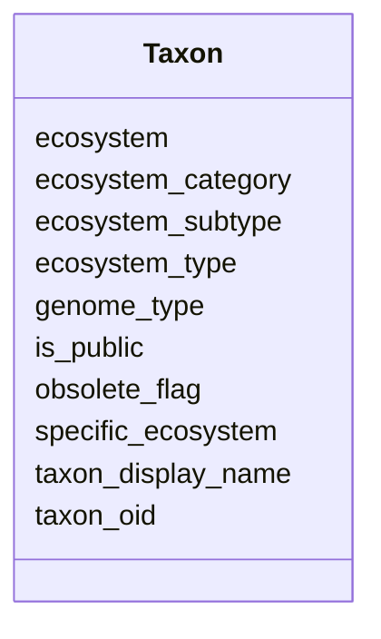

# Class: Taxon 


URI: [img_mysql_img:Taxon](https://w3id.org/jgi/img_mysql_img/Taxon)





<!-- no inheritance hierarchy -->


## Slots

| Name | Cardinality and Range | Description | Inheritance |
| ---  | --- | --- | --- |
| [taxon_oid](taxon_oid.md) | 0..1 <br/> [Integer](Integer.md) |  | direct |
| [taxon_display_name](taxon_display_name.md) | 0..1 <br/> [String](String.md) |  | direct |
| [genome_type](genome_type.md) | 0..1 <br/> [String](String.md) |  | direct |
| [is_public](is_public.md) | 0..1 <br/> [String](String.md) |  | direct |
| [obsolete_flag](obsolete_flag.md) | 0..1 <br/> [String](String.md) |  | direct |
| [ecosystem](ecosystem.md) | 0..1 <br/> [String](String.md) |  | direct |
| [ecosystem_category](ecosystem_category.md) | 0..1 <br/> [String](String.md) |  | direct |
| [ecosystem_type](ecosystem_type.md) | 0..1 <br/> [String](String.md) |  | direct |
| [ecosystem_subtype](ecosystem_subtype.md) | 0..1 <br/> [String](String.md) |  | direct |
| [specific_ecosystem](specific_ecosystem.md) | 0..1 <br/> [String](String.md) |  | direct |


## Identifier and Mapping Information


### Schema Source


* from schema: https://w3id.org/jgi/img_mysql_img


## Mappings

| Mapping Type | Mapped Value |
| ---  | ---  |
| self | img_mysql_img:Taxon |
| native | img_mysql_img:Taxon |


## LinkML Source

<!-- TODO: investigate https://stackoverflow.com/questions/37606292/how-to-create-tabbed-code-blocks-in-mkdocs-or-sphinx -->

### Direct

<details>
```yaml
name: taxon
from_schema: https://w3id.org/jgi/img_mysql_img
attributes:
  taxon_oid:
    name: taxon_oid
    from_schema: https://w3id.org/jgi/img_mysql_img
    rank: 1000
    domain_of:
    - taxon
    - taxon_body_site
    - taxon_habitat
    - taxon_vrpr
    range: integer
    required: false
  taxon_display_name:
    name: taxon_display_name
    from_schema: https://w3id.org/jgi/img_mysql_img
    rank: 1000
    domain_of:
    - taxon
    range: string
    required: false
  genome_type:
    name: genome_type
    from_schema: https://w3id.org/jgi/img_mysql_img
    rank: 1000
    domain_of:
    - taxon
    range: string
    required: false
  is_public:
    name: is_public
    from_schema: https://w3id.org/jgi/img_mysql_img
    rank: 1000
    domain_of:
    - taxon
    range: string
    required: false
  obsolete_flag:
    name: obsolete_flag
    from_schema: https://w3id.org/jgi/img_mysql_img
    rank: 1000
    domain_of:
    - taxon
    range: string
    required: false
  ecosystem:
    name: ecosystem
    from_schema: https://w3id.org/jgi/img_mysql_img
    rank: 1000
    domain_of:
    - taxon
    range: string
    required: false
  ecosystem_category:
    name: ecosystem_category
    from_schema: https://w3id.org/jgi/img_mysql_img
    rank: 1000
    domain_of:
    - taxon
    range: string
    required: false
  ecosystem_type:
    name: ecosystem_type
    from_schema: https://w3id.org/jgi/img_mysql_img
    rank: 1000
    domain_of:
    - taxon
    range: string
    required: false
  ecosystem_subtype:
    name: ecosystem_subtype
    from_schema: https://w3id.org/jgi/img_mysql_img
    rank: 1000
    domain_of:
    - taxon
    range: string
    required: false
  specific_ecosystem:
    name: specific_ecosystem
    from_schema: https://w3id.org/jgi/img_mysql_img
    rank: 1000
    domain_of:
    - taxon
    range: string
    required: false

```
</details>

### Induced

<details>
```yaml
name: taxon
from_schema: https://w3id.org/jgi/img_mysql_img
attributes:
  taxon_oid:
    name: taxon_oid
    from_schema: https://w3id.org/jgi/img_mysql_img
    rank: 1000
    alias: taxon_oid
    owner: taxon
    domain_of:
    - taxon
    - taxon_body_site
    - taxon_habitat
    - taxon_vrpr
    range: integer
    required: false
  taxon_display_name:
    name: taxon_display_name
    from_schema: https://w3id.org/jgi/img_mysql_img
    rank: 1000
    alias: taxon_display_name
    owner: taxon
    domain_of:
    - taxon
    range: string
    required: false
  genome_type:
    name: genome_type
    from_schema: https://w3id.org/jgi/img_mysql_img
    rank: 1000
    alias: genome_type
    owner: taxon
    domain_of:
    - taxon
    range: string
    required: false
  is_public:
    name: is_public
    from_schema: https://w3id.org/jgi/img_mysql_img
    rank: 1000
    alias: is_public
    owner: taxon
    domain_of:
    - taxon
    range: string
    required: false
  obsolete_flag:
    name: obsolete_flag
    from_schema: https://w3id.org/jgi/img_mysql_img
    rank: 1000
    alias: obsolete_flag
    owner: taxon
    domain_of:
    - taxon
    range: string
    required: false
  ecosystem:
    name: ecosystem
    from_schema: https://w3id.org/jgi/img_mysql_img
    rank: 1000
    alias: ecosystem
    owner: taxon
    domain_of:
    - taxon
    range: string
    required: false
  ecosystem_category:
    name: ecosystem_category
    from_schema: https://w3id.org/jgi/img_mysql_img
    rank: 1000
    alias: ecosystem_category
    owner: taxon
    domain_of:
    - taxon
    range: string
    required: false
  ecosystem_type:
    name: ecosystem_type
    from_schema: https://w3id.org/jgi/img_mysql_img
    rank: 1000
    alias: ecosystem_type
    owner: taxon
    domain_of:
    - taxon
    range: string
    required: false
  ecosystem_subtype:
    name: ecosystem_subtype
    from_schema: https://w3id.org/jgi/img_mysql_img
    rank: 1000
    alias: ecosystem_subtype
    owner: taxon
    domain_of:
    - taxon
    range: string
    required: false
  specific_ecosystem:
    name: specific_ecosystem
    from_schema: https://w3id.org/jgi/img_mysql_img
    rank: 1000
    alias: specific_ecosystem
    owner: taxon
    domain_of:
    - taxon
    range: string
    required: false

```
</details>