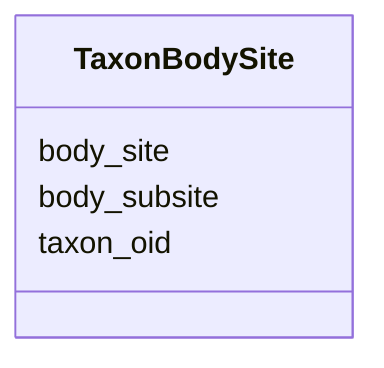

# Class: TaxonBodySite 


URI: [img_mysql_img:TaxonBodySite](https://w3id.org/jgi/img_mysql_img/TaxonBodySite)





<!-- no inheritance hierarchy -->


## Slots

| Name | Cardinality and Range | Description | Inheritance |
| ---  | --- | --- | --- |
| [taxon_oid](taxon_oid.md) | 0..1 <br/> [Integer](Integer.md) |  | direct |
| [body_site](body_site.md) | 0..1 <br/> [String](String.md) |  | direct |
| [body_subsite](body_subsite.md) | 0..1 <br/> [String](String.md) |  | direct |


## Identifier and Mapping Information


### Schema Source


* from schema: https://w3id.org/jgi/img_mysql_img


## Mappings

| Mapping Type | Mapped Value |
| ---  | ---  |
| self | img_mysql_img:TaxonBodySite |
| native | img_mysql_img:TaxonBodySite |


## LinkML Source

<!-- TODO: investigate https://stackoverflow.com/questions/37606292/how-to-create-tabbed-code-blocks-in-mkdocs-or-sphinx -->

### Direct

<details>
```yaml
name: taxon_body_site
from_schema: https://w3id.org/jgi/img_mysql_img
attributes:
  taxon_oid:
    name: taxon_oid
    from_schema: https://w3id.org/jgi/img_mysql_img
    domain_of:
    - taxon
    - taxon_body_site
    - taxon_habitat
    - taxon_vrpr
    range: integer
    required: false
  body_site:
    name: body_site
    from_schema: https://w3id.org/jgi/img_mysql_img
    rank: 1000
    domain_of:
    - taxon_body_site
    range: string
    required: false
  body_subsite:
    name: body_subsite
    from_schema: https://w3id.org/jgi/img_mysql_img
    rank: 1000
    domain_of:
    - taxon_body_site
    range: string
    required: false

```
</details>

### Induced

<details>
```yaml
name: taxon_body_site
from_schema: https://w3id.org/jgi/img_mysql_img
attributes:
  taxon_oid:
    name: taxon_oid
    from_schema: https://w3id.org/jgi/img_mysql_img
    alias: taxon_oid
    owner: taxon_body_site
    domain_of:
    - taxon
    - taxon_body_site
    - taxon_habitat
    - taxon_vrpr
    range: integer
    required: false
  body_site:
    name: body_site
    from_schema: https://w3id.org/jgi/img_mysql_img
    rank: 1000
    alias: body_site
    owner: taxon_body_site
    domain_of:
    - taxon_body_site
    range: string
    required: false
  body_subsite:
    name: body_subsite
    from_schema: https://w3id.org/jgi/img_mysql_img
    rank: 1000
    alias: body_subsite
    owner: taxon_body_site
    domain_of:
    - taxon_body_site
    range: string
    required: false

```
</details>