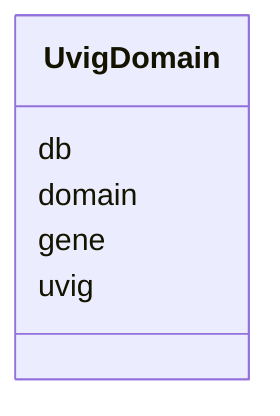

# Class: UvigDomain 


URI: [img_mysql_imgvr_prod:UvigDomain](https://w3id.org/jgi/img_mysql_imgvr_prod/UvigDomain)





<!-- no inheritance hierarchy -->


## Slots

| Name | Cardinality and Range | Description | Inheritance |
| ---  | --- | --- | --- |
| [uvig](uvig.md) | 0..1 <br/> [String](String.md) |  | direct |
| [db](db.md) | 0..1 <br/> [String](String.md) |  | direct |
| [domain](domain.md) | 0..1 <br/> [String](String.md) |  | direct |
| [gene](gene.md) | 0..1 <br/> [String](String.md) |  | direct |


## Identifier and Mapping Information


### Schema Source


* from schema: https://w3id.org/jgi/img_mysql_imgvr_prod


## Mappings

| Mapping Type | Mapped Value |
| ---  | ---  |
| self | img_mysql_imgvr_prod:UvigDomain |
| native | img_mysql_imgvr_prod:UvigDomain |


## LinkML Source

<!-- TODO: investigate https://stackoverflow.com/questions/37606292/how-to-create-tabbed-code-blocks-in-mkdocs-or-sphinx -->

### Direct

<details>
```yaml
name: uvig_domain
from_schema: https://w3id.org/jgi/img_mysql_imgvr_prod
attributes:
  uvig:
    name: uvig
    from_schema: https://w3id.org/jgi/img_mysql_imgvr_prod
    domain_of:
    - uvig
    - uvig_domain
    - uvig_hosts
    - uvig_lineage
    - uvig_pfams
    - uvig_scaffolds
    range: string
    required: false
  db:
    name: db
    from_schema: https://w3id.org/jgi/img_mysql_imgvr_prod
    rank: 1000
    domain_of:
    - uvig_domain
    range: string
    required: false
  domain:
    name: domain
    from_schema: https://w3id.org/jgi/img_mysql_imgvr_prod
    rank: 1000
    domain_of:
    - uvig_domain
    - uvig_lineage
    range: string
    required: false
  gene:
    name: gene
    from_schema: https://w3id.org/jgi/img_mysql_imgvr_prod
    rank: 1000
    domain_of:
    - uvig_domain
    range: string
    required: false

```
</details>

### Induced

<details>
```yaml
name: uvig_domain
from_schema: https://w3id.org/jgi/img_mysql_imgvr_prod
attributes:
  uvig:
    name: uvig
    from_schema: https://w3id.org/jgi/img_mysql_imgvr_prod
    alias: uvig
    owner: uvig_domain
    domain_of:
    - uvig
    - uvig_domain
    - uvig_hosts
    - uvig_lineage
    - uvig_pfams
    - uvig_scaffolds
    range: string
    required: false
  db:
    name: db
    from_schema: https://w3id.org/jgi/img_mysql_imgvr_prod
    rank: 1000
    alias: db
    owner: uvig_domain
    domain_of:
    - uvig_domain
    range: string
    required: false
  domain:
    name: domain
    from_schema: https://w3id.org/jgi/img_mysql_imgvr_prod
    rank: 1000
    alias: domain
    owner: uvig_domain
    domain_of:
    - uvig_domain
    - uvig_lineage
    range: string
    required: false
  gene:
    name: gene
    from_schema: https://w3id.org/jgi/img_mysql_imgvr_prod
    rank: 1000
    alias: gene
    owner: uvig_domain
    domain_of:
    - uvig_domain
    range: string
    required: false

```
</details>