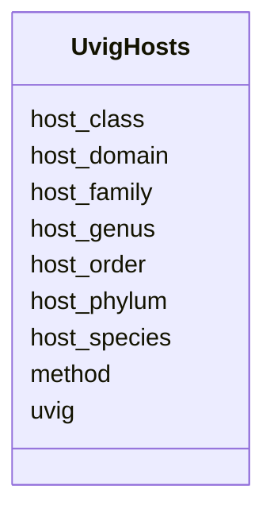

# Class: UvigHosts 


URI: [img_mysql_imgvr_prod:UvigHosts](https://w3id.org/jgi/img_mysql_imgvr_prod/UvigHosts)





<!-- no inheritance hierarchy -->


## Slots

| Name | Cardinality and Range | Description | Inheritance |
| ---  | --- | --- | --- |
| [uvig](uvig.md) | 0..1 <br/> [String](String.md) |  | direct |
| [method](method.md) | 0..1 <br/> [String](String.md) |  | direct |
| [host_domain](host_domain.md) | 0..1 <br/> [String](String.md) |  | direct |
| [host_phylum](host_phylum.md) | 0..1 <br/> [String](String.md) |  | direct |
| [host_class](host_class.md) | 0..1 <br/> [String](String.md) |  | direct |
| [host_order](host_order.md) | 0..1 <br/> [String](String.md) |  | direct |
| [host_family](host_family.md) | 0..1 <br/> [String](String.md) |  | direct |
| [host_genus](host_genus.md) | 0..1 <br/> [String](String.md) |  | direct |
| [host_species](host_species.md) | 0..1 <br/> [String](String.md) |  | direct |


## Identifier and Mapping Information


### Schema Source


* from schema: https://w3id.org/jgi/img_mysql_imgvr_prod


## Mappings

| Mapping Type | Mapped Value |
| ---  | ---  |
| self | img_mysql_imgvr_prod:UvigHosts |
| native | img_mysql_imgvr_prod:UvigHosts |


## LinkML Source

<!-- TODO: investigate https://stackoverflow.com/questions/37606292/how-to-create-tabbed-code-blocks-in-mkdocs-or-sphinx -->

### Direct

<details>
```yaml
name: uvig_hosts
from_schema: https://w3id.org/jgi/img_mysql_imgvr_prod
attributes:
  uvig:
    name: uvig
    from_schema: https://w3id.org/jgi/img_mysql_imgvr_prod
    domain_of:
    - uvig
    - uvig_domain
    - uvig_hosts
    - uvig_lineage
    - uvig_pfams
    - uvig_scaffolds
    range: string
    required: false
  method:
    name: method
    from_schema: https://w3id.org/jgi/img_mysql_imgvr_prod
    rank: 1000
    domain_of:
    - uvig_hosts
    - uvig_lineage
    range: string
    required: false
  host_domain:
    name: host_domain
    from_schema: https://w3id.org/jgi/img_mysql_imgvr_prod
    rank: 1000
    domain_of:
    - uvig_hosts
    range: string
    required: false
  host_phylum:
    name: host_phylum
    from_schema: https://w3id.org/jgi/img_mysql_imgvr_prod
    rank: 1000
    domain_of:
    - uvig_hosts
    range: string
    required: false
  host_class:
    name: host_class
    from_schema: https://w3id.org/jgi/img_mysql_imgvr_prod
    rank: 1000
    domain_of:
    - uvig_hosts
    range: string
    required: false
  host_order:
    name: host_order
    from_schema: https://w3id.org/jgi/img_mysql_imgvr_prod
    rank: 1000
    domain_of:
    - uvig_hosts
    range: string
    required: false
  host_family:
    name: host_family
    from_schema: https://w3id.org/jgi/img_mysql_imgvr_prod
    rank: 1000
    domain_of:
    - uvig_hosts
    range: string
    required: false
  host_genus:
    name: host_genus
    from_schema: https://w3id.org/jgi/img_mysql_imgvr_prod
    rank: 1000
    domain_of:
    - uvig_hosts
    range: string
    required: false
  host_species:
    name: host_species
    from_schema: https://w3id.org/jgi/img_mysql_imgvr_prod
    rank: 1000
    domain_of:
    - uvig_hosts
    range: string
    required: false

```
</details>

### Induced

<details>
```yaml
name: uvig_hosts
from_schema: https://w3id.org/jgi/img_mysql_imgvr_prod
attributes:
  uvig:
    name: uvig
    from_schema: https://w3id.org/jgi/img_mysql_imgvr_prod
    alias: uvig
    owner: uvig_hosts
    domain_of:
    - uvig
    - uvig_domain
    - uvig_hosts
    - uvig_lineage
    - uvig_pfams
    - uvig_scaffolds
    range: string
    required: false
  method:
    name: method
    from_schema: https://w3id.org/jgi/img_mysql_imgvr_prod
    rank: 1000
    alias: method
    owner: uvig_hosts
    domain_of:
    - uvig_hosts
    - uvig_lineage
    range: string
    required: false
  host_domain:
    name: host_domain
    from_schema: https://w3id.org/jgi/img_mysql_imgvr_prod
    rank: 1000
    alias: host_domain
    owner: uvig_hosts
    domain_of:
    - uvig_hosts
    range: string
    required: false
  host_phylum:
    name: host_phylum
    from_schema: https://w3id.org/jgi/img_mysql_imgvr_prod
    rank: 1000
    alias: host_phylum
    owner: uvig_hosts
    domain_of:
    - uvig_hosts
    range: string
    required: false
  host_class:
    name: host_class
    from_schema: https://w3id.org/jgi/img_mysql_imgvr_prod
    rank: 1000
    alias: host_class
    owner: uvig_hosts
    domain_of:
    - uvig_hosts
    range: string
    required: false
  host_order:
    name: host_order
    from_schema: https://w3id.org/jgi/img_mysql_imgvr_prod
    rank: 1000
    alias: host_order
    owner: uvig_hosts
    domain_of:
    - uvig_hosts
    range: string
    required: false
  host_family:
    name: host_family
    from_schema: https://w3id.org/jgi/img_mysql_imgvr_prod
    rank: 1000
    alias: host_family
    owner: uvig_hosts
    domain_of:
    - uvig_hosts
    range: string
    required: false
  host_genus:
    name: host_genus
    from_schema: https://w3id.org/jgi/img_mysql_imgvr_prod
    rank: 1000
    alias: host_genus
    owner: uvig_hosts
    domain_of:
    - uvig_hosts
    range: string
    required: false
  host_species:
    name: host_species
    from_schema: https://w3id.org/jgi/img_mysql_imgvr_prod
    rank: 1000
    alias: host_species
    owner: uvig_hosts
    domain_of:
    - uvig_hosts
    range: string
    required: false

```
</details>