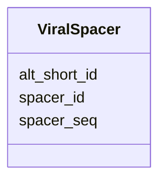

# Class: ViralSpacer 


URI: [img_mysql_imgvr_prod:ViralSpacer](https://w3id.org/jgi/img_mysql_imgvr_prod/ViralSpacer)





<!-- no inheritance hierarchy -->


## Slots

| Name | Cardinality and Range | Description | Inheritance |
| ---  | --- | --- | --- |
| [spacer_id](spacer_id.md) | 0..1 <br/> [String](String.md) |  | direct |
| [spacer_seq](spacer_seq.md) | 0..1 <br/> [String](String.md) |  | direct |
| [alt_short_id](alt_short_id.md) | 0..1 <br/> [String](String.md) |  | direct |


## Identifier and Mapping Information


### Schema Source


* from schema: https://w3id.org/jgi/img_mysql_imgvr_prod


## Mappings

| Mapping Type | Mapped Value |
| ---  | ---  |
| self | img_mysql_imgvr_prod:ViralSpacer |
| native | img_mysql_imgvr_prod:ViralSpacer |


## LinkML Source

<!-- TODO: investigate https://stackoverflow.com/questions/37606292/how-to-create-tabbed-code-blocks-in-mkdocs-or-sphinx -->

### Direct

<details>
```yaml
name: viral_spacer
from_schema: https://w3id.org/jgi/img_mysql_imgvr_prod
attributes:
  spacer_id:
    name: spacer_id
    from_schema: https://w3id.org/jgi/img_mysql_imgvr_prod
    rank: 1000
    domain_of:
    - viral_spacer
    range: string
    required: false
  spacer_seq:
    name: spacer_seq
    from_schema: https://w3id.org/jgi/img_mysql_imgvr_prod
    rank: 1000
    domain_of:
    - viral_spacer
    range: string
    required: false
  alt_short_id:
    name: alt_short_id
    from_schema: https://w3id.org/jgi/img_mysql_imgvr_prod
    rank: 1000
    domain_of:
    - viral_spacer
    range: string
    required: false

```
</details>

### Induced

<details>
```yaml
name: viral_spacer
from_schema: https://w3id.org/jgi/img_mysql_imgvr_prod
attributes:
  spacer_id:
    name: spacer_id
    from_schema: https://w3id.org/jgi/img_mysql_imgvr_prod
    rank: 1000
    alias: spacer_id
    owner: viral_spacer
    domain_of:
    - viral_spacer
    range: string
    required: false
  spacer_seq:
    name: spacer_seq
    from_schema: https://w3id.org/jgi/img_mysql_imgvr_prod
    rank: 1000
    alias: spacer_seq
    owner: viral_spacer
    domain_of:
    - viral_spacer
    range: string
    required: false
  alt_short_id:
    name: alt_short_id
    from_schema: https://w3id.org/jgi/img_mysql_imgvr_prod
    rank: 1000
    alias: alt_short_id
    owner: viral_spacer
    domain_of:
    - viral_spacer
    range: string
    required: false

```
</details>